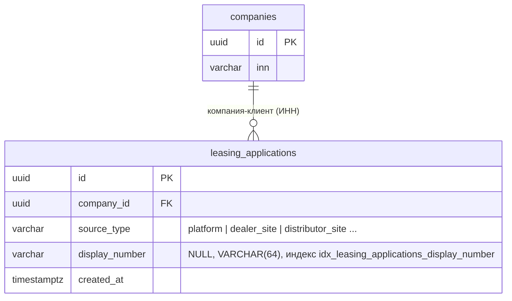
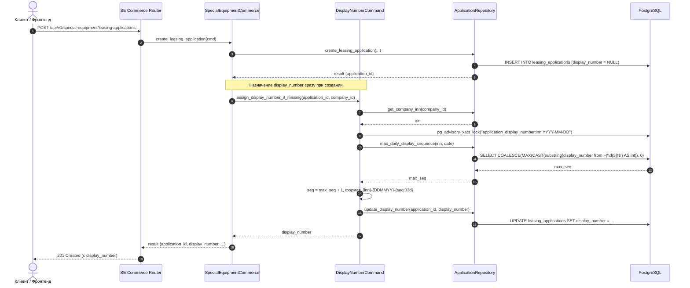

# Номер заявки: год в дате (ДДММ → ДДММГГ) и присвоение номера заявкам из корзины спецтехники

- **Дата и время создания:** 2026-09-30 11:29:42 MSK (UTC+3)
- **Идентификатор задачи Bitrix24:** — (внутренняя задача, не связана с Bitrix)
- **Тип задачи:** `feature` + `bugfix`
- **Ветка задачи:** `feature/application-number-year`
- **Целевая ветка для MR:** `test`
- **Merge Request:** [!492 (https://gitlab.carcraft.ru/carcraft/carcraft-leadgenerator/-/merge_requests/492)](https://gitlab.carcraft.ru/carcraft/carcraft-leadgenerator/-/merge_requests/492)
- **Затронутые модули:**
  - `backend/application/commands/applications/display_number.py` — формат номера, расчёт порядкового номера, блокировка;
  - `backend/infrastructure/repositories/application_repository.py` — выборка максимального порядкового номера за день;
  - `backend/application/special_equipment_commerce.py` — присвоение номера заявкам из корзины и карточки объявления спецтехники;
  - новая миграция данных — номера для уже созданных заявок без номера;
  - тесты.
- **Схема БД:** структура не меняется. `leasing_applications.display_number` — `VARCHAR(64)`, новый номер длиннее старого на 2 символа. Добавляется только миграция данных (часть B).

---

## 0. Архитектурные диаграммы

### 0.1. ER-диаграмма (структура без изменений)



### 0.2. Диаграмма последовательности (Sequence Diagram)



---

## 1. Постановка задачи

### Сейчас
Номер заявки собирается в `build_display_number` (`application/commands/applications/display_number.py`):

```python
number_date = created_on or datetime.now(UTC).date()
return f"{inn}-{number_date:%d%m}-{seq:03d}"
```

Пример: `0276951412-2909-001`. На витрине и в кабинете к нему добавляется префикс источника из `frontend/features/applications/sourceType.ts` (`AP`, `ADE`, `ADI`) → «Заявка AP 0276951412-2909-001».

Год в номере не указан: номера за 29.09.2026 и за 29.09.2027 отличаются только порядковым номером.

### Нужно
Дата в номере — `ДДММГГ`: день, месяц, две последние цифры года.

| Дата заявки | Было | Стало |
|---|---|---|
| 29.09.2026 | `0276951412-2909-001` | `0276951412-290926-001` |
| 29.09.2027 | `0276951412-2909-001` | `0276951412-290927-001` |

Остальные части номера не меняются: ИНН, дефисы, порядковый номер `NNN` за день, префикс источника на фронте.

### Существующие номера
Уже выданные номера **не пересчитываются**. Они есть в письмах, уведомлениях, документах СОПД и в выгрузках. Новый формат получают только заявки, которым номер присваивается после выкатки.

---

## 2. Часть A. Год в номере

### 2.1. `display_number.py`
- В `build_display_number` заменить формат даты `%d%m` на `%d%m%y`:
  ```python
  return f"{inn}-{number_date:%d%m%y}-{seq:03d}"
  ```
- Докстринг `assign_display_number_if_missing`: «``<INN>-<DDMMYY>-<NNN>``».
- Источник даты (`created_on`, иначе текущая дата в UTC) не меняется. Порядковый номер по-прежнему считается в пределах пары (ИНН, полная дата `created_at`), так что год уже учитывается. Сам расчёт порядкового номера меняется в части B (п. 2a.4).

### 2.2. Что не меняется
- Длина колонки и индекс. Для части A миграции не нужны.
- Номера импортированных заявок (`IMP-…`, `import_applications.py`) и любые номера, переданные явно.
- Поиск по номеру: e2e `22320-source-type.spec.ts` ищет по префиксу и цифрам номера (`display_number.replace(/\D/g, '')`), поиск от формата даты не зависит. Проверить это регрессией.
- Фронтенд: номер выводится как строка, отдельного разбора формата нет.

### 2.3. Связанные задачи
- В ТЗ «Регистрация сделки» номер сделки задан «как у заявок, но с префиксом»: `DD-7707083893-2809-001`. Его нужно привести к новому формату, `DD-7707083893-280926-001`, чтобы номера заявок и сделок были единообразны.

---

## 2a. Часть B. Заявки без номера (bugfix)

### 2a.1. Симптом
В «Моих заявках» у части новых заявок вместо номера «Заявка —»: `display_number IS NULL`, фронт показывает «—» (`sourceType.ts`, строка 24). На скриншоте это заявки ООО «СД-ФИНАНС» от 30.09.2026 с источником «Заявка с сайта платформы МЛ» и плашкой «Лизинговые компании не назначены».

### 2a.2. Причина
Номер присваивает `assign_display_number_if_missing`. Её вызывают:
- `create_application.py`;
- `create_draft.py`, через него идёт и лизинг легковых машин из витрины (`VehicleCommerceAdapter.create_leasing_application` → `handle_create_draft`);
- `update_company.py`, `update_questionnaire.py`, `leasing_applications_lc/upsert_questionnaire.py`;
- `admin_applications/assign_leasing_companies.py` — дозаполнение при назначении ЛК.

Лизинговая заявка на **спецтехнику** создаётся в обход этих команд: `application/special_equipment_commerce.py` → `create_leasing_application`. Там две ветки:
- из одного объявления — `repo.create_leasing_application`;
- из серверной корзины — `_create_cart_leasing_application` → `repo.create_leasing_application_from_items`.

Обе ветки пишут `LeasingApplication(...)` напрямую в `special_equipment_commerce_repository.py`, строки около 2109 и 2193, и номер не присваивают. У такой заявки номер появляется только при назначении лизинговых компаний. Поэтому пустой номер виден ровно у заявок «Лизинговые компании не назначены».

### 2a.3. Сопутствующий риск дублей
Сейчас порядковый номер = число заявок этого ИНН, созданных в этот день (без самой заявки), + 1 (`daily_count_for_company_inn`). Если номер присваивается не в момент создания, номера совпадают:
- при позднем присвоении (назначение ЛК, миграция из п. 2a.5), когда в тот же день уже есть заявки с номерами;
- при одновременном создании двух заявок одного ИНН.

Пример: заявка A создана без номера, затем B получила `-002`. При позднем присвоении A тоже получит `-002`. Уникального ограничения на `display_number` нет.

### 2a.4. Исправление в коде
1. **Порядковый номер** — от максимального уже выданного, а не от количества заявок:
   - в `application_repository.py` добавить `max_daily_display_sequence(session, *, company_inn, created_on)`. Среди заявок компании с этим ИНН, созданных в эту дату (`func.date(created_at)`, как сейчас) и с непустым `display_number`, взять максимум числового хвоста номера: `CAST(substring(display_number from '-(\d{3})$') AS int)`. Номера другого вида (`IMP-…`) не учитываются;
   - в `build_display_number`: `seq = max_daily_display_sequence(...) + 1`, если уже выданных номеров нет — `1`;
   - `daily_count_for_company_inn` удалить, если других вызовов нет (проверить `grep`).
2. **Блокировка от гонки.** В `build_display_number` перед расчётом взять транзакционную advisory-блокировку на пару (ИНН, дата), по образцу `cart_repository.py`:
   ```python
   key = f"application_display_number:{inn}:{number_date:%Y-%m-%d}"
   await session.execute(sa.select(sa.func.pg_advisory_xact_lock(sa.func.hashtextextended(key, 0))))
   ```
   Блокировка снимается при коммите транзакции, в которой номер записывается.
3. **Присвоение при создании заявки на спецтехнику.** В `application/special_equipment_commerce.py` сразу после успешного `repo.create_leasing_application(...)` и `repo.create_leasing_application_from_items(...)` вызвать в той же транзакции:
   ```python
   display_number = await assign_display_number_if_missing(
       session,
       application={"id": result["application_id"], "company_id": cmd.company_id},
   )
   result["display_number"] = display_number
   ```
   - `created_at` не передаётся: заявка создана в этот момент, берётся текущая дата UTC, как сейчас;
   - если у компании нет ИНН, номер остаётся пустым и позже присвоится существующими путями — поведение как у анкеты;
   - `display_number` добавить в ответ (схема ответа эндпоинтов `presentation/routers/special_equipment_commerce.py` и `commerce.py` для спецтехники, если она перечисляет поля явно).
4. Остальные вызовы `assign_display_number_if_missing` не меняются: они автоматически получают новый расчёт порядкового номера и блокировку.

### 2a.5. Миграция данных: номера для уже созданных заявок
- Новая ревизия Alembic: `146_backfill_application_display_numbers` (revises `145`). Только данные, структура не меняется.
- **Кому присваивается:**
  - заявки с `display_number IS NULL`;
  - у компании-клиента есть непустой `companies.inn`.

  Заявки без компании или без ИНН пропускаются, как в текущей логике.
- **Формат** — новый, из части A: `<ИНН>-<ДДММГГ>-<NNN>`. Дата — `created_at` в UTC, как в `_application_date`.
- **Порядковый номер** считается одним SQL-запросом:
  - `base` = максимальный хвост `-NNN` среди уже выданных номеров той же пары (ИНН, дата) в любом формате, иначе 0;
  - каждой заявке без номера — `base + row_number() OVER (PARTITION BY inn, date ORDER BY created_at, id)`.

  Так не будет дублей с уже выданными номерами и между собой.
- Перед обновлением взять `LOCK TABLE leasing_applications IN SHARE ROW EXCLUSIVE MODE`, чтобы параллельно не создавались номера.
- В лог миграции — число заявок, получивших номер.
- **Downgrade** — no-op с комментарием: выданные номера уже могли попасть в уведомления, откат их не удаляет.

### 2a.6. Что не меняется
- Уже выданные номера: миграция заполняет только пустые.
- Номера импортированных заявок (`IMP-…`).
- Логика назначения ЛК и остальных команд, кроме расчёта порядкового номера.

---

## 3. Проверка

Бизнес-тест-кейсы не описываются.

### 3.1. Автотесты
- Существующие тесты, которые проверяют только окончание номера (`endswith("-001")` в `test_applications_handler.py`, `test_applications_phase16.py`), остаются как есть.
- Тесты с жёстко заданными номерами (`"7799002001-2904-001"` и т.п. в `test_admin_applications_*`, `test_leasing_workflow_router.py`) — это фикстуры, генерацию они не проверяют; не менять.
- Дополнить существующий тест генерации (или ближайший тест `assign_display_number_if_missing`) проверкой полного формата для фиксированной даты: `created_on=date(2026, 9, 29)` → `"{inn}-290926-001"`. Новые unit-файлы не заводить (по `AGENTS.md`).
- E2E: `22320-source-type.spec.ts` — прогнать без изменений.
- Часть B, дополнить существующие тесты:
  - создание лизинговой заявки на спецтехнику из объявления и из корзины (`test_storefront_commerce_router.py` / `test_commerce_router.py`): в ответе и в БД `display_number` вида `<ИНН>-<ДДММГГ>-<NNN>`;
  - позднее присвоение (назначение ЛК) после того, как в тот же день другой заявке выдан `-002`: новая заявка получает `-003`, а не дубль;
  - e2e: оформить лизинг спецтехники из корзины → в «Моих заявках» у заявки есть номер с префиксом источника.

### 3.2. Обязательные проверки перед коммитом
- Линтеры backend.
- Запуск в Docker, прогон тестов заявок и e2e из п. 3.1, просмотр логов.
- Alembic autogenerate пуст; миграция данных применяется на копии БД стенда `test`, после неё:
  - `SELECT count(*) FROM leasing_applications a JOIN companies c ON c.id = a.company_id WHERE a.display_number IS NULL AND coalesce(btrim(c.inn), '') <> ''` = 0;
  - `SELECT display_number FROM leasing_applications WHERE display_number IS NOT NULL GROUP BY 1 HAVING count(*) > 1`: выполнить до и после миграции. После миграции новых строк в результате нет. Дубли, которые были до миграции из-за старого расчёта, перечислить в MR: исправлять их в этой задаче не нужно.

---

## 4. Критерии готовности
- [x] Новые заявки получают номер `<ИНН>-<ДДММГГ>-<NNN>`.
- [x] Порядковый номер за день считается как раньше.
- [x] Уже выданные номера не изменились.
- [x] Поиск по номеру и префиксы источника работают.
- [x] Тест с проверкой полного формата проходит.
- [x] Заявка на спецтехнику из объявления и из корзины получает номер сразу при создании.
- [x] После миграции данных у всех заявок с ИНН компании есть номер; новых дублей нет.
- [x] Порядковый номер считается от максимального выданного за день под advisory-блокировкой.
- [x] MR в `test` с описанием изменения и списком проверок: [!492](https://gitlab.carcraft.ru/carcraft/carcraft-leadgenerator/-/merge_requests/492).
