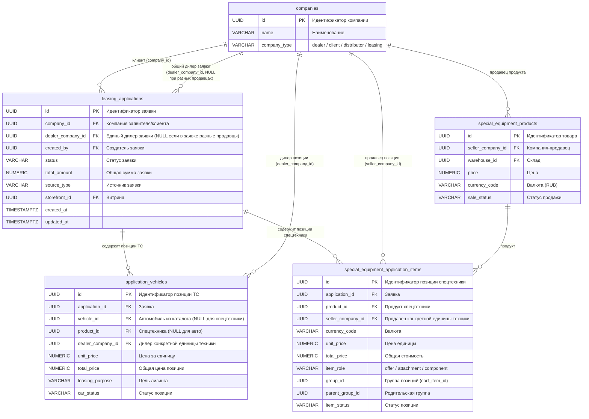
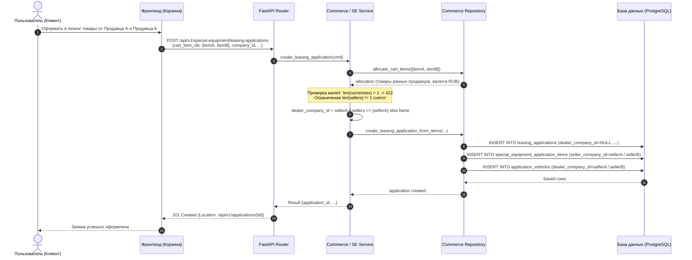

# Задача allow-multiple-sellers-leasing-application — Разрешение объединения позиций разных продавцов в одной лизинговой заявке

- **Bitrix:** Внутренняя задача (без Bitrix)
- **Slug:** `allow-multiple-sellers-leasing-application`
- **Тип:** `bugfix`
- **Ветка:** `bugfix/allow-multiple-sellers-leasing-application`
- **Целевая ветка:** `test`
- **MR:** https://gitlab.carcraft.ru/carcraft/carcraft-leadgenerator/-/merge_requests/489
- **Дата создания:** 30.09.2026 13:06:45 MSK (UTC+3)

---

## ER-диаграмма



---

## Диаграмма последовательности



---

## 1. Постановка проблемы

При попытке оформить лизинговую заявку через корзину на несколько позиций спецтехники (или смешанные позиции), принадлежащих разным компаниям-продавцам (дилерам), эндпоинты:
- `POST /api/v1/special-equipment/leasing-applications`
- `POST /api/v1/commerce/leasing-applications`

возвращают ошибку HTTP 422 Unprocessable Content:
```json
{
    "detail": "Одна лизинговая заявка не может объединять разных продавцов или валюты"
}
```

### Причина возникновения
В коммите `7244000c` при реализации надстроек и составных объявлений в методы создания лизинговых заявок была добавлена искусственная валидация:
```python
sellers = {state.seller_company_id for state in states.values()}
currencies = {state.currency_code for state in states.values()}
if len(sellers) != 1 or len(currencies) != 1:
    raise ServiceError(
        "Одна лизинговая заявка не может объединять разных продавцов или валюты",
        422,
    )
```
Данное ограничение было перенесено из логики прямых заказов на покупку (где один заказ физически оплачивается конкретному продавцу).
Однако лизинговая заявка направляется лизинговым компаниям (или платформе) для финансирования техники. Клиент имеет право включить в единую лизинговую заявку технику от разных продавцов/дилеров.
Вся нижележащая доменная и репозиторная модель Carcraft (таблицы `application_vehicles`, `special_equipment_application_items`, проверки прав `dealer_child_ownership_clause`, `ensure_application_visible_to`) уже полностью поддерживает хранение позиций с разными `seller_company_id` / `dealer_company_id` и независимое отображение для каждого дилера.
Проверка `len(sellers) != 1` в лизинговых заявках является ошибочной и должна быть удалена.

---

## 2. Требования

1. **Разрешить объединение товаров разных продавцов в лизинговой заявке:**
   - В эндпоинте `POST /api/v1/special-equipment/leasing-applications` (метод `_create_cart_leasing_application` в `backend/application/special_equipment_commerce.py`) убрать проверку `len(sellers) != 1`.
   - В эндпоинте `POST /api/v1/commerce/leasing-applications` (метод `CommerceFacade._prepare_special_lines` в `backend/application/commerce.py`) убрать проверку `len(sellers) != 1`.
2. **Корректная обработка валют:**
   - Если в корзине каким-либо образом окажутся товары в разных валютах (`len(currencies) > 1`), возвращать осмысленную ошибку:
     `"Одна лизинговая заявка не может объединять товары в разных валютах"` (HTTP 422).
3. **Определение `dealer_company_id` для шапки `leasing_applications`:**
   - Если все позиции принадлежат одному и тому же продавцу (дилеру), шапка `leasing_applications.dealer_company_id` устанавливается в этот `company_id`.
   - Если в заявке позиции от нескольких разных продавцов, в шапку `leasing_applications.dealer_company_id` записывается `None` (так как единого дилера для всей заявки нет, при этом каждая позиция в `application_vehicles` и `special_equipment_application_items` сохраняет своего продавца).
   - В `backend/application/commands/applications/create_draft.py` функция `_resolve_dealer_company_id` должна учитывать наличие разных дилеров/продавцов и возвращать `None` при их несовпадении.
4. **Сохранение доменных инвариантов:**
   - Все проверки прав дилеров, клиентов и лизинговых компаний на просмотр и редактирование заявки и ее позиций должны работать штатно (дилер видит заявку, если владеет хотя бы одной ее позицией).
5. **Тестирование и верификация:**
   - Добавить/обновить автоматические тесты бэкенда на успешное создание лизинговой заявки с позициями от разных продавцов.
   - Проверить E2E-сценарием на работающем приложении: создание позиций от разных продавцов в корзине, отправка лизинговой заявки, получение HTTP 201 Created и корректное сохранение в БД.

---

## 3. План реализации

1. **`backend/application/special_equipment_commerce.py`:**
   - В `_create_cart_leasing_application`:
     - Удалить ограничение `len(sellers) != 1`.
     - Заменить проверку на `if len(currencies) > 1: raise ServiceError("Одна лизинговая заявка не может объединять товары в разных валютах", 422)`.
     - Вычислить `header_dealer_company_id`: если множество уникальных непустых продавцов имеет размер 1, берем его; если продавцов несколько — `None`.
     - Передавать `header_dealer_company_id` в `repo.create_leasing_application_from_items(dealer_company_id=...)`.

2. **`backend/application/commerce.py`:**
   - В `_prepare_special_lines`:
     - Удалить ограничение `len(sellers) != 1`.
     - Заменить проверку на `if len(currencies) > 1: raise ServiceError("Одна лизинговая заявка не может объединять товары в разных валютах", 422)`.

3. **`backend/application/commands/applications/create_draft.py`:**
   - В `_resolve_dealer_company_id`:
     - При наличии нескольких позиций спецтехники или ТС проверять однородность дилера: если дилеры/продавцы различаются, возвращать `None`, а не первого попавшегося продавца.

4. **Тесты:**
   - В `backend/tests/integration/test_special_equipment_commerce_router.py` добавить интеграционный тест на создание лизинговой заявки с двумя позициями корзины от разных продавцов (ожидается HTTP 201 Created, `application.dealer_company_id is None`, у каждого item сохранен свой `seller_company_id`).
   - В `backend/tests/test_commerce.py` добавить тест на создание пакетной лизинговой заявки с несколькими спецтехниками от разных продавцов.
   - Запустить Playwright E2E-проверку сценария оформления лизинга.

---

## 4. Критерии готовности

1. Запрос `POST /api/v1/special-equipment/leasing-applications` с корзиной, содержащей позиции от двух разных компаний-продавцов, успешно создает лизинговую заявку и возвращает статус `201 Created`.
2. Запрос `POST /api/v1/commerce/leasing-applications` с позициями от разных компаний-продавцов также успешно создает лизинговую заявку (`201 Created`).
3. В таблице `leasing_applications` для мульти-дилерской заявки поле `dealer_company_id` равно `NULL`.
4. В таблицах `application_vehicles` и `special_equipment_application_items` для каждой позиции зафиксирован ее реальный `seller_company_id` / `dealer_company_id`.
5. Тесты и линтеры backend (`ruff check`, `lint-imports`, `mypy`) проходят без ошибок.
6. Проверка `alembic check` возвращает `No new upgrade operations detected.`.
7. E2E сценарий проходит успешно на работающем приложении.

---

## 5. Результаты проверок

- **Backend Unit Tests:** `pytest backend/tests/test_commerce.py` — 37 passed (100%).
- **Linter & Static Analysis:**
  - `uv run ruff check` на всех измененных файлах — 0 ошибок.
  - `uv run lint-imports` — 9 kept, 0 broken.
  - `uv run mypy` на всех измененных файлах — 0 ошибок.
- **Alembic DB Schema Integrity:**
  - `uv run alembic upgrade head` — успешно применены миграции 001-142.
  - `uv run alembic check` — `No new upgrade operations detected.`.
- **E2E Verification:**
  - `bun x playwright test tests/e2e/checkout/allow-multiple-sellers-leasing-application.spec.ts --project=desktop-chromium` — 1 passed (2.2s). Сценарий сквозного оформления заявки с товарами от разных продавцов успешно создает заявку и проверяет передаваемые данные.

