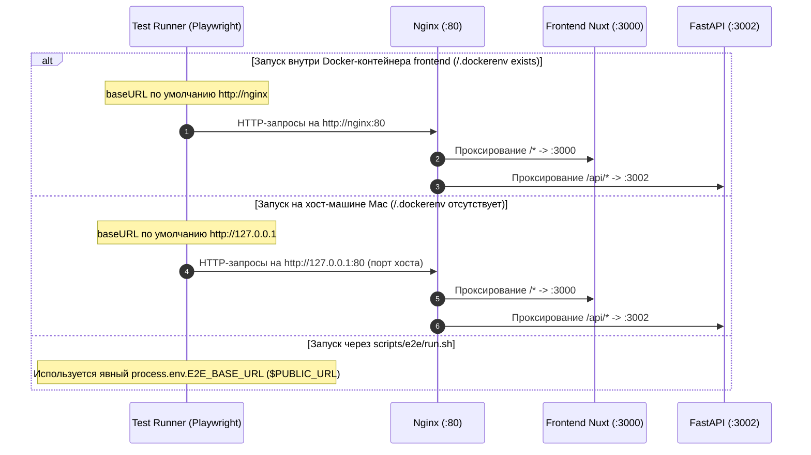

# Автоопределение baseURL Playwright в Docker и соглашения API в AGENTS.md

> Задача: настроить автоматическое определение базового адреса для Playwright (`baseURL`) в зависимости от среды исполнения (Docker-контейнер vs хост-машина) и зафиксировать правила маршрутизации API и запуска тестов в документации `frontend/AGENTS.md`.

**Идентификатор:** `e2e-playwright-docker-base-url`

**Ветка:** `chore/e2e-playwright-docker-base-url` от актуального `origin/test`.

## Текущее поведение

- В `frontend/playwright.config.ts` в блоке `use` задано `baseURL: process.env.E2E_BASE_URL ?? 'http://127.0.0.1'`.
- При запуске тестов внутри контейнера `frontend` переменная `E2E_BASE_URL` по умолчанию не задана. Playwright использует дефолт `http://127.0.0.1`, пытаясь подключиться к порту 80 самого контейнера `frontend`, где никто не слушает, что вызывает ошибку `ECONNREFUSED 127.0.0.1:80`.
- При этом скрипт `scripts/e2e/run.sh` явно экспортирует `E2E_BASE_URL="$PUBLIC_URL"`, поэтому проблема возникает только при прямом запуске целевых тестов (`bun run test:e2e`).
- В `frontend/AGENTS.md` отсутствуют явные правила о Same-Origin формате `config.public.apiBase` и автоматическом определении `baseURL` в Playwright.

## Желаемое поведение

1. В `frontend/playwright.config.ts` базовый адрес вычисляется автоматически при отсутствии явного `process.env.E2E_BASE_URL`:
   - Если существует файл индикатора контейнера `/.dockerenv` -> используется `http://nginx`.
   - Если индикатор отсутствует (хост-машина) -> используется `http://127.0.0.1`.
2. В `frontend/AGENTS.md`:
   - В разделе «Соглашения API» зафиксировано, что `config.public.apiBase` по умолчанию равен пустой строке `""` (паттерн Same-Origin), а клиентские вызовы выполняются относительно origin страницы.
   - В разделе «Запуск» зафиксировано, что конфигурация Playwright автоматически определяет `baseURL` (`http://nginx` в Docker, `http://127.0.0.1` на хосте), и ручная передача `E2E_BASE_URL` нужна только для кастомных стендов.

## Зачем это нужно

- Позволяет запускать целевые сценарии `bun run test:e2e` внутри Docker-контейнера `frontend` без ручной передачи флагов и без запуска локальных TCP-forwarder'ов.
- Гарантирует, что будущие задачи и агенты будут следовать единым правилам адресации API без возврата к хардкоду `http://localhost`.

## Планируемые изменения

1. В `frontend/playwright.config.ts`:
   - Подключить `node:fs`.
   - Добавить проверку `const isDocker = fs.existsSync('/.dockerenv')`.
   - Вычислять `const defaultBaseUrl = isDocker ? 'http://nginx' : 'http://127.0.0.1'`.
   - Использовать `baseURL: process.env.E2E_BASE_URL ?? defaultBaseUrl`.
2. В `frontend/AGENTS.md`:
   - Обновить раздел «Соглашения API» правилом об относительном `apiBase` и разрешении SSR через `resolveApiBase`.
   - Обновить раздел «Запуск» пояснением про автоопределение `baseURL` для Playwright.

## Критерии готовности

- В `frontend/playwright.config.ts` внутри контейнера Docker `baseURL` по умолчанию разрешается в `http://nginx`, на хосте — в `http://127.0.0.1`.
- Явный `process.env.E2E_BASE_URL` (в том числе из `scripts/e2e/run.sh`) имеет приоритет над дефолтом.
- Документация в `frontend/AGENTS.md` обновлена.
- Синтаксические проверки и запуск Playwright проходят без ошибок.
