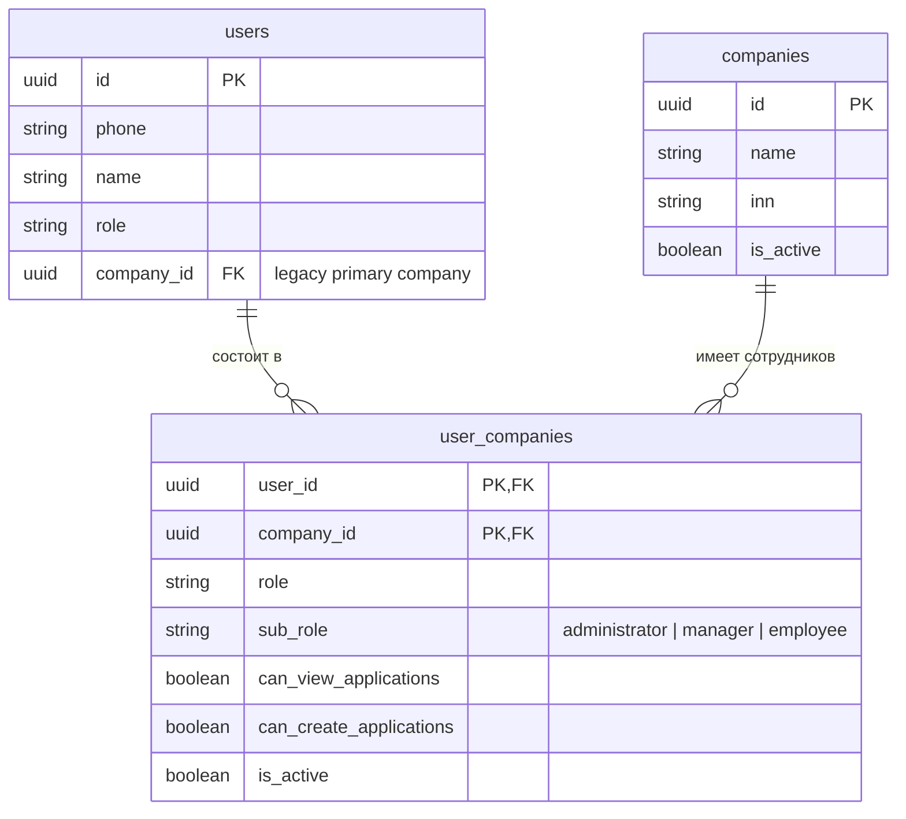

# Запрет удаления администратора компании сотрудником в ЛК

| Поле | Значение |
|------|----------|
| Bitrix | [22358 (задача 2)](https://carcraftpro.bitrix24.ru/workgroups/group/124/tasks/task/view/22358/) |
| Ветка | `bugfix/22358-2` |
| Тип | bugfix |
| Область | frontend (`CompanyMembersPanel.vue`) + backend (`application/commands/employees.py`) |



## Постановка

Если в личном кабинете (`/cabinet`, вкладка «Сотрудники») администратор компании добавляет/приглашает сотрудника, зарегистрировавшегося под этой компанией, у такого сотрудника (или менеджера компании) в таблице участников на строке администратора отображается активная кнопка «Удалить».

### Причины проблемы

1. **Frontend (`CompanyMembersPanel.vue`)**:
   - В методе `fetchCompanies` (строка 266) при нестроковом значении `sub_role` ошибочно указан fallback:
     ```ts
     sub_role: authStore.isCarCraftEmployee || typeof subRole !== 'string'
       ? 'administrator'
       : subRole as UserCompany['sub_role'],
     ```
     Если `subRole` равен `null` или `undefined`, пользователю присваивалось `'administrator'`, что приводило к ошибочной выдаче административных прав сотруднику (`canManageSelectedCompany = true`) и отображению кнопок удаления участников (включая администратора).

## Требования

1. **Доступ к вкладке «Сотрудники»**:
   - Сотрудник компании должен видеть вкладку «Сотрудники» в личном кабинете (`/cabinet`), если он состоит хотя бы в одной компании.
2. **Ограничение прав на удаление (только администратор)**:
   - Колонка «Действия» остаётся видимой в таблице для всех ролей (заголовок и ячейки сохраняются).
   - Кнопка «Удалить» отображается исключительно администраторам компании (`sub_role === 'administrator'` или `isCarCraftEmployee`). Ни сотрудник, ни менеджер не должны видеть кнопку «Удалить» и не должны иметь возможности удалять участников через API.
3. **Исправление fallback роли на фронтенде**:
   - В `fetchCompanies` при отсутствии или нестроковом значении `sub_role` устанавливать значение `'employee'`, а не `'administrator'`.
4. **Правила удаления для администраторов**:
   - Сохранить стандартные правила удаления участников: администратор компании имеет возможность удалять участников; самоблокировка удаления самого себя сохраняется (`member.user_id === authStore.user?.id`).
5. **Тестирование**:
   - Проверить E2E/браузерный сценарий:
     1. Администратор видит кнопки удаления участников кроме себя.
     2. Сотрудник компании видит вкладку «Сотрудники» и колонку «Действия», но не видит кнопок удаления и не может управлять составом.
     3. Менеджер компании видит список, кнопку «Пригласить» и колонку «Действия», но не видит кнопку «Удалить».
     4. Пользователь без компании вкладку не видит.
   - Проверить в backend-тестах отказ 403 при попытке удаления участника сотрудником и менеджером.

## Планируемые изменения

1. **Frontend**:
   - [`frontend/pages/cabinet.vue`](frontend/pages/cabinet.vue):
     - Разрешить отображение вкладки «Сотрудники» и панели для всех участников компании (`canViewEmployeesTab`).
   - [`frontend/features/company/components/CompanyMembersPanel.vue`](frontend/features/company/components/CompanyMembersPanel.vue):
     - В `fetchCompanies` скорректировать fallback: `sub_role: authStore.isCarCraftEmployee ? 'administrator' : (typeof subRole === 'string' && subRole ? subRole as UserCompany['sub_role'] : 'employee')`.
     - Сохранить колонку «Действия» для всех участников, а кнопку «Удалить» показывать только при `canDeleteSelectedCompanyMembers` (только `administrator` или `isCarCraftEmployee`).
     - В `removeMember` добавить проверку `canDeleteSelectedCompanyMembers`.

2. **Backend**:
   - [`backend/application/commands/employees.py`](backend/application/commands/employees.py):
     - В `handle_remove_company_member` вызывать `_require_administrator` вместо `_require_admin_or_manager`.
   - [`backend/presentation/routers/users.py`](backend/presentation/routers/users.py):
     - Обновить описание эндпоинта удаления участника.
   - [`backend/tests/test_employee_sub_roles.py`](backend/tests/test_employee_sub_roles.py):
     - Дополнить тесты проверками отказа 403 при вызове `handle_remove_company_member` сотрудником и менеджером.

## Критерии готовности

- [x] Сотрудник компании видит вкладку «Сотрудники» в ЛК.
- [x] Fallback роли в `fetchCompanies` не повышает обычного пользователя до `administrator`.
- [x] Кнопка «Удалить» отображается исключительно у администраторов компании.
- [x] Сотрудник и менеджер компании не видят кнопку «Удалить» и не могут отправить запрос на удаление.
- [x] Бэкенд возвращает 403 Forbidden при попытке удаления участника не-администратором (`_require_administrator`).
- [x] Администратор компании сохраняет возможность удаления участников.
- [x] Тесты в `backend/tests/test_employee_sub_roles.py` проходят успешно (12/12).
- [x] E2E-тесты Playwright проходят успешно (4/4).
- [x] Линтеры `ruff`, `lint-imports`, `mypy` не выдают новых ошибок.
- [x] `alembic check` подтверждает отсутствие расхождений схемы БД.
- [ ] Merge Request в ветку `test` с описанием и ссылкой на задачу Bitrix 22358.


