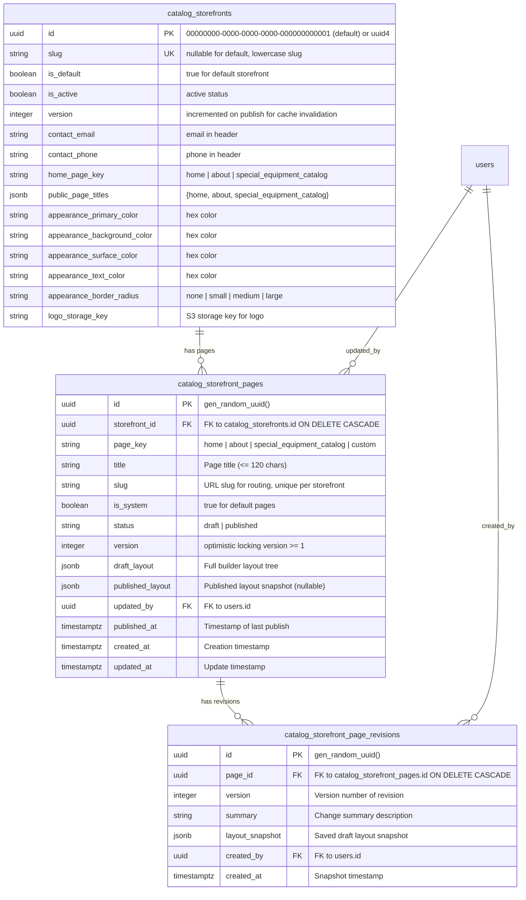
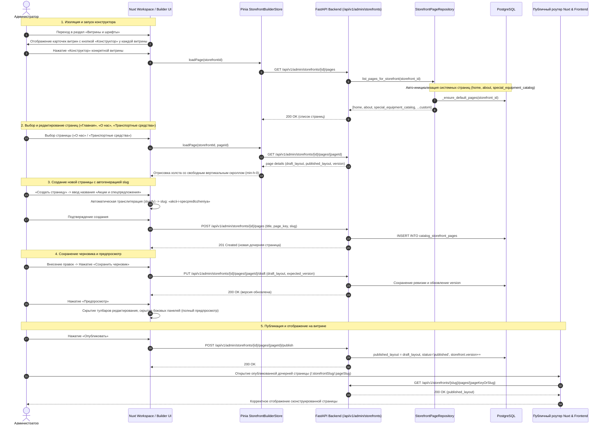

# Спецификация: Комплексное исправление и доработка конструктора витрин (Storefront Page Builder)

- **Дата и время создания:** 2026-09-30 14:54:47 MSK (UTC+3)
- **Идентификатор задачи Bitrix24:** — (внутренняя задача, не связана с Bitrix)
- **Ветка задачи:** `bugfix/storefront-builder-fixes`
- **Целевая ветка:** `test`
- **Merge Request:** [!490 (https://gitlab.carcraft.ru/carcraft/carcraft-leadgenerator/-/merge_requests/490)](https://gitlab.carcraft.ru/carcraft/carcraft-leadgenerator/-/merge_requests/490)
- **Тип задачи:** `bugfix` / `feature`

---

## 1. Архитектурные диаграммы

### 1.1. Диаграмма сущностей БД (ERD)

### 1.2. Диаграмма последовательности (Sequence Diagram)

---

## 2. Постановка проблемы и контекст

Конструктор витрин (`/workspace/storefronts/[id]/builder`) содержит критические дефекты и функциональные ограничения, препятствующие полноценной настройке страниц и публикации контента:

1. **Отсутствие визуальной изоляции по витринам в списке:** В списке витрин администратора отсутствует отдельная прямая кнопка «Конструктор» в строке/карточке каждой конкретной витрины. Пользователю неочевидно, к какой витрине применяется действие.
2. **Блокировка скроллинга холста конструктора (`main`):** Контейнер холста `<main>` внутри `StorefrontBuilderCanvas.vue` заблокирован по скроллингу из-за отсутствия `min-h-0` во flex-цепочке и жестких overflow-ограничений родительских слоев (`overflow-hidden` без размерных ограничений flex-потомков). В результате длинные страницы обрезаются и их невозможно прокрутить.
3. **Отсутствие автогенерации slug при создании страницы:** В модальном окне создания страницы пользователю требуется вручную вводить технический `page_key`, а поле `slug` не формируется автоматически из человекочитаемого названия страницы (отсутствует транслитерация/slugify).
4. **Невозможность публикации страницы как дочерней страницы витрины:** Созданные страницы после нажатия кнопки «Опубликовать» не открываются на публичном сайте по маршруту витрины. В публичном роутере Nuxt отсутствует динамический маршрут для кастомных сконструированных страниц (`/:storefrontSlug/:pageSlug` и `/:pageSlug`), а бэкенд ищет страницу только по `page_key`, игнорируя `slug`.
5. **Невозможность редактирования ключевых системных страниц витрины:** Пользователю доступно только создание новых страниц. При этом базовые системные страницы («Главная», «О нас», «Транспортные средства») не представлены в полном объеме: страница «Транспортные средства» (`special_equipment_catalog`) отсутствует в механизме инициализации страниц витрины, а публичные страницы «О нас» и «Транспортные средства» не интегрированы с рендерером конструктора `StorefrontPageRenderer`.
6. **Отсутствие возможности редактирования шапки (Header):** Конструктор не предоставляет интерфейса и параметров для настройки шапки витрины (логотип, навигационные ссылки, контакты/телефон/email, заголовки страниц).
7. **Неработающая кнопка «Предпросмотр»:** Нажатие на кнопку «Предпросмотр» меняет только текст кнопки, не отключая рамки, тулбары и контролы редактирования на холсте и не скрывая панели инструментов.
8. **Ошибки и сбои сохранения черновика:** Кнопка «Сохранить черновик» падает с ошибками или не синхронизирует состояние версий страницы, из-за чего последующие действия блокируются конфликтом версий (`409 Conflict`).

---

## 3. Требования к реализации

### 3.1. Изоляция и запуск конструктора по витринам
- В компоненте `AdminStorefrontsPanel.vue` добавить отдельную кнопку «Конструктор» непосредственно в карточку/строку каждой витрины в левом списке, а также сохранить её в шапке детального просмотра витрины.
- При переходе в конструктор (`/workspace/storefronts/[id]/builder`) состояние хранилища `storefrontBuilder` должно очищаться перед загрузкой, гарантируя отсутствие остаточных данных предыдущей открытой витрины.
- В верхней панели конструктора (`StorefrontBuilderTopBar.vue`) отображать явное название и slug текущей редактируемой витрины со ссылкой на возврат к списку витрин.

### 3.2. Восстановление скроллинга холста конструктора
- В `StorefrontBuilderCanvas.vue` и flex-контейнерах `pages/workspace/storefronts/[id]/builder.vue` обеспечить корректную flexbox-верстку с `min-h-0`, `overflow-y-auto` и `w-full`.
- Устранить блокирующие перехваты колеса мыши и гарантировать плавную прокрутку страницы от верхнего баннера до нижнего футера при любом объеме содержимого.

### 3.3. Автоматическая генерация slug и page_key
- Реализовать утилиту транслитерации и slugify (с поддержкой кириллицы, латиницы, дефисов и очистки спецсимволов).
- В модальном окне создания страницы при вводе названия (например, «Спецпредложения и лизинг») автоматически генерировать `slug` (`specpredlozheniya-i-lizing`) и `page_key`.
- Пользователь должен иметь возможность при необходимости вручную отредактировать сгенерированный slug перед отправкой формы.
- Создаваемая страница должна сохранять и передавать `slug` на бэкенд в `createPage`.

### 3.4. Публикация и маршрутизация дочерних страниц витрины
- В бэкенде в `handle_get_public_storefront_page` реализовать поиск страницы по `slug` (если по `page_key` страница не найдена).
- В публичном роутере Nuxt зарегистрировать динамический маршрут для сконструированных страниц:
  - Для дефолтной витрины: `/:customPageSlug` (с проверкой, что slug не пересекается с зарезервированными системными маршрутами `cart`, `about`, `workspace` и т.д.).
  - Для дочерней витрины со slug: `/:storefrontSlug/:customPageSlug`.
- Создать страницу-обработчик кастомных страниц, которая загружает макет через `pagesApi.getPublicPage` и отображает страницу через `StorefrontPageRenderer`.
- В конструкторе после успешной публикации предоставлять прямую ссылку на открытую страницу для быстрой проверки.

### 3.5. Полноценное редактирование системных страниц («Главная», «О нас», «Транспортные средства»)
- В бэкенде в `_ensure_default_pages` (`storefront_page_repository.py`) добавить инициализацию страницы «Транспортные средства» (`page_key="special_equipment_catalog"`, `title="Транспортные средства"`, `slug="special-equipment"`, `is_system=True`) с дефолтным макетом, содержащим каталог/витрину техники.
- В выпадающем списке страниц конструктора отображать все три страницы с понятными метками: «Главная», «О нас», «Транспортные средства» (с бейджем «Системная»).
- В публичных страницах `pages/about.vue` и `pages/special-equipment/index.vue` интегрировать `StorefrontPageRenderer` с получением макета из `pagesApi.getPublicPage` и сохранением существующего поведения как резервного шаблона (`fallback slot`).

### 3.6. Настройка и редактирование Header (Шапки)
- В конструкторе добавить вкладку или раздел настройки «Шапка» (Header):
  - Редактирование контактного телефона и email.
  - Управление логотипом (URL / загрузка).
  - Редактирование названий навигационных пунктов («Главная», «О нас», «Транспортные средства») с синхронизацией с `public_page_titles`.
  - Возможность управления видимостью контактов/ссылок.
- Интегрировать сохранение параметров шапки через API витрины (`updateStorefront` / `updatePublicUi`).
- Отображать шапку в верхней части холста конструктора для наглядного интерактивного предпросмотра.

### 3.7. Полноценный режим предпросмотра
- При активации кнопки «Предпросмотр»:
  - Передавать `:is-editable="false"` в `StorefrontPageRenderer`, отключая все outline-рамки, кнопки удаления, перемещения и добавления секций/виджетов.
  - Сворачивать/скрывать боковые панели инструментов (Sidebar и Inspector), предоставляя чистый вид страницы в выбранном разрешении (Desktop / Laptop / Tablet).
  - При повторном нажатии («Редактирование») восстанавливать панели инструментов и интерактивные контролы.

### 3.8. Стабильное сохранение черновика и управление версиями
- В `storefrontBuilder.ts` гарантировать корректное обновление `currentPage.value.version` после каждого сохранения черновика и публикации.
- Добавить обработку конфликтов версий с возможностью автоматической актуализации данных.
- Отображать информативные тосты об успешном сохранении черновика либо понятную ошибку в случае сбоя.

### 3.9. Отображение и управление всеми страницами витрины в конструкторе и панели администратора
- **Конструктор витрин:**
  - В бэкенд добавить недостающий маршрут `GET /api/v1/admin/storefronts/{storefront_id}`, возвращающий `StorefrontAdminResponse`. Его отсутствие вызывало HTTP 405 при вызове `api.getStorefront`, срыв загрузки и пустой выпадающий список страниц `<select>`.
  - В выпадающем списке `<select>` верхней панели конструктора отображать все страницы витрины (системные: «Главная», «О нас», «Транспортные средства» и все созданные кастомные страницы), а также опцию «+ Создать страницу…».
  - Все страницы витрины должны быть переключаемыми и настраиваемыми через холст конструктора.
  - В модальном окне создания страницы показывать понятную ошибку и не закрывать модальное окно при сбое; при успехе сразу активировать созданную страницу.
- **Вкладка «Доступ к разделам» (`?tab=visibility`):**
  - **Блок «Публичные страницы»:**
    - Отображать все страницы витрины: базовые системные страницы («Главная», «О нас», «Транспортные средства») и созданные пользователем кастомные страницы.
    - В выпадающем списке «Главная страница» и списке «Названия страниц» предоставлять возможность просматривать и редактировать названия всех страниц витрины.
    - Для каждой кастомной страницы выводить бейдж со slug/page_key и кнопку быстрого перехода к редактированию в Конструктор.
    - Предоставить кнопку «+ Создать страницу в конструкторе».
    - При нажатии «Сохранить страницы» сохранять названия системных страниц и названия кастомных страниц.
  - **Блок «Доступ к разделам -> Публичный сайт»:**
    - В список разделов публичного сайта включать не только «О нас» и «Транспортные средства», но и все созданные кастомные страницы текущей витрины.
    - Для каждой страницы предоставлять переключатель видимости (Видим / Скрыт). Для активной главной страницы переключатель блокировать с подсказкой «Текущую главную страницу нельзя скрыть».
    - В бэкенде в `section_visibility` разрешить ключи страниц конкретной витрины при валидации и сохранении переопределений видимости.

---

## 4. План изменений в файлах

### Бэкенд (`backend/`)
1. `backend/presentation/routers/storefronts.py`:
   - Добавить эндпоинт `GET /api/v1/admin/storefronts/{storefront_id}` с возвратом `StorefrontAdminResponse`.
2. `backend/presentation/routers/admin_storefront_pages.py` и `backend/presentation/schemas/storefront_pages.py`:
   - Добавить PATCH/PUT эндпоинт для обновления метаданных страницы (title/slug).
3. `backend/domain/section_visibility.py`:
   - Расширить `validate_section_visibility_key` поддержкой кастомных ключей страниц витрины.
4. `backend/application/queries/section_visibility.py`:
   - В `handle_list_section_visibility` и `handle_get_section_visibility` для scope="public" с указанным `storefront_id` добавлять в матрицу все страницы данной витрины из `catalog_storefront_pages`.
5. `backend/application/commands/section_visibility.py`:
   - В `handle_update_section_visibility` разрешать ключи страниц витрины для scope="public".
6. `backend/infrastructure/repositories/storefront_page_repository.py`:
   - Обеспечить создание дефолтных системных страниц и поиск страниц по key/slug.

### Фронтенд (`frontend/`)
1. `frontend/features/storefrontBuilder/store/storefrontBuilder.ts` и `storefrontBuilderApi.ts`:
   - Добавить обработку ошибок при создании страниц, гарантировать наполнение `availablePages` всеми страницами витрины.
   - Добавить метод обновления метаданных страницы.
2. `frontend/features/storefrontBuilder/components/StorefrontBuilderTopBar.vue`:
   - Гарантировать отображение всех страниц витрины в `<select>` с возможностью переключения и настройки.
3. `frontend/pages/workspace/storefronts/[id]/builder.vue`:
   - Поддержка открытия целевой страницы через `query.page`.
   - Валидация и отображение ошибок при создании страницы.
4. `frontend/features/admin/storefronts/components/AdminStorefrontsPanel.vue`:
   - В блоке «Публичные страницы» подгружать и отображать кастомные страницы витрины с полями редактирования названий, ссылками на конструктор и кнопкой создания новой страницы.
   - Сохранять названия как системных, так и кастомных страниц при отправке формы.
5. `frontend/features/sectionVisibility/AdminSectionVisibilityPanel.vue`:
   - В scope «Публичный сайт» динамически выводить все кастомные страницы витрины рядом со стандартными разделами и позволять переключать их видимость.

---

## 5. Критерии готовности (Definition of Done)

- [x] В списке витрин каждая витрина имеет индивидуальную кнопку перехода в конструктор; контекст витрины строго изолирован.
- [x] Холст конструктора (`main`) свободно прокручивается по вертикали на всю высоту содержимого в любых разрешениях.
- [x] При создании страницы название автоматически транслитерируется в латинский slug, доступный для ручной правки.
- [x] Системные страницы «Главная», «О нас» и «Транспортные средства» доступны для редактирования в выпадающем списке страниц конструктора.
- [x] Изменения системных страниц «О нас» и «Транспортные средства» после публикации корректно отображаются на публичном сайте (с fallback на дефолтный шаблон).
- [x] Новая созданная страница успешно публикуется и открывается на публичном сайте как дочерняя страница витрины по своему slug.
- [x] В конструкторе доступно редактирование параметров Header витрины (контакты, логотип, заголовки пунктов меню).
- [x] Кнопка «Предпросмотр» скрывает управляющие элементы конструктора и боковые панели, отображая чистый сайт.
- [x] Сохранение черновика работает стабильно, сохраняет ревизии и версионирование без конфликтов.
- [x] В конструкторе в `<select>` отображаются ВСЕ страницы витрины (системные и кастомные), каждая страница доступна для выбора и настройки.
- [x] Создание страницы в конструкторе работает надежно с понятной индикацией ошибок.
- [x] В панели управления витриной (`?tab=visibility`) в блоке «Публичные страницы» отображаются и редактируются все страницы витрины (системные и созданные).
- [x] В панели управления витриной (`?tab=visibility`) в блоке «Доступ к разделам -> Публичный сайт» отображаются переключатели видимости для всех страниц витрины.
- [x] Статические проверки бэкенда (`ruff`, `lint-imports`, `mypy`) и ORM-модели проверены.
- [x] E2E/Playwright тесты подтверждают работу отредактированных сценариев.

