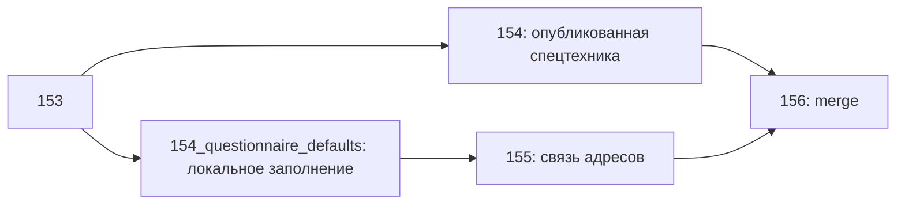
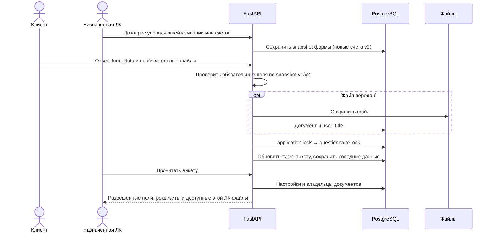

# №22286 — Расширение анкеты клиента и автоматический сбор данных

- Задача: https://carcraftpro.bitrix24.ru/workgroups/group/124/tasks/task/view/22286/
- Ветка: `feature/22286`; исходная реализация — от `33d5a7b5`, локальная доработка 01.10.2026 начата от `origin/test` на `8565a148`, затем синхронизирована с `b7907107`. Прежняя реализация уже входит в эту базу; новая доработка остаётся локальной.
- Основание: «№41. Анкета пользователя 11.09.2026 версия 2.docx», SHA256 `3f3bb75ca7092a29f85fbef925bfc9086416595d45b2b325832244596d203465`; решения пользователя в чате; Flow Atlas «Carcraft — все фичи проекта», project.91e485f9-d3ef-4ab6-90dd-211921823f31.
- Статус на 02.10.2026: основная реализация и доработки ТЗ №41 версии 3 объединены в test через MR !506 (cb781e6c). Последующая правка удаляет дублирующую клиентскую кнопку «Анкета заявки», сохраняя «Продолжить» и отдельную страницу заполнения; проверена в bugfix/22286-client-questionnaire-button. Результаты и история решений — в конце спецификации.
- Актуализация 01.10.2026: предоставлены ТЗ №41 версия 3 от 29.09.2026, SHA256 `43fd63d99aab56f205c6cbff1341dfef1216f64183058ba19895e5c4b4a90970`, и «№40 Настройка анкеты для лизинговых компаний.docx», SHA256 `660f53721cbe2cc774efff8a11e72a8244563c45af5907cb553fe42159e5cf9c`. Пользователь отложил реализацию №40 и разрешил устранить блокировки от дозапросных полей; позднее разрешил сохранить в JSONB реквизиты вместе со сведениями о файлах и исправить остальные выявленные проблемы. Согласованная реализация версии3 завершена локально; ранняя загрузка всех файлов остаётся отложенной. Уточнения ниже имеют приоритет над прежними решениями о документной обязательности.
- Дополнение 02.10.2026: после предыдущей проверки воспроизведён P2 в браузере — подтверждённый OCR-адрес бенефициара сохранялся на сервере, но не обновлялся в форме; последующее изменение доли отправляло прежний адрес обратно. Пользователь разрешил исправление. Предыдущие API-проверки адреса и браузерный сценарий ручного паспорта не покрывали эту последовательность. Требование §3.8.3–3.8.4 остаётся прежним; ниже зафиксированы исправление и дополнительная регрессия.
- Это единственная текстовая спецификация задачи. Результаты проверки и уточнения добавляются сюда.

```mermaid
erDiagram
  alembic_version {
    varchar version_num PK "метаданные: merge156; далее data migrations157–159"
  }
  leasing_applications ||--o| application_questionnaires : "сейчас 0..1; новая заявка обязательно 1"
  companies ||--o{ leasing_applications : "company_id"
  leasing_applications ||--o{ application_vehicles : "application_id"
  leasing_applications ||--o{ special_equipment_application_items : "application_id"
  leasing_applications ||--o{ document_applications : "application_id"
  documents ||--o{ document_applications : "document_id"
  leasing_applications ||--o{ application_documents : "application_id"
  documents ||--o{ application_documents : "document_id"
  leasing_applications ||--o{ application_document_requests : "application_id"
  application_document_requests |o--o{ application_documents : "document_request_id"
  leasing_applications ||--o{ sopd_passport_snapshots : "application_id"
  signature_requests |o--o| sopd_passport_snapshots : "signature_request_id"
  leasing_companies ||--o{ application_documents : "leasing_company_id"
  leasing_companies ||--o{ application_document_requests : "leasing_company_id"
  leasing_companies ||--o| leasing_questionnaire_settings : "НОВОЕ: leasing_company_id"
  beneficial_owner_absence_reasons |o--o{ application_questionnaires : "НОВОЕ: причина отсутствия"
  leasing_applications {
    uuid id PK
    uuid company_id FK
    string status
  }
  application_questionnaires {
    uuid id PK
    uuid application_id FK,UK
    string company_phone "НОВОЕ"
    string company_email "НОВОЕ"
    string company_website "НОВОЕ"
    boolean actual_address_same_as_legal "НОВОЕ 155: NOT NULL DEFAULT false"
    jsonb contact_person "НОВОЕ: один контакт"
    jsonb management_company_details "158: реквизиты + сведения о документе"
    jsonb open_bank_accounts "157: новые ответы — четыре поля; старые сохраняются"
    boolean postal_address_matches_legal "НОВОЕ"
    jsonb founders "существует"
    jsonb beneficiaries "существует, расширяется"
    uuid no_beneficial_owner_reason FK "НОВОЕ"
    jsonb field_sources "НОВОЕ: технический источник, не confidence"
    jsonb people_identity_map "НОВОЕ: скрытый реестр legacy alias к UUID"
    jsonb vehicle_purchase_purpose "НОВОЕ: цели по UUID позиции"
    timestamptz questionnaire_completed_at "НОВОЕ: успешное назначение ЛК"
    timestamptz created_at
    timestamptz updated_at
  }
  application_vehicles {
    uuid id PK
    uuid application_id FK
    string leasing_purpose "существует: первая цель для совместимости"
    jsonb leasing_purposes "НОВОЕ: все выбранные цели"
  }
  special_equipment_application_items {
    uuid id PK
    uuid application_id FK
    string leasing_purpose "существует"
    jsonb leasing_purposes "НОВОЕ: все выбранные цели"
  }
  document_applications {
    uuid id PK
    uuid document_id FK
    uuid application_id FK
  }
  documents {
    uuid id PK
    string file_name
    string s3_key
  }
  application_documents {
    uuid id PK
    uuid application_id FK
    uuid document_id FK
    uuid document_request_id FK "nullable"
    uuid leasing_company_id FK
    string user_title "НОВОЕ"
  }
  application_document_requests {
    uuid id PK
    uuid application_id FK
    uuid leasing_company_id FK
    string document_type
    jsonb form_data
    jsonb form_schema "снимок версии1/2; старые не переписываются"
    boolean has_form
    string status
  }
  sopd_passport_snapshots {
    uuid id PK
    uuid application_id FK
    string signer_key "UK вместе с application_id"
    uuid signature_request_id FK,UK
    jsonb recognition_fields
    jsonb recognition_confidence
    jsonb draft_fields
    jsonb confirmed_fields
    jsonb edited_fields "НОВОЕ: маска ручных правок"
  }
  signature_requests {
    uuid id PK
    uuid application_id FK
    string status
    timestamptz signed_at
    timestamptz revoked_at
  }
  leasing_questionnaire_settings {
    uuid leasing_company_id PK,FK "НОВОЕ"
    jsonb fields "НОВОЕ: enabled и required по полю"
  }
  beneficial_owner_bases {
    uuid id PK "НОВОЕ"
    string code UK
    string name
    boolean is_active
    timestamptz created_at
    timestamptz updated_at
  }
  beneficial_owner_absence_reasons {
    uuid id PK "НОВОЕ"
    string code UK
    string name
    boolean is_active
    timestamptz created_at
    timestamptz updated_at
  }
```



ERD — значимые поля, а не полный набор колонок; метка «НОВОЕ» означает добавление задачей №22286, уже реализованное в её ветке. Полная таблица 114 колонок приведена ниже. JSONB `beneficiaries[].beneficial_owner_basis` содержит UUID справочника и проверяется приложением, физический FK из JSONB не выдумывается. Существующие таблицы проверены по `infrastructure/models/applications.py`, `documents.py`, `signature_requests.py`, `sopd_passport_snapshots.py`. Таблица настроек `leasing_questionnaire_settings` ссылается на `leasing_companies.id`; подтверждено миграцией 148 и ORM.

```mermaid
sequenceDiagram
  actor User as Пользователь
  participant UI as Nuxt
  participant API as FastAPI
  participant DB as PostgreSQL
  participant Provider as ФНС / DaData / DBrain
  participant S3 as Хранилище документов
  actor Admin as carcraft_employee
  actor LC as Лизинговая компания
  User->>UI: Создать заявку, выбрать компанию
  UI->>API: Создание заявки
  API->>DB: Заявка + отдельная анкета в одной транзакции
  API->>Provider: Получить доступные данные компании / ЕГРЮЛ
  alt Получены данные
    API->>DB: Обновить только поля без ручного приоритета
    API->>S3: PDF выписки
    API->>DB: Документ и связи с заявкой
  else Нет данных / ошибка провайдера
    API-->>UI: Сохранённые данные и доступный повтор
  end
  User->>UI: Изменить все цели транспорта
  UI->>API: Сохранить цели выбранной позиции
  API->>DB: leasing_purposes и vehicle_purchase_purpose одной анкеты
  UI-->>User: /questionnaire/:id — отдельная страница заполнения
  User->>UI: Контакты, адреса, бенефициары, ЭДО
  UI->>API: Существующее автосохранение анкеты этой заявки
  API->>DB: Только изменённые поля анкеты
  User->>UI: Загрузить банковскую выписку
  UI->>API: Существующий upload выписки
  API->>Provider: Существующий анализатор выписки
  alt Получены контрагенты
    API->>DB: Основные контрагенты без перезаписи ручных данных
  else Пустой результат / ошибка
    API-->>UI: Существующий результат загрузки; ручные сведения сохранены
  end
  User->>UI: Заполнить недостающее / загрузить паспорт
  UI->>API: Распознавание паспорта подписанта заявки
  API->>Provider: DBrain
  API->>S3: Исходные изображения паспорта
  API->>DB: Документы заявки, технический снимок и confidence
  API-->>UI: Значения + confidence по неизменённым полям
  User->>UI: Исправить поле / подтвердить
  UI->>API: Поля + маска ручных изменений
  API->>DB: Подтверждённый паспорт + проекция в анкету без confidence
  User->>UI: Сохранить и продолжить / уйти со страницы
  UI->>API: Дождаться сохранения ожидающих изменений
  alt Проверка полей или сохранение неуспешны
    UI-->>User: Оставить редактор и введённые данные, показать ошибку
  else Успешно / изменений нет
    UI-->>User: Следующий этап /application/:id?step=company или выбранный маршрут
  end
  Admin->>API: Назначить ЛК
  API->>DB: Заблокировать заявку, проверить настройки каждой ЛК без обязательности дозапросных полей
  alt Обязательные данные отсутствуют
    API-->>Admin: 422 со списком отсутствующих полей; назначения нет
  else Все требования выполнены
    API->>DB: Назначения + questionnaire_completed_at + уведомления
    API-->>LC: Заявка, разрешённая проекция анкеты и документы
  end
  LC->>UI: Открыть или скачать СОПД из поля анкеты
  UI->>API: GET файла согласия в контексте заявки и поля
  API->>DB: Проверить доступ к заявке, видимость поля и актуальное согласие
  alt Согласие доступно
    API->>S3: Прочитать существующий подписанный файл
    alt Файл существует
      API-->>UI: Файл с фактическим типом и способом выдачи
    else Файл отсутствует
      API-->>UI: 404/410 без создания другого документа
    end
  else Нет доступа / согласие скрыто или отозвано
    API-->>UI: Отказ без выдачи файла
  end
  LC->>API: Существующий дозапрос документов / данных
  API-->>User: Существующее уведомление
  User->>API: form_data, необязательные для разрешённых типов файлы и user_title
  API->>S3: Сохранить приложенные файлы
  API->>DB: Документы заявки + ответ + обновление той же анкеты + уведомления
  API-->>LC: Актуальные сведения и доступные файлы
```

## Постановка и реализованное состояние

Анкета — структурированные сведения о клиенте для рассмотрения конкретной заявки. Документы прикладываются к заявке; анкета содержит их текстовое описание и идентификаторы, а не файлы. Разные заявки одной компании сохраняют независимые анкеты. Истории версий внутри одной заявки нет.

На ветке задачи анкета создаётся для каждой новой заявки во всех поддерживаемых путях. application_id уникален; общий upsert обновляет updated_at, проекция целей — при изменении содержимого. Добавлены 52 колонки анкеты, включая actual_address_same_as_legal в локальной доработке; связанные миграции задачи — 147–151 и 154–155. Исходные замечания «поля отсутствуют» и «updated_at не меняется» относились к базе до реализации и больше не описывают эту ветку. Полный актуальный список и отличие от origin/test приведены в разделе «Актуальный контракт БД после реализации».

## Принятые решения

1. questionnaire_completed_at ставится при успешном назначении новой ЛК администратором. Повтор того же назначения без нового получателя дату не меняет. Новое успешное направление обновляет дату; ошибки не меняют её.
2. После направления анкета обновляется в той же записи через существующие дозапросы; уведомления сохраняются. Само позднее дополнение не меняет дату направления.
3. Кредиты/займы/лизинг — вариант Б, §3.16 имеет приоритет над §3.15: файл или текст отсутствия; таблицы обязательств и сумм нет. Без файла отсутствие используется по умолчанию, отдельный обязательный чекбокс не вводится.
4. Настройки видимости и обязательности индивидуальны для каждой ЛК. Нельзя передавать одной ЛК объединение полей, разрешённых другим ЛК.
5. Confidence не попадает в application_questionnaires. Хранение технического confidence в passport_recognition_data и sopd_passport_snapshots разрешено.
6. Срок в анкете — дата подписания СОПД плюс три календарных года. Юридический текст уже подписанного СОПД не меняется.
7. СНИЛС относится только к директору: director_snils. Отдельный snils не добавляется.
8. Один основной контакт: contact_person {name,position,phone,email}.
9. Ручное значение, включая явную очистку, приоритетнее автоматического обновления.
10. Отсутствующие обязательные сведения блокируют направление в соответствующую ЛК; ошибка внешнего источника не даёт обход проверки. Сохранение незавершённой анкеты доступно. Уточнение 01.10.2026: обязательность девяти полей, вводимых в текущем пользовательском процессе только через дозапрос после назначения, временно недоступна; перечень и границы приведены в разделе «Отложенное ТЗ №40 и устранение блокировки дозапросов».
11. admin в ТЗ — существующий carcraft_employee. Новая роль не создаётся.

## Контракт данных и полей

Все новые бизнес-поля nullable; технические карты имеют пустой объект/массив по умолчанию. UUID не преобразуются в числа. Прежние колонки сохранены для совместимости; новые company_* отделяют контакты организации от контакта человека. Полный физический контракт приведён ниже; все источники §3 уточняются следующими правилами.

### Форма компании

- Телефон/сайт/email организации → company_phone/company_website/company_email. Телефон проверяется как номер, email и сайт по формату; пустые необязательные значения → NULL. Рядом с сайтом checkbox website_in_blocked_domains_registry, ручной, default false; автоматический запрос реестра не добавляется.
- Основной контакт: ФИО, должность, телефон, email → contact_person; действующие phone/email используются как совместимая проекция основного контакта, без размножения контактов.
- Юридический/фактический/почтовый адрес → существующие поля анкеты. При postal_address_matches_legal=true сервер и UI копируют юридический адрес в почтовый и блокируют ручной ввод. При false почтовый доступен. Юридический адрес изменён → синхронное обновление почтового при выбранном совпадении.
- Перед банковскими выписками: СБИС, Диадок, Контур, другая система + название, «не используются». Последнее взаимоисключает системы. Название другой обязательно при выборе. Сохранение в electronic_document_management_systems.
- Цели каждого транспорта → vehicle_purchase_purpose. Все выбранные цели и UUID транспорта сохраняются; числа 101/102 в примере ТЗ не задают контракт идентификатора.

### Лица и паспорта

Паспортный контрол содержит surname/name/patronymic/nationality/gender/birthDate/birthPlace/passportSeries/passportNumber/givenDate/code/givenWhom. Для директора сохраняется в director_surname/director_first_name/director_patronymic/director_citizenship/director_sex/director_birth_date/director_birth_place/director_passport_series/director_passport_number/director_passport_issue_date/director_passport_department_code/director_passport_issued_by; director_full_name составляется из ФИО. Несуществующее director_passport_data из §3.3.5 не вводится поверх существующих колонок. Остальные лица сохраняются в соответствующем JSONB с устойчивым UUID id; signer_key служит привязкой к паспорту/СОПД и не является запасным идентификатором записи.

- Гражданство обязательно при подтверждении паспорта. Если источник его не дал, пустое; не подставлять РФ без основания. Для иностранного гражданства нет российских цифровых ограничений серии/номера/кода.
- ПДЛ checkbox + обязательное ФИО при true; при false ФИО очищается. Для директора director_is_pdl/director_pdl_related_person; для остальных is_pdl/pdl_related_person_name. Отметка name_changed сохраняется и сбрасывается в false.
- Бенефициары доступны с директором и с управляющей организацией. Добавление/удаление карточек; UUID карточки; ФИО, ИНН, дата/место рождения, гражданство, пол, паспорт, адрес, доля 0..100, основание, ПДЛ, смена ФИО. Доля/основание/ИНН/ПДЛ не выдумываются из OCR.
- Сверка введённого ФИО бенефициара с OCR выводит сообщение ТЗ о несовпадении и предлагает исправление/повтор. Ручное имя не затирается автоматически.
- «Бенефициар отсутствует» очищает массив и требует причину; other требует пояснение. При обратном переключении причина/пояснение очищаются. Деактивированные справочные записи сохраняются у ранее выбранных лиц, но не доступны для нового выбора.
- Маска edited_fields хранится технически в паспортном снимке. Только реально изменённое поле теряет процент; остальные проценты сохраняются после autosave/reload/confirm. Повторное OCR обновляет распознанные неизменённые поля; ручные значения защищены. Значение 0% отображается; отсутствующий confidence не превращается в 0. Цвета существующего контракта: 91–100 зелёный, 61–90 жёлтый, 0–60 красный. Если DBrain дал общий confidence серии+номера, один показатель применяется к обоим — независимые значения не придумываются.
- Подтверждение сохраняет паспорт и проекцию анкеты в одной транзакции; устаревшие ответы UI не затирают более свежий ввод. При ошибке остаётся возможность исправления/повтора. Доступ к снимку привязан к заявке, лицу и текущему пользователю.

Исходные страницы паспорта сохраняются в `documents` с типами `sopd_passport_main`/`sopd_passport_registration` и связью `document_applications`. Исходное имя файла сохраняется; повтор того же изображения для того же лица не создаёт дубликат. После назначения ЛК создаются также её связи `application_documents`; эти связи требуют `leasing_company_id` и не создаются до назначения. Confidence и маска правок остаются техническими данными снимка.

### Автоматические источники

Используются текущие данные Company/DaData и документированный nalog_pb_api/search_org. Полное/короткое имя, ИНН/КПП/ОГРН, регистрация/орган, ОКВЭД, налоговый режим, директор/учредители переносятся только при наличии подтверждённого значения. employee_count берётся из avg_headcount за максимальный валидный год. NULL/неудачный запрос не уничтожает ручной ввод. field_sources — техническая карта источников по полям/лицам, недоступна для клиентской подмены. Нет данных → пустое поле и ручной ввод/повтор.

foreign_company_name: версия 2 указывала незавершённую доработку обмена. Nullable поле и ручное заполнение поддерживаются. Уточнение по приложению к версии 3: поставщик сообщает о JSON-атрибутах выписки с иностранным наименованием; прежняя предпосылка о недоступном источнике требует пересмотра. Автозаполнение этого поля пока не подключено; контракт нового ответа и приоритет ручных значений нужно подтвердить при отдельной реализации.

Для выписки используется GET parser/nalog_egrul_api/pdf_download с inn или ogrn, key из settings. По официальной документации ответ JSON содержит success, file_name и base64 pdf_content (не ссылка). Валидировать успешность, допустимый размер, base64/PDF; сохранить documents + связи заявки и application_documents. Повтор не плодит документ, уже приложенный к этой заявке. Ошибка отражается как доступный повтор, не как полученная выписка. Доступны открытие/скачивание существующим механизмом документов.

### Дозапросы и файлы

Существующий POST /api/v1/documents расширяется user_titles (JSON-массив строк, соответствует files); каждый title непустой <=255, иначе имя файла. Сохранение в application_documents.user_title. Файл остаётся в documents/S3 и привязан к заявке. Тип запроса, доступ, срок, статус, MIME/размер и повтор проверяются до побочных эффектов; исключения/уведомления используют существующие механизмы.

| Тип дозапроса | Вход | Поле анкеты / результат |
|---|---|---|
| snils | form_data.number, скан необязателен | director_snils, 11 цифр |
| licenses, sro | файлы и user_title | licenses_or_sro_membership: тип, название, document_id |
| main_counterparties | form_data.counterparties | main_counterparties: список ИНН/наименований; файлы отдельно |
| open_bank_accounts | form_data.accounts | open_bank_accounts: банк/счёт, сохраняется действующий строгий контракт формы |
| loans_docs | файл или отсутствие | loans_credits_leasing: текст §3.16 и ссылки |
| third_member_guarantees | файл или отсутствие | third_party_guarantees: текст §3.17 |
| additional_collateral | файл или отсутствие | additional_collateral_available: текст §3.18 |
| beneficial_owner | form_data.fio | transaction_beneficiary |
| state_defense_order | файл или отсутствие | state_defense_order: текст §3.24 |
| appointment_docs / существующий код справочника | файл или отсутствие | director_appointment_document: текст §3.29 |

Для перечисленных форм и вариантов отсутствия разрешён ответ с нулём файлов. Для остальных типов прежнее требование файла сохраняется. Отправка ответа атомарно обновляет статус запроса, данные анкеты и уведомления; повтор одного ответа не создаёт повторных документов/уведомлений. Поздний ответ обновляет ту же анкету. Автоматически извлечённые из банковской выписки контрагенты используются только при наличии такой информации в текущем анализаторе; неизвестные суммы/контрагенты не выдумываются.

### Согласия

Активное СОПД сопоставляется с реальным статусом signed_electronic/signed_physical и отсутствием отзыва. Используется подписавшее лицо этой заявки; pending/cancelled/revoked исключаются. Учитывается частичный отзыв для соответствующей ЛК. Пункты 63–78 заполняются формулировками ТЗ; дата окончания +3 календарных года, для 29 февраля несуществующего года — 28 февраля. Новое действующее СОПД обновляет проекцию. Старые анкеты других заявок автоматически не переписываются.

В коде нет отдельного sopd_number и статуса с буквальным названием active; окончательный способ отображения номера должен быть подтверждён существующим реквизитом или отдельным решением до объявления этой части готовой. UUID документа не выдаётся за существующий печатный номер.

### Настройки и чтение ЛК

Новый контракт GET/PUT /api/v1/leasing/companies/{lc_id}/questionnaire-settings: {leasing_company_id,fields:[{field,label,enabled,required}]}; PUT {fields:[{field,enabled,required}]}. Читать — аутентифицированным участникам сценария; менять — carcraft_employee. Реестр разрешённых полей на сервере; неизвестные поля отклоняются. required=true при enabled=false запрещено. Нет индивидуального override → enabled=true, required=false, без выдуманных бизнес-требований ЛК.

Перед назначением проверяется каждое требование каждой новой ЛК в той же транзакции с блокировкой заявки. Ошибка возвращает конкретные ЛК/поля, не частично назначает остальных. False для boolean является заполненным значением; NULL/пустой текст/неполный составной объект не удовлетворяет обязательному полю. Дублирующее назначение не повторяет эффект.

Исключение 01.10.2026: эффективная обязательность дозапросных полей отключена до определения достижимого процесса в будущей задаче. Сохранённые прежние `required=true` для них не действуют и не переписываются при чтении; новое включение отклоняется с объяснением. Это не меняет видимость полей или права на файлы. Имеющийся контракт `enabled/required` не считать реализацией ТЗ №40: предоставленное №40 описывает включение полей и версии настроек, без отдельного `required`.

В ответе каждой ЛК сервер оставляет только enabled-поля этой ЛК, независимо от того, где читается анкета (карточка заявки, финансовый пакет, отдельный GET). Пользователь и администратор видят доступную им полную анкету. Технические sources/confidence не попадают в выдачу анкеты. Доступ к файлам проверяется отдельно существующей привязкой к заявке.

## API и границы реализации

- Сохраняются PUT /api/v1/questionnaire/{application_id} и PUT /api/v1/applications/{id}/questionnaire, но оба используют общий use case проверки/сохранения.
- GET /api/v1/questionnaire/{id} → {questionnaire}; авторизация заявки и проекция для ЛК обязательны.
- POST /api/v1/questionnaire/{id}/refresh → {questionnaire,sources}; доступ редактирования, ручной приоритет, повтор внешнего обмена.
- GET /api/v1/questionnaire-dictionaries/{kind} → {items:[{id,code,name,is_active}]}; kind = beneficial_owner_bases либо beneficial_owner_absence_reasons. POST туда и PATCH /{kind}/{id} — carcraft_employee; физического DELETE нет. include_inactive — только администратору. Seed: 8 оснований §3.10 и 7 причин §3.9 дословно из ТЗ.
- Паспортные PATCH принимают fields + editedFields; snapshot response добавляет editedFields. Не доверять присланному confidence или служебным данным.
- ORM/SQL только инфраструктурные репозитории; use case не делает commit; HTTP-слой владеет транзакцией и ошибками. Новые источники используют settings и существующие инфраструктурные адаптеры. Новую архитектурную абстракцию провайдера без необходимости не вводить.

## План реализации и владение работой

1. Core backend: nullable поля, источники, миграция 147, словари, унификация записи, создание отдельной анкеты, заполнение компании/ФНС, семантика условных полей.
2. Документы/доставка: миграция 148, user_title, проекции ответов/согласий, настройки по ЛК, обязательность назначения, фильтрация чтения.
3. Frontend: формы компании/людей/ЭДО, справочники и настройки, просмотр анкеты клиента/ЛК, optional-file ответы и проценты по полям.
4. Интеграция: паспортная маска и проекция, миграция 149; выписка ЕГРЮЛ; сквозные проверки, ревью, обновление этой спеки и необходимых схем Flow Atlas.
5. Проверки и MR в test. Не включать чужой untracked spec №22112 и __pycache__. Из .flow-atlas сохранить под контролем версий только clean-base.flow.json как обязательную чистую базу авторинга; остальные scratch-файлы не включать.

## Критерии готовности и проверка

1. Новая заявка всегда имеет одну анкету; повтор save меняет ту же запись/id и updated_at. Новая заявка компании имеет другое id анкеты; прошлые значения не меняются.
2. Поля формы проходят путь ввод → HTTP → БД → GET → повторное открытие. Проверяются почтовый адрес, контакт, ЭДО, ПДЛ/снятие, иностранный паспорт, несколько бенефициаров/отсутствие/other.
3. Справочники: UUID, начальные записи, создание/переименование/деактивация, отказ не-admin, сохранность старого выбора.
4. Ручной ввод/очистка переживают обновление ФНС/DaData/OCR. Поздний ответ UI не перезаписывает свежие значения. Confidence отсутствует в БД анкеты и её API; только изменённый паспортный показатель теряет процент; повтор OCR после confirm работает.
5. LC-A/LC-B имеют разные правила: обязательное поле блокирует назначение без частичного эффекта; date только после успеха; чтение каждой ЛК не раскрывает выключенные поля другой. Чужая заявка/лицо/документ дают 403/404.
6. Все типы дозапросов из таблицы проверены реальными HTTP с БД: form-only, file+title, отсутствие, повтор, ошибки формы/файла, существующие уведомления. Файлы доступны из заявки клиенту/назначенной ЛК, недоступны чужим.
7. Активные/отозванные СОПД, смена активного документа, +3 года, 29 февраля; подписанный PDF не изменяется. Неустановленный номер не заменяется вымышленным.
8. ЕГРЮЛ: корректный PDF, отсутствие/ошибка провайдера, повтор без дубля, открытие/скачивание. Реальную интеграцию нельзя объявлять проверенной лишь по фикстуре; состояние внешних проверок записать отдельно.
9. Docker: приложение запускается; E2E через реальные HTTP/браузер, viewport >=768; собрать логи. Добавить целевые E2E. Unit/архитектурные тесты не добавлять и не запускать без запроса.
10. Backend: ruff check . --fix, lint-imports, mypy; новых ошибок нет. Alembic upgrade head + alembic check → No new upgrade operations detected, без stamp/фильтров. Frontend не добавляет ошибки типов в stores/composables/services/api.
11. Ревью Standards + Spec по неизменному diff, MR только в test, после обязательных зелёных проверок объединить по AGENTS. Подтверждение готовности только по реально пройденным проверкам.
12. Flow Atlas: существующие ID/ручные правки сохраняются, reconcile_project через flow.edit, draft/ready + смысловая сверка; схемы не объявляются implemented до реализации и проверки. Текущие несвязанные ready-ошибки документируются отдельно.

## Результаты выполнения

Реализация находится в коммите `34d7f568`, [Draft MR !497](https://gitlab.carcraft.ru/carcraft/carcraft-leadgenerator/-/merge_requests/497), цель — test. Выполнены миграции 147–151. Последний полный целевой запуск: API/БД/S3 и 7 браузерных E2E, Alembic check без расхождений, Ruff/Mypy 1185/import-contracts 9, frontend build/vue-tsc — зелёные. Подробные результаты и ограничения окружения приведены ниже; прежние промежуточные результаты до 149 и 6 E2E не являются текущим итогом.

Проверка контракта БД уточнила ограничения, не покрытые утверждением «колонка существует»: подпись/печать имеют только структуру хранения, ключ contacts остаётся совместимым представлением одного contact_person, legacy website не синхронизируется с company_website. Эти ограничения описаны в актуальном контракте и не скрываются результатами предыдущего review.

Выбор реквизита СОПД закрыт 01.10.2026: пользователь явно выбрал вариант А — дата СОПД и ссылка на существующий документ. В подписанном шаблоне нет печатного номера; новый номер не создаётся. Текущая проекция соответствует принятому решению. В Flow Atlas выбор сохраняется в `decision.22286.sopd-number`. Исторические записи проверок ниже отражают состояние до этого ответа.

## Актуальный контракт БД после реализации

Сверка обновлена 01.10.2026 для локальной доработки поверх `8565a148`, ORM `ApplicationQuestionnaire` и метаданных изолированной PostgreSQL `questionnaire22286` на ревизии 155. **114 колонок: 62 существовали до задачи, 50 добавлены миграцией 147, `people_identity_map` — миграцией 150, `actual_address_same_as_legal` — миграцией 155.** Реестр `QUESTIONNAIRE_FIELDS` содержит 108 бизнес-полей; шесть оставшихся колонок — идентификаторы, даты создания/изменения и технические карты.

В коде `origin/test` на `8565a148` уже 113 колонок: прежняя реализация вошла в общую ветку. 114-я колонка и заполнение исторических defaults добавлены только локально. Это сравнение кода веток, а не утверждение о схеме общей test/production-БД; их метаданные здесь не запрашивались. Все прежние колонки сохранены.

Таблица содержит **все 114 физических колонок**, а не только строки исходной сводки ТЗ. Типы, длины и nullable сверены с ORM и PostgreSQL. Наличие колонки не означает наличие отдельного поля в интерфейсе или автоматического источника; ограничения записи указаны явно.

Поле | PostgreSQL | NULL | Происхождение | Назначение / запись
--- | --- | --- | --- | ---
`id` | UUID | Нет | До №22286 | Идентификатор анкеты. Сервер; не редактируется
`application_id` | UUID | Нет | До №22286 | Заявка, FK и UNIQUE. Сервер; одна запись на заявку
`full_company_name` | VARCHAR(500) | Да | До №22286 | Полное наименование компании. Бизнес-поле каталога API; допускает ручную запись
`short_company_name` | VARCHAR(255) | Да | До №22286 | Сокращённое наименование. Бизнес-поле каталога API; допускает ручную запись
`inn` | VARCHAR(20) | Да | До №22286 | ИНН компании. Бизнес-поле каталога API; допускает ручную запись
`ogrn` | VARCHAR(20) | Да | До №22286 | ОГРН. Бизнес-поле каталога API; допускает ручную запись
`kpp` | VARCHAR(20) | Да | До №22286 | КПП. Бизнес-поле каталога API; допускает ручную запись
`okpo` | VARCHAR(20) | Да | До №22286 | ОКПО. Бизнес-поле каталога API; допускает ручную запись
`okato` | VARCHAR(20) | Да | До №22286 | ОКАТО. Бизнес-поле каталога API; допускает ручную запись
`okved_main` | VARCHAR(500) | Да | До №22286 | Основной ОКВЭД. Бизнес-поле каталога API; допускает ручную запись
`okved_additional` | TEXT | Да | До №22286 | Дополнительные ОКВЭД. Бизнес-поле каталога API; допускает ручную запись
`tax_system` | VARCHAR(50) | Да | До №22286 | Система налогообложения. Бизнес-поле каталога API; допускает ручную запись
`legal_form` | VARCHAR(100) | Да | До №22286 | Организационно-правовая форма. Бизнес-поле каталога API; допускает ручную запись
`legal_address` | TEXT | Да | До №22286 | Юридический адрес. Бизнес-поле каталога API; допускает ручную запись
`legal_address_matches_registration` | BOOLEAN | Да | До №22286 | Совпадение юридического адреса с адресом регистрации. Существующий отдельный флаг; не alias UI actual_address_same_as_legal
`actual_address` | TEXT | Да | До №22286 | Фактический адрес. Бизнес-поле каталога API; допускает ручную запись
`actual_address_same_as_legal` | BOOLEAN | Нет | Миграция 155 (локально) | DEFAULT false; реальный checkbox. При true сервер копирует итоговый legal_address после применения приоритетов источников; при false адрес независим. Ручная запись, null и неверный тип — 422
`actual_address_details` | TEXT | Да | До №22286 | Детализация фактического адреса. Бизнес-поле каталога API; допускает ручную запись
`postal_address` | TEXT | Да | До №22286 | Почтовый адрес. Бизнес-поле каталога API; допускает ручную запись
`phone` | VARCHAR(50) | Да | До №22286 | Телефон контактного лица. Совместимость с основным контактом; отдельно от company_phone
`fax` | VARCHAR(50) | Да | До №22286 | Факс. Бизнес-поле каталога API; допускает ручную запись
`email` | VARCHAR(255) | Да | До №22286 | Email  контактного лица. Совместимость с основным контактом; отдельно от company_email
`website` | VARCHAR(255) | Да | До №22286 | Сайт, существующее поле. Сохранённое legacy-поле; автоматической синхронизации с company_website нет
`bank_name` | VARCHAR(255) | Да | До №22286 | Наименование банка. Бизнес-поле каталога API; допускает ручную запись
`bik` | VARCHAR(20) | Да | До №22286 | БИК. Бизнес-поле каталога API; допускает ручную запись
`settlement_account` | VARCHAR(50) | Да | До №22286 | Расчётный счёт. Бизнес-поле каталога API; допускает ручную запись
`director_full_name` | VARCHAR(255) | Да | До №22286 | ФИО руководителя. Бизнес-поле каталога API; допускает ручную запись
`director_position` | VARCHAR(100) | Да | До №22286 | Должность руководителя. Бизнес-поле каталога API; допускает ручную запись
`director_passport_series` | VARCHAR(30) | Да | До №22286; длина расширена в 147 | Серия паспорта. Бизнес-поле каталога API; допускает ручную запись
`director_passport_number` | VARCHAR(30) | Да | До №22286; длина расширена в 147 | Номер паспорта. Бизнес-поле каталога API; допускает ручную запись
`director_passport_issued_by` | TEXT | Да | До №22286 | Кем выдан паспорт. Бизнес-поле каталога API; допускает ручную запись
`director_passport_issue_date` | DATE | Да | До №22286 | Дата выдачи паспорта. Бизнес-поле каталога API; допускает ручную запись
`director_passport_department_code` | VARCHAR(30) | Да | До №22286; длина расширена в 147 | Код подразделения. Бизнес-поле каталога API; допускает ручную запись
`director_birth_date` | DATE | Да | До №22286 | Дата рождения руководителя. Бизнес-поле каталога API; допускает ручную запись
`director_birth_place` | TEXT | Да | До №22286 | Место рождения руководителя. Бизнес-поле каталога API; допускает ручную запись
`director_citizenship` | VARCHAR(100) | Да | До №22286 | Гражданство руководителя. Бизнес-поле каталога API; допускает ручную запись
`director_registration_address` | TEXT | Да | До №22286 | Адрес регистрации руководителя. Бизнес-поле каталога API; допускает ручную запись
`director_actual_address` | TEXT | Да | До №22286 | Фактический адрес руководителя. Бизнес-поле каталога API; допускает ручную запись
`director_phone` | VARCHAR(50) | Да | До №22286 | Телефон руководителя. Бизнес-поле каталога API; допускает ручную запись
`director_email` | VARCHAR(255) | Да | До №22286 | Email  руководителя. Бизнес-поле каталога API; допускает ручную запись
`director_surname` | VARCHAR(100) | Да | До №22286 | Фамилия руководителя. Бизнес-поле каталога API; допускает ручную запись
`director_first_name` | VARCHAR(100) | Да | До №22286 | Имя руководителя. Бизнес-поле каталога API; допускает ручную запись
`director_patronymic` | VARCHAR(100) | Да | До №22286 | Отчество руководителя. Бизнес-поле каталога API; допускает ручную запись
`director_sex` | VARCHAR(20) | Да | До №22286 | Пол руководителя. Бизнес-поле каталога API; допускает ручную запись
`director_birth_country` | VARCHAR(100) | Да | До №22286 | Страна рождения руководителя. Бизнес-поле каталога API; допускает ручную запись
`director_registration_country` | VARCHAR(100) | Да | До №22286 | Страна регистрации руководителя. Бизнес-поле каталога API; допускает ручную запись
`director_registration_postal_code` | VARCHAR(10) | Да | До №22286 | Индекс регистрации руководителя. Бизнес-поле каталога API; допускает ручную запись
`director_registration_house` | VARCHAR(50) | Да | До №22286 | Дом регистрации руководителя. Бизнес-поле каталога API; допускает ручную запись
`director_registration_apartment` | VARCHAR(50) | Да | До №22286 | Квартира регистрации руководителя. Бизнес-поле каталога API; допускает ручную запись
`director_registration_date` | DATE | Да | До №22286 | Дата регистрации руководителя по адресу. Бизнес-поле каталога API; допускает ручную запись
`director_actual_country` | VARCHAR(100) | Да | До №22286 | Страна фактического адреса руководителя. Бизнес-поле каталога API; допускает ручную запись
`director_actual_postal_code` | VARCHAR(10) | Да | До №22286 | Индекс фактического адреса руководителя. Бизнес-поле каталога API; допускает ручную запись
`director_actual_house` | VARCHAR(50) | Да | До №22286 | Дом фактического адреса руководителя. Бизнес-поле каталога API; допускает ручную запись
`director_actual_apartment` | VARCHAR(50) | Да | До №22286 | Квартира фактического адреса руководителя. Бизнес-поле каталога API; допускает ручную запись
`director_actual_same_as_registration` | BOOLEAN | Да | До №22286 | Фактический адрес руководителя совпадает с регистрацией. Бизнес-поле каталога API; допускает ручную запись
`founders` | JSONB | Да | До №22286 | Учредители. JSONB-массив лиц; у каждого свой UUID id, паспортные данные внутри элемента
`beneficiaries` | JSONB | Да | До №22286 | Бенефициарные владельцы. JSONB-массив лиц; у каждого свой UUID id, паспортные данные внутри элемента
`has_beneficiary` | BOOLEAN | Да | До №22286 | Наличие бенефициарного владельца. Бизнес-поле каталога API; допускает ручную запись
`other_representatives` | JSONB | Да | До №22286 | Подписанты и другие представители. JSONB-массив лиц; у каждого свой UUID id, паспортные данные внутри элемента
`beneficiary_info` | TEXT | Да | До №22286 | Дополнительные сведения о бенефициаре. Бизнес-поле каталога API; допускает ручную запись
`management_bodies` | JSONB | Да | До №22286 | Органы управления. Бизнес-поле каталога API; допускает ручную запись
`registration_date` | DATE | Да | Миграция 147 | Дата регистрации. Бизнес-поле каталога API; допускает ручную запись
`registration_authority_name` | VARCHAR | Да | Миграция 147 | Регистрирующий орган. Бизнес-поле каталога API; допускает ручную запись
`postal_address_matches_legal` | BOOLEAN | Да | Миграция 147 | Совпадение юридического адреса с  почтовым адресом. Сохраняемый флаг; сервер копирует legal_address в postal_address
`company_phone` | VARCHAR | Да | Миграция 147 | Телефон организации. Бизнес-поле каталога API; допускает ручную запись
`company_email` | VARCHAR | Да | Миграция 147 | Email  организации. Бизнес-поле каталога API; допускает ручную запись
`company_website` | VARCHAR | Да | Миграция 147 | Сайт организации. Поле действующей формы сайта организации; ручное
`contact_person` | JSONB | Да | Миграция 147 | ФИО, должность, телефон и  email  контактного лица. Основной контакт; phone/email внутри него копируются в одноимённые колонки
`correspondent_account` | VARCHAR | Да | Миграция 147 | Корреспондентский счёт. Бизнес-поле каталога API; допускает ручную запись
`director_inn` | VARCHAR | Да | Миграция 147 | ИНН руководителя. Бизнес-поле каталога API; допускает ручную запись
`director_snils` | VARCHAR | Да | Миграция 147 | СНИЛС руководителя. СНИЛС руководителя, в том числе из дозапроса snils
`director_appointment_document` | JSONB | Да | Миграция 147 | Документ о назначении руководителя. Из ответа на дозапрос: status/text/documents; по умолчанию текст отсутствия, ручной PUT игнорируется
`director_is_pdl` | BOOLEAN | Да | Миграция 147 | Руководитель является ПДЛ или родственником ПДЛ. Бизнес-поле каталога API; допускает ручную запись
`director_pdl_related_person` | VARCHAR | Да | Миграция 147 | ФИО ПДЛ или родственника ПДЛ. Бизнес-поле каталога API; допускает ручную запись
`director_name_changed` | BOOLEAN | Да | Миграция 147 | Отметка о смене ФИО. Бизнес-поле каталога API; допускает ручную запись
`employee_count` | INTEGER | Да | Миграция 147 | Среднесписочная численность сотрудников. Бизнес-поле каталога API; допускает ручную запись
`licenses_or_sro_membership` | JSONB | Да | Миграция 147 | Лицензии и членство в СРО. Из ответа licenses/sro: ссылки document_id и названия; ручной PUT игнорируется
`main_counterparties` | JSONB | Да | Миграция 147 | Основные контрагенты. Ручной ввод/дозапрос; источник банковской выписки не затирает ручное
`open_bank_accounts` | JSONB | Да | Миграция 147 | Открытые расчётные счета. Бизнес-поле каталога API; допускает ручную запись
`loans_credits_leasing` | JSONB | Да | Миграция 147 | Кредиты, займы и лизинг. Из ответа на дозапрос: status/text/documents; по умолчанию текст отсутствия, ручной PUT игнорируется
`third_party_guarantees` | JSONB | Да | Миграция 147 | Поручительства за третьих лиц. Из ответа на дозапрос: status/text/documents; по умолчанию текст отсутствия, ручной PUT игнорируется
`additional_collateral_available` | JSONB | Да | Миграция 147 | Возможность дополнительного обеспечения. Из ответа на дозапрос: status/text/documents; по умолчанию текст отсутствия, ручной PUT игнорируется
`vehicle_purchase_purpose` | JSONB | Да | Миграция 147 | Цели приобретения ТС. Проекция leasing_purposes по UUID позиции; ручной PUT игнорируется
`management_company_details` | JSONB | Да | Миграция 147 | Сведения об управляющей компании. Бизнес-поле каталога API; допускает ручную запись
`transaction_beneficiary` | JSONB | Да | Миграция 147 | Выгодоприобретатель по сделке. Бизнес-поле каталога API; допускает ручную запись
`electronic_document_management_systems` | JSONB | Да | Миграция 147 | Используемые системы ЭДО. Бизнес-поле каталога API; допускает ручную запись
`website_in_blocked_domains_registry` | BOOLEAN | Да | Миграция 147 | Сайт в реестре запрещённых доменов. Бизнес-поле каталога API; допускает ручную запись
`state_defense_order` | JSONB | Да | Миграция 147 | Наличие гособоронзаказа. Из ответа на дозапрос: status/text/documents; по умолчанию текст отсутствия, ручной PUT игнорируется
`personal_data_processing_consent` | JSONB | Да | Миграция 147 | Согласие на обработку персональных данных. Из действующих СОПД; вычисляется сервером, ручной PUT игнорируется
`legal_entity_credit_report_consent` | JSONB | Да | Миграция 147 | Согласие на кредитный отчёт юрлица. Из действующих СОПД; вычисляется сервером, ручной PUT игнорируется
`individual_credit_report_consent` | JSONB | Да | Миграция 147 | Согласие на кредитный отчёт физлица. Из действующих СОПД; вычисляется сервером, ручной PUT игнорируется
`credit_bureau_data_transfer_consent` | JSONB | Да | Миграция 147 | Согласие на передачу данных в БКИ. Из действующих СОПД; вычисляется сервером, ручной PUT игнорируется
`marketing_communications_consent` | JSONB | Да | Миграция 147 | Согласие на рекламные рассылки. Из действующих СОПД; вычисляется сервером, ручной PUT игнорируется
`information_accuracy_declaration` | JSONB | Да | Миграция 147 | Заверение о достоверности сведений. Из действующих СОПД; вычисляется сервером, ручной PUT игнорируется
`information_verification_consent` | JSONB | Да | Миграция 147 | Согласие на проверку информации. Из действующих СОПД; вычисляется сервером, ручной PUT игнорируется
`permitted_data_recipients` | JSONB | Да | Миграция 147 | Банки и партнёры для передачи данных. Из действующих СОПД; вычисляется сервером, ручной PUT игнорируется
`telecom_data_transfer_consent` | JSONB | Да | Миграция 147 | Согласие на передачу данных операторам связи. Из действующих СОПД; вычисляется сервером, ручной PUT игнорируется
`federal_register_inclusion_consent` | JSONB | Да | Миграция 147 | Согласие на включение в федеральный реестр. Из действующих СОПД; вычисляется сервером, ручной PUT игнорируется
`affiliates_data_transfer_consent` | JSONB | Да | Миграция 147 | Согласие на передачу аффилированным лицам. Из действующих СОПД; вычисляется сервером, ручной PUT игнорируется
`electronic_documents_equivalence_consent` | JSONB | Да | Миграция 147 | Электронные документы равнозначны бумажным. Из действующих СОПД; вычисляется сервером, ручной PUT игнорируется
`automated_marketing_consent` | JSONB | Да | Миграция 147 | Согласие на автоматические рассылки. Из действующих СОПД; вычисляется сервером, ручной PUT игнорируется
`biometric_data_processing_consent` | JSONB | Да | Миграция 147 | Согласие на обработку биометрии. Из действующих СОПД; вычисляется сервером, ручной PUT игнорируется
`consent_validity_period` | TEXT | Да | Миграция 147 | Срок действия согласий. Из действующих СОПД; вычисляется сервером, ручной PUT игнорируется
`consent_revocation_procedure` | TEXT | Да | Миграция 147 | Порядок отзыва согласий. Из действующих СОПД; вычисляется сервером, ручной PUT игнорируется
`questionnaire_completed_at` | TIMESTAMPTZ | Да | Миграция 147 | Дата и время заполнения анкеты. Сервер: успешное новое назначение ЛК
`authorized_person_signature` | JSONB | Да | Миграция 147 | Подпись руководителя или представителя. Колонка есть; сценарий заполнения не подключён; ручной PUT игнорируется
`company_seal` | JSONB | Да | Миграция 147 | Оттиск печати. Колонка есть; сценарий заполнения не подключён; ручной PUT игнорируется
`foreign_company_name` | VARCHAR | Да | Миграция 147 | Наименование на иностранном языке. Ручной ввод; внешний источник пока не подключён
`no_beneficial_owner_reason` | UUID | Да | Миграция 147 | Причина отсутствия бенефициарного владельца. UUID FK справочника; это не название/код причины
`no_beneficial_owner_reason_details` | TEXT | Да | Миграция 147 | Пояснение причины отсутствия бенефициара. Бизнес-поле каталога API; допускает ручную запись
`field_sources` | JSONB | Нет | Миграция 147 | Источники значений и ручной приоритет. NOT NULL, DEFAULT {}; формируется сервером, скрыто из API
`people_identity_map` | JSONB | Нет | Миграция 150 | Техническая связь прежних ключей лиц с UUID. NOT NULL, DEFAULT {}; формируется сервером, скрыто из API
`created_at` | TIMESTAMPTZ | Да | До №22286 | Дата создания. DEFAULT CURRENT_TIMESTAMP; вручную не меняется
`updated_at` | TIMESTAMPTZ | Да | До №22286 | Дата изменения. Общий upsert обновляет всегда; проекция целей — только при изменении JSON

### Имена интерфейса и совместимость

| Что | Реальный контракт |
|---|---|
| `contact_person` и `contacts` | В БД есть только `contact_person` JSONB. UI сохраняет один контакт и также держит совместимую копию `contacts[0]`; отдельной колонки `contacts` нет, этот ключ backend отбрасывает. При записи вложенных phone/email они проецируются в старые `phone`/`email`. Обратной автоматической сборки всего contact_person из этих колонок нет. |
| `company_phone` / `company_email` | Контакты организации. Они независимы от `phone`/`email` основного контактного лица. |
| `company_website` / `website` | Обе колонки существуют. Действующая форма «Сайт организации» пишет company_website; website сохранён для совместимости. Между ними нет автоматической синхронизации. |
| `actual_address_same_as_legal` | С 01.10.2026 — отдельная BOOLEAN NOT NULL колонка, DEFAULT false. Checkbox сохраняется через API и восстанавливается при открытии. При true и UI, и сервер копируют итоговый legal_address в actual_address; ручной юридический адрес защищён от автоматического источника. false отключает связь без очистки фактического адреса. Старые совпадающие строки адресов не трактуются как согласие на связь: миграция ставит false. |
| `legal_address_matches_registration` | Реальная старая колонка со своим смыслом; не является другим именем actual_address_same_as_legal. Значение при добавлении нового флага не меняется. |
| `postal_address_matches_legal` | Реальная новая BOOLEAN-колонка; значение сохраняется и сервер поддерживает совпадение почтового адреса с юридическим. |
| `director_passport_data` | Такой колонки нет. Паспорт директора хранится в отдельных `director_*`; технические OCR-данные — в sopd_passport_snapshots. |
| `snils` | Отдельной колонки snils нет: дозапрос snils пишет director_snils, согласно принятому решению. |
| `signer_key` у лица | Ключ связи с паспортным/СОПД-контекстом. Идентичность записи внутри founders/beneficiaries/other_representatives определяется UUID id; signer_key не заменяет его. |
| `sopd_number` | Колонка/печатный реквизит не реализованы. В проекции согласий используются signature_request_id, signer_key, дата и reference «СОПД от …». 01.10.2026 выбран вариант А: дата и ссылка; новый номер не требуется. |

### Реализованная структура и ограничения заполнения

- `authorized_person_signature` и `company_seal` сохранены как nullable JSONB согласно сводке ТЗ. ТЗ не задаёт алгоритм их наполнения. Уточнение пользователя от 01.10.2026 исключает предложенные агентом отдельные образцы и подписание анкеты: эти сценарии не реализуются и не являются условием готовности задачи. Поля не заполняются из подписи СОПД; ручной PUT для них закрыт. Наличие колонок не означает реализованное подписание или проверку печати.
- Согласия — 14 JSONB-полей со списками сведений о действующих подписантах; `consent_validity_period` и `consent_revocation_procedure` фактически **TEXT** (по одной строке на подписанта), хотя исходная таблица ТЗ называет VARCHAR. Дата заполнения анкеты — TIMESTAMPTZ. Бинарные подписи, печати и файлы внутрь JSONB не складываются.
- `field_sources` и `people_identity_map` — NOT NULL DEFAULT '{}'; обе карты скрыты в ответе анкеты. Confidence там нет. `recognition_confidence` и `edited_fields` относятся к `sopd_passport_snapshots`, `confidence_data` — к существующему `passport_recognition_data`.
- Новые бизнес-колонки миграции 147 не получили серверных DEFAULT false/«отсутствует». Это устранено для исторических данных миграцией 154 и общим upsert: начальные boolean и тексты отсутствия из `initial_values()` подставляются только вместо отсутствующего значения. Существующий non-null JSON сохраняется целиком; manual/document_request на корне или вложенном пути защищает явную очистку. Текущий ручной payload имеет приоритет над default. Миграция 154 не меняет id/application_id, created_at/updated_at и questionnaire_completed_at. Новое поле actual_address_same_as_legal имеет собственный серверный DEFAULT false в миграции 155.
- `application_documents.user_title` — VARCHAR(255) NULL (миграция 148), а файлы — `documents`/S3. `document_applications` связывает документ с заявкой до назначения ЛК. `application_documents` дополнительно требует leasing_company_id; document_request_id nullable, поскольку автоматический паспорт/ЕГРЮЛ может не иметь дозапроса.
- `application_vehicles.leasing_purposes` и `special_equipment_application_items.leasing_purposes` — JSONB NULL, миграция 151. Прежнее поле leasing_purpose остаётся строкой первой цели. `vehicle_purchase_purpose.vehicles[].vehicle_id` — UUID **позиции** application_vehicles, не товара или каталога.

Проверка 01.10.2026: `alembic upgrade head` и `alembic check` → ревизия 155, **No new upgrade operations detected.** PostgreSQL содержит 114 колонок; actual_address_same_as_legal подтверждён как BOOLEAN NOT NULL DEFAULT false. На отдельной временной БД проверены исторические строки, обновление до 155 и повтор 153 → 155 без перезаписи существующих данных. Исходная сверка 30.09.2026 подтверждала 113 колонок на 151; она предшествовала этой локальной доработке.


### Воспроизводимый целевой E2E-запуск

В общий диспетчер добавлен `bash scripts/e2e/run.sh --suite 22286`. Стек находится в `scripts/e2e/22286/compose.yml`; БД, S3, JWT и артефакты изолированы от рабочего окружения. Скрипт последовательно поднимает зависимости, применяет все миграции, создаёт локальные фикстуры, выполняет API-проверки документов/настроек/согласий, основных полей/паспортов, HTTP-фикстуры провайдера, Alembic check и браузерный сценарий. Последовательность обязательна: тесты провайдера меняют режим общей изолированной HTTP-фикстуры.

Backend собирается из публичного `ghcr.io/astral-sh/uv:0.9.7-python3.12-bookworm-slim` и зафиксированного `backend/uv.lock`. Для приватного `carcraft-bor` нужен `E2E_SDK_SSH_KEY` (путь deploy-ключа), штатный CI `SDK_SSH_KEY` либо SSH agent через `SSH_AUTH_SOCK`. Ключ используется только BuildKit SSH mount; в слои образа и Git не копируется. Ключ сервера GitLab закреплён по существующему контракту `.gitlab-ci.yml`. Библиотека не заменяется заглушкой. Образы фронтенда и браузера также собираются из публичной базы с frozen lockfile.

Флаги `--skip-build` и `--api-only` явно ограничивают проверку: первый использует уже собранные образы, второй пропускает браузер. Стандартный запуск использует полную сборку и браузер. Результаты, локальные сессии и логи остаются в `/tmp/carcraft-22286-e2e`; токены из этого каталога не включаются в MR. Текущий работающий стек при подготовке harness не прерывался.

Проверено: `bash -n` обоих shell entrypoints, `docker compose config --quiet`, `docker buildx build --check` нового Dockerfile backend — без предупреждений. Полная сборка нового backend с нуля пока не выполнялась: в текущем окружении не обнаружен доступный SSH agent/deploy-key для приватного SDK. Выполненные HTTP/БД/S3 E2E относятся к текущему коду, запущенному на уже собранном образе зависимостей; это не доказательство новой установки приватной зависимости. Реальные ФНС/DBrain/SMS этой изолированной проверкой не подтверждаются.


### Flow Atlas и границы проверок

Сохранённая ревизия 45, hash `8e54c9fe98f80531abff02398f28502e6c99c3f6c32dbd50d2c0553a5dba6c4e`: `reconcile_project` сохранил 11 выбранных решений и ручные правки. В принятом варианте `flow.22286.confidence.technical` уточнено повторное OCR; дочерний `flow.22286.confidence.technical.merge-manual` показывает цикл восстановления ручных значений, включая null, и сохранение прежней маски. Сверка с `_apply_recognition` и API E2E выполнена в обе стороны. Предложения остаются stage=proposal до завершения реализации/ревью; исторические current-схемы описывают исходное состояние до этой задачи.

- Draft validation сохранённого документа: valid=true.
- Ready validation: valid=false — вопрос `decision.22286.sopd-number` и 6 ранее существовавших unresolved-узлов аналитики/фоновых расписаний вне №22286. Эти неизвестности не заменены выдуманной логикой.
- MCP снова доступен напрямую. Большой reconcile-кандидат проверен/запланирован официальным stdio MCP; apply и контрольный flow.read/draft/ready выполнены зарегистрированным flow_atlas. Перед изменением проверены project.get_context и authoring. Обновление43 добавило дочернюю проекцию целей, схему контрагентов и поле иностранного наименования. Все прежние ID, 11 выборов, ручные поля и их порядок сверены до/после и сохранены. Конфликт порядка полей двух вручную расширенных таблиц разрешён сохранением current согласно указанию пользователя сохранять ручные правки; новые поля добавлены после прежних.
- Визуальная проверка этой ревизии через computer-use не выполнена: runtime завершился на настройке Windows sandbox. Структура и ссылки проверены MCP; успешный UI-просмотр не заявляется.
- Логи API не содержат 5xx/traceback целевых сценариев. В сценариях отзыва СОПД есть два `sopd_revoke_sms_failed`: SMS-транспорт изолированного окружения отключён. Запись уведомлений проверена, реальная доставка SMS не проверена.


### Итоговая проверка после интеграции test=33d5a7b5

- `bash scripts/e2e/run.sh --suite 22286 --skip-build`: **exit 0**. Все API-сценарии и **7 passed (26.8s)** на Chromium 1440×1000; браузер обращался к реальному API без перехвата HTTP.
- API: новая анкета/черновик, изоляция заявок и ролей, ручной приоритет/null, словари, назначение ЛК и отдельные наборы полей, дозапросы с файлами и без, повтор запроса/уведомления, согласия/отзыв, ЕГРЮЛ и паспортные файлы в S3, confidence и повторное OCR, UUID старых лиц и tombstones. ФНС/ЕГРЮЛ проверены HTTP-фикстурой; это не live-провайдер.
- Настоящий импорт TXT установленным `carcraft-bor` проверен до контрагентов в анкете, БД/S3, включая replay, IDOR и приоритет manual/document_request. Цели транспорта проверены HTTP-путями draft/create/items/replace/delete/equipment-cart/commerce; старый direct-adapter не имеет действующего HTTP create-маршрута, поэтому проверен реальной application-командой с БД/commit и последующим авторизованным HTTP GET; 31 выбранное значение сохраняется без искусственного ограничения количества.
- Браузер: организация/иностранное название/контакт/адреса/ЭДО; confidence 0%/98% и исправление только одного поля; UUID бенефициара, ПДЛ, смена ФИО, ручной паспорт и очистка доли; словари и настройки ЛК; дозапрос без файла и с названием; выдача разных полей двум ЛК и отказ постороннему; множественные цели, reload и очистка. Исходная гонка GET после подтверждения паспорта воспроизведена, исправлена и дополнительно прошла 3/3 адресных прогона.
- Миграции 147–151 следуют после upstream146. Основная БД на151; отдельная одноразовая БД проверила upgrade до149 → legacy fixtures →150–151. В обеих проверках `alembic check`: **No new upgrade operations detected.** Изоляция проверяется через current_database() и guard подключения Alembic; после проверки удаляется только созданная одноразовая БД.
- После последних исправлений полный backend Ruff: зелёный; Mypy: **1185 source files**, ошибок нет; lint-imports: **9 kept, 0 broken**. Свежая frontend production-сборка и полный `vue-tsc --noEmit --pretty false` зелёные. Browser image ранее собран из публичной базы по lockfile.
- Итоговый compose.log: 3205 строк, 0 HTTP5xx/traceback. Два `sopd_revoke_sms_failed` относятся к отключённому SMS-транспорту изолированного окружения; проверены записи уведомлений, не реальная отправка SMS.
- Просмотрены свежие `beneficiary-manual-passport.png` и `multiple-transport-purposes.png`; ранее — `passport-edited-confidence.png`. Артефакты и логи в `/tmp/carcraft-22286-e2e`. Unit и архитектурные тесты не запускались.
- Backend использует имеющийся образ зависимостей с текущим исходным кодом через mount. Новый Dockerfile прошёл buildx check; чистая установка приватного SDK требует недоступного здесь SSH agent/deploy-key. Реальные ФНС, DaData, DBrain и SMS этим прогоном не подтверждены.
- Итоговый MR остаётся draft до выбора реквизита СОПД. Независимое повторное ревью зафиксированного scope завершено: обе оси без оставшихся actionable замечаний.


## Standards — независимое ревью реализации 34d7f568

Зафиксированный scope: 96 файлов, base/merge-base `33d5a7b5ebbf3cfb91bcc7a0be1fda36aa405f5e`; SHA256 файлов совпали до и после read-only ревью. Найдены два нарушения P2 и один smell P3:

- UUID карточки физлица: резервные ключи id/signer_key/ИНН/index приводили к потере пути ручного источника после первого автообновления. Исправлено нормализацией старых карточек и путей источников, включая удалённые карточки.
- Чистая политика готовности анкеты находилась в application. Перенесена в domain, где определяется заполненность составных полей.
- Дублировались формулировки отсутствия документов. Используется единый доменный реестр.

Первоначальный результат Standards: 3 замечания, худшее P2. Повторное независимое ревью 134 зафиксированных файлов: **0 нарушений, 0 smells, худшего нет**. Адресное ревью последних изменений (135 файлов в scope, 8 изменились) также завершено: 0 нарушений и 0 actionable smells; SHA256 совпали до и после.

## Spec — независимое ревью реализации 34d7f568

Сверка выполнена с DOCX №41 v2, ответами пользователя и этой спецификацией. Найдены четыре P2:

- Не был подключён перенос всех целей транспорта в `vehicle_purchase_purpose` (§3.20).
- Не был подключён существующий анализатор выписок как источник основных контрагентов (§3.13).
- Очистка доли бенефициара отправляла отсутствующее значение вместо явного null.
- Не было ручного контрола и отображения `foreign_company_name`.

Первоначальный результат Spec: 4 замечания, худшее P2. Исправления внесены, проверены E2E и закрыты независимым повторным ревью. После исправления трёх замечаний в новых путях итоговый результат Spec: **0 замечаний, худшего нет**. Гипотеза о попадании посторонних подписанных документов снята: существующий репозиторий фильтрует СОПД.

Дополнительная проверка интеграции: скрытая для ЛК причина отсутствия бенефициара не должна ошибочно делать заполненный ответ «бенефициара нет» неготовым к назначению. Зависимость проверяется по полной анкете, а выдача ЛК — только по разрешённым полям.


### Уточнения реализации после ревью

- Миграция 150 нормализует UUID карточек и переносит их `field_sources`. `people_identity_map` — технический JSONB NOT NULL DEFAULT '{}': по коллекции хранит alias → список UUID, чтобы повторный импорт не возвращал удалённую карточку и не снимал ручной приоритет. Неоднозначный alias не используется для слияния; в рабочем merge ключом является только UUID. Реестр не редактируется и не выдаётся через API анкеты.
- Миграция 151 добавляет `leasing_purposes` на позиции транспорта и спецтехники. Существующая цель преобразуется в один элемент без разбиения текста. Старая строка `leasing_purpose` остаётся совместимым представлением первой цели. В анкете `vehicle_id` — UUID позиции `application_vehicles`, а не идентификатор каталога; прямое редактирование производного поля анкеты запрещено. Сохранение, изменение и удаление позиции перестраивают список в единственной анкете заявки.
- Источник контрагентов — существующие разобранные операции банковских выписок компании; обновляется анкета текущей заявки. Повторная загрузка и refresh используют существующую аналитику с приоритетом manual/document_request. Пустой результат не очищает сведения.


### Проверка исправлений ревью

Результаты API, миграций, браузера и статических проверок приведены выше. Дополнительно проверена скрытая для ЛК причина отсутствия бенефициара: зависимость оценивается по полной анкете без раскрытия скрытого поля.

Atlas45 содержит `flow.22286.purposes.proposal.sync` (14 блоков/19 переходов), `flow.22286.counterparties.bank` (19/25) и binding иностранного наименования. Source fingerprints новых схем совпадают с кодом. Удалено неподтверждённое ограничение 30 целей. Draft valid; ready ожидает только ранее описанные неизвестности/выбор номера СОПД. Визуальный просмотр Atlas через computer-use недоступен из-за ошибки Windows sandbox.


Последний Spec review 134 файлов обнаружил три P2, исправленные до Draft MR:

- Required-цели: каждый элемент `vehicles` обязан содержать непустой список непустых строк `purposes`; UUID позиции не считается заполнением. Реальная попытка назначения ЛК при пустых/частичных целях возвращает422 без создания связей и даты. При заполненных целях назначение проходит; необязательное поле допускает пустое значение.
- Изменение проекции целей обновляет `updated_at`; no-op сохраняет дату. API-регрессия проверяет update/no-op/remove.
- Обе команды создания заявки спецтехники теперь вызывают общую инициализацию `initial_values` и `refresh_questionnaire` внутри прежней транзакции. Проверены реквизиты, тексты отсутствия обязательств, сохранённые цели и единственность анкеты при недоступных источниках. Direct command не выдаётся за отсутствующий HTTP create-маршрут.

Полный повторный suite22286 с новым `readiness_acceptance.py`, API, миграциями и браузером прошёл. Atlas45 содержит дочернюю проверку `flow.22286.purposes.readiness` (9 блоков/11 связей), явное условие изменения даты и сохранённые ветви повтора назначения. Draft valid; ready имеет тот же открытый вопрос СОПД и шесть ранее существовавших неизвестностей. Все прежние ID, выбранные решения и ручные таблицы/порядок полей сохранены.


Итог независимой проверки до уточнения контракта БД: Standards — 0 нарушений/0 actionable smells, худшего нет; Spec — 0 оставшихся замечаний, худшего нет. Оба reviewer работали read-only и подтвердили SHA256135/135 до/после; после ревью добавлены записи результата в эту спецификацию и удалена лишняя пустая строка EOF в questionnaire_delivery.py по git diff --check; поведение кода не менялось. MR остаётся Draft по несогласованному реквизиту СОПД; это ограничение не закрыто автоматически.


## Локальная доработка после сверки БД — 01.10.2026

Пользователь поручил продолжить реализацию без push и без создания/изменения MR. Это явное исключение из автоматической публикации по AGENTS.md. Работа продолжается в локальной feature/22286 после fast-forward до origin/test 8565a148: прежняя реализация и уточнение спецификации уже входят в эту базу.

План доработки:

1. Заполнить начальные значения новых полей у исторических анкет отдельной миграцией и обеспечивать их в общем пути записи. Заполнять только отсутствующее, сохранять существующее значение и явную ручную очистку по field_sources; дату направления не менять. Проверить повторный запуск и новые анкеты через реальные HTTP/БД сценарии.
2. Сохранить состояние существующего переключателя «Фактический адрес совпадает с юридическим» как отдельное поле actual_address_same_as_legal, не переопределяя legal_address_matches_registration. При true копировать адрес на сервере; при false сохранять самостоятельное значение. Проверить сохранение, повторное открытие, изменение юридического адреса и права в desktop E2E.
3. Подпись/печать: согласно уточнению пользователя от 01.10.2026 не добавлять отдельные образцы подписи/печати, экспорт или подписание анкеты. Сохранить nullable-колонки из ТЗ; удалить неподтверждённые предложения из действующей схемы и спецификации. Файлы остаются вложениями заявки, анкета содержит текстовые сведения и идентификаторы.
4. СОПД: 01.10.2026 пользователь выбрал А — дата и ссылка. Используется текущая проекция; вымышленный номер и изменение подписанного PDF не требуются.
5. website и company_website остаются отдельными историческим и действующим полями: сама сверка не является требованием синхронизировать их. Не создавать director_passport_data, snils и contacts как дубли уже согласованных полей.

Готовность локальной доработки: соответствующая миграция применяется без расхождений Alembic; статические проверки backend и frontend проходят; затронутые API/браузерные сценарии и ошибки прав проверены; результаты записаны сюда. Без push, обновления MR и автоматического merge.


### Проверки локальной доработки 01.10.2026

- `bash scripts/e2e/run.sh --suite 22286 --skip-build --api-only`: все API/БД/S3 сценарии пройдены, включая defaults_acceptance и address_acceptance. Реальные HTTP-пути проверили создание новой анкеты, заполнение исторических NULL, сохранность существующих false/true/JSON и ручной очистки, повтор, дату направления, оба пути PUT, связь адресов, ошибочный тип флага и отказы прав.
- Основная изолированная БД обновлена до 155. На отдельной одноразовой БД проверены legacy fixtures и defaults, upgrade до 155, downgrade до 153 и повторный upgrade до 155; данные и даты сохранены. На обеих БД `alembic check` завершился с **No new upgrade operations detected.**
- Свежая сборка frontend в Docker и `vue-tsc --noEmit --pretty false` успешны. Браузерный целевой набор: **8 passed (45.9s)**, включая новый сценарий true → reload → изменение юридического адреса → false → самостоятельный адрес → reload.
- Backend: `uv run --no-sync ruff check . --fix` — без ошибок; `uv run --no-sync lint-imports` — 9 kept, 0 broken. Полный `uv run --no-sync mypy .` проверил 1186 файлов и нашёл две существовавшие в базе ошибки: `domain/notification_policy.py:327` и `tests/test_document_request_history.py:517`. Оба файла в локальном diff отсутствуют; в изменённых файлах ошибок нет. Проверки использовали установленное окружение `/app/.venv` Docker-образа, без переустановки приватного SDK.
- Логи проверены после API и браузера: 4493 строки, 0 HTTP 5xx, 0 traceback. Два события ошибки отправки отзыва СОПД соответствуют отключённому SMS-транспорту фикстуры. Внешние ФНС/DaData/DBrain/SMS не проверялись; FNS-обновление адреса проверено через изолированный HTTP-сервис фикстуры.
- Независимые Standards и Spec reviewers проверили неизменный scope из 14 файлов (SHA256 14/14). Функциональных замечаний нет; оба отметили устаревшее описание БД. Исправлены ERD, полный список 114 колонок, сохранение адресного флага и начальное заполнение старых анкет. Исторические проверки выше сохранены с их датами.
- Изменения остаются в рабочем дереве локальной ветки. Коммиты, push, создание/изменение MR и merge в этой доработке не выполнялись.


Адресное повторное независимое ревью: **Standards — 0 нарушений / 0 actionable smells; Spec — 0 оставшихся замечаний**. После обновления спеки reviewers подтвердили SHA256 14/14 до/после. Полный перечень 114 колонок и каталог 108 полей дополнительно сопоставлены с PostgreSQL автоматически.

### Граница подписи и печати — уточнение 01.10.2026

Пользователь указал: «Если в ТЗ нету то не надо. Давай доделаем то что надо сделать». ТЗ §2.1 перечисляет `authorized_person_signature` и `company_seal`, но не требует отдельного сбора образцов, экспорта анкеты или её подписания. Предложенные агентом варианты А/Б сняты; выбирать один из них не требуется. Существующие nullable-колонки сохраняются, новые формы и обработчики для них не добавляются.

Исследован действующий механизм СОПД и документов руководителя: запрос подписи связан с конкретным документом, пользователем и заявкой; сохраняются способ, дата и ссылка на целый файл. Отдельных изображений подписи/печати этот механизм не предоставляет и основанием для автоматического заполнения двух полей анкеты не является. Существующее подписание других документов не расширяется в рамках №22286.

### Завершение согласованного объёма — 01.10.2026

Сверка пользовательских путей выявила два оставшихся пробела. Исправления входят в уже согласованные доступ к документам и проверку готовности; нового подписания не добавляют.

1. **Дата и ссылка СОПД (принятый вариант А).** Отображать в анкете открытие/скачивание существующего подписанного документа по `signature_request_id`. Чтение выполняется в контексте заявки с теми же правами и разрешённой проекцией, что чтение анкеты. ЛК получает только согласия, доступные именно ей; скрытые, чужие или отозванные согласия не дают доступа к файлу. Администратор и участники заявки не должны зависеть от того, совпадает ли их user_id с подписантом. Повторно создавать, подписывать или копировать документ не требуется. Отсутствие доступного файла возвращает понятную ошибку без подмены другим документом. UUID передаются строками; пути хранилища не выдаются клиенту.
2. **Обязательность исключённых полей.** `authorized_person_signature` и `company_seal` сохраняются в модели и настройке видимости, но их нельзя делать обязательными: согласованный способ заполнения отсутствует. API настроек сообщает недоступность обязательности, UI отключает соответствующий checkbox и объясняет причину. Попытка отправить required=true напрямую возвращает422. Если такая настройка уже сохранена, эффективная обязательность этих двух полей равна false; остальные пользовательские настройки и значения сохраняются. Назначение ЛК продолжает проверять все остальные обязательные поля.

Критерии: реальные API-проверки доступа к СОПД для участников, администратора и назначенной ЛК, отказ постороннему/другой ЛК, скрытое поле, отзыв и отсутствие файла; браузерное открытие/скачивание из анкеты. Для настроек — отключённые checkbox, отказ прямого PUT, безопасная обработка прежней конфигурации и сохранение проверки обычных обязательных полей. Линтеры, типы, целевой E2E и Alembic check; unit-тесты не добавляются. Изменения остаются локальными, без commit/push/MR.

### Итог завершения согласованного объёма — 01.10.2026

- Добавлен `GET /api/v1/questionnaire/{application_id}/consents/{signature_request_id}/content?field=...&disposition=inline|attachment`. Запрашиваемое согласие проверяется по доступной анкете и свежей проекции; существующий файл читается без копирования и нового подписания. При отсутствии ссылки — 404, при отсутствии объекта в хранилище — 410. В реальной анкете ЛК доступны «Открыть СОПД» и «Скачать СОПД». Административный доступ проверен через API; отдельный экран администратора не добавлялся.
- Два nullable-поля подписи/печати сохранены, обязательность для них недоступна. GET настроек сообщает `required_available` и `required_unavailable_reason`; прежний required=true не блокирует назначение и не переписывается при чтении. Прямой PUT=true возвращает 422 без записи. Видимость и требования остальных полей сохранены.
- `bash scripts/e2e/run.sh --suite 22286 --skip-build` после свежей сборки frontend: **exit 0**, все HTTP/БД/S3 сценарии и **9 passed (37.3s)** на desktop Chromium. Проверены исходные PDF/PNG и MIME, права участников/администратора/ЛК, скрытые поля, чужие заявки, область согласия, полный/частичный отзыв, заменённый СОПД, 404/410 и неизменность исходных байтов/ETag. Браузер проверил реальные ссылки ЛК, новую вкладку и скачивание с SHA256, недоступную обязательность, а также прежние сценарии анкеты.
- Первый новый browser-тест ошибочно ожидал административный вход через страницу ЛК; он удалён как несуществующий путь. Повтор всего browser без подготовки данных обнаружил уже очищенные предыдущим прогоном цели транспорта; окончательный общий runner заново подготовил фикстуры и прошёл целиком. Из-за этих сбоев код продукта не изменялся.
- Alembic основной и временной БД: **No new upgrade operations detected**. Upgrade 149→153→155, downgrade 153→155 и сохранность исторических данных проверены существующим миграционным сценарием.
- Свежая Docker-сборка frontend и полный `vue-tsc --noEmit --pretty false` прошли. Полный Ruff с `--fix` прошёл без изменений; `lint-imports`: 9 kept / 0 broken. Mypy проверил 1187 файлов: только две прежние ошибки `domain/notification_policy.py:327` и `tests/test_document_request_history.py:517`; ошибок в изменённых файлах нет.
- Финальные логи с запуска текущего backend: 2653 строки, 0 HTTP 5xx, 0 traceback, 0 прочих ошибок. Два `sopd_revoke_sms_failed` относятся к отключённому SMS в изолированной фикстуре. Живые ФНС/DaData/DBrain/SMS не вызывались. Backend использует существующий образ зависимостей и текущие исходники; чистая установка приватного SDK не проверялась. Unit-тесты не добавлялись и не запускались.

## Standards — итоговое независимое ревью локальных доработок

**0 нарушений, 0 actionable smells, худшего замечания нет.** Проверены 26 файлов относительно `8565a14875c9cf97e2ca90414c130189ada4d4e3`, включая новые миграции, scoped-чтение СОПД, формы и E2E. После уточнения единственного browser-теста выполнено адресное повторное ревью. SHA256 26/26 совпали до и после; перед этой записью результаты повторно сверены главным агентом.

## Spec — итоговое независимое ревью локальных доработок

**0 оставшихся замечаний, худшего нет.** Исходный DOCX и его SHA256 перепроверены; учтены все принятые решения и исключение неподтверждённых сценариев подписи/печати. SHA256 26/26 совпали до и после адресного повторного ревью. После ревью изменяются только статус и записи результатов в этой спецификации; продуктовый код заморожен. Коммиты, push, создание/обновление MR и merge не выполнялись.

### Flow Atlas — итоговая сверка 01.10.2026

Обновлён существующий документ «Carcraft — все фичи проекта», project.91e485f9-d3ef-4ab6-90dd-211921823f31, через MCP plan/apply и reconcile_project. Итоговая ревизия **52**, hash `4e52f1a8154546d6cd1294784ce65feb64c6aca2cde1e38e1c662cf1098e084f`. Все 12 принятых решений и ручные данные сохранены. Удалены только неподтверждённое решение и предложенные агентом схемы отдельных образцов подписи/печати и подписания анкеты; требование с прежним ID помечено outOfScope, nullable-колонки сохранены. Вопросов по этим исключённым сценариям не осталось.

С кодом и ТЗ сверены действующие схемы:

- [Фактический и юридический адрес](http://127.0.0.1:5173/?document=monetization#flow=flow.22286.actual-address.live).
- [Начальное заполнение и исторические анкеты](http://127.0.0.1:5173/?document=monetization#flow=flow.22286.defaults.live).
- [Открытие и скачивание СОПД](http://127.0.0.1:5173/?document=monetization#flow=flow.22286.consent-file.live).
- [Проверка доступа к документу](http://127.0.0.1:5173/?document=monetization#flow=flow.22286.consent-access.live).
- [Актуальная проекция согласий](http://127.0.0.1:5173/?document=monetization#flow=flow.22286.consent-projection.live).
- [Настройка доступности и обязательности полей ЛК](http://127.0.0.1:5173/?document=monetization#flow=flow.22286.field-settings.live).

Действия, проверки, ошибки, повторы и запись данных показаны узлами и связями; сложные проверки раскрыты дочерними схемами. Успешное сохранение адреса и настроек возвращает к форме явной связью return. Исторические contacts.current/save.current сохранены с ID и пометкой «До ТЗ №41». Сущность анкеты содержит актуальные 114 колонок.

Сохранённые узлы и связи повторно прочитаны через MCP; два UI-возврата дополнительно сверены главным агентом по файлу документа. **Draft validation: valid=true.** Общий ready остаётся false только из-за шести прежних UNRESOLVED_NODE других функций: analytics.unsupported, job-notifications.schedule, job-payment.schedule, job-compensation.schedule, job-registry-cleanup.schedule, job-magic-cleanup.schedule. Новых диагностик не появилось. Визуальная проверка именно редактора Atlas не выполнена: CUA не запустился из-за helper_unknown_error. Это не относится к успешной браузерной E2E-проверке продукта выше.


## Дополнение 01.10.2026 — отдельная страница просмотра анкеты

Основание: пользователь в этой задаче согласовал отдельную страницу и её встраивание при сохранении требований ТЗ №41. Это уточнение действующей задачи №22286; отдельная спецификация не создаётся.

### До изменения и требования ТЗ

Полная собранная анкета показывалась внутри модального окна карточки заявки дилера/дистрибьютора и внутри обзора заявки ЛК. Клиент открывал форму своей заявки; отдельного экрана чтения всей собранной анкеты у него не было. Заполнение выполняется в существующей форме заявки. ТЗ №41 (§3.1, §3.2 «Адреса», §3.22) прямо сохраняет ввод контактов, адресов и ЭДО в соответствующих блоках заявки; отдельная запись анкеты на заявку (§2.2) не задаёт UI-маршрут. Отдельная страница чтения совместима с этими требованиями, если сохраняются источники заполнения, права и фильтрация ЛК.

### Согласованное решение и план

- Вынести собранную анкету на отдельную страницу чтения. Две тонкие оболочки маршрута: публичная с авторизацией для клиента и workspace для сотрудника/дилера/дистрибьютора/ЛК используют один компонент просмотра в features/questionnaire; API, поля формы, сохранение и документы остаются прежними.
- В существующих карточках заменить длинную встроенную анкету понятным переходом «Открыть анкету». Обеспечить возврат к исходной заявке, включая открытие её карточки из списка. Клиенту добавить переход из его формы заявки без потери несохранённых данных, например отдельной вкладкой, оставляющей форму открытой. Для бизнес-ролей точка входа — карточка заявки; для сотрудника — действия/детали заявки.
- Сохранить UUID заявки и контекст notification_company_id, leasing_company_id и витрины через установленные утилиты; активную компанию не переключать. Новая страница не расширяет доступ. ЛК получает только разрешённую сервером проекцию, пользователь/сотрудник — доступную ему полную анкету.
- Показать понятные состояния загрузки, пустой анкеты, отсутствия доступа/заявки и ошибки с повтором. При смене заявки или контекста не показывать предыдущие персональные данные.
- Поддержать прямое открытие URL и перезагрузку, авторизацию и desktop viewport от 768px. Сохранить открытие/скачивание действующего СОПД и ссылку к документам заявки.

### Критерии готовности и проверка

1. Клиент открывает анкету из своей формы и возвращается к той же заявке; прямая ссылка и reload работают.
2. ЛК открывает страницу из обзора заявки и возвращается с тем же контекстом; разные ЛК видят свою проекцию, чужая заявка недоступна.
3. Новый экран не изменяет анкеты при просмотре, не переносит предписанные ТЗ поля заполнения и не создаёт вторую запись анкеты.
4. Целевые браузерные E2E проверяют навигацию, данные, доступ/ошибки, документы и 768px+. Обновить затронутые старые E2E на новый переход. Unit/архитектурные тесты не запускать.
5. Собрать frontend в Docker, проверить TypeScript, выполнить E2E и просмотреть логи; проверить Alembic upgrade head и check на изолированной БД. Новая UI-функция не требует изменения схемы.

Реализация ведётся параллельно: UI/маршруты, E2E, независимое ревью контекста и доступа. Пользовательская команда «давай сделаем отдельную страницу и встроем её» является разрешением реализации этого совместимого с ТЗ решения.


### Результат реализации отдельной страницы, 01.10.2026

- Добавлены маршруты `/questionnaire/:id` (с alias витрины) и `/workspace/questionnaire/:id`; общий экран находится в `features/questionnaire/components/QuestionnairePage.vue`. Business-роли с публичного URL переходят в workspace до отображения анкеты и проходят ограничения существующего раздела заявок.
- Добавлены входы из клиентской карточки и формы, карточек дилера/дистрибьютора, заявки ЛК и административного списка. Переход из редактируемой формы клиента открывает новую вкладку. Возврат восстанавливает заявку и допустимый контекст компании/ЛК/витрины.
- Формы ввода ТЗ №41 сохранены. Страница показывает сохранённую серверную проекцию, поддерживает обновление, 403/404/некорректный ID, очищает устаревшие данные и загружает существующие документы только после успешного получения анкеты. Новый просмотр не записывает данные.
- Docker frontend build: PASS. Vue TypeScript (`nuxi prepare`, `vue-tsc --noEmit -p .nuxt/tsconfig.json`): PASS. `git diff --check`: PASS.
- `bash scripts/e2e/22286/browser.sh --skip-build`: **16 passed, 52.3s**. Проверены сохранение существующих полей, женский паспорт бенефициара, клиентская форма без потери ввода, прямой URL/reload/768px, неизменность анкеты при чтении, сотрудник, две ЛК и их фильтрация, сохранение обоих company-контекстов, public-to-workspace redirect, чужой пользователь/непривязанная ЛК, отсутствующая/некорректная заявка, анонимный доступ, открытие и скачивание действующего СОПД.
- Первый прогон дал 12/16: выявлены недожидание завершения навигации, попадание служебного NuxtRouteAnnouncer в общий role=alert selector и зависимость старого purpose-теста от очищенной прежним прогоном фикстуры. Исправлены только ожидания/селекторы и подготовка реальной позиции через API; проверки результата сохранены. Повторный полный браузерный прогон зелёный.
- Визуально проверен screenshot страницы 768px: горизонтального переполнения нет. FNS/OCR/документы использовали существующие синтетические E2E-данные; живой вызов DBrain не выполнялся.
- Проверка выполнялась на свежесобранном frontend и уже работавшем изолированном backend. Полный перезапуск обновлённого после pull backend и полный suite с миграциями НЕ объявляются пройденными.

### Незавершённая обязательная проверка БД

`git pull --ff-only origin test` успешно обновил feature/22286 с 8565a148 до b7907107 и сохранил локальные правки. После синхронизации возник конфликт: опубликованная `154_superstructure_improvements.py` и существующая локальная неопубликованная `154_questionnaire_initial_values.py` имеют одинаковый revision=154. Запуск существующей проверки upgrade/check завершился `Revision 154 is present more than once` и `Multiple head revisions ... 154, 155`.

Предложено присвоить локальной миграции уникальный ID, обновить её зависимую ревизию 155 и добавить пустую merge-ревизию с проверкой обоих путей на изолированной БД. Автоматический review разрешений отклонил изменение графа миграций как выходящее за согласие на UI-страницу и потенциально влияющее на историю обновления. Изменения миграций не применены, stamp/фильтры autogenerate не использовались; пользователю отправлен отдельный запрос разрешения. До ответа и успешного Alembic check общая задача не считается полностью проверенной; commit/push/MR/merge не выполнены. UI-изменения и существующие локальные доработки сохранены в рабочем дереве.


## Уточнение пользователя 01.10.2026 — отдельная страница ЗАПОЛНЕНИЯ

Пользователь уточнил: «Я не про это, я про отдельную страницу заполнения». Предыдущее понимание задачи как только чтения было ошибкой исполнителя. Это уточнение заменяет ограничение предыдущего дополнения «страница только просмотра» для клиента. Реализация согласована текущим прямым поручением пользователя, повторное разрешение на страницу не требуется. Разрешение на изменение миграционного графа из этого уточнения не следует.

### Требования и совместимость с ТЗ

Анкета остаётся этапом формы конкретной лизинговой заявки и использует ту же запись application_questionnaires. Меняется адрес этапа, а не источники/правила данных. Сохранить предусмотренные ТЗ №41 блоки контактов и адресов (§3.1/§3.2), паспортов/СОПД (§3.3), бенефициаров (§3.8), документов компании и ЭДО (§3.22), текущие права и блокировки после направления. Просмотр ЛК остаётся серверной фильтрованной проекцией, ЛК не получает редактор клиента.

### План после независимого review

- Выделить существующую оркестрацию страницы заявки в единый feature-компонент checkout; Nuxt-страницы становятся тонкими оболочками. Не создавать вторую модель формы, копию сохранения/автозаполнения/прав или новые API.
- Канонический адрес заполнения — `/questionnaire/:id`, включая вариант витрины. Здесь отображается существующая полноценная форма CheckoutQuestionnaire, заголовок «Заполнение анкеты», сохранение и продолжение оформления.
- Шаг «Анкета», завершение ввода техники и старые ссылки заявки на шаг 1 ведут на эту страницу. «Сохранить и продолжить» выполняет прежние проверки и сохранение, затем открывает `/application/:id?step=company`. Возврат со следующего шага открывает тот же редактор.
- Прямой URL и reload редактора открывают анкету даже для распределённой заявки, но сохраняют существующий режим только чтения и запрет сохранения. Автообновление статуса обновляет ограничения, не выбрасывая пользователя из явно открытого редактора.
- При уходе с редактора дождаться завершения сохранения обычных полей; при ошибке остаться на странице с введёнными данными. Не менять currentSection и не размонтировать форму до завершения сохранения. Защитить также переходы «Назад» и через шаги.
- Убрать ошибочно добавленную клиентскую ссылку открытия просмотрщика в новой вкладке; клиентская карточка ведёт на заполнение. Существующие бизнес-права редактирования сохраняются; прямой переход ЛК ведёт на её workspace-просмотр. Серверная авторизация не меняется.
- Сохранить контекст notification_company_id и витрины, UUID, проверки чужой/несуществующей заявки и desktop 768px+.

### Проверка исправленного сценария

E2E: непосредственное заполнение контактов/адресов/ЭДО на новом URL, женский паспорт/бенефициар, автосохранение и reload, ошибка валидации, Next с сохранением → компания, возврат к редактору, уход до debounce без потери ввода, старые ссылки → новый редактор, права/чужая заявка, readonly после распределения, независимость анкет двух заявок. Сохранить проверки workspace ЛК, фильтрации и СОПД. Проверить build/TypeScript/логи и ширину 768px. Миграции не изменять без отдельного разрешения; существующий блокер Alembic 154 сохраняется.


### Результат исправления: отдельная страница заполнения

- `/questionnaire/:id` теперь отображает полную существующую форму с заголовком «Заполнение анкеты»; `/application/:id` и новый маршрут используют единый `ApplicationWorkflowPage`. Старый клиентский просмотрщик в новой вкладке удалён. Рабочий просмотр ЛК/сотрудника остаётся `/workspace/questionnaire/:id`.
- Вход из карточки клиента «Анкета заявки», этапа техники, шага «Анкета» и старых ссылок на шаг 1 приводит к редактору. «Сохранить и продолжить» проверяет и сохраняет анкету, затем открывает компанию; «Назад» и шаги возвращают редактор. Контекст компании/витрины сохранён.
- Уход с редактора, включая смену UUID/контекста в том же маршруте, дожидается очереди сохранения; при ошибке остаются форма и введённые значения. Проверка пустой очереди перенесена до валидации в `save`: неизменённая форма не удерживает пользователя. Кнопка продолжения по-прежнему отдельно валидирует. «Далее» из заблокированной анкеты открывает следующий экран без записи.
- Независимое ревью закрыло три найденных угла: сохранение перед same-route сменой цели, неработавшее «Далее» у заблокированной анкеты, проверка обязательных полей при пустой очереди сохранения. Повторное чтение кода не выявило оставшихся actionable замечаний в этом изменении. Горизонтальный скролл степпера ограничен его контейнером.
- Docker frontend build: **PASS**. `nuxi prepare` + `vue-tsc --noEmit -p .nuxt/tsconfig.json`: **PASS**. TypeScript выявил чрезмерную глубину автоматического вывода Nitro-типа в неиспользуемых ответах операций настроек; явный `$fetch<unknown>` устранил ошибку без изменения исполнения. `git diff --check`: **PASS**.
- `bash scripts/e2e/22286/browser.sh --skip-build`: **20 passed (1.1m)**. Проверены ввод контактов/адресов/ЭДО, женский паспорт бенефициара, сохранение и reload, ошибка валидации, немедленные переходы, отказ записи и повтор, две независимые анкеты, чистый выход после штатного автозаполнения, readonly распределённой заявки без PUT, прежние ссылки, 768px, администратор, две ЛК и их фильтрация/контекст, чужая и отсутствующая заявка, анонимный вход, открытие/скачивание СОПД.
- Первый прогон: 19/20. Единственное падение было неверным ожиданием теста «новая анкета вообще не записывается»: существующие компоненты штатно заполняют контакт пользователя и нормализуют налоговую систему. Код и сетевой trace подтвердили происхождение записи. Исправленный тест строго ограничивает допустимую дельту, проверяет остальные поля и отсутствие дополнительного PUT при уходе после завершения автосохранения. Проверки поведения не удалены; повторный полный прогон зелёный.
- Визуально просмотрен screenshot редактора на 768px; горизонтального переполнения всей страницы нет. Финальные логи backend/frontend: **2175 строк, 0 ERROR/traceback/HTTP 5xx**. OCR/ФНС/документы использовали синтетические данные изолированного стенда; живой DBrain не вызывался. Unit- и архитектурные тесты не запускались.
- Повторный обязательный Alembic upgrade/check по текущим исходникам снова остановился на дублирующемся revision 154 и heads 154/155. Миграции не изменены. Проверка UI прошла на новом frontend и существующем работающем изолированном backend; полный перезапуск backend после синхронизации и отсутствие schema drift НЕ подтверждены. До отдельного разрешения на ранее отклонённое изменение миграционного графа и успешного check commit/push/MR/merge не выполняются.


## Разрешённое исправление конфликта миграций 01.10.2026

Пользователь явно поручил: «Исправляй конфиликт. А по поводу второго подробнее как было раньше почему возникла проблема». Это отдельное согласие на исправление ранее отклонённого миграционного графа; повторное разрешение не требуется. Объём ограничен графом миграций и проверками. Решение по моменту обязательности документов пользователь ещё не принимал; соответствующий процесс не меняется.

Перед правками `git pull --ff-only origin test`: Already up to date, b7907107. Работа продолжается в feature/22286. Фактическая версия работающей изолированной questionnaire22286 — 155; это локальная ветка анкеты, опубликованная 154 спецтехники в ней ещё не применена.

План прошёл независимое чтение графа и сценариев проверки:

- Опубликованная `154_superstructure_improvements.py`, revision 154/down 153, остаётся неизменной.
- Только локальной неопубликованной `154_questionnaire_initial_values.py` присвоить уникальный revision `154_questionnaire_defaults`, сохранив down 153 и тело backfill без изменений.
- Локальную 155 перепривязать к `154_questionnaire_defaults`, сохранив upgrade/downgrade.
- Добавить пустую merge-ревизию 156 с родителями 154 и 155. Она объединяет историю, не меняет таблицы вручную и не заменяет выполнение ветвей.



Проверки готовности: единственный head156; реальный upgrade на трёх disposable PostgreSQL БД (исторические149/153→head, опубликованная154→head, локальная155→head), сохранность UUID/ручных NULL/источников/дат/адресов/VIN, downgrade/replay на проверочной БД и успешный Alembic check без новых операций. Никаких stamp, ручных замен alembic_version и фильтров autogenerate. Затем обновить существующий изолированный E2E-стенд с фактической155, перезапустить актуальный backend, выполнить HTTP/БД/S3 и браузерные E2E, Ruff/import-linter/mypy и проверить логи.

Старая локальная154 без последующей155 была бы неоднозначна с опубликованной154. Подтверждённый стенд находится на155; миграции анкеты не опубликованы. Такой неподтверждённый отдельный экземпляр БД не объявляется проверенным и не переименовывается автоматически.


### Пояснение ожидающего решения по обязательным документам

История проверена read-only по `33d5a7b5` (до задачи), `34d7f568` (основная реализация №22286) и текущему коду. Проблема не появилась от отдельной страницы анкеты.

До задачи сотрудник назначал ЛК, создавалась leasing_company_applications; после назначения и перехода к допустимому статусу ЛК делала дозапрос, клиент отвечал файлом. Проверки обязательности новых документных полей анкеты перед назначением не было. Проверка существующей связи в `application/commands/leasing/request_documents.py` уже существовала.

В №22286 перед созданием связи добавлен `assert_ready_for_delivery` в assign_leasing_companies. Если конкретная ЛК включает required для director_appointment_document, первая попытка назначения без файла даёт422. Дозапрос до назначения даёт404. Это ранее воспроизведено HTTP, в этом уточнении повторно подтверждено по коду. По умолчанию required=false: проблема возникает при соответствующей настройке, не у всех заявок.

Общий upload сам по себе не заполняет документный реквизит анкеты: проекция срабатывает при ответе на существующий дозапрос (upload_for_application). Ручной PUT не принимает эти поля. Поэтому новый путь предварительной загрузки потребует явного связывания файла с типом документа и правами выбранной ЛК.

ТЗ №41 §3.12, §3.24, §3.29 оставляет эти документы в существующем дозапросе и предусматривает значения «не предоставлен». Спека, решение10 и раздел «Настройки и чтение ЛК», требует заполнения обязательных сведений до назначения. Одновременно исполняемые правила не описывают достижимый способ получить такой документ до первой связи с ЛК. Требование §3.1 к обязательным полям формы само по себе не добавляет предварительную загрузку документов; ТЗ №40 не предоставлено.

Варианты остаются открытыми: (1) предварительная загрузка с сохранением строгой проверки до направления; (2) дозапрос после назначения и проверка документов на следующем согласованном этапе; (3) ограничение обязательности для полей, доступных только через дозапрос. «Обязательный ответ» и «обязательный файл» не взаимозаменяемы. Документ ЛК A не должен автоматически становиться доступным ЛК Б. Пользователь пока попросил только подробное объяснение; ни один из вариантов в этом исправлении миграций не реализуется.


### Итог исправления миграций — проверено 01.10.2026

- Локальный revision154 переименован в `154_questionnaire_defaults`; родитель155 обновлён; добавлена пустая merge156 с родителями154/155. На стенде реально применена156, `alembic heads` возвращает только156. Опубликованная154 не изменялась: SHA256 `ca437ea5bc4273ed5008e000557459d9eaef7b9cf0a10f4e8fe1b83e63e05c91`. Независимое сравнение с исходными backups подтвердило неизменность тел локальных миграций.
- Реальные PostgreSQL E2E на трёх отдельных создаваемых БД прошли: legacy149/153→156 с downgrade153/replay; published154→156; local155→156. Проверены сохранность UUID/ручных NULL/источников/дат/адресов, backfill категорий, VIN и связей спецтехники. В каждом случае `No new upgrade operations detected.`. Disposable БД удалены, основная БД во время этих проверок только читалась; stamp, ручных правок alembic_version и новых фильтров autogenerate нет.
- Перед обновлением работающего изолированного стенда сохранён pg_dump. Его исходная155 обновлена до156 штатным Alembic. Backend перезапущен на текущих исходниках, затем отдельно собран с `uv sync --frozen` и реальным закреплённым приватным SDK через существующий SSH BuildKit mount. Ключ не копировался в образ. Первый вызов build без SSH mount остановился на его обязательности; корректный запуск с существующим ключом завершился успешно.
- Финальный `bash scripts/e2e/run.sh --suite 22286 --skip-build` выполнялся ПОСЛЕ свежей сборки backend и успешно прошёл: все миграционные/HTTP/БД/S3 сценарии и **20 браузерных E2E (1.5m)**. Флаг skip-build здесь пропускает повторную сборку уже собранного образа; реальные контейнеры перезапущены. Предыдущий полный прогон на прежнем образе зависимостей также прошёл, но финальным доказательством является новый прогон.
- Ruff `--fix`: PASS, без правок. Import-linter: 9 kept/0 broken. Mypy: 1187 файлов, только две прежние ошибки вне изменения — `domain/notification_policy.py:327` и `tests/test_document_request_history.py:517`; новых ошибок в изменённых файлах нет. `git diff --check`: PASS. Unit-тесты не запускались.
- Логи финального запуска: 1720 строк, 0 HTTP5xx, 0 traceback, 0 неожиданных ошибок. 2 сообщения `sopd_revoke_sms_failed` соответствуют отключённой отправке SMS в изолированной фикстуре отзыва СОПД. Внешние ФНС/DBrain/SMS не проверялись как живые интеграции.
- Миграционный блокер закрыт. Обязательность документов и три других замечания первоначального аудита этим исправлением не менялись и не считаются закрытыми. Общая задача остаётся локальной без commit/push/MR/merge; открытое решение по процессу документов не подменяется техническим решением.


## Отложенное ТЗ №40 и устранение блокировки дозапросов — 01.10.2026

Пользователь сообщил, что ТЗ №40 решили пока не выполнять, затем поручил: «Давай сделаем, пока без этих ломаний. А для того кто будет реализовывать 40 оставь комментарии чтобы он сам решил как это все реализовывать», и запросил проверку оставшихся работ по версии 3 ТЗ №41. Это разрешение на локальное исправление обнаруженного цикла и пояснения для следующего разработчика; не на реализацию всего №40 или всех новых требований версии 3. Прежнее исключение без commit/push/MR/merge сохраняется. Перед изменениями выполнено `git pull --ff-only origin test`: Already up to date, b7907107. Ветка feature/22286, текущие правки сохранены.

### Уточнение требований и граница исправления

- ТЗ №40, разделы «Таблица настройки полей» и «Разработать таблицу leasing_questionnaire_settings», вводит «Использовать»: включение поля в состав анкеты данной ЛК. Отдельного флага обязательности и блокировки назначения до получения файлов нет. ТЗ №41 §3.1 и адреса ссылаются на настройки обязательности; это пересечение должен отдельно разрешить будущий исполнитель №40.
- Минимальное исправление использует существующий QUESTIONNAIRE_REQUIRED_UNAVAILABLE_REASONS. Исключаются девять полей: director_appointment_document, state_defense_order, licenses_or_sro_membership, loans_credits_leasing, third_party_guarantees, additional_collateral_available, director_snils, open_bank_accounts, transaction_beneficiary. Первые шесть недоступны ручному PUT; последние три технически принимаются API, но текущий UI вводит их только в ответе на дозапрос.
- main_counterparties может заполняться из банковских выписок, загружаемых до назначения; management_company_details сейчас получает реквизиты из источника компании. В этой точечной правке они не исключаются. Новое содержание management_company_details из §3.30 версии 3 требует отдельной доработки, а не незаметной подмены значения.
- Старые required=true для исключённых полей не блокируют назначение; сырые настройки не переписываются при чтении. Новые required=true отклоняются с пояснением. UI показывает недоступный checkbox и причину. Отсутствие файла не объявляется наличием файла.
- Остальные проверки заполнения, enabled-фильтрация ЛК, разграничение документов, права и статусы дозапроса сохраняются. Нет нового раннего upload, этапа или переноса проверки на иной статус. Миграция схемы не требуется.

### Пересечения для будущего исполнителя №40

Комментарии оставляются рядом с временным ограничением, проверкой назначения, проекцией ЛК, хранилищем настроек и экраном. Они фиксируют зависимость «назначение → дозапрос → ответ» и оставляют выбор будущего процесса открытым. ТЗ №40 требует фильтры по ЛК/разделу/русскому названию и мультивыбор ЛК для поля; текущая таблица одной ЛК этого не реализует. Также нужны версии при изменении, одна актуальная запись и отсутствие новой версии при no-op; текущий replace_fields перезаписывает JSONB. В №40 FK companies.id, здесь leasing_companies.id — разные UUID, нужна явная карта. Названия полей также различаются: например ceo_appointment_document/director_appointment_document. «Использовать» нельзя автоматически трактовать как «обязательный файл до назначения». Права на файлы и ограничения согласий сохраняются независимо от включения поля.

### План и критерии проверки

1. Расширить существующий список недоступной обязательности без изменения схемы/API-формата, добавить комментарии пересечения с №40.
2. Обновить HTTP/DB E2E: прежние сохранённые required, новая настройка422, права401/403, сохранность visibility/сырых настроек, обычное обязательное поле всё ещё422, затем успешное назначение → дозапрос → ответы файлом и структурированными данными в ту же анкету.
3. Браузер 768+: для девяти полей checkbox отключён, не отмечен и имеет понятную причину; сохранение остальных настроек работает. Сохранить существующий основной сценарий и женские паспортные E2E.
4. Выполнить Docker E2E, Ruff, import-linter, mypy (допустимы только прежние несвязанные ошибки), Alembic upgrade/check и проверку логов. Независимые review Standards/Spec по точной дельте этой доработки.
5. В этой же спецификации перечислить подтверждённые оставшиеся изменения версии 3 и конфликты, отделяя аудит от реализованных исправлений.

### Проверка версии 3 ТЗ №41 — оставшиеся работы

Сравнение выполнено по OOXML с учётом зачёркиваний и удалений, а не только по извлечённому тексту. В версии 3 зачёркнут §3.14 (новая редакция в §3.32), полностью удалён §3.15, сокращён последний абзац §3.21, добавлены §3.30–3.32. Остальные действующие нумерованные требования до конца §3.32 совпадают с версией 2. Приложенное после них техническое письмо отдельно уточняет доступность источника иностранного наименования (см. ниже). Зачёркнутые инструкции §3.14 не используются как актуальные. Подтверждённые ниже недостатки пока не исправляются этой временной доработкой обязательности.

| Пункт | Уже есть | Что осталось |
| --- | --- | --- |
| §3.30, управляющая компания | Тип дозапроса management_company, загрузка файлов, JSONB management_company_details | Перенос ответа в анкету, состояние по умолчанию и ответ без файла, показ названия и доступ к файлу, повторное обновление той же анкеты |
| §3.31–3.32, открытые счета | Название банка, БИК и расчётный счёт; несколько строк; form_data; ответ без файла; перенос массива в анкету | Корреспондентский счёт в каждой строке, новый формат form_data, согласованное обновление схемы/валидации/истории и сохранённых запросов |
| §3.31, все has_form=true | У четырёх текущих типов обязательные структурированные данные проверяются, файл не обязателен | Необязательность файлов сейчас задаётся списком типов, а не самим has_form; при новых формах требуется устранить это ограничение |
| Удалённый §3.15 и действующий §3.16 | Файл либо сообщение об отсутствии кредитных сведений, без таблицы обязательств | Новая таблица не нужна; прежний конфликт требований удалён |
| §3.21 | Одна анкета на заявку, дозапрос обновляет её | Удаление повторной фразы не требует отдельной новой реализации |

**Управляющая компания: реальный конфликт значения существующего поля.** Сейчас `application/services/questionnaire.py` получает management_company_details из DaData как массив реквизитов {name,inn,ogrn}; readiness ожидает массив name/inn. §3.30 требует сведения о предоставленном документе: {status:"file_attached"|"not_provided",file_name}. В текущем проекторе questionnaire_documents.py ветки management_company нет; frontend и backend требуют для этого типа файл. Общий показ QuestionnaireValue и фильтрация документов ожидают другой уже существующий формат {status:"attached"|"missing",text,documents:[{document_id,user_title}]}. Для доработки нужно определить и явно отразить совместимый формат, сохранность уже собранных реквизитов и ссылки/права на реальные файлы. Распознавать реквизиты управляющей компании из документа по §3.30 не требуется. После перевода поля на дозапросный источник пересмотреть его предварительную обязательность вместе с этой временной границей.

**Банковские счета: новое поле, а не только новый экран.** Сейчас форма, валидатор document_request_forms.py и история используют {bank:{name,bik},acc_number}. §3.32 требует {bank:string,acc_number,bik,correspondent_account}. Значит, БИК уже присутствует, но должен переместиться на уровень записи; корреспондентский счёт отсутствует. Новый payload с четырьмя полями сейчас отвергается строгим валидатором. Затрагиваются DocumentRequestResponseModal.vue, DocumentRequestHistory.vue, схема справочника, backend-валидация, проекция и сохранённые данные. Опубликованную миграцию129 нельзя редактировать: новая доработка потребует новой миграции и решения для старых ответов/ожидающих запросов, так как каждый запрос хранит snapshot form_schema. Отдельные bank_name/bik/settlement_account/correspondent_account самой анкеты при ответе заполнять не требуется — текущая проекция уже так работает. Это не означает удаление самостоятельных банковских полей редактора.

**Разделение требований о файлах.** §3.31 относится к has_form=true (четыре текущих типа: snils, main_counterparties, open_bank_accounts, beneficial_owner). appointment_docs и management_company имеют has_form=false; ответ без файла разрешён им отдельно §3.29 и §3.30 соответственно. Для licenses/sro общего разрешения без файла в новых пунктах нет.

Проверка выше — адресная сверка новой дельты версии 3. Она не закрывает прежние замечания первоначального аудита про адрес бенефициара из OCR, сопоставление подписанта и порядок блокировок конкурентных операций; они остаются отдельными работами и не подменяются новым банковским полем.


**Приложение к версии 3: иностранное наименование компании.** Служебное письмо поставщика после §3.32 сообщает о JSON-атрибутах выписки через nalog_egrul_api/pdf_download с includeAttributes=1 и необязательным skipPdf=1, включая полное наименование на английском языке. Это новое свидетельство о готовности источника для прежнего поля foreign_company_name, а не новый нумерованный экран или поле формы. Сейчас infrastructure/services/questionnaire_fns.py использует nalog_pb_api/search_org либо search_ip, а domain/questionnaire_sources.py:fns_values иностранное наименование не переносит. Нужно подтвердить контракт ответа, подключить автозаполнение и сохранить приоритет ручного значения. Живой сервис в этом аудите не вызывался; доступность за пределами приложенного письма не проверена. Содержимое письма и учётные данные не переносятся в код или эту спецификацию.

**Адресная HTTP-проверка новой дельты v3.** На отдельной синтетической заявке изолированной БД: ответ management_company без файла →422 с требованием файла; с PDF →201, но management_company_details не меняется; банковский ответ в формате §3.32 с четырьмя полями →422 «Некорректный расчётный счёт». Настройки ЛК восстановлены в finally. Это доказательства оставшихся доработок, а не успешная приёмка §3.30–3.32. Временный проверочный скрипт находится вне репозитория.


### Результат временного исправления — проверено 01.10.2026

- Production-изменение сосредоточено в доменном реестре QUESTIONNAIRE_REQUIRED_UNAVAILABLE_REASONS: девять дозапросных полей исключены из предварительной обязательности. Серверный GET, защита PUT, проверка назначения и существующий UI используют общий реестр. Новых API, схем или ранней загрузки нет.
- TODO(TZ40) оставлены в domain/questionnaire.py, application/services/questionnaire_delivery.py (проверка и проекция), infrastructure/models/questionnaire_settings.py, frontend/pages/workspace/questionnaire-settings.vue. Они описывают текущие ограничения и различия с №40, сохраняя будущий выбор реализации открытым.
- HTTP RED до production-правки воспроизвёл422 на назначении при старых required=true даже после заполнения обычного телефона. HTTP GREEN на той же последовательности прошёл: обычное обязательное поле сохраняет422, затем назначение двух ЛК, дозапрос назначения/СНИЛС, ответ PDF/структурой, прежние ID/дата анкеты, права клиента/постороннего/двух ЛК, настройка visibility и неизменность сырых старых правил. Настройки восстановлены в finally. Первый post-fix прогон выявил ошибку нового тестового oracle: ответ запроса содержит slug, а не document_type; тест приведён к существующей схеме, production дополнительно не менялся.
- Полный `bash scripts/e2e/run.sh --suite 22286 --skip-build`: PASS на текущем backend, смонтированном в Docker; backend и frontend перезапущены. Переиспользованы ранее собранные образы с установленным закреплённым SDK, зависимости не менялись. Все HTTP/DB/S3 проверки, upgrade-пути и финальный Alembic check прошли; результат `No new upgrade operations detected.`, head156. Новых миграций в этом исправлении нет.
- Браузер: **20 passed (1.2m)**. Проверены девять недоступных checkbox с объяснением на768px, сохранение обычной обязательности телефона и visibility документа, женский паспорт бенефициара, отдельная страница заполнения/сохранение/reload/ошибки, СОПД, ЛК и чужой доступ. Runtime-поведение frontend меняется только через новые метаданные API; исходник страницы настроек получил лишь комментарии.
- Ruff `--fix`: PASS, import-linter:9kept/0broken. Mypy:1187файлов, только прежние несвязанные ошибки domain/notification_policy.py:327 и tests/test_document_request_history.py:517; новых ошибок нет. Unit- и архитектурные тесты не запускались. `git diff --check`: PASS.
- Логи текущего прогона с момента запуска backend `2026-10-01T20:19:55.011297126Z`:5203строки, HTTP5xx=0, traceback=0, неожиданных ошибок=0. Два sopd_revoke_sms_failed ожидаемы при отключённых SMS. Полный исторический compose.log содержит более старые воспроизведения ограничений/дедлоков; они не объявлены исправленными этой правкой и отделены по timestamp.
- Независимые reviews точной дельты восьми файлов: Standards —0замечаний; Spec — после дополнения аудита источником foreign_company_name0оставшихся замечаний. Сравнение с before-change копиями исключило прежние локальные изменения из этого review.
- Новые требования §3.30–3.32 и подключение источника иностранного наименования не реализованы; их реальные пробелы и точки изменения перечислены выше. ТЗ №40 остаётся отложенным. Commit/push/MR/merge не выполнены по действующему пользовательскому ограничению.


### Согласованная реализация версии 3 и оставшихся ошибок — 01.10.2026

Основание: пользователь «Ладно давай пока только JSONB может хранить и реквизиты, и сведения о файлах. Делай и пройдись по остальными проблемам». Это разрешение на реализацию перечисленных ниже доработок вместо прежнего режима аудита. Предварительная загрузка всех файлов на страницу заполнения и полная реализация ТЗ №40 остаются отложенными. Действующее ограничение на commit/push/MR/merge сохраняется. Перед реализацией git pull --ff-only origin test: Already up to date, b7907107. Повторное согласование уже выбранного пользователем сохранения обеих частей не требуется.

**Что требует ТЗ и что выбрано в реализации.** §3.30 требует status=file_attached/not_provided и file_name, отсутствие файла допустимо; хранение реквизитов рядом — явно выбранное пользователем сохранение существующего поведения, а не требование удалить или извлечь реквизиты из файла. JSONB management_company_details получает объект {requisites: прежнее значение, status, file_name, documents:[{document_id,user_title}]}. Файлы остаются в существующем хранилище документов. Новая миграция158 после157 переносит прежнее значение в requisites без потери и переводит соответствующие field_sources под requisites; опубликованные миграции не редактируются. Ручные запросы со старым массивом или новым объектом requisites поддерживаются, но не могут подделать статус и ссылки на документы. Обновление источника меняет только requisites, ответ на дозапрос — только документную часть. Проверка обязательности этого поля по-прежнему оценивает реквизиты name/inn, а не приложенный после назначения файл; это сохранение прежнего смысла, до решения №40. Проекция для другой ЛК сохраняет реквизиты и скрывает чужие название/ссылки. Представление показывает обе части, включая сообщение по умолчанию.

**Открытые счета (§3.32, зачёркнутый §3.14 не применяется).** Новая миграция157 после merge156 обновляет только каталог типа open_bank_accounts: schema_version=2, строки {bank:string,bik,acc_number,correspondent_account}. Новые запросы получают новый снимок. Старые ожидающие запросы и ответы со schema_version=1 сохраняются и обслуживаются в прежнем формате {bank:{name,bik},acc_number}; фиктивные корреспондентские счета не добавляются. Валидатор, форма и история выбирают контракт по сохранённому снимку, неизвестная версия отклоняется. Отдельные банковские поля анкеты не заполняются из этого ответа. §3.31: файл необязателен при has_form=true, структурированные поля остаются обязательными. Для management_company файл необязателен отдельно по §3.30.

**Иностранное наименование.** Приложение к версии3 и документация поставщика https://parser-api.com/nalog-egrul подтверждают pdf_download(inn либо ogrn, includeAttributes=1, skipPdf=1) и attributes. После точного совпадения компании в существующем источнике ФНС — дополнительное чтение единственного непустого атрибута section=Наименование, name=Полное наименование на английском языке. Ошибка, пустой или неоднозначный атрибут не удаляют ранее сохранённые сведения. Ручное значение и ручной NULL имеют прежний приоритет. Проверка через синтетический HTTP-провайдер; живые вызовы и ключ из вложения не используются.

**Подтверждённые ошибки первоначального аудита.** Передать адрес регистрации из OCR регистрационной страницы в карточку бенефициара с сохранением ручного приоритета. Сопоставлять паспорт с одной карточкой по проверенной роли и UUID; исторические ключи разрешать однозначно на границе кандидатов, не выбирать человека по OR и не создавать карточку из паспорта при исчезновении целевого человека. Привести блокировки к порядку application → questionnaire во всех операциях чтения с блокировкой/сохранения, исключив воспроизведённый deadlock.

Параллельные зоны: банковский backend/UI/157; источник ФНС и представление управляющей компании; паспортная проекция/идентификация/блокировки; основной исполнитель — JSONB/158/проекция документов и интеграционная проверка. Общий HTTP-стенд и provider/settings изменяются последовательно.



**Критерии готовности.** HTTP/БД/S3: сохранение старых реквизитов и ручных источников, ответы управляющей компании с/без/повторным файлом, стабильные ID/дата, два источника не затирают друг друга; запрет поддельных ссылок и права клиента/постороннего/двух ЛК. Старые банковские pending/provided остаются v1, новые v2 принимают четыре поля/несколько строк без файла, ошибки и replay. OCR женского бенефициара с адресом, коллизии идентификаторов и удаление карточки, конкурентные реальные HTTP PUT/refresh без deadlock. Источник ФНС с ручными приоритетами и ошибками. Браузер768+: форма/история счетов обеих версий, обе части управляющей компании, основной редактор и женский паспорт. Обновить целевые E2E и включить их в runner; прогнать Docker E2E, Ruff/import-linter/mypy, Alembic upgrade/check с No new upgrade operations detected., логи текущего прогона и независимые Standards/Spec review. Отдельные unit/архитектурные тесты не добавлять и не запускать.


### Уточнение переноса исторических ответов — 02.10.2026

При review обнаружен дополнительный воспроизводимый по коду случай: до новой проекции уже могли существовать provided-ответы management_company с файлами. Одна миграция158 сохраняет реквизиты, но выставляет not_provided; обычный refresh не читает исторические ответы, а replay ранее выполненного ответа возвращает сохранённый результат до проектора. Файлы остаются в истории, однако сообщение новой анкеты противоречило бы этим данным.

§3.30 описывает событие ответа и повторного предоставления, но не задаёт обратный перенос исторических файлов. Исправление ниже — техническое решение для согласованности прежних данных в рамках поручения «пройдись по остальным проблемам», а не приписанное ТЗ требование. Новая миграция159 после158 берёт последний фактически предоставленный ответ management_company (provided либо approved) для заявки (не последний pending-запрос), переносит его связанные document_id/user_title в документную часть JSONB и помечает источники document_request. Если последний предоставленный ответ не содержит файлов, остаётся not_provided; нельзя восстанавливать файл из более старого ответа. Requisites, их источники, ID/дата анкеты и права ЛК сохраняются. Исходные ответы и файлы не переписываются. Downgrade159 не удаляет полезные перенесённые сведения; downgrade158 по-прежнему отказывается потерять документную часть. Проверка — реальная миграция на одноразовой БД с историческими ответами, несколькими файлами, более новым pending и последним no-file, сохранностью реквизитов/источников/ID/дат и повторным upgrade/check. Финальный head159.


### Итог реализации и проверки — 02.10.2026

**Управляющая компания.** management_company_details остаётся одним JSONB: {requisites, status, file_name, documents:[{document_id,user_title}]}. Существующие реквизиты перенесены без удаления; сами файлы остаются в подсистеме документов/S3. Ответ на дозапрос обновляет только документную часть, DaData — только requisites; ручной массив и новый объект {requisites} поддерживаются, ручной NULL сохраняется. Ручной API не позволяет подменять статус, имя и ссылки. Ответ без файла, повторный ответ и idempotency replay проверены. ЛК видит общие реквизиты и только разрешённые ей файлы; на768px реквизиты отображаются отдельным блоком на ширину значения, без лишней вложенной колонки.

**Перенос истории.** 157 обновляет каталог банковских форм, оставляя прежние снимки;158 переносит старое значение и источники в requisites;159 восстанавливает документную часть из последнего фактического ответа. У исторического auto-approved single-file ответа provided_at мог отсутствовать:159 учитывает подтверждённую связь файла, выбирает дату предоставления/загрузки до reviewed_at. Позднее одобрение старого файла не вытесняет более новый ответ без файла. Если отсутствуют user_title и file_name, ссылка сохраняется с подписью «Документ об управляющей компании». Это технические решения согласованности старых данных, отдельно от событийного требования §3.30. Downgrade159 сохраняет сведения; downgrade158 отклоняется, если удалил бы уже известные сведения о файлах. Исходные документы/ответы, права, реквизиты и их источники, ID/даты анкеты не переписываются.

**Остальные доработки.** Новые банковские запросы v2 содержат bank, bik, acc_number и correspondent_account; старые pending/provided продолжают v1 без выдуманных данных и без переписывания истории. Обязательная структурированная форма допускает отсутствие файла по has_form. Иностранное полное английское наименование поступает из документированного атрибута ЕГРЮЛ; ручное значение/NULL имеют приоритет, ошибки источника не стирают данные. Адрес регистрации из OCR передаётся бенефициару; паспорт привязывается к однозначной карточке по роли/UUID, исчезнувшая карточка не создаётся заново. Порядок блокировок application → questionnaire устраняет воспроизведённый deadlock.

**Проверки финальной версии:**

- Полный `bash scripts/e2e/run.sh --suite 22286 --skip-build`: PASS, exit0. Backend использует актуальный bind-mount, frontend пересобран; закреплённый реальный SDK из существующего образа, без подмены. Финальный лог: /tmp/carcraft-22286-v3-final-run.log.
- HTTP/БД/S3: прежний основной набор плюс foreign_name, management_company, bank_accounts_v1_v2, OCR-адрес/идентификация и конкурентные реальные PUT/refresh. Проверены права401/403, отрицательные422/409, старые снимки, ручные значения/NULL, два источника, отсутствие/повторная загрузка файла, стабильные ID/дата и разграничение двух ЛК.
- Браузер: **25 passed (1.3m)** на финальной сборке, включая женский паспорт, отдельную страницу анкеты, сохранение/reload/ошибки, банковские формы обеих версий, общие реквизиты и частные файлы двух ЛК, скачивание и ответ управляющей компании без файла. Новые сценарии работают на768px, проверяют отсутствие горизонтального overflow. Скриншот после исправления вложенных колонок просмотрен.
- Миграции: три прежних пути обновления БД до159 плюс отдельная одноразовая БД для исторических ответов управляющей компании. Проверены157→158→159, исходное несоответствие на158, NULL provided_at при auto-approve, оба пустых имени файла, позднее одобрение, pending/custom/другой тип/неверные app/LC-связи, последний no-file, неизменность исходных строк, downgrade/replay. Временные БД удалены. Финальный upgrade/check: **No new upgrade operations detected.**, единственный head159.
- Ruff `--fix`: PASS. Import-linter:9kept/0broken. Mypy:1187файлов; только прежние несвязанные ошибки domain/notification_policy.py:327 и tests/test_document_request_history.py:517. Новых ошибок нет. `git diff --check`: PASS. Unit/архитектурные тесты не добавлялись и не запускались.
- Логи backend/frontend/nginx с запуска финального backend `2026-10-01T21:25:06.594736519Z`:6307строк, HTTP5xx=0, traceback=0, deadlock=0. Два ожидаемых sopd_revoke_sms_failed при отключённых SMS. Исторические RED-прогоны из других запусков отделены по времени.
- Независимые Standards/Spec review:0открытых замечаний. ДополнительныеP2 по историческому автоодобрению и nullable-имени воспроизведены миграционным E2E и исправлены до финального прогона.

Во время проверки исправлены два ожидания тестов: PostgreSQL кешировал список соединений наблюдателя внутри транзакции — добавлен pg_stat_clear_snapshot перед опросом, без ослабления реальных row-lock барьеров; пустое file_name=null не является предоставленным значением и не обязано иметь system-source, при этом само значение и все остальные источники проверяются. Эти случаи отделены от production-ошибок; полный прогон после исправления прошёл.

**Границы результата.** ТЗ №40 и предварительная загрузка всех документов в редактор не реализованы по решению пользователя. Временное отключение девяти недостижимых требований и TODO(TZ40) сохранены. Живые ФНС/DaData/DBrain не проверялись: использованы явно синтетические HTTP-источники и OCR-кеш, без ключа из документа. Изменения и миграции проверены локально в изолированном Docker-окружении; commit/push/MR/merge и применение к рабочей/боевой БД не выполнялись.


### Исправление обновления адреса бенефициара — 02.10.2026

Основание: действующие §3.8.3–3.8.4 ТЗ №41 версии3 требуют предварительного заполнения карточки распознанными значениями, включая адрес регистрации/проживания. Пользователь подтвердил исправление после воспроизведения в браузере. Новые требования к документам, настройкам ЛК и структуре БД не вводятся.

До исправления сервер подтверждал новый OCR-адрес, но QuestionnaireBeneficiaries обновлял только остальные паспортные поля. Изменение доли владения отправляло целиком карточку со старым адресом; сервер воспринимал его как ручную правку. План: включить registration_address в перенос подтверждённых полей с существующей защитой изменений, внесённых пользователем во время запроса. Ранее сохранённый ручной адрес и ручной NULL должны по-прежнему иметь приоритет. При наличии отложенного сохранения карточки перенести в него актуальные значения после слияния, чтобы очередь не отправляла старый адрес независимо от состояния формы.

Критерии готовности: постоянный браузерный E2E падает на прежней сборке по причине устаревшего адреса; после исправления новый адрес отображается без перезагрузки, сохраняется после изменения только доли и после reload. Дополнительно проверить сохранность ручного значения/очистки, правки адреса во время обновления и изменения доли до получения обновления. Проверки выполняются на реальном изолированном backend с синтетическим OCR-кешем, без живого DBrain; сборка frontend в Docker, проверка логов и Alembic upgrade/check обязательны. Результаты дополняются после прогона.


Проверкой с задержкой реального GET более 1500 мс подтверждён второй вариант того же дефекта: добавление адреса в список обновления исправляло обычный путь, но ожидающее автосохранение отправляло прежний массив. Исправление дополняется ожиданием всех текущих обновлений подтверждённого паспорта перед формированием PUT и заменой только уже отложенного массива бенефициаров текущими данными формы после слияния. Та же защита применяется к кнопке «Сохранить и заполнить паспорт» нового бенефициара. Если GET завершился ошибкой, сохранение устаревшей карточки блокируется с сообщением о повторном открытии заявки; успешное повторное обновление той же карточки снимает блокировку. Успешное обновление само по себе не создаёт дополнительный PUT. Проверяемая последовательность начинается с подтверждения паспорта; уже отправленные до подтверждения PUT не входят в эту регрессию.


**Результат дополнительного исправления — 02.10.2026:**

- Исправлены QuestionnaireBeneficiaries и координация сохранения в CheckoutQuestionnaire. Подтверждённый адрес попадает в форму, отложенные изменения сохраняют актуальные паспортные значения. Защита ручного ввода/NULL сохранена; автосохранение и прямое сохранение нового бенефициара ждут обновления.
- Постоянная регрессия: frontend/tests/e2e/questionnaire-beneficiary-address-22286.spec.ts и синтетическая фикстура scripts/e2e/22286/beneficiary_address_acceptance.py, подключены в run.sh/browser.sh. Использованы реальные HTTP, PostgreSQL, S3 и браузер1280px; внешний DBrain заменён только явно синтетическим кешем. Настоящие API-ответы при проверке гонки задерживались на2200мс, а при ошибке транспорт GET прерывался. Дополнительно проверены401/403 для чтения и подтверждения чужого паспорта.
- RED на исходном образе: обычный OCR→форма и изменение доли во время GET воспроизвели дефект. Промежуточное добавление одного поля:4PASS/2RED, что подтвердило необходимость согласования очереди. Финальный прогон: **6PASS за27.3с**, включая прежний ручной адрес, ручнойNULL, ручную правку во время GET, медленный GET, сетевой сбой с последующим изменением доли и попыткой прямого сохранения второго бенефициара, восстановление после reload.
- Прежний сценарий ручного женского паспорта: **1PASS за9.3с**. При отдельном запуске выявлена зависимость теста от начального флага отсутствия бенефициара: тест теперь явно снимает этот флаг через UI перед добавлением карточки. Production-логика этого флага не менялась. Всего в этой доработке прошли7целевых браузерных сценариев; полный прежний набор25 заново не запускался.
- Docker frontend build:PASS. Полный vue-tsc --noEmit --pretty false на финальном образе:exit0, пустой лог. Ruff новой Python-фикстуры:PASS; bash -n для run.sh/browser.sh и git diff --check:PASS. Unit/архитектурные тесты не добавлялись и не запускались.
- Alembic upgrade head/check на изолированной БД: **No new upgrade operations detected.**, exit0. Схема и production-backend этой доработкой не изменены.
- Логи backend/frontend/nginx финального прогона с2026-10-01T22:17:50Z:1678строк, HTTP5xx=0, traceback=0, deadlock=0, ERROR/unhandled=0. Лог: /tmp/carcraft-22286-beneficiary-address-final-compose.log; браузерные артефакты: /tmp/carcraft-22286-e2e/beneficiary-address-final-results и beneficiary-address-manual-regression-results.
- Независимая проверка кода:0блокирующих замечаний в описанной последовательности после подтверждения. Начальный git pull --ff-only не завершился: удалённая feature/22286 отсутствует; локальная ветка и ранее накопленные изменения сохранены. Работа осталась локальной; commit/push/MR/merge не выполнялись по действующему решению пользователя.


### Общая синхронизация подтверждения паспортов — 02.10.2026

После исправления адреса бенефициара поступило замечание о подтверждении паспорта учредителя и быстрой смене отметки ФИО. §3.3.5 версии3 прямо требует сохранять исправленные данные учредителей и других лиц в founders, beneficiaries и other_representatives, затем использовать их в СОПД. Предыдущая защита была локальной для бенефициаров; общий refreshQuestionnaire сравнивал целиком массив founders/other_representatives и при изменении флага мог пропустить все исправленные паспортные поля.

Продолжение согласованного исправления: воспроизвести через настоящий браузер/API, затем использовать одну очередь записи анкеты для PUT и подтверждения паспорта (PATCH с последующим GET). Очередь должна упорядочить уже выполняющийся PUT до подтверждения и последующие PUT после обновления. Перенос карточек выполнять по UUID и отдельным полям, сохраняя местные изменения флагов, удаление карточек и правки других людей; после переноса согласовать уже отложенные изменения. Прямое сохранение нового бенефициара должно использовать ту же очередь. Убрать дублирующий механизм ожидания только бенефициаров. Ошибка GET после успешного PATCH блокирует отправку устаревшей анкеты до успешного обновления или повторного открытия страницы.

Проверки: сначала RED для учредителя, затем реальные E2E для учредителя, представителя и руководителя, правок во время GET и ошибки обновления; повторить шесть регрессий адреса бенефициара и ручной женский паспорт. Проверить сохранность исправленного паспорта в GET/после reload и правильную отметку ФИО; существующий API/права не расширять. Docker, TypeScript, логи и Alembic check — как прежде. Никаких новых требований к документам, настройкам ЛК, схеме БД или публикации не вводится.


Воспроизведение подтвердило прежний номер паспорта в реальном PUT и последующем GET у учредителя и представителя. Первая общая реализация также проверена отдельной RED-регрессией: уже поставленная до подтверждения, но ещё не отправленная отметка ФИО терялась при слиянии. Поэтому очередь хранит исходное значение каждого ожидающего поля до локальной правки, а JSONB-карточки сравниваются по UUID и отдельным полям. Перенос с сервера выполняется только для значений, не изменённых ни относительно этого исходного состояния, ни во время подтверждения. После успешного PUT исходное состояние обновляется до отправленного значения, если появились следующие правки; после GET — до актуального серверного значения. Это технический способ соблюдения прежнего требования о сохранении исправлений, а не новое требование ТЗ.

Прямое сохранение бенефициара остаётся точечным PUT через общую очередь и не требует завершать контакты/ЭДО. Технические сообщения passport/inviteState продолжают обновлять состояние интерфейса, но не создают пустой PUT анкеты. Сохранение паспорта отправляет снимок выбранного черновика; новые правки не обрывают ожидание уже отправленного подтверждения. При любом завершении подтверждения выполняется сверка анкеты, поскольку ответ с ошибкой связи мог прийти после записи на сервере.


Дополнительные 8 постоянных браузерных сценариев находятся в questionnaire-passport-refresh-22286.spec.ts, независимые фикстуры — passport_refresh_acceptance.py. На финальной сборке отдельный прогон дал 8 PASS за 38.1 с: учредитель при быстром/медленном GET, представитель, руководитель, ожидающие до подтверждения отметка ФИО/email и ручной адрес бенефициара, ранее начатый PUT, сбой GET с блокировкой повторной отправки и восстановлением после reload. Использованы женские паспорта и настоящие HTTP-запросы; этот набор не обращается к внешнему распознавателю. Корректный номер 654321 откатывался на 123456 на прежнем коде у учредителя/представителя; RED подтверждён серверным GET, исходящим PUT и повторным открытием.

Причина пропуска в предыдущем исправлении: подтверждение бенефициара и общее подтверждение учредителей/представителей имели разные обработчики, а регрессия проверяла только первый. Проверка одной роли не доказывает исправность остальных путей. Новый набор покрывает оба пути и разные моменты изменения поля относительно подтверждения; общий механизм записи исключает дублирующие очереди на этих путях.


**Итог общей синхронизации — 02.10.2026.** Исправление завершено локально. Бенефициары, учредители, представители и руководитель используют общий порядок подтверждения паспорта и сохранения анкеты. Дублирующее ожидание только бенефициаров удалено; ожидающие ручные значения сохраняются с учётом их исходного состояния. Требования §3.3.5 и §3.8.3–3.8.4 не менялись.

- Полный `bash scripts/e2e/run.sh --suite 22286 --skip-build`: **PASS, exit 0**. Backend запущен в Docker с актуальным исходным кодом, frontend пересобран. Полный лог: `/tmp/carcraft-22286-passport-sync-full-run.log`.
- Браузерный набор: **39 passed (2.3m)**, включая прежние 25 сценариев, 6 регрессий адреса и 8 новых сценариев общей синхронизации. Проверены также контакты/ЭДО, права, дозапросы, банковские формы, документы управляющей компании, отдельная страница, ошибки сохранения и переходы между заявками. Новые паспорта синтетические, женские; живой DBrain не вызывался.
- Полный API/БД/S3-набор задачи, проверки источников и порядка блокировок, миграционные сценарии: PASS. Alembic upgrade/check: **No new upgrade operations detected.**, итоговый head 159; в полном логе 6 успешных проверок схемы. Новых миграций и изменений production-backend в этом исправлении нет.
- Docker frontend build и полный `vue-tsc --noEmit --pretty false`: PASS, exit 0, лог TypeScript пустой. Ruff новой Python-фикстуры, синтаксис обоих shell-скриптов и `git diff --check`: PASS. Unit/архитектурные тесты не добавлялись и не запускались.
- Логи backend/frontend/nginx с `2026-10-01T22:52:16Z`: 9265 строк; HTTP 5xx, traceback, deadlock, ERROR/unhandled — 0. Файл: `/tmp/carcraft-22286-passport-sync-final-compose.log`.
- Независимый повторный review: блокирующих замечаний в проверенных путях подтверждения/сохранения нет. Найденная при промежуточном review потеря ожидающей ручной правки подтверждена RED-тестом и устранена до финального прогона.
- Изменения сохранены в локальной `feature/22286`; commit/push/MR/merge не выполнялись по действующему решению пользователя. Git pull не смог завершиться из-за отсутствующей удалённой `feature/22286`; локальные изменения сохранены.


### Публикация накопленных изменений — 02.10.2026

Пользователь поручил создать MR со всеми изменениями задачи. Это отменяет прежнее ограничение на commit/push и создание MR для данной публикации; целевая ветка — только test. MR включает доработки ТЗ №41 версии3, отдельную страницу, согласованные изменения JSONB и документов, миграции154–159, общую синхронизацию паспортов и все относящиеся к задаче E2E. Создание MR не трактуется как отдельная отмена прежнего ограничения на автоматическое объединение: MR оставляется открытым для review.

Временные материалы .flow-atlas (в том числе локальная выгрузка clean-base.flow.json), Python-кэш и чужая спецификация задачи22112 остаются локально без удаления и не входят в коммит. Исходная реализация задачи уже содержится в test; эта публикация содержит все последующие согласованные доработки, а не повторяет уже объединённые коммиты. Перед публикацией test обновлена через fetch, HEAD совпадает с origin/test b7907107f617bd9883b4bab5f32d25b57d1affae; слияние веток не требуется.


Проверки перед публикацией: Ruff — PASS; import-linter — 9 kept / 0 broken. Повторный полный Mypy проверил 1187 файлов и выявил только две ранее существовавшие ошибки в неизменённых domain/notification_policy.py:327 и tests/test_document_request_history.py:517; отсутствие изменений в этих файлах подтверждено сравнением с origin/test. Новых ошибок в затронутых файлах нет. Последний полный Docker E2E на публикуемом production-коде — 39/39 браузерных сценариев, API/БД/S3 и миграционные сценарии PASS; Alembic check — No new upgrade operations detected., head 159. После этого прогона production-код не менялся.

Два независимых review всего набора из 76 файлов относительно b7907107f617bd9883b4bab5f32d25b57d1affae завершены: Standards — 0 actionable замечаний; Spec — 0 actionable замечаний. Оба reviewer проверили SHA256 всех файлов; после review дополнена только эта спецификация результатами проверок. Общий дамп .flow-atlas и не относящиеся к задаче локальные файлы исключены из состава публикации.


### Удаление дублирующей клиентской кнопки — 02.10.2026

Прямое поручение пользователя: убрать отдельную кнопку «Анкета заявки» у клиента. Дополнительный переход из списка не требовался ТЗ №41; отдельная страница заполнения и существующая кнопка «Продолжить» сохраняются. Изменение: удалить ссылку из ApplicationCard и ставшие ненужными import/вызов useQuestionnaireNavigation. Обновить существующий браузерный E2E: отсутствие дополнительной ссылки, переход через «Продолжить» в заполнение черновика, сохранение и дальнейшие переходы; сохранить проверки других ролей и доступа. Проверки: Docker frontend build, целевой браузерный набор страницы, логи, Alembic upgrade/check, diff. При синхронизации установлено, что MR !506 уже объединён в test (cb781e6c). Для правки создаётся последующий MR из bugfix/22286-client-questionnaire-button в test. Состав полей не изменяется; отдельно объяснить пользователю отличия ручного ввода, автоматических сведений и ответов на дозапросы.

Результат: дополнительная ссылка клиента и неиспользуемый composable удалены; «Продолжить», страница заполнения и переходы других ролей сохранены. Docker frontend build — PASS. Целевой questionnaire-page E2E на реальном backend: **11/11 PASS, 33.0 с, exit 0**, включая отсутствие ссылки, вход через «Продолжить», сохранение, возврат, 768px и права. Исправлен старый E2E-helper: /auth/me возвращает active_company_id, а не activeCompanyId; теперь проверяется реальный UUID активной компании и его неизменность, а у ЛК — ожидаемый UUID. Синтетический клиент может иметь другой активный контекст, поэтому сценарий проверяет сохранность фактического контекста и данные конкретной заявки вместо навязывания компании из фикстуры.

Alembic upgrade/check — **No new upgrade operations detected.**; diff --check — PASS. Логи с 2026-10-02T08:28:35Z: 2425 строк, HTTP 5xx/traceback/deadlock/ERROR/unhandled — 0. Логи: /tmp/carcraft-22286-client-button-e2e.log и /tmp/carcraft-22286-client-button-compose.log. Скриншот карточки просмотрен: /tmp/carcraft-22286-e2e/client-application-with-continue.png. Независимые Standards и Spec review узкого изменения — 0 actionable замечаний; последующее исправление helper проверено финальным E2E и просмотром diff. Схема, production-backend и состав полей формы не менялись; unit- и архитектурные тесты не добавлялись и не запускались.


### Отображение незаполненных полей — 05.10.2026

Основание и согласование: после объяснения причины скрытия пустых полей пользователь прямо поручил: «Сделай что-бы все поля было видно. Не надо их скрывать». Это подтверждение предложенного изменения: показывать весь разрешённый состав анкеты, оставляя незаполненные поля с пометкой «Не указано». Продолжение задачи Bitrix22286; ветка bugfix/22286 по правилу AGENTS.md: тип исправления и номер задачи. Пользователь уточнил это требование после ошибочного имени anketa-polzovatelya. Перед началом выполнен git pull --ff-only origin test: Already up to date. Прежние локальные изменения .flow-atlas не относятся к этому исправлению.

Проблема: ApplicationQuestionnaire удаляет из списка строки со значением null или пустой строкой. Поэтому пользователь не видит отсутствующих сведений, хотя поля входят в ответ API. Требование: в просмотре анкеты отображать все бизнес-поля, разрешённые сервером для текущего пользователя/ЛК, включая пустые. Для null и пустой строки использовать существующее «Не указано»; сохранить корректные значения false/0, вложенные данные и сообщения об отсутствии документов. Служебные id/метаданные не становятся полями анкеты. Права доступа и исключение сервером полей, отключённых для ЛК, сохраняются. Новые поля/миграции, изменение заполнения и обход доступа в объём не входят.

План: проверить полноту возвращаемого списка ключей, убрать фильтр по значению из компонента просмотра, добавить русские подписи 12 уже существующим бизнес-полям director_* (страна рождения и составные адреса), ранее скрытым из-за отсутствия labels, покрыть пустые поля существующим браузерным E2E на реальном API. Подагенты независимо выполняют UI-изменение, E2E и проверку требований/прав. Критерии готовности: видны пустые реквизиты организации, поля руководителя, сведения о счетах/ЭДО/согласиях; после reload строки остаются; заполненные значения, false и ноль не искажаются; отключённые для ЛК поля и чужие заявки недоступны. Проверки: Docker frontend build, целевой браузерный E2E на desktop768+, проверка TypeScript и diff, логи приложения; Alembic upgrade head/check на изолированной БД с результатом No new upgrade operations detected. Unit- и архитектурные тесты не запускаются. После проверок — MR только в test и обязательное review перед объединением.


Результат проверки отображения — 05.10.2026: удалено только условие исключения null/пустой строки из ApplicationQuestionnaire; добавлены русские labels для12 существующих полей руководителя. Все108 бизнес-полей серверного каталога покрыты подписями. API, заполнение, настройки видимости ЛК и права не изменены.

- RED на прежней Docker-сборке: новый браузерный сценарий не нашёл строку «Наименование на иностранном языке» с пустым значением. Предварительные неуспешные попытки из-за остановленного локального Docker-стенда не считаются воспроизведением дефекта; после восстановления стенда получен именно функциональный RED.
- GREEN на новой Docker-сборке: questionnaire-page-22286.spec.ts —12/12 PASS за33.0с. Новый сценарий проверяет33 пустых поля, в том числе11 новых адресных/персональных строк, двенадцатое новое boolean-поле, значения true/false/0, вложенную пустую строку, заполненные данные, пустые массивы, пояснения об отсутствии документов, reload и viewport768px. Старые сценарии проверили ограничения ЛК, чужую заявку, ошибки, авторизацию и навигацию. Реальный API нормализует верхнеуровневую пустую строку в null; вложенная пустая строка сохранена и проверена как «Не указано».
- Docker frontend build и git diff --check: PASS. Полный vue-tsc выполнен: две существующие ошибки в неизменённом frontend/features/company/components/CompanyDetailModal.vue:288,290 (string|undefined не соответствует CompanyType). Diff этого файла относительно origin/test пуст; в изменённых файлах ошибок нет. Полный TypeScript-прогон не объявляется зелёным.
- Alembic upgrade head/check на изолированной БД выполнен до и после браузерного прогона: No new upgrade operations detected., exit0. Новых миграций нет.
- Логи backend/frontend/nginx после старта GREEN:2572строки, HTTP5xx/Traceback/deadlock/ERROR/unhandled —0. Артефакты вне репозитория: /tmp/carcraft-22286-visible-{red,green,build,types,alembic,compose}.log; просмотрен screenshot /tmp/carcraft-22286-e2e/questionnaire-empty-fields-768.png.
- Два независимых review текущих четырёх файлов относительно origin/test a0cdc3d0: Standards0, Spec0 actionable замечаний. После review дополнена только эта спецификация результатами проверок. Unit/архитектурные тесты не добавлялись и не запускались.

### Исправления аудита ТЗ41 в MR !516 — 05.10.2026

Основание и согласование: пользователь поручил проверить MR !516 и, если он корректен, исправить оставшиеся замечания в ветке этого MR без создания нового. Исходный diff MR eb02480b относительно merge-base a0cdc3d0 проверен двумя независимыми reviewers: Standards0, Spec0. Ветка bugfix/22286; продолжение той же задачи https://carcraftpro.bitrix24.ru/workgroups/group/124/tasks/task/view/22286/. Текущая команда пользователя является разрешением реализации трёх ранее показанных и воспроизведённых замечаний. Существующие локальные изменения .flow-atlas не входят в работу.

Требования и план:

1. ТЗ §3.13: добавить необязательный комментарий к каждому контрагенту в ответе на дополнительный запрос, передавать и сохранять его в form_data.counterparties[].comment и application_questionnaires.main_counterparties[].comment, показывать в истории и анкете. Старый ответ только name/inn остаётся допустимым; пустой комментарий не обязателен. Проверять текстовый тип, не разрешать произвольные новые ключи. Файлы и их права остаются в существующем механизме документов.
2. При ручной записи карточек founders/beneficiaries/other_representatives проверять типы известных текстовых, логических, паспортных полей и UUID справочников до сохранения. Неверные значения возвращают422 и не изменяют анкету. Не преобразовывать число123 в ФИО. Учитывать существующие имена полей и необязательные/пустые значения, ручную очистку и согласованные технические ключи; сохранить рабочие OCR/СОПД и автоматические источники.
3. Проверять share/share_percentage через Decimal: конечное значение в диапазоне0..100, boolean и нечисловые значения отклонять. Сохранять совместимый JSON-контракт действующего UI; не терять точность до проверки границ. В частности, строка100.0000000000000001 должна отклоняться, корректные0/100/25.5 должны работать.

Схема БД не меняется: затронуты существующие JSONB application_questionnaires.main_counterparties, founders, beneficiaries, other_representatives и application_document_requests.form_data. ERD выше сохраняет актуальные связи. В основной текущей записи анкеты комментарий находится внутри элемента main_counterparties; отдельные записи/таблицы не создаются. Изменение сохраняет ранее согласованные исключения ТЗ40 и СОПД.

Критерии готовности: реальные HTTP/БД проверки трёх исправлений, отказ ошибочных payload с неизменностью данных, успешная загрузка подписантов после отказа, браузерный ввод/отображение комментария и повторное открытие, прежние сценарии MR516 и всего набора22286. Docker-сборка frontend, Ruff, import-linter, mypy, TypeScript, Alembic upgrade head/check (No new upgrade operations detected), просмотр логов. Unit/архитектурные тесты не добавляются и не запускаются. После независимого review и проверок — commit/push в bugfix/22286, обновление существующего MR !516 с целевой веткой test; новый MR не создаётся.
Результат исправлений на базе test d917bbd5: полный Docker-набор22286 прошёл, **41/41 Chromium E2E за2.5мин**, HTTP/БД/S3 и миграционные сценарии PASS. Новые API-проверки отклонили120 ошибочных карточек лиц через оба PUT-маршрута с422 и неизменной полной записью анкеты; проверены оба алиаса доли, точные границы, даты, очистка и последующий GET подписантов200. Комментарий проверен через HTTP, БД, историю, проекцию и браузер768px, в том числе старые ответы без него. Decimal используется до проверки конечности и диапазона; преобразование в int/float происходит только на границе существующего числового JSON-контракта, без вычислений в float.

Ruff --fix: All checks passed!, diff не изменился; import-linter:9 kept/0 broken; Docker frontend build и vue-tsc:PASS. Mypy проверил1187файлов и завершился exit1 только из-за двух прежних ошибок domain/notification_policy.py:327 и tests/test_document_request_history.py:517. Оба файла неизменны относительно базы, строки происходят из8308f8d05. Alembic upgrade/check: No new upgrade operations detected., head159. Два новых независимых итоговых review10файлов: Standards0, Spec0; SHA256 проверенного diff67cd7709a33f45b700f13e47717b739344620a2cac3f2c6b014fd06b091a9e77. Unit/архитектурные тесты не запускались. Логи: /tmp/carcraft-22286-e2e/audit-fixes-suite.log и compose-audit-fixes.log;2926 HTTP,0 ответов5xx, только2 ожидаемые ошибки выключенного тестового SMS sender. Снимки формы, истории и анкеты с видимым комментарием просмотрены.

Перед отправкой обнаружено продвижение удалённой test до16b7cc34 с изменениями гражданства, паспортных сценариев СОПД и миграциями160–161. Поскольку оно затрагивает тот же процесс, исправления сохранены отдельным коммитом c8cf5c2e в bugfix/22286, затем test объединена в эту ветку без конфликтов (f5abe566). Требуется повторная проверка интеграции на актуальной базе: Docker frontend, HTTP/браузер22286, Alembic и логи; при изменении действующего UI-контракта обновить соответствующие E2E. Результаты этого этапа будут добавлены ниже. Источником окончательного review становится16b7cc34; новый MR не создаётся.

**Итог интеграции с test 16b7cc34 — 05.10.2026.** Production исправлений сохранился без изменений; Ruff дополнительно упорядочил импорт citizenship/client в backend/main.py. Адаптированы E2E к уже принятому поведению test: после точных проверок backfill159 выполняются upgrade текущей единственной head, сравнение схемы, сохранность данных и downgrade/replay; несовпадающее OCR-ФИО обязано вернуть422 PASSPORT_NAME_MISMATCH, затем отдельный корректный синтетический снимок подтверждает проекцию; ручной паспорт открывается кнопкой и гражданство выбирается из списка.

- Обе группы миграционных E2E прошли до161, включая legacy149/published154/local155 и157→158→159→161 с downgrade/replay. Все14 HTTP acceptance прошли, включая120 атомарных отказов422 и сохранение необязательного комментария. Alembic upgrade/check на161: **No new upgrade operations detected.**, exit0.
- Браузер:40 сценариев PASS за2.4мин; единственный старый шаг, ожидавший форму до нажатия «Ввести паспорт вручную», адаптирован и повторно проверен на новой фикстуре:1/1 PASS за9.5с. Таким образом, все41 сценарий подтверждены на одной production-интеграции; это результат общего и целевого прогонов, а не заявление об одном финальном запуске41/41.
- Docker frontend build, vue-tsc, Ruff и9 контрактов import-linter:PASS. Полный Mypy:3 существующие ошибки в1192файлах, exit1. К двум прежним добавилась application/commands/sopd_passport_snapshots.py:122 из целевой ветки, commit813c8e39; все три файла неизменны в diff MR. Новых ошибок в изменённых файлах нет.
- Логи итоговой интеграции:3084 HTTP-запроса,0 ответов5xx; только2 ожидаемых сообщения отключённого тестового SMS sender. Внешние OCR/поиск проверяются через явно синтетические фикстуры, живые провайдеры не подтверждались. Логи в /tmp/carcraft-22286-e2e/: audit-fixes-integrated-suite.log (миграции и первоначальная несовместимость старого OCR-ожидания), audit-fixes-integrated-core.log (полный core PASS), audit-fixes-integrated-remainder.log (остальные API, drift и40 browser PASS), audit-fixes-integrated-targeted-browser.log (повторный1 PASS), compose-audit-fixes-integrated.log. Снимки формы/истории/анкеты и ручного паспорта просмотрены.
- Оба независимых review и дополнительные проверки интеграции/адаптаций: Standards0, Spec0. До этого дополнения результатов SHA256 итогового diff13файлов относительно16b7cc34:98dfe5456fdd0a589172928d6cdc4e5c8136d7cc06200c5d6866f750f3491ab8. После review меняется только текст результатов. Unit/архитектурные тесты не запускались.
- Публикация: тот же MR !516, source bugfix/22286, target test. Проверить удалённый GitLab CI через доступные интерфейсы не удалось; его успешность не заявляется. Изменения .flow-atlas и посторонние локальные файлы исключены из коммитов.
