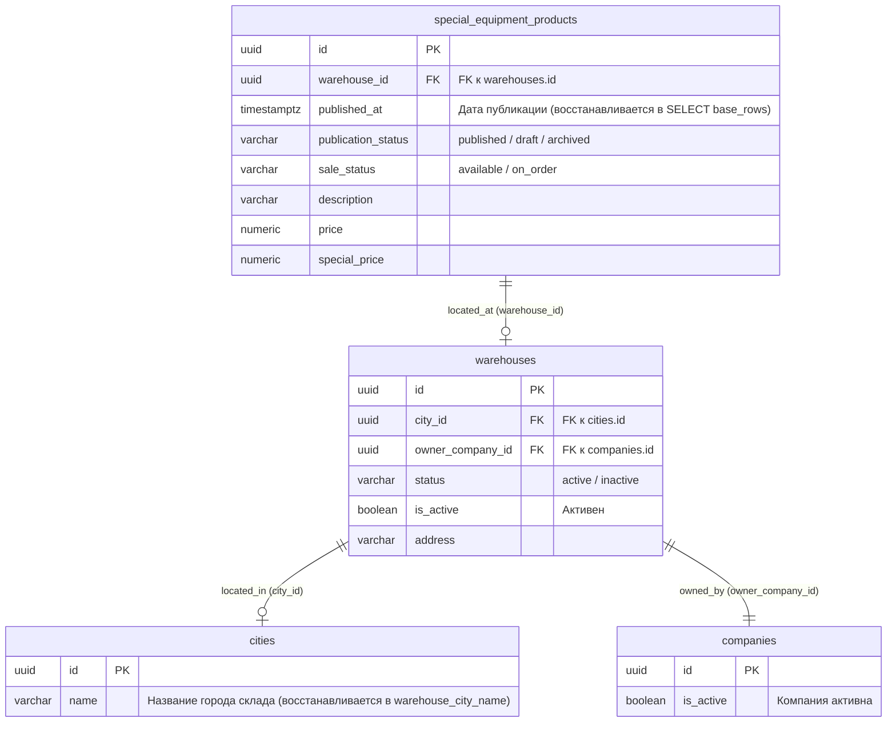

# Спецификация: Восстановление полей published_at и warehouse_city_name в публичной выдаче спецтехники

- **Дата и время создания:** 2026-09-30 17:45:02 MSK (UTC+3)
- **Идентификатор задачи Bitrix24:** — (внутренняя задача, багфикс к задаче удаления составных объявлений спецтехники)
- **Ветка задачи:** `bugfix/se-catalog-published-at-fix`
- **Целевая ветка:** `test`
- **Тип задачи:** `bugfix`

---

## 1. Архитектурная диаграмма сущностей БД (ERD)



---

## 2. Постановка проблемы и контекст

После слияния MR !491 («refactor(special-equipment): drop composite products and clean up schema») каталог спецтехники на тестовом стенде `https://test.multileasing.ru/api/v1/special-equipment/products` и фасеты `/api/v1/special-equipment/facets` перестали отвечать и возвращают ошибку `500 Internal Server Error`:

```json
{
    "type": "about:blank",
    "title": "Произошла внутренняя ошибка. Попробуйте позже.",
    "status": 500,
    "detail": "Произошла внутренняя ошибка. Попробуйте позже.",
    "code": "INTERNAL_ERROR"
}
```

### Коренная причина (Root Cause)
В коммите `2b8f29b5` при удалении связей составных товаров спецтехники был переписан запрос CTE `base_rows` в `_public_offering_group_rows` ([`backend/infrastructure/repositories/special_equipment_repository.py`](file:///Users/a_belianskii/Projects/carcraft-leadgenerator/backend/infrastructure/repositories/special_equipment_repository.py)). Из списка `SELECT` случайно выпали:
1. `SpecialEquipmentProduct.published_at`
2. Скалярный подзапрос города склада `(sa.select(City.name)...label("warehouse_city_name"))`
3. `effective_modification.year_from`, `effective_modification.year_to`
4. Атрибуты надстройки: `eff_super_model.code`, `eff_super_model.slug`, `eff_super_mark.code`, `eff_super_mark.slug`, `eff_super_mod.id`, `eff_super_mod.code`, `eff_super_mod.name`, `eff_super_mod.slug`.

В последующей функции `_public_offering_representatives` столбец `published_at` напрямую запрашивается для вычисления оконной функции даты публикации группы:
```python
sa.func.max(fulfillable.c.published_at)
.over(partition_by=fulfillable.c.commercial_key)
.label("group_published_at")
```
Так как в `base_rows` (и соответственно в производном `fulfillable`) столбца `published_at` не оказалось, SQLAlchemy выбрасывает `AttributeError: published_at`. Этот необработанный сбой перехватывается глобальным `handle_unhandled_exception` и возвращает 500.
А при вызове `_product_resource` отсутствие `year_from` приводило к `KeyError: 'year_from'`.

Аналогично, фасеты `/api/v1/special-equipment/facets` обращаются к `_public_offering_representatives` для сборки срезов комплектаций и цветов, поэтому также падали с 500 ошибкой.
Дополнительно в скрипте сидинга `seed_special_equipment_e2e.py` были исправлены расхождения с актуальной схемой базы данных (`slug` для unit/superstructure и корректные атрибуты superstructure attribute).

---

## 3. Требования и планируемые изменения

1. **Восстановление полей в `_public_offering_group_rows`:**
   В файле [`backend/infrastructure/repositories/special_equipment_repository.py`](file:///Users/a_belianskii/Projects/carcraft-leadgenerator/backend/infrastructure/repositories/special_equipment_repository.py) в CTE `base_rows` вернуть:
   - `SpecialEquipmentProduct.published_at`
   - Скалярный подзапрос `warehouse_city_name`
   - `effective_modification.year_from`, `effective_modification.year_to`
   - Атрибуты надстройки (`eff_super_model`, `eff_super_mark`, `eff_super_mod`)
2. **Проверка работы листинга и фасетов:**
   - Запрос `GET /api/v1/special-equipment/products?availability=available&availability=on_order&sort=published_desc&page=1&page_size=24` должен возвращать HTTP 200 и корректный список объявлений с заполненным `warehouse_city_name` и датами публикации.
   - Запрос `GET /api/v1/special-equipment/facets` должен возвращать HTTP 200 и корректное дерево фасетов без исключений.
3. **Исправление сидинга E2E:**
   - Привести `backend/scripts/seed_special_equipment_e2e.py` в полное соответствие с текущей схемой БД (`SpecialEquipmentUnit`, `SpecialEquipmentSuperstructure`, `SpecialEquipmentSuperstructureAttribute`).

---

## 4. Критерии готовности (DoD)

- [x] В `_public_offering_group_rows` в `base_rows` добавлены `SpecialEquipmentProduct.published_at`, `warehouse_city_name`, `year_from`, `year_to` и атрибуты надстройки.
- [x] Запросы к `handle_list_products` и `handle_list_facets` при `sort="published_desc"` и `category_path=None` выполняются успешно без исключений (HTTP 200).
- [x] Обязательные статические проверки (`ruff`, `lint-imports`, `mypy`) в `backend/` проходят без ошибок.
- [x] Проверка `alembic check` подтверждает отсутствие расхождений схемы БД (`No new upgrade operations detected.`).
- [x] E2E / интеграционная проверка каталога спецтехники отрабатывает успешно как на пустой базе, так и на заполненных сидом данных.
- [ ] Создан Merge Request в ветку `test` и автоматически влит после проверок.
