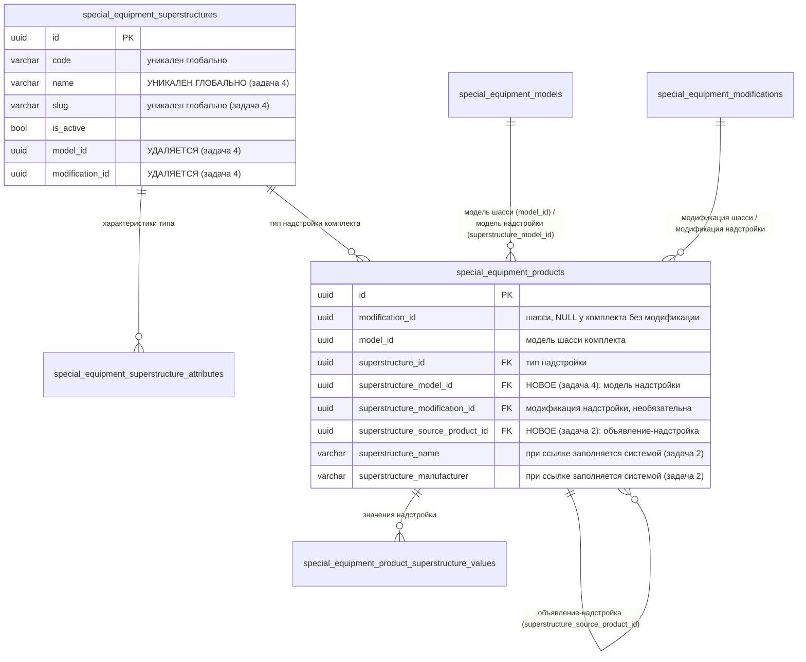
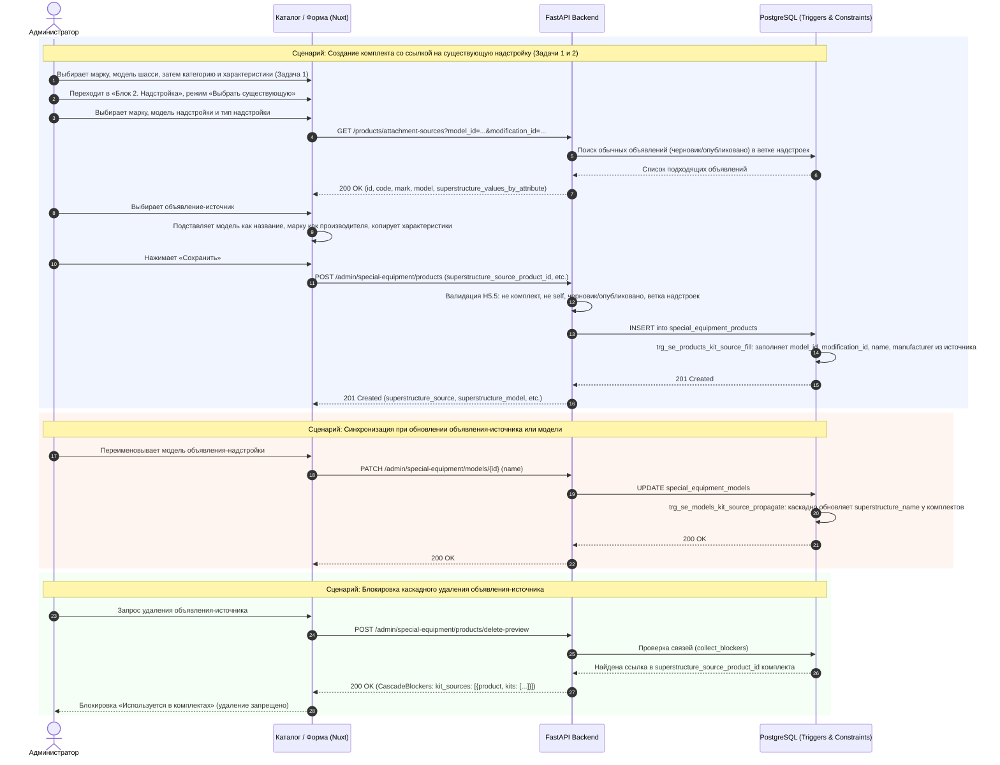

# Надстройки: пять доработок после выкатки на тест

- **Дата и время создания:** 2026-09-30 23:58:01 MSK (UTC+3)
- **Идентификатор задачи Bitrix24:** — (внутренняя задача, не связана с Bitrix)
- **Тип задачи:** `bugfix`
- **Ветка задачи:** `bugfix/superstructure-fixes`
- **Целевая ветка для MR:** `test`
- **Основа:** доработка задачи `task_2026-09-29_15-14-23_MSK` (справочник «Надстройки», «Комплект с техникой», шаблон v7), которая уже на тесте.

Спецификация состоит из пяти независимо описанных задач. Нумерация — как в постановке.

| № | Задача | Тип | Слои | Зависит от |
|---|---|---|---|---|
| 1 | Порядок полей в блоке «Шасси» | bugfix | frontend | — |
| 2 | «Выбрать существующую»: выбор объявления-надстройки после типа, ссылка вместо ввода названия и производителя | bugfix | БД, backend, импорт, frontend | 4 |
| 3 | Прокрутка вкладок «Управления каталогом» | bugfix | frontend | — |
| 4 | Тип надстройки без марки, модели и модификации | bugfix | БД, backend, импорт, frontend | — |
| 5 | Баг: при выборе группы у типа надстройки не видно характеристик | bugfix | backend | — |

**Порядок выкатки:** 5 → 3 → 1 → 4 → 2. Задачи 5, 3, 1 выкатываются по отдельности. Задачи 4 и 2 выкатываются вместе: обе меняют шаблон импорта, новая версия шаблона **v8** включает изменения обеих.

---

## 0. Архитектурные диаграммы

### 0.1. ER-диаграмма (после задач 4 и 2)

### 0.2. Sequence-диаграмма: Жизненный цикл комплекта со ссылкой на надстройку

---

## Задача 1. Порядок полей в блоке «Шасси»

### 1.1. Сейчас и нужно
- **Сейчас:** в блоке «Блок 1. Шасси» комплекта первое поле — «Категории шасси», затем марка, модель, модификация.
- **Нужно:** марка → модель → модификация → **категории** → характеристики шасси.

### 1.2. Правила
| # | Правило |
|---|---|
| Ш1 | Порядок полей: «Марка шасси *» → «Модель шасси *» → «Модификация шасси» → «Категории шасси *» → «Характеристики шасси». Категории доступны после выбора модели; до этого поле неактивно с подсказкой «Сначала выберите модель шасси». Только обычные категории (`KIT_ATTACHMENT_CATEGORY`) — без изменений. |
| Ш2–Ш6 | Без изменений. |

### 1.3. Frontend
- `frontend/features/specialEquipment/management/correction/CatalogCorrectionForm.vue` (~627–639): перенести блок `CatalogCategoryMultiSelect` «Категории шасси» после поля «Модификация шасси».
- `:disabled="!text('model_id')"`; подсказка под полем — «Сначала выберите модель шасси», пока модель не выбрана, иначе текущая «Выберите категорию, чтобы заполнить характеристики шасси».
- Текст `se-section-help` блока: «Выберите марку, модель и модификацию шасси, затем категорию — от неё зависит набор характеристик. Если модификация не выбрана, характеристики заполняются вручную.»
- `changeKitCategories`, подтверждения и блок характеристик — без изменений.

### 1.4. E2E
`se-kits.spec.ts`, тест «Создание «Комплект с техникой» с модификацией шасси»: поле «Категории шасси» расположено после «Модификации шасси» и неактивно до выбора модели; порядок заполнения в тестах — марка → модель → модификация → категория.

### 1.5. Критерии приёмки
- [ ] В блоке «Шасси» порядок: марка → модель → модификация → категории → характеристики.
- [ ] До выбора модели категории выбрать нельзя.
- [ ] Создание и редактирование комплекта работают как раньше.

---

## Задача 2. «Выбрать существующую»: объявление-надстройка после типа, ссылка вместо ввода

**Зависит от задачи 4** (модель надстройки хранится в комплекте, типы без модели).

### 2.1. Сейчас и нужно
- **Сейчас:** в режиме «Выбрать существующую» поиск объявления стоит сверху; после выбора данные копируются в поля «Ввести самим», название и производитель вводятся/правятся вручную; связь с объявлением не хранится.
- **Нужно:** сначала марка → модель → модификация → тип надстройки, **ниже** — выбор объявления-надстройки. Название и производителя не вводим: комплект хранит ссылку на объявление и берёт их из него «вживую». Режим «Ввести самим» не меняется.

### 2.2. Правила
| # | Правило |
|---|---|
| Н5 | **Выбрать существующую:** «Марка надстройки *» → «Модель надстройки *» → «Модификация надстройки» (необязательно) → «Тип надстройки *» → **ниже** список «Объявление надстройки *». Список доступен после выбора модели и типа. В нём — обычные (не комплекты) объявления из ветки категорий надстроек со статусом «Черновик» или «Опубликовано», у которых модель модификации = выбранной модели, а если выбрана модификация — модификация = выбранной. Поиск по коду и названию. Поля «Название надстройки» и «Производитель надстройки» не показываются для ввода. После выбора — карточка выбранного объявления: код, «{Марка} {Модель} {Модификация}», статус, «Название надстройки: {Модель}», «Производитель: {Марка}» (только чтение), кнопка «Изменить». |
| Н5.1 | Комплект хранит ссылку `superstructure_source_product_id`. Из объявления «вживую» берутся: название надстройки = **название модели** объявления, производитель = **название марки** объявления, модель и модификация надстройки = модель и модификация объявления. Марка/модель/модификация в фильтрах — только фильтр списка; сохраняются значения из объявления. |
| Н5.2 | После выбора объявления характеристики надстройки **копируются** из значений модификации объявления по совпадающим характеристикам типа и **остаются редактируемыми**; хранятся в `product_superstructure_values`. Характеристики типа, которых нет в модификации объявления, пустые. Выбор другого объявления перезаписывает значения после подтверждения «Заменить характеристики надстройки значениями из выбранного объявления?». |
| Н5.3 | Смена модели/модификации в фильтрах сбрасывает выбранное объявление. Смена типа — по Н6, объявление сохраняется. |
| Н5.4 | «Выбрать существующую» → «Ввести самим»: ссылка убирается; название, производитель, модель и модификация надстройки подставляются текущими значениями из объявления и становятся редактируемыми. Обратно — нужно выбрать объявление. |
| Н5.5 | Проверки при сохранении: объявление существует, это не комплект, не само редактируемое объявление, хотя бы одна его категория в ветке надстроек, статус «Черновик» или «Опубликовано» → иначе `KIT_SUPERSTRUCTURE_SOURCE_INVALID`. Название, производитель, модель и модификация надстройки из запроса при ссылке игнорируются. После сохранения статус и категории исходного объявления на связь не влияют. |
| Н5.6 | Смена модификации у исходного объявления, переименование его модели или марки, смена марки у модели сразу меняют название, производителя, модель и модификацию надстройки у связанных комплектов. |
| Н5.7 | Объявление, на которое ссылаются комплекты, **удалить нельзя** — блокировка «Используется в комплектах» со списком комплектов (код, название). Снятие с публикации и архив разрешены, связь сохраняется. |
| К4 | Без изменений: «{Название надстройки} на базе {Марка шасси} {Модель шасси}». Для связанного комплекта — «АТЗ-10 на базе FOTON D18». |

### 2.3. БД — миграция `153_kit_superstructure_source`
1. `special_equipment_products`:
   - `superstructure_source_product_id UUID NULL` FK → `special_equipment_products.id` `ON DELETE RESTRICT` (`fk_se_products_superstructure_source`);
   - индекс `idx_se_products_superstructure_source (superstructure_source_product_id) WHERE superstructure_source_product_id IS NOT NULL`;
   - `ck_se_products_kind`: в ветку обычного объявления добавить `AND superstructure_source_product_id IS NULL`; ветка комплекта не меняется (название и производитель остаются NOT NULL — их заполняет триггер);
   - `ck_se_products_superstructure_source_not_self`: `superstructure_source_product_id IS NULL OR superstructure_source_product_id <> id`.
2. Триггеры синхронизации. Функция `se_sync_kit_superstructure_source()` вычисляет для комплекта со ссылкой: `superstructure_model_id = models.id`, `superstructure_modification_id = source.modification_id`, `superstructure_name = models.name`, `superstructure_manufacturer = marks.name` (через `source.modification_id → modifications.model_id → models.mark_id → marks`).

   | Триггер | Таблица и событие | Действие |
   |---|---|---|
   | `trg_se_products_kit_source_fill` | `BEFORE INSERT OR UPDATE OF superstructure_source_product_id, superstructure_name, superstructure_manufacturer, superstructure_model_id, superstructure_modification_id ON special_equipment_products`, `WHEN NEW.superstructure_source_product_id IS NOT NULL` | Заполнить четыре поля NEW из источника. |
   | `trg_se_products_kit_source_propagate` | `AFTER UPDATE OF modification_id ON special_equipment_products` | Обновить комплекты с `superstructure_source_product_id = NEW.id`. |
   | `trg_se_models_kit_source_propagate` | `AFTER UPDATE OF name, mark_id ON special_equipment_models` | Обновить комплекты, источник которых на модификации этой модели. |
   | `trg_se_marks_kit_source_propagate` | `AFTER UPDATE OF name ON special_equipment_marks` | Обновить комплекты, источник которых на моделях этой марки. |

   Обновления из триггеров — `UPDATE special_equipment_products SET superstructure_source_product_id = superstructure_source_product_id WHERE …`, значения вычисляет первый триггер. `updated_at` комплектов не меняется. Читатели `superstructure_name`/`superstructure_manufacturer` (`cart_repository`, `purchase_repository`, `application_repository`, `exchange_*`, `item_projection`, снимки, поиск, группировка) не меняются.
3. Downgrade: удалить триггеры, функцию, CHECK, индекс, FK и колонку. Название и производитель остаются текстом.
4. Модель `SpecialEquipmentProduct`: поле `superstructure_source_product_id`, CHECK, индекс.

### 2.4. Backend
- Входные схемы продукта (`presentation/schemas/special_equipment_management.py`, рядом с `superstructure_id` ~806/918/994): `superstructure_source_product_id: UUID | None`. В ответе продукта — это поле и `superstructure_source: {id, code, name, publication_status, mark, model, modification} | null`.
- Валидация комплекта (`application/commands/special_equipment_management.py` ~938–975, `domain/special_equipment_kits.py`): при ссылке — Н5.5 → `KIT_SUPERSTRUCTURE_SOURCE_INVALID`; `superstructure_model_id`, `superstructure_modification_id`, название и производитель из запроса игнорируются (заполнит триггер). Без ссылки — правила задачи 4.
- Удаление объявления (`domain/special_equipment_cascade_delete.py` `collect_blockers`, репозиторий графа): новая блокировка `kit_sources` — удаляемое объявление является источником для комплектов, которые не удаляются в этом же плане. `CascadeBlockers.kit_sources: list[{product, kits: [{id, code, title}]}]`, учитывается в `is_empty`.
- `GET /products/attachment-sources` (`list_attachment_sources`, ~1869):
  - новые параметры: `model_id: UUID` (обязателен), `modification_id: UUID | None`, `exclude_product_id: UUID | None`; `search`, `limit` — как сейчас;
  - условия: как сейчас (не комплект, `draft|published`, ветка надстроек) + модель модификации = `model_id`, модификация = `modification_id`, если задана, `id <> exclude_product_id`;
  - элемент ответа: `id`, `code`, `publication_status`, `mark`, `model`, `modification`, `superstructure_name` = название модели, `superstructure_manufacturer` = название марки, `superstructure_values_by_attribute`; поле `suggested_superstructure_ids` удалить.

### 2.5. Импорт (шаблон v8, вместе с задачей 4)
- «Объявления»: после «Код модификации надстройки» — колонка **«Код объявления надстройки»** (`superstructure_source_code`).
- Строка-комплект с заполненным «Кодом объявления надстройки»:
  - «Код модели надстройки», «Код модификации надстройки», «Название надстройки», «Производитель надстройки» пустые → иначе `KIT_SUPERSTRUCTURE_SOURCE_CONFLICT` (колонка — первая заполненная);
  - объявление ищется в «Объявлениях» файла или в БД; не найдено → `PRODUCT_NOT_FOUND` (колонка «Код объявления надстройки»); проверки Н5.5 (категории — из «Категорий объявлений» файла, если строка есть в файле, иначе из БД) → `KIT_SUPERSTRUCTURE_SOURCE_INVALID`.
- PATCH: пустая ячейка не меняет поле; «Очистить» убирает ссылку, текущие название, производитель, модель и модификация остаются как ручные значения.
- Внутри «Объявлений» сначала применяются обычные объявления, затем комплекты.
- Новые коды в `domain/special_equipment_import.py`: `KIT_SUPERSTRUCTURE_SOURCE_CONFLICT`, `KIT_SUPERSTRUCTURE_SOURCE_INVALID`.
- Экспорт: у связанного комплекта заполняется только «Код объявления надстройки».
- «Инструкция»: описание способа «ссылка на объявление-надстройку».

### 2.6. Frontend
- `CatalogCorrectionForm.vue`, блок «Надстройка» (~746–925):
  - режим в draft: `superstructure_source_mode: 'manual' | 'existing'`; при редактировании — `existing`, если есть `superstructure_source_product_id`;
  - общие поля обоих режимов сверху: марка, модель, модификация надстройки, тип;
  - **existing:** под типом — поиск и список `listAttachmentSources({ model_id, modification_id, search, exclude_product_id })`; до выбора модели и типа — «Выберите модель и тип надстройки». Выбор → карточка (Н5), `superstructure_source_product_id`, копия характеристик (Н5.2). Поля «Название надстройки» и «Производитель надстройки» скрыты; в payload они и `superstructure_model_id`/`superstructure_modification_id` не отправляются;
  - смена режима и фильтров — Н5.3, Н5.4; гидрация при редактировании — марка/модель/модификация из `superstructure_source`;
  - ошибка `KIT_SUPERSTRUCTURE_SOURCE_INVALID` — у списка объявлений.
- `api.ts`: `listAttachmentSources(params)` с новыми параметрами; `types.ts`: `AttachmentSourceItem.publication_status`, без `suggested_superstructure_ids`; продукт — `superstructure_source_product_id`, `superstructure_source`.
- `catalogPayload.ts`: `superstructure_source_product_id`.
- Предпросмотр удаления объявления: блок «Используется в комплектах» со ссылками на комплекты.

### 2.7. Сид и E2E
- `scripts/seed_special_equipment_e2e.py`: комплект со ссылкой на объявление-надстройку.
- `se-kits.spec.ts`:
  - новый тест «Комплект: Выбрать существующую»: марка → модель → тип → выбор объявления; полей названия и производителя нет; на витрине «{Модель объявления} на базе {Марка шасси} {Модель шасси}»; переименование модели объявления меняет заголовок комплекта;
  - новый шаг «Удаление объявления-источника»: предпросмотр показывает «Используется в комплектах», удаление недоступно.

### 2.8. Критерии приёмки
- [ ] В «Выбрать существующую» список объявлений стоит под типом и отфильтрован по модели (и модификации).
- [ ] Название и производитель не вводятся, берутся из объявления и меняются вместе с ним.
- [ ] Характеристики копируются из объявления и редактируются.
- [ ] Удаление объявления-источника заблокировано с перечнем комплектов; архив и снятие с публикации разрешены.
- [ ] Импорт: комплект со ссылкой загружается, при заполненных полях надстройки — `KIT_SUPERSTRUCTURE_SOURCE_CONFLICT`.
- [ ] «Ввести самим» работает как раньше.

---

## Задача 3. Прокрутка вкладок «Управления каталогом»

### 3.1. Сейчас и нужно
- **Сейчас:** `.se-tabs` в `features/specialEquipment/management/registry.css` — `overflow-x: auto`, полоса прокрутки скрыта (`scrollbar-width: none`), колесо мыши вкладки не двигает; вкладки справа («Группы характеристик», «Цвета», «Единицы измерения», «Надстройки») обрезаны.
- **Нужно:** стрелки ‹ › по краям, прокрутка колесом, автопрокрутка к активной вкладке.

### 3.2. Frontend
- Новый компонент `frontend/features/specialEquipment/management/correction/CatalogTabsScroller.vue` — обёртка над `nav.se-tabs` в `CatalogCorrectionRegistryPage.vue` (~24–37):
  - кнопки ‹ и › (`aria-label` «Прокрутить вкладки влево» / «вправо», 32×32, фон карточки, градиент-тень к краю), видны только при скрытых вкладках с этой стороны (`scrollLeft`, `scrollWidth`, `clientWidth`; `ResizeObserver` + событие `scroll`);
  - клик — прокрутка на 80 % ширины, `behavior: 'smooth'`;
  - колесо мыши над вкладками при переполнении: `deltaY` переводится в `scrollLeft`, `preventDefault`;
  - при загрузке и смене раздела активная вкладка прокручивается в видимую область (`scrollIntoView({ inline: 'nearest', block: 'nearest' })`).
- `registry.css`: `.se-tabs` — оставить `overflow-x: auto` и скрытую полосу, добавить `scroll-behavior: smooth`; обёртке — `position: relative`.
- Клавиатура (Tab) и `aria-current` сохраняются.

### 3.3. E2E
Шаг «Вкладки» (в `se-kits.spec.ts` или спеке реестра каталога): при ширине 1280 px стрелка › видна; клик делает видимой вкладку «Надстройки»; открытие `?entity=superstructures` сразу показывает активную вкладку.

### 3.4. Критерии приёмки
- [ ] Все вкладки доступны стрелками и колесом мыши.
- [ ] Стрелка показывается только при наличии скрытых вкладок с её стороны.
- [ ] Активная вкладка всегда видна после загрузки.

---

## Задача 4. Тип надстройки без марки, модели и модификации

### 4.1. Сейчас и нужно
- **Сейчас:** тип надстройки («Создать тип надстройки») привязан к марке, модели (обязательно) и модификации; название уникально в пределах (модель, модификация); марка и модель надстройки комплекта берутся из типа.
- **Нужно:** у типа нет марки, модели и модификации — это общий справочник. Режим «Ввести самим» в комплекте визуально не меняется: марка → модель → модификация надстройки → тип → название → характеристики → производитель. Марка и модель надстройки хранятся в самом комплекте.

### 4.2. Правила
| # | Правило |
|---|---|
| С1 | Код обязателен и уникален глобально, не меняется. **Название обязательно и уникально на всю платформу** (без учёта регистра и пробелов по краям) — текущий механизм конфликта уникальности справочников. |
| С2 | **Удаляется.** Коды `SUPERSTRUCTURE_MODEL_IN_USE` и `SUPERSTRUCTURE_MODIFICATION_MODEL_MISMATCH` для типа больше не возникают. |
| С3–С8 | Без изменений. |
| Н1 | **Ввести самим:** «Марка надстройки *» → «Модель надстройки *» → «Модификация надстройки» (необязательно, принадлежит модели → `KIT_SUPERSTRUCTURE_MODIFICATION_MODEL_MISMATCH`) → «Тип надстройки *» — все **активные** типы, без фильтра по модели. Модификация больше не подставляется из типа и не блокируется. Модель и модификация сохраняются в комплекте (`superstructure_model_id`, `superstructure_modification_id`). Модель обязательна → `KIT_SUPERSTRUCTURE_MODEL_REQUIRED`. |
| Н2–Н4, Н6 | Без изменений. |
| К5 | «Надстройка» на детальной: марка и модель — из `superstructure_model_id` комплекта (было — из типа), модификация — из `superstructure_modification_id`. |
| К7 | Поиск по марке и модели надстройки — через `superstructure_model_id`. |

### 4.3. БД — миграция `152_superstructure_type_without_model`
Одна транзакция.
1. `special_equipment_products`:
   - `superstructure_model_id UUID NULL` FK → `special_equipment_models.id` `ON DELETE RESTRICT`, индекс `idx_se_products_superstructure_model`;
   - заполнить `superstructure_model_id = superstructures.model_id` у всех комплектов;
   - составной FK `(superstructure_modification_id, superstructure_model_id)` → `special_equipment_modifications (id, model_id)` `ON DELETE RESTRICT` (`fk_se_products_superstructure_modification_model`; `uq_special_equipment_modifications_id_model` уже есть);
   - `ck_se_products_kind`: в ветку обычного объявления — `AND superstructure_model_id IS NULL`, в ветку комплекта — `AND superstructure_model_id IS NOT NULL`.
2. `special_equipment_superstructures`:
   - сохранить `id, model_id, modification_id` в `special_equipment_superstructures_model_backup_152` (для downgrade);
   - дубли названий по `lower(btrim(name))`: первый по `(created_at, id)` остаётся, остальные — «{Название} ({Марка} {Модель})»; если занято — суффикс « 2», « 3»…; `slug` пересчитать (транслитерация — копия функции из `144_special_equipment_units`); переименования — в лог миграции;
   - удалить `uq_se_superstructures_model_mod_name`, `uq_se_superstructures_model_mod_slug`, `idx_se_superstructures_model_mod_active_name`, `fk_se_superstructures_modification_model`, FK на модели, колонки `model_id`, `modification_id`;
   - создать `uq_se_superstructures_name` (`lower(btrim(name))`), `uq_se_superstructures_slug` (`lower(btrim(slug))`), `idx_se_superstructures_active_name (is_active, name, id)`.
3. Downgrade: вернуть `model_id`/`modification_id` из backup; типам без backup взять модель из любого их комплекта, если комплектов нет — падение со списком кодов; `SET NOT NULL`; вернуть старые индексы и FK (при конфликте — падение со списком); вернуть старый CHECK; удалить новые колонку, FK, индексы продуктов и backup-таблицу.
4. Модели SQLAlchemy: `SpecialEquipmentSuperstructure` без `model_id`/`modification_id` и старых индексов; `SpecialEquipmentProduct.superstructure_model_id`, составной FK, CHECK.

### 4.4. Backend
- Тип:
  - `SuperstructureResource`, `SuperstructureUpsertInput` — убрать `model_id`, `modification_id`, `model`, `model_name`, `mark_id`, `mark_name`, `modification`, `modification_name`;
  - `GET /superstructures` — убрать фильтры `mark_id`, `model_id`, `modification_id` (`management_repository` ~1166–1172), остаются `search`, `is_active`;
  - `get_entity("superstructure")` (~3840) — без загрузки модели и модификации;
  - `special_equipment_management.py` (~1620–1740) — удалить проверки модели/модификации типа.
- Комплект:
  - входные схемы — `superstructure_model_id: UUID | None`; в ответе — `superstructure_model: {id, code, name, mark: {id, code, name}} | null`;
  - валидация (~938–975, `ensure_kit_superstructure`): модель обязательна (`KIT_SUPERSTRUCTURE_MODEL_REQUIRED`), модификация принадлежит модели (`KIT_SUPERSTRUCTURE_MODIFICATION_MODEL_MISMATCH`); удалить сравнение с моделью и модификацией типа (`SUPERSTRUCTURE_MODIFICATION_MODEL_MISMATCH`, `KIT_SUPERSTRUCTURE_MODIFICATION_MISMATCH`).
- Каскадное удаление (`domain/special_equipment_cascade_delete.py` `_cascade_superstructures`, репозиторий ~382, ~443): удаление модели или модификации больше не удаляет типы; вместо этого удаляются комплекты с `superstructure_model_id` в удаляемых моделях или `superstructure_modification_id` в удаляемых модификациях. `superstructure_model_ids`/`superstructure_modification_ids` графа строятся по продуктам.
- Публичные запросы (`special_equipment_repository.py` ~1029, ~1196–1203, ~1633–1636): `super_model` — по `SpecialEquipmentProduct.superstructure_model_id`, `super_mark` — через `super_model.mark_id`. Группировка равных предложений (`_public_offering_group_rows`): в ключ добавить `superstructure_model_id`. Формат ответа (`application/queries/special_equipment.py` ~455–490) не меняется.

### 4.5. Импорт: шаблон v8
- `TEMPLATE_VERSION = 8`, `SUPPORTED_TEMPLATE_VERSIONS = {8}`; `_VERSIONED_HEADERS`/`_VERSIONED_FIELDS` — ключ 8. Файл v7 → `TEMPLATE_VERSION_UNSUPPORTED`. Остальные листы v8 = v7.
- «Надстройки»: «Код», «Название», «Активность». Удалить `model_code`, `modification_code` и их разбор в `special_equipment_import_v2.py` (~2015–2110). Уникальность названия — глобальная (файл + БД).
- «Объявления»: после «Код надстройки» — **«Код модели надстройки»** (`superstructure_model_code`), затем «Код модификации надстройки» (как было).
- Строка-комплект без ссылки на объявление: «Код модели надстройки» обязателен → `KIT_SUPERSTRUCTURE_MODEL_REQUIRED`; «Код модификации надстройки» необязателен, принадлежит модели → `KIT_SUPERSTRUCTURE_MODIFICATION_MODEL_MISMATCH`; название и производитель обязательны (как было). Удалить сравнение с моделью/модификацией типа (~5170–5222).
- Новый код `KIT_SUPERSTRUCTURE_MODEL_REQUIRED` в `domain/special_equipment_import.py`.
- Сборщик шаблона и «Инструкция» (`special_equipment_xlsx.py` ~600–620): тип без модели; модель надстройки — в «Объявлениях».

### 4.6. Frontend
- `CatalogCorrectionForm.vue` (~375–419): удалить fieldset «Принадлежность надстройки», `superstructureBelongingDisabled`, `changeSuperstructureMark/Model/Modification`.
- Блок «Надстройка», «Ввести самим»: список типов — `listAll('superstructures', { is_active: true })` один раз при открытии формы; убрать `modelSuperstructures`, фильтр по модели, `kitSuperstructureModificationLocked`, `applyKitSuperstructureType`-подстановку модификации. Модель надстройки → `superstructure_model_id`. Гидрация при редактировании — из `superstructure_model`/`superstructure_modification_id` комплекта.
- `catalogPayload.ts`, `types.ts`: у `CatalogSuperstructure` убрать поля модели/модификации; у продукта — `superstructure_model_id`, `superstructure_model`.
- `CatalogCorrectionRegistryPage.vue` (~40–70, ~827–829, ~925–950, ~1190, ~1339, ~1422): у «Надстроек» убрать фильтры «Марка», «Модель», «Модификация» и колонки марки/модели/модификации.

### 4.7. Сид и E2E
- `seed_special_equipment_e2e.py`: типы без модели; комплект «Ввести самим» с `superstructure_model_id`.
- `se-kits.spec.ts`, «CRUD справочника надстроек»: в форме нет «Марка», «Модель», «Модификация»; повтор названия типа → ошибка уникальности. «Создание комплекта…»: список типов не зависит от модели надстройки.

### 4.8. Критерии приёмки
- [ ] Форма типа надстройки без марки, модели и модификации; название уникально на платформе.
- [ ] Миграция переименовала дубли названий и вывела их в лог.
- [ ] Существующие комплекты после миграции показывают ту же марку и модель надстройки.
- [ ] «Ввести самим»: доступны все активные типы; модель и модификация надстройки сохраняются в комплекте.
- [ ] Импорт v8 без «Код модели»/«Код модификации» у «Надстроек» и с «Кодом модели надстройки» в «Объявлениях»; v7 отклоняется.

---

## Задача 5. Баг: не видно характеристик при выборе группы у типа надстройки

### 5.1. Воспроизведение
«Управление каталогом» → «Надстройки» → «Создать тип надстройки» → «Добавление характеристик» → группа «Оборудование шасси»: четыре галочки без названий, «Добавить выбранные (0)» не активируется.

### 5.2. Причина
`GET /api/v1/admin/special-equipment/superstructures/attribute-candidates` (`list_superstructure_attribute_candidates`, `special_equipment_management_repository.py` ~3922) отдаёт `id`, `code`, `name`, `attribute_group_id`. Фронт (`CatalogSuperstructureAttributePicker.vue`, тип `CatalogSuperstructureAttributeCandidate`) читает `attribute_id`, `attribute_name`, `attribute_code`, `group_id`, `group_name`. Итог: названия пустые, у галочек `value = undefined`, ключи `v-for` совпадают, счётчик 0. Роутер (`special_equipment_management.py` ~2224) возвращает `JSONResponse`, поэтому схема ответа `SuperstructureAttributeCandidate` (тоже с `id/code/name`) не проверяется.

### 5.3. Исправление
- Запрос возвращает `attribute_id`, `attribute_code`, `attribute_name`, `data_type`, `unit` (название единицы), `group_id`, `group_name` (JOIN `special_equipment_attribute_groups`), `is_active`.
- `SuperstructureAttributeCandidate` в `presentation/schemas/special_equipment_management.py` — те же поля.
- Роутер возвращает `SuperstructureAttributeCandidatesResponse(items=…)` — ответ валидируется по `response_model`.
- Frontend не меняется; дополнительно в пикере не выводить кандидата без `attribute_id`.

### 5.4. E2E
`se-kits.spec.ts`, «CRUD справочника надстроек»: после выбора группы видны названия характеристик; отметка двух характеристик → «Добавить выбранные (2)» → обе в «Назначенных характеристиках».

### 5.5. Критерии приёмки
- [ ] При выборе группы видны названия, единицы и коды характеристик.
- [ ] Отмеченные характеристики добавляются в «Назначенные характеристики», счётчик считает выбранные.

---

## Файл для загрузки

`special-equipment_nadstroiki_v8.xlsx` (шаблон v8, после выкатки задач 4 и 2):
- 2 типа (`SUPERSTRUCTURE_ATZ_10` «Автотопливозаправщик», `SUPERSTRUCTURE_PK23500_D` «Кран-манипулятор») без модели;
- объявления-надстройки `VEKTOR_ATZ_10`, `PALFINGER_PK23500_D`;
- комплект `FOTON_D18_4800_ATZ10` — ссылка на `VEKTOR_ATZ_10` (задача 2), заголовок «АТЗ-10 на базе FOTON D18»;
- комплект `FOTON_D18_6100_KMU_PK23500` — «Ввести самим» с «Кодом модели надстройки» `NADSTROIKA_KMU` (задача 4), заголовок «КМУ PK 23500 на базе FOTON D18».
