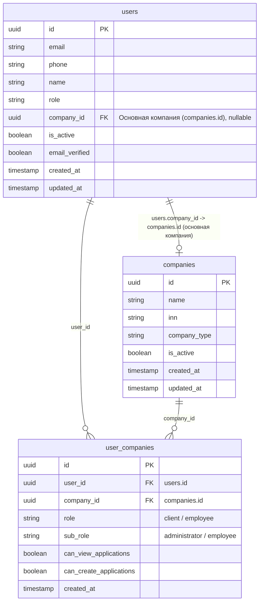
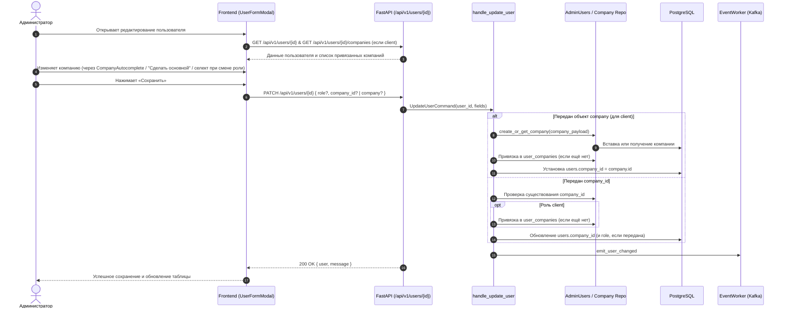

# Задача allow-client-company-edit — редактирование компании клиента и смена компании при смене роли

- Задача: внутренняя (slug: `allow-client-company-edit`)
- Ветка: `feature/allow-client-company-edit`
- Статус: спецификация для согласования





## Постановка

На странице административного ЛК `/workspace/users` («Управление пользователями») при редактировании пользователя администратор сталкивается с ошибкой:
```json
{
    "detail": "Основную компанию клиента изменять нельзя"
}
```

Данная ошибка возникает из-за ранее внедрённого ограничения в `backend/application/commands/admin_users/update_user.py`:
```python
if existing["role"] == "client" and "company_id" in fields:
    raise ServiceError("Основную компанию клиента изменять нельзя", 400)
```

Это ограничение блокирует:
1. Любую попытку изменить основную компанию клиента через API или интерфейс.
2. Смену роли пользователя с `client` на роль, требующую привязки компании (`dealer`, `leasing_company`, `distributor`), когда администратор выбирает новую компанию в форме.
3. Корректировку ошибочно привязанной компании клиента при ведении базы клиентов администратором.

Согласно бизнес-требованиям, администратор системы должен иметь возможность изменять основную компанию клиента, а также менять роль пользователя с выбором соответствующей компании.

## Текущее поведение

- В `backend/application/commands/admin_users/update_user.py` при `existing["role"] == "client"` и наличии `company_id` в `fields` безусловно выбрасывается `ServiceError("Основную компанию клиента изменять нельзя", 400)`.
- Схема `UserAdminPatchBody` в `backend/presentation/schemas/users.py` принимает `company_id: UUID | None`, но не поддерживает передачу объекта компании `company: AddCompanyPayload | None`, из-за чего для клиента нельзя передать данные новой компании при обновлении пользователя (как это сделано в `UserCreateBody`).
- В `frontend/features/auth/components/UserFormModal.vue`:
  - Для роли `client` при редактировании (`props.user`) поле выбора компании скрыто; вместо этого отображается список компаний как `disabled` input-элементы и кнопка «+ Добавить ещё компанию».
  - В методе `submitForm` стоит условие: `if (company_id && form.value.role !== 'client') body.company_id = company_id`, которое блокирует отправку `company_id` для роли `client`.
  - При попытке сменить роль пользователя с `client` на `dealer` / `leasing_company` / `distributor` и выбрать компанию в появившемся выпадающем списке форма отправляет `company_id`, что приводит к серверной ошибке `400 "Основную компанию клиента изменять нельзя"`, поскольку в БД у пользователя всё ещё `existing["role"] == "client"`.

## Целевое поведение

1. **Редактирование основной компании клиента в UI:**
   - В модальном окне редактирования пользователя (`UserFormModal.vue`) для роли `client` отображается поле «Основная компания» с компонентом `CompanyAutocomplete`.
   - Поле инициализируется текущей компанией пользователя (`company_name` и `company_inn`).
   - Администратор может найти и выбрать другую компанию через автокомплит DaData.
   - Ниже отображается блок «Привязанные компании» (список из `user_companies`):
     - Каждая компания выводится с наименованием и ИНН;
     - Текущая основная компания (`users.company_id`) выделена меткой «Основная»;
     - Для остальных привязанных компаний доступна кнопка «Сделать основной», по клику на которую эта компания устанавливается в качестве основной без повторного ввода ИНН;
     - Сохраняется кнопка «+ Добавить ещё компанию» для привязки дополнительной компании без смены текущей основной.

2. **Смена роли пользователя:**
   - Если администратор меняет роль с `client` на `dealer`, `leasing_company` или `distributor`, отображается выпадающий список доступных компаний данного типа, и выбранный `company_id` успешно сохраняется вместе с новой ролью.
   - Если администратор меняет роль с `dealer`/`leasing_company`/`distributor` на `client`, форма переключается на ввод компании клиента через `CompanyAutocomplete` и успешно сохраняет новую роль и компанию.

3. **Backend API (`PATCH /api/v1/users/{user_id}`):**
   - Убран запрет на изменение компании для клиентов.
   - Схема `UserAdminPatchBody` поддерживает как `company_id: UUID | None`, так и `company: AddCompanyPayload | None`.
   - Обработка в `handle_update_user`:
     - Если передан объект `company` (для роли `client`): компания создаётся или находится в БД (`create_or_get_company`), привязывается в `user_companies` (если ещё не привязана) с правами администратора, и `users.company_id` устанавливается на идентификатор этой компании.
     - Если передан `company_id`: проверяется существование компании. Если результирующая роль пользователя — `client`, данная компания также автоматически связывается в `user_companies` (если связь отсутствует) с правами администратора, и `users.company_id` обновляется.
     - Если меняется роль (например, с `client` на `dealer`) и передан `company_id`, обновляются и `role`, и `company_id` без ошибок.
     - Сохраняется генерация DWH-события `emit_user_changed` с актуальными `company_id` и `role`.

## Бизнес-цель

Обеспечить администраторам системы возможность корректного ведения данных пользователей в административном ЛК: исправлять ошибочно выбранные компании клиентов, переназначать основные юридические лица клиентов из числа привязанных или новых, а также переводить пользователей между ролями без блокирующих ошибок валидации.

## Выбранный подход

- Расширить `UserAdminPatchBody`, добавив `company: AddCompanyPayload | None = None` (по аналогии с `UserCreateBody`).
- В `handle_update_user` убрать проверку `existing["role"] == "client" and "company_id" in fields` и реализовать логику назначения основной компании:
  - При передаче `company` (объект) — через `create_or_get_company` + `insert_user_company_links` (если нет связи) + установка `company_id`.
  - При передаче `company_id` — проверка существования + привязка в `user_companies` для роли `client` (если нет связи) + установка `company_id`.
- В `UserFormModal.vue` поддержать редактирование основной компании клиента через `CompanyAutocomplete`, переключение основной компании из существующих связей и корректную передачу данных при смене роли.

## Рассмотренные варианты

1. **Только убрать ошибку в backend, не меняя UI:**
   - *Минусы:* администратор не сможет менять компанию клиента в интерфейсе `UserFormModal.vue`, так как поля ввода компании для существующего клиента были заблокированы.
   - *Вердикт:* отклонён, так как задача явно возникла при работе на странице `workspace/users`.

2. **Разрешить редактирование только через выбор из уже привязанных компаний:**
   - *Минусы:* если клиенту нужно назначить абсолютно новую компанию, администратору пришлось бы сначала добавлять её кнопкой «+ Добавить ещё компанию», а затем отдельным шагом делать основной.
   - *Вердикт:* отклонён; прямой поиск через `CompanyAutocomplete` покрывает как новые компании, так и существующие.

3. **Комплексное решение (Выбран):**
   - Разрешить смену основной компании через `CompanyAutocomplete`, переключение из списка привязанных компаний, а также корректную смену роли с выбором компании.

## Планируемые изменения

### Backend

1. **`backend/presentation/schemas/users.py`**
   - В `UserAdminPatchBody` добавить поле:
     ```python
     company: AddCompanyPayload | None = None
     ```
   - Запретить одновременную передачу `company` и `company_id` через model validator (аналогично валидации при создании пользователя).

2. **`backend/application/commands/admin_users/update_user.py`**
   - Удалить строку:
     ```python
     if existing["role"] == "client" and "company_id" in fields:
         raise ServiceError("Основную компанию клиента изменять нельзя", 400)
     ```
   - Добавить обработку `company` и `company_id`:
     - Если в `fields` передан `company`:
       - Проверить, что целевая роль (`fields.get("role") or existing["role"]`) — `client`. Для других ролей вернуть ошибку 400: `Компанию объектом можно привязать только клиенту`.
       - Вызвать `create_or_get_company`.
       - Проверить наличие связи в `user_companies`, при отсутствии — вызвать `insert_user_company_links` с `sub_role="administrator"`.
       - Установить `fields["company_id"] = company["id"]`.
     - Если в `fields` передан `company_id`:
       - Проверить существование через `company_exists`.
       - Если целевая роль `client` и `company_id` не `None`: проверить наличие связи в `user_companies`, при отсутствии — вызвать `insert_user_company_links`.
   - Запланировать обогащение компании (1C enrichment) при добавлении новой компании.

3. **`backend/tests/integration/test_admin_users_router.py`**
   - Обновить тест `test_admin_can_list_and_add_client_company_without_replacing_primary`:
     - Заменить проверку `assert primary_change.status_code == 400` на проверку успешного изменения `status_code == 200` при `PATCH /users/{id}` с новым `company_id`.
   - Добавить новые интеграционные тесты:
     - Изменение основной компании клиента передачей `company_id`;
     - Изменение основной компании клиента передачей объекта `company`;
     - Смена роли пользователя с `client` на `dealer` с одновременной передачей `company_id` дилерской компании;
     - Запрет одновременной передачи `company` и `company_id` в `PATCH`;
     - Попытка передать объект `company` для не-клиента (ошибка 400).

### Frontend

1. **`frontend/features/auth/components/UserFormModal.vue`**
   - Отображать поле «Основная компания» (`CompanyAutocomplete`) для роли `client` как при создании, так и при редактировании пользователя.
   - При редактировании (`props.user`) предзаполнять `clientCompanyName` названием и ИНН текущей компании (`newUser.company_name`, `newUser.company_inn`).
   - В блоке существующих компаний клиента:
     - Выводить метку «Основная» у компании, чей `id` совпадает с текущим `form.company_id`.
     - Для остальных компаний выводить кнопку «Сделать основной», по нажатию на которую `form.company_id` переключается на эту компанию, а `clientCompanyName` обновляется её названием.
   - В методе `submitForm`:
     - Если `form.role === 'client'`:
       - Если выбрана новая компания через автокомплит (`clientCompany.value`): передавать в body `company: clientCompany.value`.
       - Если выбрана компания по id (или переключена из существующих): передавать в body `company_id: form.company_id`.
     - Если роль `dealer`, `leasing_company` или `distributor`: передавать `company_id: form.company_id`.
     - При смене роли на не-клиента очищать `clientCompany` и данные клиентских компаний.

## Критерии приёмки

1. При редактировании пользователя с ролью `client` администратор может выбрать новую компанию через `CompanyAutocomplete` и сохранить форму — запрос `PATCH /api/v1/users/{id}` завершается со статусом `200 OK`, `users.company_id` обновляется, создаётся связь в `user_companies`.
2. При редактировании пользователя с ролью `client`, у которого есть несколько привязанных компаний, администратор может нажать «Сделать основной» у любой из них и сохранить — `users.company_id` обновляется на выбранную компанию.
3. При редактировании пользователя с ролью `client` администратор может изменить его роль на `dealer` (или `leasing_company`, `distributor`), выбрать компанию из выпадающего списка и сохранить — запрос выполняется без ошибки `400 "Основную компанию клиента изменять нельзя"`, роль и компания обновляются.
4. При смене роли с дилера на клиента администратор может привязать компанию клиента через `CompanyAutocomplete` и успешно сохранить пользователя.
5. Запрос `PATCH /api/v1/users/{id}` с несуществующим `company_id` возвращает ошибку `404 CompanyNotFoundError`.
6. Запрос `PATCH /api/v1/users/{id}` с одновременным указанием `company` и `company_id` отклоняется валидатором (422 Unprocessable Entity).
7. Запрос `PATCH /api/v1/users/{id}` с объектом `company` для пользователя не с ролью `client` возвращает ошибку `400`.
8. Линтеры и статические проверки (`ruff`, `mypy`, `lint-imports`, `tsc`) проходят без ошибок.
9. `alembic check` подтверждает отсутствие расхождений схемы БД.
10. E2E сценарий редактирования пользователя и смены компании проверен.

## Риски и меры

- **Риск:** Нарушение целостности связей в `user_companies` при смене `users.company_id`.
  - **Мера:** При установке нового `company_id` для клиента проверять наличие записи в `user_companies` и создавать её с правами администратора, если она ещё не создана.
- **Риск:** Конфликт между полями `company` и `company_id` в запросе `PATCH`.
  - **Мера:** Строгая валидация в Pydantic-схеме `UserAdminPatchBody`, запрещающая одновременное присутствие обоих полей.
- **Риск:** Регрессия в существующих интеграционных тестах админ-пользователей.
  - **Мера:** Актуализация теста `test_admin_can_list_and_add_client_company_without_replacing_primary` и добавление новых тестов для всех ветвлений.

## Вопросы

Вопросы согласованы с пользователем: разрешено как прямое редактирование основной компании клиента через UI / выбор компании, так и смена компании при изменении роли пользователя.

## Проверка спецификации

- ER-диаграмма затронутых таблиц (`users`, `companies`, `user_companies`) размещена в начале спецификации.
- Sequence-диаграмма взаимодействия UI, API, Command, Repositories и DB размещена в начале спецификации.
- Требования однозначны и покрывают сценарии как на Frontend, так и на Backend.
- Схема БД не меняется, миграции не требуются, `alembic check` остаётся чистым.
