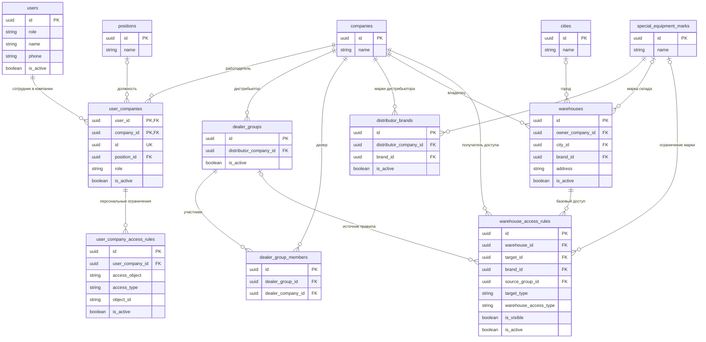
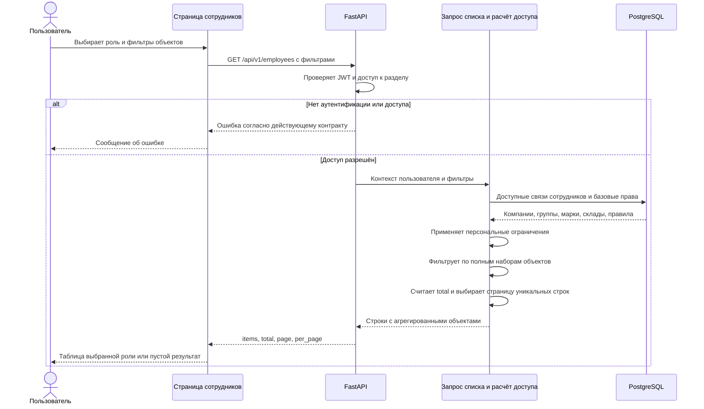

# Задача 22398 Корректировка списка сотрудников

- Задача: https://carcraftpro.bitrix24.ru/workgroups/group/124/tasks/task/view/22398/
- Источник требований: «Корректировка списка сотрудников от 29.09.2026.docx», предоставленный пользователем. Страница Bitrix не используется как источник требований.
- Дата создания: 2026-10-01 00:21:42 MSK (UTC+3).
- Ветка: `feature/22398`.
- Основание: `origin/test`, коммит `ccbdc96c7f1b564612a5425cc1365f8b6e0cfe74`; выполнен `git pull --ff-only origin test`, результат — Already up to date.
- Статус: спецификация подтверждена пользователем («делай»); реализация и локальные проверки завершены; MR !499 создан в `test`, запрос автообъединения отправлен, объединение не подтверждено.

Диаграмма показывает существующие таблицы и значимые связи. `user_companies.id` — уникальный UUID, а первичный ключ таблицы составной (`user_id`, `company_id`). `user_company_access_rules.object_id` — строковое значение, полиморфная ссылка без внешнего ключа. Изменения схемы БД не планируются.

## Постановка

На `/workspace/employees` состав таблицы и дополнительные фильтры должны зависеть от выбранной роли. Сотрудник, связанный с несколькими компаниями, показывается отдельной строкой для каждой связи. Доступные марки, склады и дистрибьюторы агрегируются внутри строки. Фильтрация по любому доступному объекту находит сотрудника без размножения строк.

Действующие правила доступа из ТЗ №30 и №36 сохраняются в их текущей реализации. Задача меняет представление списка и поиск по нему; она не предоставляет сотрудникам новых прав.

## Текущее состояние и уточнения источника

1. `EmployeesTab.vue` и `EmployeeFilters.vue` сейчас не содержат фильтра роли. Список поддерживает компанию, должность, ФИО, телефон и пагинацию. Таблица дополнительно показывает права просмотра и создания заявок; в новом составе эти столбцы отсутствуют.
2. `GET /api/v1/employees` передаёт фильтры через `ListEmployeesQuery` в `employees_repository.list_employees`. Репозиторий выбирает строки через `user_companies`, не возвращает UUID связи и списки объектов и не включает сотрудников КК без связи с компанией.
3. Упоминание справочника `mark` в документе трактуется как актуальный `special_equipment_marks`: ORM `DistributorBrand.brand_id` и `Warehouse.brand_id` ссылаются на него. В актуальном складе используется `city_id → cities.name`, а не поле `warehouses.city`. Новые таблицы `mark` или поля `city` не создаются.
4. Структура сверена с ORM в `models/users.py`, `companies.py`, `positions.py`, `support.py`, `vehicles.py`, `user_company_access.py` и миграциями 066, 080, 128, 139. Историческая миграция 080 использовала `mark`; реализация ориентируется на текущие ORM и итоговую схему всей цепочки миграций.

## Требования

### Роли и состав таблиц

Фильтр «Роль» располагается над таблицей. Значения: «Все роли», «Дилер», «Дистрибьютор», «Клиент», «Лизинговая компания», «Сотрудник КК». Отсутствующее значение эквивалентно «Все роли». Бизнес-роли фильтруются по `user_companies.role`; для сотрудников КК используется системная роль `users.role`. `admin` и `carcraft_employee`, если встречаются в действующем контракте, отображаются как «Сотрудник КК»; новую системную роль в БД не вводить.

| Выбранная роль | Заголовок | Столбцы в указанном порядке | Дополнительные фильтры |
| --- | --- | --- | --- |
| Все роли | Пользователи | Роль, Компания, Должность, ФИО, Телефон, Статус, Кнопки | Нет |
| dealer | Пользователи Дилеры | Дилер, Марка, Дистрибьютор, Склад дилера, Должность, ФИО, Телефон, Статус, Кнопки | Дистрибьютор, Дилер, Склад |
| distributor | Пользователи Дистрибьюторы | Дистрибьютор, Марка, Склад дистрибьютора, Должность, ФИО, Телефон, Статус, Кнопки | Марка, Склад |
| client | Пользователи | Роль, Компания, Должность, ФИО, Телефон, Статус, Кнопки | Нет |
| leasing_company | Пользователи | Роль, Компания, Должность, ФИО, Телефон, Статус, Кнопки | Нет |
| Сотрудник КК | Пользователи | Роль, Компания, Должность, ФИО, Телефон, Статус, Кнопки | Нет |

Для двух последних ролей общая структура — предложенное решение, поскольку документ не задаёт отдельного состава. Фильтры должности, ФИО и телефона сохранить; общий фильтр компании сохранить для общей таблицы и дистрибьюторов, для дилеров использовать фильтр «Дилер» без дублирующего выбора компании.

Смена роли сразу меняет таблицу и загружает первую страницу. Несовместимые дополнительные фильтры очищаются и не передаются в API. Сброс возвращает «Все роли» и очищает остальные фильтры. Пустое состояние и colspan учитывают текущий состав столбцов. Интерфейс поддерживает desktop viewport 768+ CSS-пикселей.

### Строки и заполнение

- Обычная строка соответствует одному `user_companies.id`. Один пользователь в двух компаниях даёт две строки с отдельными должностью, ролью, активностью и объектами доступа.
- Компания берётся из `companies.name`, должность — из `positions.name`, ФИО и телефон — из `users`. Статус связи: true → «Активен», false → «Неактивен».
- Марки, склады и дистрибьюторы возвращаются как наборы объектов с идентификаторами и отображаемыми названиями. На frontend выводятся через запятую; повторные объекты и повторные отображаемые значения внутри столбца не выводятся. Порядок значений детерминированный.
- При отсутствии значения или пустом наборе отображается «—». Для склада использовать город из `cities.name` и адрес; отсутствие города не скрывает имеющийся адрес.
- Дистрибьюторы дилера определяются по `dealer_group_members.dealer_company_id → dealer_groups.distributor_company_id → companies.name`. Повторное членство дилера в группах одного дистрибьютора не создаёт дублей. Активность групп и базовых связей учитывается по действующим правилам доступа.
- Марки дистрибьютора определяются по активным `distributor_brands`, затем ограничиваются персональными правилами brand.
- Марки дилера определяются по действующим базовым правам компании, затем ограничиваются персональными правилами brand. Нельзя подменять базовые права всеми марками справочника или автоматически всеми марками связанных дистрибьюторов.
- Склады в столбце ограничиваются владельцем: `warehouses.owner_company_id = user_companies.company_id`. Затем применяются базовые и персональные права warehouse. Чужие склады не включаются в столбец собственных складов.
- Действия «Редактировать» и «Отключить» используют существующие права и маршруты. Отсутствие права изменения сохраняет режим просмотра; отключение уже неактивной связи недоступно.

### Базовые и персональные права

Расчёт выполняется для сотрудника конкретной строки, а не для пользователя, открывшего список. Сначала определяется базовый набор объектов компании по текущим правилам, затем накладываются активные `user_company_access_rules` соответствующего `user_company_id`:

- Нет персонального ограничения / all: базовый набор.
- selected: пересечение базового набора с выбранными объектами.
- except_selected: базовый набор за вычетом исключённых объектов.
- none: пустой набор.

Использовать существующую семантику доступа и не расширять её выбранными объектами за пределами базовых прав. Источником названий служат актуальные справочники, а не сохранённый `object_name` правила. Видимость самих сотрудников и разрешения действий сохраняются. Значения lookup-фильтров ограничиваются областью видимости текущего пользователя.

### Фильтрация и пагинация

Фильтры «Дистрибьютор», «Дилер», «Марка», «Склад» проверяют принадлежность выбранного идентификатора полному набору соответствующих объектов строки. Разные заполненные фильтры объединяются через AND. Фильтр дилера проверяет компанию сотрудника dealer; фильтры марки и склада — эффективный доступ сотрудника.

Фильтрация выполняется до подсчёта `total` и выбора страницы. При совпадении сохраняется весь набор объектов строки, а не только выбранный объект. Пагинация считает связи сотрудников и согласованное исключение для КК, а не строки JOIN с марками/складами/группами. Запрещено фильтровать только уже загруженную страницу. Сотрудник с несколькими объектами не пропадает и не повторяется на соседних страницах; сортировка имеет стабильный уникальный завершающий ключ.

Неизвестная роль и некорректный UUID дают ошибку валидации API. Корректный, но недоступный или отсутствующий объект даёт пустой результат без раскрытия чужих данных. Несовместимые с ролью объектные фильтры frontend не отправляет; API валидирует такие комбинации.

### Предлагаемое исключение для сотрудников КК без компании

Документ одновременно требует строку на `user_companies.id` и отображение КК без компании. Предлагается явно согласовать исключение:

- Для системного сотрудника КК без единой связи `user_companies` показывать одну строку по `users.id`, только в доступной КК области просмотра и при фильтре «Все роли» / «Сотрудник КК».
- `user_company_id` и `company_id` этой строки — null; компания и должность — «—», роль из `users.role`, статус из `users.is_active` (true → «Активен», иначе «Неактивен»).
- Не создавать фиктивную связь или идентификатор компании. Для сотрудников со связями дополнительные строки без компании не создавать.
- Существующие действия сотрудников требуют компанию, поэтому такую строку показывать только для просмотра; управление системными учётными записями отдельными маршрутами не входит в задачу.
- UI различает строку связи и строку системного сотрудника явным типом, а не резервным выбором разных идентификаторов.

Это предлагаемая трактовка для review, а не подтверждённое документом правило статуса и действий. До реализации необходимо подтвердить её вместе со спецификацией либо скорректировать этот раздел.

## Планируемые изменения

1. Расширить `GET /api/v1/employees`, `ListEmployeesQuery` и репозиторий списка параметрами `role`, `distributor_id`, `dealer_id`, `brand_id`, `warehouse_id`, сохранив существующие общие фильтры.
2. Для списка определить типизированную модель строки: UUID связи / явный тип строки, данные пользователя и компании, отображаемую роль и отдельную `company_role` для сохранения роли связи при редактировании, статус, действующие разрешения и агрегированные `brands`, `warehouses`, `distributors`. UUID в Python — `uuid.UUID`, frontend — непрозрачная строка. Для списка с КК без компании отделить nullable-контракт от ответов создания/редактирования обычного сотрудника.
3. Реализовать расчёт эффективных наборов объектов на backend, переиспользуя существующую семантику базовых и персональных ограничений. Все ORM-запросы остаются в infrastructure; не выполнять запрос по каждому объекту или строке со стороны frontend. Использовать групповые выборки/агрегации; не обрезать полный набор лимитом справочника.
4. Обеспечить фильтрацию, count и пагинацию по уникальным строкам. Добавить или расширить lookup-запросы дополнительных фильтров в существующей feature; lookup не должен раскрывать недоступные компании/объекты или ограничиваться текущей страницей сотрудников.
5. Обновить `frontend/features/employees/api/employeesApi.ts`, `EmployeeFilters.vue`, `EmployeesTab.vue`: типизированные фильтры, заголовки и состав столбцов, отображение наборов, устойчивые ключи, смена роли и сброс страницы. Форму создания/изменения менять только при необходимости согласовать типы без изменения её поведения.
6. Добавить/обновить целевые E2E и необходимые фикстуры; unit- и архитектурные тесты не добавлять и не запускать без отдельного запроса.
7. После подтверждения выполнять реализацию параллельно подагентами по направлениям backend, frontend и E2E, с итоговой интеграцией и review.

Новые миграции не запланированы. Если реализация выявит необходимость изменения схемы или состава требований, сначала обновить эту же спецификацию.

## Критерии готовности и проверки

1. Без роли и после сброса отображается общая таблица с заданными столбцами. Для dealer/distributor переключаются заголовки, столбцы и дополнительные фильтры; для client, leasing_company и КК используется согласованная общая структура.
2. Пользователь в нескольких компаниях имеет отдельные строки; сотрудник с несколькими марками, складами и дистрибьюторами — одну строку на связь с полными наборами без дублей. Проверить повторное членство дилера в группах одного дистрибьютора.
3. Фильтрация по каждому из нескольких доступных объектов находит сотрудника. Значения за пределами базовых прав, исключённые объекты и режим none не дают совпадения. Проверить all, selected, except_selected и отсутствие правил.
4. Проверить совместные фильтры, очистку несовместимых фильтров, пустые значения, пустую выдачу, total и несколько страниц при множественных объектах. В найденной строке остаются все доступные значения.
5. Проверить доступ КК, дистрибьютора и дилера: чужие сотрудники и объекты не раскрываются; дистрибьютор сохраняет действующие ограничения на изменение сотрудников дилера. Проверить отказ без JWT и права раздела.
6. В браузере при viewport 768+ проверить таблицы, фильтры, пагинацию, редактирование и отключение разрешённой связи, запрет отключения неактивной связи и согласованный режим КК без компании. Проверить реальные HTTP-запросы API и их результат.
7. Выполнить Docker-сборку и запуск затронутых сервисов, `bash scripts/e2e/run.sh` и целевые сценарии списка сотрудников; общий прогон не заменяет отсутствующий целевой сценарий. Просмотреть логи backend/frontend/nginx.
8. Для изменений FastAPI выполнить `uv run ruff check . --fix`, `uv run lint-imports`, `uv run mypy .` из backend. Не добавлять новые ошибки mypy в изменённых файлах и TypeScript в затронутых frontend-файлах.
9. На локальной/изолированной БД выполнить `uv run alembic upgrade head` и `uv run alembic check`; обязательный результат — код 0 и `No new upgrade operations detected.` Без stamp и фильтров, скрывающих расхождения.
10. Проверить diff и соответствие этой спецификации; создать MR только в `test`, указать ссылку задачи, изменения, результаты E2E, статических проверок, логов и Alembic. Объединить после прохождения проверок и обязательного review.

## Граница текущего этапа

Пользователь подтвердил спецификацию командой «делай», включая предложенное исключение КК без компании. Реализация выполняется в указанном worktree. Результаты проверок фиксируются ниже по завершении.

## Результаты реализации и проверок

- Добавлены фильтры ролей и объектов, таблицы dealer/distributor, агрегированные наборы эффективного доступа и отдельные системные строки КК. `company_role` сохраняет бизнес-роль связи при редактировании КК с компанией.
- Расчёт доступа выполняется групповыми запросами по всем видимым кандидатам перед фильтрацией и пагинацией. Lookup охватывает все страницы и использует бизнес-роль связи.
- Docker: отдельный стенд `carcraft-22398-e2e`, БД `employees22398`, backend/frontend/nginx собраны и запущены. Использована установленная база зависимостей через `BACKEND_DEPENDENCY_IMAGE`; Docker доступен через SSH, браузерные проверки через локальный SSH-туннель на порт 18398.
- `bash scripts/e2e/run.sh --suite 22398 --keep`: 7 passed. Реальные HTTP и desktop-браузер 1440×1000 проверили роли, all/selected/except_selected/none и отсутствие правил, агрегирование, дубли групп, мультикомпанию, КК, фильтры до пагинации, lookup, ошибки, редактирование, отключение, неактивную связь, просмотр без управления и действия над собой.
- `uv run ruff check . --fix`: успешно; также исправлены две исходные ошибки сортировки импортов в `list_lca.py` и `application_documents_repository.py`, без изменения поведения.
- `uv run lint-imports`: 9 kept, 0 broken.
- `uv run mypy .`: две прежние ошибки вне задачи — `domain/notification_policy.py:327`, `tests/test_document_request_history.py:517`; новых ошибок в изменённых файлах нет.
- `bun x nuxt prepare`, `bun x vue-tsc --noEmit`: успешно.
- `alembic upgrade head`, `alembic check`: успешно, `No new upgrade operations detected.` Миграции задачи не потребовались.
- Логи backend/frontend/nginx просмотрены: ошибок приложения и HTTP 5xx в итоговом прогоне нет. Предупреждения Nuxt о размере chunks и Alembic о `dialect_options` не препятствуют проверкам.
- Независимый review: Standards и Spec — замечаний после исправлений нет.
- Unit- и архитектурные тесты не добавлялись и не запускались.

- MR: https://gitlab.carcraft.ru/carcraft/carcraft-leadgenerator/-/merge_requests/499 ; целевая ветка `test`. Запрос автообъединения отправлен через push option `merge_request.merge_when_pipeline_succeeds`. Проверить серверные статусы через доступные средства не удалось: инструмент CI отказал в доступе, HTTPS GitLab не проходит проверку сертификата. Объединение не заявляется выполненным.
