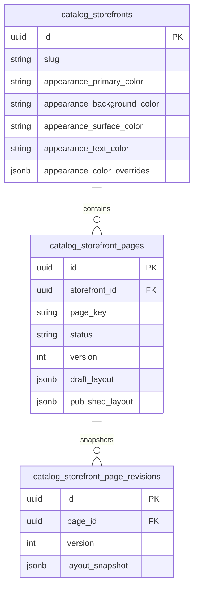
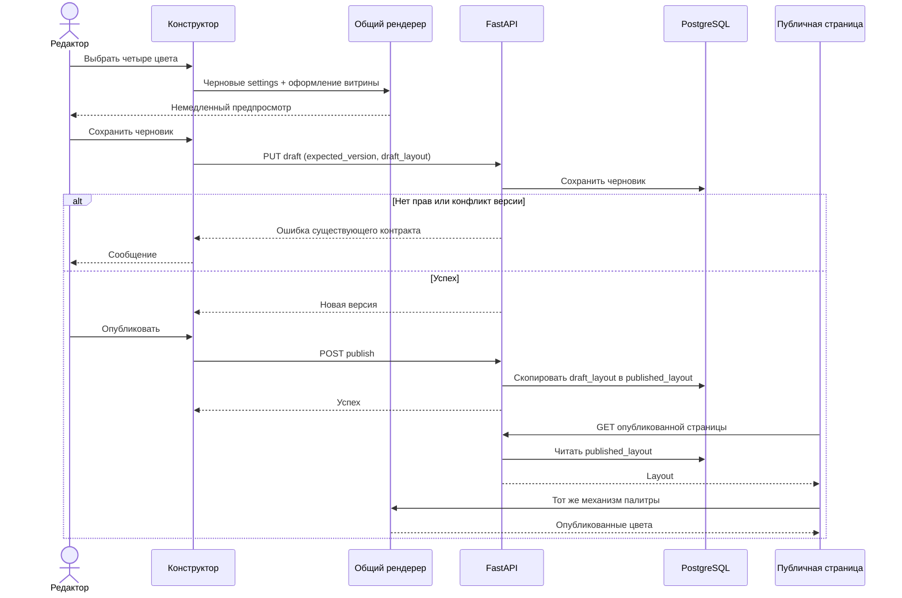

# Исправление палитры страниц конструктора витрин

- Внутренняя задача без Bitrix: `storefront-theme`.
- Ветка: `bugfix/storefront-theme`.
- Создана: 2026-10-01 11:06:34 MSK. Согласована пользователем: «делай».
- Спецификация восстановлена в изолированном worktree после изменения общего checkout другой задачей; согласованный объём сохранён.
- Пример: витрина `00000000-0000-0000-0000-000000000001`, `/about`.

Существующая схема проверена по ORM `storefronts.py`, `storefront_pages.py`.
Цвета уже содержатся в `layout.settings`; изменений БД и миграций не планируется.

## Постановка и доказательства

Выбор цветов в конструкторе не применяется к публичной странице. Скриншоты
показывают различия фона и дорожек калькулятора. Панель меняет четыре поля
`layout.settings`; холст использует только фон, общий рендерер не применяет
палитру, а виджеты используют фиксированные цвета Tailwind. Публичная тема
витрины формируется отдельно. При первичной загрузке `/about` дорожки были
белыми, затем браузер перенаправил на авторизацию. Полный сценарий и причина
белых дорожек требуют воспроизведения на изолированном стенде.

## Требования

1. Primary, Background, Surface, Text применяются немедленно и после публикации
   одинаково на холсте и публичной странице.
2. Область палитры — содержимое страницы; шапка, футер, кабинет и другие
   страницы сохраняют своё оформление.
3. Явные цвета секции/колонки/виджета выше палитры страницы. Отсутствующие
   и некорректные значения используют оформление витрины.
4. Все доступные виджеты используют палитру; семантические цвета ошибок
   и успешных результатов сохраняют значение и читаемость.
5. Дорожки, бегунки и клавиатурный фокус калькулятора видимы и согласованы;
   ползунки сохраняют пересчёт.
6. Черновик не влияет на публикацию до публикации; reload и undo/redo
   сохраняют существующий контракт.
7. Не менять схему БД, правила доступа, API. Desktop viewport от 768 px.
8. Шрифты, радиусы, произвольный custom CSS в объём изменения не входят.

## План

1. На Docker-стенде воспроизвести сценарий изменения, сохранения и публикации.
2. Общий механизм разрешения палитры страницы поверх темы витрины с
   существующей нормализацией и токенами; использовать в общем рендерере.
3. Перевести виджеты на токены, сохранить явные стили и локальную область CSS.
4. Устранить подтверждённую причину расхождения ползунков.
5. Добавить браузерный E2E реального приложения и API сохранения/публикации.
6. Делегировать независимо механизм палитры, виджеты, E2E подагентам;
   интегрировать и выполнить обязательные проверки.
7. Записать результаты сюда, создать MR только в `test`, объединить после
   проверок и обязательного review.

## Критерии готовности

- E2E воспроизводит баг до исправления; после — проходит при 1440 и 768 px.
- Установить четыре отличимых цвета, проверить холст, save/reload/publish,
  открыть `/about`, сравнить вычисленные цвета.
- Проверить неизменность опубликованной версии до publish, явный цвет
  виджета, наследование/некорректный цвет, изоляцию темы, fallback страницы.
- Проверить видимость дорожек, тему бегунков и фокуса, пересчёт калькулятора.
- Проверить отсутствие прав и конфликт версии через существующие интерфейсы.
- Применимые статические проверки фронтенда; отсутствие новых TS ошибок.
  Unit- и архитектурные тесты не добавлять и не запускать.
- Docker build/start, целевой браузерный E2E, логи сервисов и консоль браузера.
- Изолированная БД: `alembic upgrade head`, `alembic check` с результатом
  `No new upgrade operations detected.`
- MR в `test`: изменения, E2E, статические проверки, логи и Alembic.

## Результаты

Реализация начата после согласования. Подтверждён дополнительный фактор:
GET опубликованного layout отдаёт `Cache-Control: public, max-age=60,
stale-while-revalidate=300`. В одном браузере reload после публикации
использовал старые settings, тогда как независимый новый браузер показывал
новые. План уточнён: публичный frontend-запрос layout использует
`cache: 'no-cache'` для обязательной проверки актуальности через действующий
ETag без изменения backend-контракта.

### Проверки и итог реализации

- Исходный Docker frontend из `19784a0a`: браузерный сценарий RED — фон
  рендерера оставался `rgba(0, 0, 0, 0)` вместо `rgb(244, 228, 201)`.
- Исправленная production-сборка Docker backend/frontend/nginx успешна.
- Реальное приложение: `E2E_BASE_URL=http://localhost:18417
  E2E_STOREFRONT_THEME_ARTIFACT_DIR=<worktree>/artifacts/e2e/storefront-theme
  bun run test:e2e -- tests/e2e/storefronts/storefront-theme.spec.ts --workers=1`
  из frontend — **4 passed (12.3s)**.
- Проверены 4 цвета в конструкторе, сохранение/reload/undo/redo, подтверждение
  публикации, неизменность опубликованного layout до публикации, обновление
  палитры в том же браузере, viewport 1440/768, ползунки/пересчёт/фокус,
  все 11 виджетов, явные цвета секций/колонок/виджетов, разделители,
  наследование, некорректные значения/#RGB и fallback пустой страницы,
  отсутствие утечки в шапку/другую страницу и API 401/403/409/422.
- Панель цветов показывает фактические наследуемые/нормализованные значения
  той же палитры. Локальные переменные не меняют body/head и другие страницы.
- `bun x nuxi prepare`, `bun x vue-tsc --noEmit`, `git diff --check` — успешны.
  Специализированный E2E доступен для коллекции без артефактов стенда (`--list`).
  `bash -n` runner и Python compile fixture успешны. Отдельного frontend
  eslint-скрипта в проекте нет. Unit/architecture tests не запускались.
- Изолированная БД: `/app/.venv/bin/alembic upgrade head` и
  `/app/.venv/bin/alembic check` — exit 0,
  **No new upgrade operations detected.** Существующее предупреждение
  SQLAlchemy про `dialect_options` не влияет на результат.
- Проверены Docker-логи и browser pageerror: неожиданных ошибок/HTTP5xx нет;
  два ожидаемых VersionConflictError соответствуют проверкам stale version.
- Визуально просмотрены скриншоты конструктора и опубликованной страницы:
  палитра совпадает, дорожки ползунков видимы. Артефакты локальные и не коммитятся.
- Независимый review Standards и Spec: замечания исправлены; итог 0 оставшихся
  замечаний по каждому направлению.

Для повторения всего изолированного прогона:
`BACKEND_DEPENDENCY_IMAGE=<существующий backend image с зависимостями>
bash scripts/e2e/storefront-theme/run.sh`.
Фактический образ зависимостей: `vd1vabzxmn5j3uhk0plpr6w9-backend:latest`.
Runner использует отдельные Docker-ресурсы и localhost:18417; для SSH Docker
context создаёт собственный tunnel и удаляет его при завершении.
