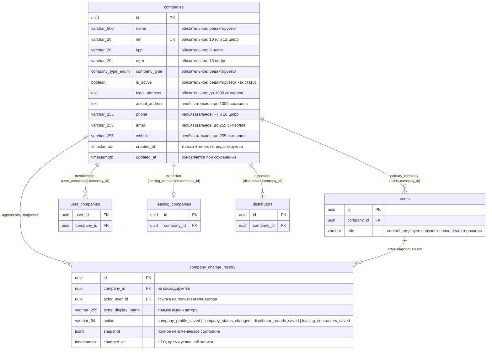
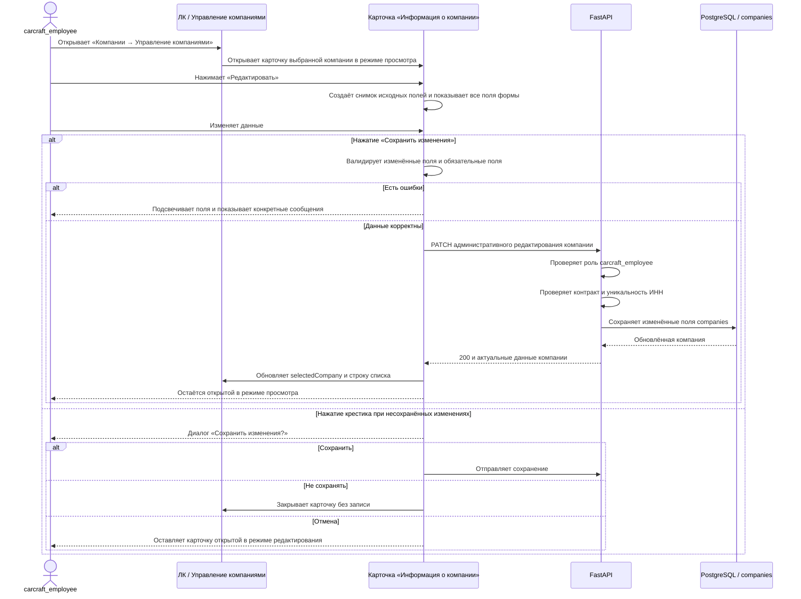

# Спецификация: Редактирование компаний сотрудником CarCraft

- **Дата и время создания:** 2026-10-01 11:32:36 MSK (UTC+3)
- **Идентификатор задачи Bitrix24:** [22294](https://carcraftpro.bitrix24.ru/workgroups/group/124/tasks/task/view/22294/)
- **Ветка задачи:** `feature/22294-company-admin-edit`
- **Целевая ветка:** `test`
- **Тип задачи:** `feature`
- **Статус:** дополнена правилами безопасного перехода типов, российского телефона, UX ошибок и modal lifecycle; ожидает реализации

---

## 1. Архитектурная диаграмма сущностей БД (ERD)

Базовое редактирование использует существующую таблицу `companies`. Вторая часть задачи добавляет append-only таблицу `company_change_history`; миграция обязательна. История хранит полный снимок реквизитов и связанных настроек на момент каждого успешного административного сохранения, а не изменяет запись `companies`.

---

## 2. Диаграмма основного сценария

---

## 3. Текущее поведение

1. Раздел личного кабинета `Компании → Управление компаниями` открывает карточку `Информация о компании` по клику на строку списка.
2. В карточке блоки «Основная информация» и «Контактная информация» доступны только для просмотра. Пустые контактные поля не отображаются.
3. Под блоком «Статистика» сейчас сразу расположен блок «Сотрудники компании».
4. До задачи карточка закрывалась через событие общего модального компонента. В рамках задачи закрытие по фону должно быть явно запрещено; крестик и Escape используют единый обработчик закрытия.
5. Уже существует общий маршрут обновления `PUT /api/v1/companies/{company_id}`. Он сохраняет поля компании и разрешён не только `carcraft_employee`, но также владельцу или пользователю, связанному с компанией. Этот существующий сценарий владельца должен сохраниться без изменений.
6. Данные компании хранятся в таблице `companies`: `name`, `inn`, `kpp`, `ogrn`, `company_type`, `is_active`, `phone`, `email`, `website`, `legal_address`, `actual_address`, `created_at` и другие поля.

---

## 4. Цель и бизнес-ценность

Дать любому пользователю с ролью `carcraft_employee` возможность корректировать реквизиты и контактные данные любой компании непосредственно из раздела «Компании» своего личного кабинета.

Это сокращает зависимость от ручного изменения данных через технические инструменты, сохраняет действующий функционал владельца компании и исключает возможность редактирования для иных ролей.

---

## 5. Требуемое поведение

### 5.1. Доступ и расположение кнопки

1. В карточке компании кнопка видна только пользователю с ролью `carcraft_employee`.
2. Кнопка располагается в левой колонке карточки в самом низу блока «Контактная информация», непосредственно перед заголовком блока «Статистика», выровненная по левому краю.
3. В исходном режиме кнопка серая и имеет текст **«Редактировать»**. Карточка остаётся полностью в режиме просмотра.
4. Для любых иных ролей кнопка не отображается. Административный API также обязан вернуть отказ в доступе, если запрос выполнен не `carcraft_employee`.

### 5.2. Режим редактирования

1. После нажатия «Редактировать» внизу блока «Контактная информация» отображаются действия в порядке: основная синяя кнопка **«Сохранить изменения»**, затем вторичная кнопка **«Отмена»**. Кнопка «Отмена» оставляет карточку открытой и возвращает снимок исходных значений.
2. Редактируются только поля блоков «Основная информация» и «Контактная информация»:
   - название;
   - тип;
   - ИНН;
   - КПП;
   - ОГРН;
   - статус;
   - телефон;
   - email;
   - веб-сайт;
   - юридический адрес;
   - фактический адрес.
3. Дата создания остаётся только для чтения и не передаётся в запросе обновления.
4. Блоки «Статистика» и «Сотрудники компании» не меняются в рамках задачи.
5. В режиме редактирования отображаются все контактные поля, включая пустые. Это позволяет заполнить телефон, email, сайт или фактический адрес, если они отсутствовали у компании до открытия карточки.
6. До начала редактирования интерфейс сохраняет снимок исходных значений. Он используется для определения несохранённых изменений и формирования PATCH только из изменённых полей.
7. Существующий отдельный блок «Изменить статус» скрывается или становится недоступным на время режима редактирования. Статус изменяется только в локальной форме вместе с остальными полями, чтобы не было двух независимых сценариев изменения `is_active`.

### 5.3. Правила заполнения и валидации

1. Фронтенд перед сохранением проверяет полный локальный снимок формы. Все поля «Основной информации» обязательны при сохранении:
   - название;
   - тип;
   - ИНН;
   - КПП;
   - ОГРН;
   - статус.
2. В «Контактной информации» обязательным является только юридический адрес. Телефон, email, сайт и фактический адрес допускают пустое значение.
3. Название принимает любой непустой текст длиной до 500 символов.
4. Тип выбирается только из существующего перечня: «Дилер», «Лизинговая компания», «Дистрибьютор», «Другое».
5. ИНН принимает только цифры длиной 10 или 12 символов. Ввод букв должен блокироваться на клиенте; сервер повторно валидирует формат и уникальность ИНН.
6. КПП принимает только цифры длиной ровно 9 символов. Ввод букв блокируется на клиенте; сервер повторно валидирует формат.
7. ОГРН принимает только цифры длиной ровно 13 символов. Ввод букв блокируется на клиенте; сервер повторно валидирует формат.
8. Статус выбирается только из существующего списка: «Активна» или «Неактивна».
9. Телефон предназначен только для Российской Федерации. В режиме просмотра и редактирования он всегда отображается строго в маске `+7 (XXX) XXX-XX-XX`, например `+7 (495) 100-02-00`. Пользователь вводит или вставляет только цифры; UI сам расставляет `+7`, пробелы, скобки и дефисы. Буквы, иной код страны, более 10 цифр после `+7` и неполный номер не могут быть сохранены. При передаче в API маска нормализуется в существующий wire-формат `+7XXXXXXXXXX`. Пустое значение допустимо и передаётся как `null`.
10. Уже сохранённое форматированное значение телефона, например `+7 (495) 100-02-00`, не должно обрезаться или блокировать редактирование. При открытии карточки оно приводится к маске; при сохранении другого поля неизменённый телефон не блокирует PATCH.
11. Во всех строках списка `Компании → Управление компаниями` заполненный телефон компании отображается той же маской `+7 (XXX) XXX-XX-XX`. Значение API, включая унаследованное слитное `+76669999999`, форматируется только для UI как `+7 (666) 999-99-99`; форматирование не изменяет БД и не отправляет PATCH.
12. Для карточки и списка используется одна общая frontend-функция форматирования телефона компании. Она не применяется автоматически к телефонам пользователей, контактных лиц, анкет или иных доменов вне scope этой задачи.
13. Email принимает текст до 255 символов; если он заполнен, проверяется корректный формат email.
14. Веб-сайт принимает текст до 255 символов; если он заполнен, проверяется корректный URL-формат.
15. Юридический и фактический адрес принимают текст до 1000 символов. Юридический адрес не может состоять только из пробелов.
16. При клиентской ошибке HTTP-запрос не выполняется: невалидные поля подсвечиваются, а рядом выводится конкретный текст причины.
17. Унаследованное значение, которое уже не соответствует новому формату, но не менялось сотрудником, само по себе не блокирует сохранение других полей. Однако пустое обязательное поле должно быть заполнено до сохранения.
18. Новый PATCH является частичным: сервер валидирует каждое переданное поле, но не отклоняет запрос из-за непереданного унаследованного значения. Пустой PATCH не отправляется: при отсутствии изменений кнопка сохранения не выполняет запрос.
19. Для очистки необязательных полей (`phone`, `email`, `website`, `actual_address`) фронтенд передаёт JSON-значение `null`. Пустая строка после trim не должна передаваться как новое значение.
20. Перевод статуса в «Неактивна» сохраняет существующую серверную семантику `is_active=false`, включая каскадную деактивацию связанных пользователей, лизинговой компании и дистрибьютора. Перед сохранением форма показывает явное предупреждение о последствиях этого действия.

### 5.4. Сохранение, ошибки и несохранённые изменения

1. Кнопка «Сохранить изменения» запускает клиентскую проверку. При ошибках HTTP-запрос не выполняется.
2. Для сохранения из данной карточки вводится отдельный административный маршрут частичного обновления компании. Он доступен исключительно субъекту со scope `COMPANIES_ADMIN`, который текущая серверная модель выдаёт только роли `carcraft_employee`; маршрут не изменяет права или контракт существующего маршрута владельца компании.
3. Сервер повторяет критичные проверки: scope, существование компании, формат переданных реквизитов, допустимые значения типа и статуса, уникальность переданного ИНН. Сервер не требует непереданные поля и не исправляет не изменённые унаследованные значения.
4. Новый маршрут возвращает ошибки в стабильном формате. Для ошибок полей ответ содержит `field_errors`: массив объектов `{ "field": "<имя API-поля>", "code": "<машинный код>", "message": "<текст для пользователя>" }`. Минимальные случаи: `422 VALIDATION_ERROR` для формата, длины, enum и обязательности переданного поля; `409 INN_ALREADY_EXISTS` с полевой ошибкой `inn`; `404 COMPANY_NOT_FOUND`; `403 INSUFFICIENT_PERMISSIONS`. Фронтенд не парсит текст `detail` для определения поля.
5. При успешном ответе карточка остаётся открытой, переключается в режим просмотра и показывает данные, возвращённые сервером.
6. Строка редактированной компании в списке обновляется теми же актуальными данными без полной перезагрузки страницы.
7. После обновления страницы сохранённые данные должны быть получены из API и отображаться без потери.
8. При нажатии на крестик, если после включения режима редактирования есть несохранённые изменения, открывается диалог **«Сохранить изменения?»** с действиями в строгом порядке:
   - основная кнопка **«Сохранить»** — выполняет обычное сохранение; при успехе закрывает карточку, при ошибке оставляет её открытой с ошибками;
   - визуально опасная кнопка **«Не сохранять»** — отбрасывает локальные изменения и закрывает карточку;
   - вторичная кнопка **«Отмена»** — закрывает только диалог и оставляет карточку открытой в режиме редактирования.
9. Если изменений нет, крестик или Escape закрывает карточку сразу.
10. Клик по фону не закрывает карточку и не вызывает диалог подтверждения: `close-on-overlay` устанавливается явно в `false`.
11. Escape при несохранённых изменениях вызывает тот же диалог, что и крестик. При выборе «Сохранить» карточка закрывается только после успешного ответа API; при ошибке остаётся открытой в режиме редактирования с сообщениями ошибок.
12. Новый PATCH возвращает `{ "company": <актуальный профиль компании> }`. Родительская панель заменяет этим объектом `selectedCompany` и строку с тем же UUID в `companies`.
13. Закрытие discard-dialog и карточки должно быть stack-safe: после любого сценария («Отмена», «Не сохранять», успешное «Сохранить», Escape или крестик) не остаётся невидимого overlay; корневой интерфейс не содержит добавленных modal-компонентом `inert`/`aria-hidden`; body scroll разблокирован; интерфейс кликабелен; фокус возвращён в карточку либо в элемент, который её открыл. Вложенная modal не может независимо оставить страницу заблокированной при одновременном закрытии с родительской карточкой.

---

### 5.5. Безопасная смена типа компании

1. Единственный существующий перечень типов — `dealer`, `leasing_company`, `distributor`, `other`. В селекте карточки показываются все четыре значения. `other` — самостоятельное значение enum, не контейнер для дополнительного незафиксированного списка.
2. `company_type` — lifecycle-поле. Его изменение не выполняется простым `UPDATE companies`: новый административный PATCH направляет изменение в отдельную transaction-safe команду.
3. В одной транзакции команда блокирует строку компании, читает текущий тип, subtype-записи и типозависимые связи. Если проверки не прошли, транзакция не изменяет ни один реквизит из PATCH.
4. При переходе **в** `leasing_company` или `distributor` сервер создаёт отсутствующий subtype (`leasing_companies` или `distributors`) до записи нового типа. Если subtype ранее существует, но неактивен как результат штатного предыдущего перехода этой же компании из данного типа, сервер реактивирует этот subtype в той же транзакции. Обычный цикл `distributor → leasing_company → distributor → leasing_company` не должен требовать отдельной процедуры восстановления и не должен сам по себе возвращать `TYPE_TRANSITION_CONFLICT`.
5. При переходе **из** `leasing_company` или `distributor` subtype и история не удаляются. Переход блокируется с `409 TYPE_TRANSITION_CONFLICT`, пока существуют связанные активные или семантически несовместимые данные: заявки/документы/программы монетизации/пользователи subtype для лизинговой компании; бренды, связи дистрибьютор—дилер, группы и типозависимые склады для дистрибьютора; связанные объекты, использующие исходную роль компании для дилера.
6. Если блокирующих зависимостей нет, покидаемый subtype переводится в неактивное состояние в той же транзакции, затем обновляется `companies.company_type`. Физическое удаление subtype, заявок, документов, финансовых записей, брендов или связей запрещено.
7. Переходы `dealer` ↔ `other` не требуют subtype, но также проходят проверку отсутствия role-specific зависимостей. Это консервативное правило исключает семантически неверные объекты после смены роли.
8. Ошибка перехода имеет HTTP `409`, код `TYPE_TRANSITION_CONFLICT`, полевую ошибку `company_type` и структурированный массив blocker-объектов `{ code, label, count, resolution_hint }`. `label` и `resolution_hint` формируются сервером на русском языке; технический `code` не выводится пользователю. Минимальные понятные категории для дилера: «Заявки дилера», «Товарные позиции дилера», «Склады дилера». UI оставляет форму открытой, выделяет/подчёркивает блок «Тип» красным и не показывает ложный успех.
9. Количество blocker-объектов обязательно. Конкретные идентификаторы, названия записей и прямые ссылки на их редактирование не возвращаются и не отображаются, пока серверная проверка не подтвердит право текущего `carcraft_employee` видеть каждый соответствующий объект. После реализации этой проверки UI может показать ограниченный список конкретных объектов и ссылки на разрешённые бизнес-действия.
10. После успешного перехода публикуется ровно одно согласованное `company.changed.v1` событие с актуальным типом. Публикация не должна происходить для отклонённого или откатившегося перехода.
11. Для `TYPE_TRANSITION_CONFLICT` системный toast не используется: он не гарантирует отображение полного списка и исчезает до того, как сотрудник обработает данные. Под полем «Тип» внутри карточки отображается постоянный компактный error-panel с заголовком «Нельзя изменить тип компании» и полным списком blocker-ов: русские `label`, `count` и `resolution_hint`. Панель имеет светло-красный фон и заметную, но не доминирующую красную границу/акцент; не показывает технические коды.
12. Error-panel не должен растягивать карточку бесконечно: при длинном списке он имеет ограниченную высоту и внутреннюю вертикальную прокрутку. Содержимое панели остаётся доступным для чтения и навигации с клавиатуры; прокрутка панели не блокирует прокрутку карточки.
13. Panel очищается, если сотрудник возвращает исходный тип компании, после успешного сохранения или при закрытии карточки. Изменение иных полей формы не очищает panel, пока выбранный конфликтующий тип остаётся прежним.
14. Реактивация ранее деактивированного целевого subtype допускается только после блокировки строки компании и subtype-записей и после проверки всех актуальных type-specific зависимостей покидаемого типа. При наличии реальной зависимости переход возвращает обычный `409 TYPE_TRANSITION_CONFLICT` с понятными blocker-ами; subtype, `company_type` и другие поля PATCH не изменяются.
15. Реактивация не удаляет и не пересоздаёт historical subtype-запись, не меняет её UUID и не создаёт дубликат. В одной транзакции выполняются: проверка зависимостей, `is_active=true` для целевого ранее неактивного subtype, `is_active=false` для покидаемого subtype (если применимо), обновление `companies.company_type` и commit. При любой ошибке все эти изменения откатываются.
16. Сообщение «Неактивный профиль целевого типа» не является допустимым результатом обычного обратного перехода между `leasing_company` и `distributor`. Этот blocker допускается только для отдельного будущего сценария, когда сервер доказал, что профиль деактивирован нештатно и его реактивация небезопасна; текущий административный PATCH такого отдельного сценария не реализует.

---

## 6. Планируемые изменения

### Frontend

1. Доработать `frontend/features/company/components/CompanyDetailModal.vue`:
   - добавить режимы просмотра и редактирования;
   - добавить локальную форму, снимок исходных значений, признак несохранённых изменений и сообщения валидации;
   - выводить редактируемые поля в двух существующих информационных блоках;
   - показывать все контактные поля в режиме редактирования;
   - добавить кнопку внизу «Контактной информации», перед «Статистикой», и расположить form actions «Сохранить изменения» → «Отмена»;
   - реализовать ввод и отображение телефона строго в маске РФ `+7 (XXX) XXX-XX-XX` с нормализацией `+7XXXXXXXXXX` перед PATCH;
   - вынести форматирование телефона компании в общий frontend utility и использовать его также для контакта в строке списка; не изменять через этот utility телефоны иных доменов;
   - явно установить `close-on-overlay="false"`;
   - перехватывать закрытие по крестику и Escape и открывать диалог подтверждения только при несохранённых изменениях;
   - в discard-dialog вывести действия в порядке «Сохранить» → опасное «Не сохранять» → «Отмена»;
   - устранить блокировку интерфейса после закрытия вложенного discard-dialog: modal lifecycle обязан корректно восстановить `inert`, `aria-hidden`, body scroll и фокус;
   - принимать от родительской панели типизированный async callback сохранения, ждать его результат и закрываться только после успеха; локально отображать переданные parent полевые и общие ошибки;
   - скрывать или отключать существующий отдельный контрол переключения статуса во время режима редактирования;
   - вывести предупреждение о каскадных последствиях выбора статуса «Неактивна».
2. Доработать `frontend/features/admin/companies/manage/components/CompaniesListPanel.vue`:
   - передавать в карточку признак роли `carcraft_employee`;
   - вызвать отдельный административный маршрут сохранения;
   - после успеха обновлять `selectedCompany` и соответствующий элемент `companies` возвращённым объектом компании;
   - преобразовать `field_errors` нового административного API в сообщения конкретных полей и передавать их обратно в modal;
   - при `TYPE_TRANSITION_CONFLICT` подчеркнуть блок «Тип» красным, сохранить карточку и введённые значения; показать полный список русских категорий/количеств/подсказок в компактном прокручиваемом inline error-panel под полем типа, а не в системном toast;
   - описать строгий тип `AdminCompanyDetail` либо расширить существующий тип компании всеми полями, используемыми в форме; не использовать index signature как контракт формы.
3. Доработать `frontend/features/admin/companies/manage/api/companiesAdminApi.ts`:
   - описать тип административного payload без неявных типов;
   - добавить вызов нового административного PATCH-маршрута, возвращающего `{ company }`;
   - существующий `updateCompany` не изменять и не использовать для нового сценария.
4. Использовать существующее хранилище аутентификации `useAuthStore` и его признак `isCarCraftEmployee`; не создавать новое хранилище и не добавлять библиотеку управления состоянием.

### Backend

1. Добавить в `backend/presentation/schemas/companies.py` отдельную схему административного обновления с разрешённым набором полей и серверной валидацией форматов/длин.
2. Добавить в `backend/presentation/routers/admin_companies.py` отдельный маршрут `PATCH /api/v1/admin/companies/{company_id}`:
   - применить существующий административный scope-guard `require_scopes(COMPANIES_ADMIN)`;
   - задокументировать response model, summary и description;
   - вернуть `{ company }` с актуальным профилем компании;
   - для validation и domain errors вернуть согласованный API-контракт, включая `field_errors` и HTTP-коды из раздела 5.4.
3. Добавить или выделить в `backend/application/commands/companies/` команду административного обновления:
   - принимать только разрешённые изменённые поля;
   - не принимать `created_at`;
   - проверять формат и допустимость каждого переданного поля, а уникальность ИНН — относительно других компаний;
   - обрабатывать `company_type` только отдельной transition-командой: блокировать компанию и subtype-записи, проверять типозависимые зависимости, создавать отсутствующий subtype или реактивировать ранее штатно деактивированный target subtype для `leasing_company`/`distributor`, деактивировать покидаемый subtype без удаления истории и только затем обновлять базовую компанию;
   - возвращать `409 TYPE_TRANSITION_CONFLICT`, структурированный `field_errors` для `company_type` и блокеры `{ code, label, count, resolution_hint }`, если переход нарушит lifecycle-инварианты; при конфликте не сохранять другие PATCH-поля;
   - не возвращать конкретные ID, названия или ссылки на связанные объекты без серверной проверки прав текущего сотрудника на каждый объект;
   - передавать остальные изменения в существующий репозиторий;
   - публиковать ровно одно стандартное событие `company.changed.v1` через существующий application-command механизм после подготовки актуального snapshot; router не пишет в ClickHouse, записи DWH остаются обязанностью event-worker.
4. При необходимости доработать `backend/infrastructure/repositories/company_repository.py` или отдельный transition-repository только для безопасного частичного сохранения, блокировки компании, проверки зависимостей и возврата актуальной записи; не менять схему таблицы `companies` и не удалять subtype/связанные бизнес-данные.
5. Существующий `PUT /api/v1/companies/{company_id}` и его правила владельца не менять.

### E2E

1. Добавить browser Playwright-сценарий раздела управления компаниями в `frontend/tests/e2e/` для размещения и видимости кнопки, перехода в edit-mode, редактирования/вставки форматированного телефона РФ, client validation без PATCH, PATCH только изменённых полей, обновления карточки/строки, форматирования унаследованного слитного телефона в списке, заполнения пустых контактов, красной ошибки типа и inline error-panel с полным списком blocker-ов, закрытия Save/«Не сохранять»/«Отмена», Escape и inert overlay. Добавить устойчивые semantic labels или task-scoped `data-testid` для нового сценария.
2. Добавить real API/Docker-проверку, не основанную на Playwright route-mock: employee со scope `COMPANIES_ADMIN` получает `200`; пользователь без scope получает реальный `403`; malformed body — `422`; duplicate INN — `409`; неизвестный UUID — `404`; повторный GET подтверждает сохранение. Отдельно проверить все четыре значения enum и lifecycle-переходы: clean-переход создаёт целевой subtype и сохраняет тип; цикл `distributor → leasing_company → distributor → leasing_company` реактивирует исходный leasing subtype без создания дубликата и сохраняет тип; конфликтный переход с типозависимыми связями возвращает `409 TYPE_TRANSITION_CONFLICT` и не меняет базовую компанию, subtype или связи.
3. Подготовить изолированную fixture: employee без связи с редактируемой компанией, client-owner для регрессии прежнего PUT, client non-owner, заполненную target-company, sparse-company с пустыми optional-полями, duplicate-INN company и legacy-invalid company для проверки неизменённого устаревшего поля.
4. Подключить 22294 к воспроизводимому Docker E2E-runner: build backend/frontend/nginx, migrations, `alembic check`, fixture setup, target E2E/API-check и сбор backend/frontend/nginx logs и Playwright artifacts.
5. Проверить desktop viewport не менее 768 CSS-пикселей.

---

## 7. Критерии готовности (DoD)

- [ ] Кнопка «Редактировать» показывается только `carcraft_employee` в карточке компании и расположена внизу «Контактной информации», непосредственно перед «Статистикой», слева.
- [ ] До нажатия кнопки карточка работает в прежнем режиме просмотра.
- [ ] После нажатия все перечисленные поля основной и контактной информации доступны для редактирования; дата создания, статистика и сотрудники не изменяются.
- [ ] Пустые контактные поля отображаются в режиме редактирования и могут быть заполнены.
- [ ] В edit-mode действия расположены «Сохранить изменения» → «Отмена».
- [ ] Клиентская и серверная проверки соблюдают согласованные правила: ИНН 10/12 цифр, КПП 9 цифр, ОГРН 13 цифр, телефон РФ в UI-маске `+7 (XXX) XXX-XX-XX` и wire-формате `+7XXXXXXXXXX`, установленные длины и обязательность полей.
- [ ] Сохранённый телефон `+7 (495) 100-02-00` открывается, редактируется, вставляется из буфера и сохраняется без обрезания; неполный номер, буквы и иной код страны не сохраняются.
- [ ] Телефон компании в строке списка отображается единообразно с карточкой: унаследованный `+76669999999` визуально показан как `+7 (666) 999-99-99`; форматирование не изменяет API-значение и не затрагивает телефоны иных доменов.
- [ ] Невалидные данные не отправляются, поля подсвечиваются, а пользователь получает конкретное сообщение.
- [ ] Новый PATCH принимает только изменённые поля, не содержит `created_at`, не отправляется при отсутствии изменений, а `null` очищает только допускающие очистку optional-поля.
- [ ] Неизменённое унаследованное невалидное значение не блокирует PATCH другого поля; изменённое невалидное значение отклоняется с полевой ошибкой.
- [ ] Только субъект со scope `COMPANIES_ADMIN` может вызвать новый административный API; иной пользователь получает HTTP 403 даже при прямом запросе.
- [ ] API-контракт ошибок проверен: `422` возвращает полевые ошибки в `field_errors`, duplicate ИНН — `409` и ошибку поля `inn`, неизвестная компания — `404`.
- [ ] Существующий сценарий владельца через `PUT /api/v1/companies/{company_id}` сохраняет прежние права и поведение.
- [ ] Успешное сохранение обновляет карточку и строку списка данными из ответа API; после обновления страницы эти данные не теряются.
- [ ] При нажатии крестика или Escape с несохранёнными изменениями показан диалог в порядке «Сохранить», опасное «Не сохранять», «Отмена»; без изменений карточка закрывается сразу, а при ошибке сохранения остаётся открытой.
- [ ] После каждого пути закрытия discard-dialog/карточки (`Отмена`, `Не сохранять`, успешное `Сохранить`, Escape, крестик) отсутствует overlay, корневой UI не остаётся `inert`/`aria-hidden`, body scroll разблокирован, интерфейс кликабелен и фокус восстановлен.
- [ ] Клик по фону не закрывает карточку; существующий отдельный переключатель статуса не создаёт параллельный путь изменения `is_active` в edit-mode.
- [ ] Перед переводом компании в «Неактивна» отображено предупреждение о каскадной деактивации; сервер сохраняет текущую каскадную семантику.
- [ ] `TYPE_TRANSITION_CONFLICT` возвращает для каждого blocker русские `label`, `count` и `resolution_hint`, а не только технический код; UI подчёркивает «Тип» красным и выводит полный список в постоянном компактном inline error-panel под полем типа, сохраняя открытую форму и её значения. Для этого случая системный toast не используется.
- [ ] При большом количестве blocker-ов inline error-panel имеет ограниченную высоту, внутреннюю доступную с клавиатуры прокрутку и не ломает размер или прокрутку карточки; он очищается только при возврате исходного типа, успешном сохранении или закрытии карточки.
- [ ] Конкретные записи и ссылки в сообщении о blocker-ах не раскрываются без отдельной проверенной серверной проверки доступа `carcraft_employee` к каждой записи.
- [ ] Добавлена и проверена Alembic migration для `company_change_history`; `alembic check` после миграции завершился с `No new upgrade operations detected.`
- [ ] Для backend-изменений успешно выполнены `ruff`, `lint-imports` и `mypy`; при отсутствии ранее существовавших ошибок в затронутых файлах новые ошибки не добавлены.
- [ ] Выполнен целевой browser E2E и real API/Docker E2E на работающем Docker-приложении, включая успешное сохранение, валидацию, роль, direct HTTP 403/404/409, обновление после reload и закрытие с несохранёнными изменениями; логи проверены.
- [ ] После согласования спецификации реализация выполняется в этой ветке; MR создаётся только в `test`.

---

## 8. Неблокирующие замечания

1. Актуальный `backend/AGENTS.md` появился в `origin/test` после создания ветки задачи. Перед реализацией ветка должна быть безопасно актуализирована от `origin/test`; спецификация и реализация не должны использовать устаревшие backend-инструкции.
2. Вторая часть задачи утверждена 2026-10-01: неизменяемая история изменений реквизитов компании входит в эту же ветку и расширяет данную спецификацию.

---

## 9. Вторая часть: неизменяемая история изменений реквизитов компании

### 9.1. Цель и границы

Сотрудник CarCraft открывает карточку конкретной компании, например «Демо Дистрибьютор 1», и видит только журнал этой компании. Название окна — **«История изменений реквизитов компании»**. История создаётся только для новых успешных административных операций после внедрения; ранее произошедшие изменения не реконструируются и не выдаются за исторические.

В scope истории входят все действия текущей modal «Информация о компании», влияющие на её основную или контактную информацию либо связанные с типом настройки:

1. `PATCH /api/v1/admin/companies/{company_id}` — сохранение реквизитов, включая смену типа и `is_active` из edit-mode.
2. Отдельное действие «Изменить статус» в карточке.
3. `PUT /api/v1/admin/companies/{company_id}/distributor-brands` — сохранение марок дистрибьютора.
4. Сохранение связей ЛК с подрядчиками из правой части этой же карточки.

Создание или редактирование самого справочника подрядчиков, управление группами дилеров вне карточки и legacy owner `PUT /api/v1/companies/{company_id}` в этот срез не входят. Последний сохраняет прежнее поведение и не должен создавать историю административной карточки.

### 9.2. Данные и неизменяемость

Каждая успешная операция создаёт **одну новую версию** в `company_change_history` в той же PostgreSQL-транзакции, что и изменение предметных данных. Запись содержит `company_id`, `changed_at`, `actor_user_id`, неизменяемый снимок `actor_display_name`, действие `action` и JSONB `snapshot`.

В `snapshot` всегда записываются итоговые значения `name`, `company_type`, `inn`, `kpp`, `ogrn`, `is_active`, `phone`, `email`, `website`, `legal_address`, `actual_address`. Для сохранения марок добавляются упорядоченные пары `distributor_brands` с неизменяемыми `id` и `name`; для сохранения связей ЛК — упорядоченные пары `leasing_contractors` с `id`, `name` и `inn`. Поэтому историю можно корректно сравнить даже после переименования марки или подрядчика.

История append-only на уровне БД: миграция создаёт trigger, который отклоняет `UPDATE` и `DELETE` для `company_change_history`. В публичном и административном API нет маршрутов создания, изменения или удаления истории; создание разрешено только внутреннему writer-у из согласованных команд. Внешний ключ автора не использует каскадное удаление. Downgrade миграции, который мог бы удалить аудиторские данные, должен завершаться ошибкой, а не удалять таблицу.

Снимок создаётся только после успешной доменной проверки, записи изменений и подготовки итогового состояния. Если основной command возвращает ошибку, включая `TYPE_TRANSITION_CONFLICT`, либо создание истории не удалось, транзакция откатывается полностью. Событие `company.changed.v1` публикуется, как и прежде, только после commit; история не строится асинхронно из события.

### 9.3. Авторизация и API чтения

Добавляется только read-only endpoint `GET /api/v1/admin/companies/{company_id}/change-history`. Он требует существующий серверный scope `COMPANIES_ADMIN`; отсутствие scope возвращает `403`, неизвестная компания — `404`. Нельзя опираться на скрытие кнопки во frontend.

Ответ выдаёт cursor-пагинацию версий в обратном хронологическом порядке с устойчивым tie-breaker по `id`. Каждая версия содержит дату UTC, имя автора на момент операции, тип действия и полный snapshot. Сервер также принимает два ID версий этой же компании для comparison-ответа; target-version должна быть позже base-version, иначе возвращается `422`. В comparison сервер вычисляет список изменившихся полей `field`, `old_value`, `new_value`; frontend не рассчитывает diff сам.

### 9.4. UX истории и сравнения версий

В правой колонке карточки, в её верхнем правом углу под крестиком и **над** «Изменить статус», в режиме просмотра показывается кнопка **«Просмотреть историю изменений»**. В edit-mode она не показывается: это исключает открытие второго modal поверх несохранённой формы.

Нажатие открывает вложенное modal «История изменений реквизитов компании». Вверху выбранной версии показываются дата и время в `ru-RU`/MSK, а также имя пользователя. По умолчанию target-версией является самая новая запись; если версии нет, выводится честный empty state о том, что история формируется с момента включения функции.

Пользователь может выбрать target-версию из списка журнала. Визуально слева расположен select **«Было»**, справа — select **«Стало»**. `Было` выбирается только из более ранних версий этой же компании; по умолчанию выбирается непосредственно предыдущая версия target. Этот порядок является только визуальным: для server comparison `Было` передаётся как `base_id`, а `Стало` — как `target_id`; переменные, backend-контракт и порядок сравнения не меняются. Верхние два select — единственное место выбора версий.

После выбора обеих версий окно выводит компактную таблицу `Поле / Было / Стало` только с реально отличающимися значениями. Ниже неё расположены два независимых раскрываемых блока: «Полный снимок версии „Было“» и «Полный снимок версии „Стало“». Они показывают соответствующие выбранные неизменяемые snapshots: все сохранённые поля, включая неизменившиеся, марки и подрядчиков с ИНН при наличии. Оба блока могут быть открыты одновременно; внутри них нет второго select и альтернативного выбора версии. Если для target нет более ранней версии, сравнение недоступно, блок снимка «Было» не отображается, а снимок «Стало» остаётся доступен. Адреса не обрезаются без возможности прочтения полного значения; для длинных значений используется перенос строки и вертикальная прокрутка тела modal.

При закрытии истории закрывается только верхний modal. Базовая карточка «Информация о компании» остаётся открытой и интерактивной; исчезают только overlay/focus trap верхнего окна, не остаётся `inert`, `aria-hidden` или body scroll-lock.

### 9.5. Планируемые изменения второй части

1. Добавить ORM-модель, repository и Alembic migration для `company_change_history`, DB-level trigger неизменяемости, индексы `(company_id, changed_at DESC, id DESC)` и безопасный FK автора.
2. Добавить централизованный writer снимков и read/query слой: снимок итоговых company-реквизитов, марок и подрядчиков; cursor-list; серверный comparison выбранных версий.
3. Пробросить аутентифицированного автора во все четыре согласованные команды и создавать запись до общего commit. Не добавлять историю при no-op сохранении, неуспехе или rollback.
4. Добавить read-only API schemas и endpoint истории с `COMPANIES_ADMIN`; не добавлять write/delete API истории.
5. Доработать административный frontend API, right-side controls и `CompanyDetailModal.vue`; добавить отдельный history modal со states loading, empty, forbidden/error, pagination, выбором «Была/Стала» и полным snapshot.
6. Использовать существующий stack-safe `Modal` без самостоятельных overlay; добавить regression сценарий: открыть историю, закрыть, продолжить работу в открытой карточке.

### 9.6. Критерии готовности второй части

- [ ] Каждая из четырёх согласованных успешных операций создаёт ровно одну новую неизменяемую версию с итоговым полным snapshot, MSK-отображением времени и именем фактического автора.
- [ ] Неуспех, validation error, `409` конфликта, rollback и no-op не создают запись истории.
- [ ] В истории сохраняются все 11 полей основной/контактной информации; марки и связи с подрядчиками сохраняются вместе с ID и читаемыми значениями.
- [ ] БД отклоняет прямые `UPDATE` и `DELETE` исторической записи; API не содержит маршрутов её изменения либо удаления; опасный downgrade не удаляет журнал.
- [ ] Только запрос со scope `COMPANIES_ADMIN` читает историю; клиент без scope получает реальный `403` при direct HTTP.
- [ ] История выбранной компании не содержит версий иной компании; cursor-пагинация не даёт пропусков или дублей при одинаковом времени записи.
- [ ] Сотрудник может выбрать более раннее «Было» слева и target «Стало» справа, увидеть server-calculated diff и открыть независимые полные snapshots обеих выбранных версий; блок «Было» не показывается, если ранее сохранённой версии нет. Визуальная перестановка не меняет `base_id`/`target_id` или backend-порядок сравнения.
- [ ] Кнопка истории размещена под крестиком и над «Изменить статус», отсутствует в edit-mode; после закрытия истории исходная карточка остаётся открытой и полностью работоспособной.
- [ ] Выполнены затронутые browser E2E, real API/Docker E2E, миграции, `alembic check`, backend linters и проверка логов без destructive reset production-like БД.
