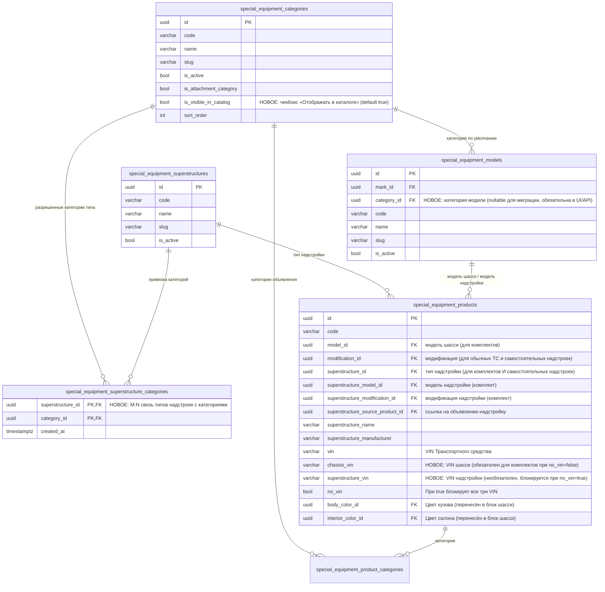
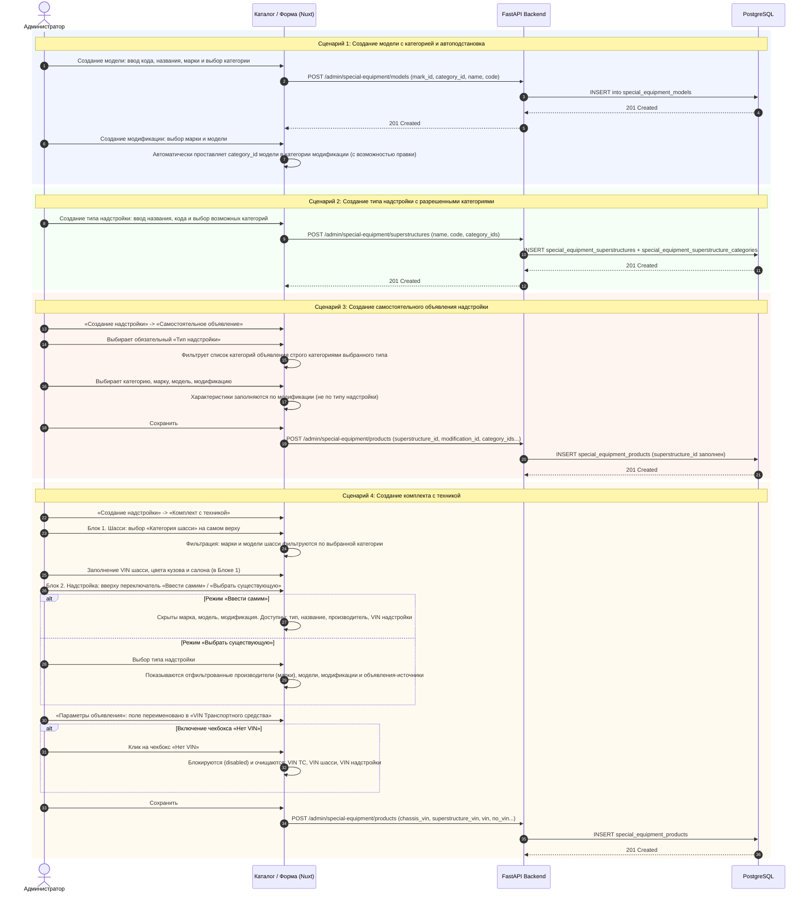

# Доработка надстроек, категорий и объявлений спецтехники

- **Дата и время создания:** 2026-10-01 14:07:46 MSK (UTC+3)
- **Согласование:** Согласована пользователем 2026-10-01 14:20 MSK: «да, делай».
- **Идентификатор задачи Bitrix24:** — (внутренняя задача без Bitrix: `superstructure-improvements`)
- **Тип задачи:** `feature`
- **Ветка задачи:** `feature/superstructure-improvements`
- **Целевая ветка для MR:** `test`
- **Основа:** правки по документу «Правки надстройки (2).docx» после выкатки базового функционала надстроек на тестовый контур.

---

## 0. Архитектурные диаграммы

### 0.1. ER-диаграмма изменений БД

### 0.2. Sequence-диаграмма сквозных сценариев

---

## 1. Постановка задачи и анализ входных данных

На основе документа «Правки надстройки (2).docx» и предоставленных скриншотов сформулирован пакет из 9 функциональных блоков доработок для подсистемы каталога спецтехники, справочника надстроек, категорий и карточек создания объявлений.

### Соответствие скриншотов точкам входа в кодовой базе

| № скриншота | Описание интерфейса | Точка входа в коде |
|---|---|---|
| **1** | Модальное окно «Создать модель»: добавление поля выбора категории привязки | [CatalogCorrectionForm.vue:256](file:///Users/a_belianskii/Projects/carcraft-leadgenerator/frontend/features/specialEquipment/management/correction/CatalogCorrectionForm.vue#L256) |
| **2** | «Блок 1. Шасси»: вынос категории наверх, каскадная фильтрация марки и модели | [CatalogCorrectionForm.vue:579](file:///Users/a_belianskii/Projects/carcraft-leadgenerator/frontend/features/specialEquipment/management/correction/CatalogCorrectionForm.vue#L579) |
| **3–4** | «Блок 2. Надстройка»: перенос плашек «Ввести самим» / «Выбрать существующую» наверх блока, перестроение полей | [CatalogCorrectionForm.vue:703](file:///Users/a_belianskii/Projects/carcraft-leadgenerator/frontend/features/specialEquipment/management/correction/CatalogCorrectionForm.vue#L703) |
| **5** | Выпадающий список со стрелками («Статус продажи» и другие `select`): горизонтальное повторение стрелки | Поле: [CatalogCorrectionForm.vue:1131](file:///Users/a_belianskii/Projects/carcraft-leadgenerator/frontend/features/specialEquipment/management/correction/CatalogCorrectionForm.vue#L1131). Стили: [main.css:122](file:///Users/a_belianskii/Projects/carcraft-leadgenerator/frontend/assets/css/main.css#L122), [registry.css:302](file:///Users/a_belianskii/Projects/carcraft-leadgenerator/frontend/features/specialEquipment/management/registry.css#L302) |
| **6** | «Цвет кузова» и «Цвет салона»: перенос из параметров объявления в «Блок 1. Шасси» | [CatalogCorrectionForm.vue:1179](file:///Users/a_belianskii/Projects/carcraft-leadgenerator/frontend/features/specialEquipment/management/correction/CatalogCorrectionForm.vue#L1179) |
| **7** | VIN и чекбокс «Нет VIN»: переименование в «VIN Транспортного средства», блокировка всех VIN | [CatalogCorrectionForm.vue:1202](file:///Users/a_belianskii/Projects/carcraft-leadgenerator/frontend/features/specialEquipment/management/correction/CatalogCorrectionForm.vue#L1202) |
| **8** | «Создать тип надстройки»: выбор разрешенных категорий | Подключение: [CatalogCorrectionForm.vue:376](file:///Users/a_belianskii/Projects/carcraft-leadgenerator/frontend/features/specialEquipment/management/correction/CatalogCorrectionForm.vue#L376). Компонент: [CatalogSuperstructureAttributePicker.vue](file:///Users/a_belianskii/Projects/carcraft-leadgenerator/frontend/features/specialEquipment/management/correction/CatalogSuperstructureAttributePicker.vue) |
| **9** | Самостоятельная надстройка: обязательный выбор типа надстройки без ручного ввода характеристик типа | [CatalogCorrectionForm.vue:388](file:///Users/a_belianskii/Projects/carcraft-leadgenerator/frontend/features/specialEquipment/management/correction/CatalogCorrectionForm.vue#L388) |

---

## 2. Детальные требования к реализации

### Блок 1. Категория модели техники (Скриншот 1)
1. **БД и модель:** В таблицу `special_equipment_models` добавляется колонка `category_id UUID NULL REFERENCES special_equipment_categories(id) ON DELETE RESTRICT`. Для существующих моделей миграция заполняет `category_id` на основе основной категории первой существующей модификации модели (или оставляет NULL, если модификаций нет).
2. **API и валидация:** При создании новой модели через API эндпоинт `POST /api/v1/admin/special-equipment/models` поле `category_id` становится обязательным.
3. **UI создания модели:** В форме «Создать модель» в секцию «Принадлежность модели» добавляется селектор категории (`CatalogSearchableSelect` / дерево категорий).
4. **Автоподстановка:**
   - При создании/редактировании модификации: при выборе модели в список `category_ids` модификации автоматически подставляется категория выбранной модели (с возможностью последующего редактирования/добавления других категорий пользователем).
   - При создании комплекта надстройки: при выборе модели шасси категория автоматически проставляется в категорию шасси (с возможностью редактирования).
   - В обычном объявлении категория по-прежнему подтягивается из модификации.

### Блок 2. «Блок 1. Шасси» в создании комплекта (Скриншот 2, 6, 7)
1. **Порядок полей:** Поле «Категории шасси» выносится на самый верх блока «Блок 1. Шасси» перед селекторами марки и модели.
2. **Каскадная фильтрация:** При выборе категории шасси выпадающие списки «Марка шасси» и «Модель шасси» фильтруются — отображаются только те марки и модели, которые привязаны к выбранной категории (модели фильтруются по `model.category_id == selected_category_id`).
3. **Перенос цветов:** Поля «Цвет кузова» (`body_color_id`) и «Цвет салона» (`interior_color_id`) переносятся из блока «Параметры объявления» в «Блок 1. Шасси».
4. **VIN шасси:** В «Блок 1. Шасси» добавляется обязательное поле ввода «VIN шасси» (`chassis_vin`). При включении чекбокса «Нет VIN» поле становится необязательным и отключается (disabled).

### Блок 3. «Блок 2. Надстройка» в создании комплекта (Скриншоты 3–4, 7)
1. **Переключатель наверх:** Переключатели «Ввести самим» / «Выбрать существующую» (`se-choice-grid`) переносятся в самое начало блока «Блок 2. Надстройка».
2. **Режим «Ввести самим»:**
   - Полностью скрываются селекторы марки, модели и модификации надстройки.
   - Отображаются только:
     - «Тип надстройки» (`CatalogSearchableSelect`, обязательное);
     - «Название надстройки» (текстовое поле, обязательное);
     - «Производитель надстройки» (текстовое поле, обязательное);
     - «VIN надстройки» (текстовое поле, необязательное);
     - Характеристики типа надстройки (из назначенного набора атрибутов типа).
3. **Режим «Выбрать существующую»:**
   - Отображается каскадный выбор:
     1. «Тип надстройки» (селектор);
     2. В зависимости от выбранного типа надстройки фильтруются производители (марки надстроек);
     3. «Производитель надстройки» (переименованный селектор марки надстройки);
     4. «Модель надстройки» (фильтруется по выбранному производителю);
     5. «Модификация надстройки» (необязательный выбор);
     6. «Объявление надстройки» (селектор объявления-источника);
     7. «VIN надстройки» (необязательное поле).

### Блок 4. Исправление повторяющихся стрелок выпадающих списков (Скриншот 5)
1. **Причина бага:** В файле `frontend/features/specialEquipment/management/registry.css` селектор `.se-field select` задаёт сокращённое свойство `background: hsl(var(--se-surface));`, которое неявно сбрасывает `background-repeat` в `repeat` и перебивает классы `.select-field` с меньшей специфичностью. При `:focus` из `main.css:144` задаётся SVG-стрелка, которая из-за `background-repeat: repeat` размножается по горизонтали.
2. **Решение:**
   - В `registry.css` заменить `background: ...` на `background-color: hsl(var(--se-surface));`.
   - В `main.css` для `.select-field`, `.select-field:focus`, `.select-field:hover`, `.select-field.error` явно закрепить `background-repeat: no-repeat !important;`, `background-position: right 0.5rem center;`, `background-size: 1.5em 1.5em;`.
   - Проверить все выпадающие списки раздела управления каталогом спецтехники.

### Блок 5. Параметры объявления и логика VIN (Скриншот 7)
1. **Переименование поля:** Общее поле «VIN» в блоке «Параметры объявления» переименовывается в **«VIN Транспортного средства»** (обязательное при `no_vin=false`).
2. **Поля в БД:** В таблицу `special_equipment_products` добавляются:
   - `chassis_vin VARCHAR(32) NULL`
   - `superstructure_vin VARCHAR(32) NULL`
3. **Чекбокс «Нет VIN»:**
   - При включении чекбокса «Нет VIN» (`no_vin = true`) блокируются (disabled), очищаются и не требуют заполнения ВСЕ три поля:
     1. «VIN Транспортного средства»;
     2. «VIN шасси» (в Блоке 1);
     3. «VIN надстройки» (в Блоке 2).
   - Чек-констрейнт `ck_special_equipment_products_vin_choice` обновляется: при `no_vin = true` все три VIN должны быть `NULL`. При `no_vin = false` для комплектов обязательны `vin` и `chassis_vin`.

### Блок 6. Связь «Тип надстройки» ↔ категории (Скриншот 8)
1. **БД и модель:** Создаётся связующая таблица `special_equipment_superstructure_categories`:
   - `superstructure_id UUID REFERENCES special_equipment_superstructures(id) ON DELETE CASCADE`
   - `category_id UUID REFERENCES special_equipment_categories(id) ON DELETE RESTRICT`
   - Первичный ключ `(superstructure_id, category_id)`
2. **API:** Эндпоинты управления типами надстроек (`GET/POST/PATCH /api/v1/admin/special-equipment/superstructures`) расширяются полем `category_ids: list[UUID]`.
3. **UI создания/редактирования типа надстройки:** В форму «Создать тип надстройки» добавляется компонент множественного выбора категорий (`CatalogCategoryMultiSelect` с фильтром по категориям надстроек).
4. **Ограничение категорий при создании объявления:** При выборе типа надстройки при создании объявления надстройки список доступных категорий объявления фильтруется: пользователю доступны строго те категории, которые привязаны к данному типу надстройки. Выбранная категория сохраняется как категория объявления и отображается на его карточке.

### Блок 7. Самостоятельное объявление надстройки (Скриншот 9)
1. **Обязательный тип надстройки:** В форме создания объявления надстройки в режиме «Самостоятельное объявление» добавляется обязательное поле выбора «Тип надстройки» (`superstructure_id`).
2. **Констрейнт БД:** Констрейнт `ck_se_products_kind` адаптируется, чтобы разрешать сохранение `superstructure_id` для самостоятельных объявлений надстроек (`modification_id IS NOT NULL AND model_id IS NULL AND superstructure_name IS NULL`).
3. **Характеристики:** Характеристики самостоятельного объявления надстройки берутся исключительно из модификации (как есть); характеристики типа надстройки для самостоятельного объявления не заполняются.

### Блок 8. Признак категории «Отображать в каталоге»
1. **БД и модель:** В таблицу `special_equipment_categories` добавляется колонка:
   - `is_visible_in_catalog BOOLEAN NOT NULL DEFAULT TRUE` (серверный дефолт `TRUE`).
2. **API:** Добавляется поле `is_visible_in_catalog: bool` в схемы схем создания/обновления/чтения категорий.
3. **UI:** В форме создания/редактирования категории добавляется чекбокс «Отображать в каталоге» (по умолчанию отмечен).
4. **Поведение каталога:**
   - Если `is_visible_in_catalog = false`, категория скрывается в публичной витрине каталога и на страницах каталога для клиентов.
   - В админке в такую категорию по-прежнему можно добавлять объявления, привязывать к моделям и типам надстроек.
   - Цель: служебная категория «Другие», куда направляются объявления, пока администратор не классифицирует их или не включит видимость.

### Блок 9. Шаблон импорта XLSX v9 и синхронизация страницы импорта
1. **Переход на версию v9:** В документе-постановке указана версия v8 ошибочно (v8 была предыдущей версией). Актуальная версия шаблона повышается до **v9**:
   - `TEMPLATE_VERSION = 9` в `backend/domain/special_equipment_import.py`;
   - Поддерживаемые версии `SUPPORTED_TEMPLATE_VERSIONS = frozenset({9})` (с сохранением обратной совместимости чтения v8, если требуется, либо строгой валидацией v9);
   - Маршрут скачивания шаблона: создаётся `/api/v1/special-equipment/import-templates/v9/content`. Старый маршрут `/v8/content` сохраняется с отдачей шаблона v9 / 307 редиректом для обратной совместимости.
2. **Изменения структуры листов и колонок v9:**
   - **Лист «Модели» (`models`):** добавляется колонка «Код категории» (`category_code`) для привязки модели к категории спецтехники.
   - **Лист «Категории» (`categories`):** добавляется булева колонка «Отображать в каталоге» (`is_visible_in_catalog`, по умолчанию `Да`).
   - **Лист «Типы надстроек» (`superstructures`):** добавляется лист или связь категорий типов надстроек `superstructure_categories` («Код надстройки», «Код категории») для сопоставления разрешенных категорий типа надстройки.
   - **Лист «Объявления» (`products`):**
     - Колонка `VIN` переименовывается в `VIN транспортного средства`;
     - Добавляется колонка `VIN шасси` (`chassis_vin`);
     - Добавляется колонка `VIN надстройки` (`superstructure_vin`);
     - Для самостоятельных объявлений надстроек разрешается и валидируется указание `Код надстройки` (`superstructure_code`).
3. **Синхронизация страницы импорта (`https://test.multileasing.ru/workspace/special-equipment-import`):**
   - В `specialEquipmentImportApi.ts` обновить `templateContentUrl` на `/api/v1/special-equipment/import-templates/v9/content`.
   - В `SpecialEquipmentImportUpload.vue` и типах обновить ожидаемую версию шаблона на `templateVersion: 9`.
   - В интерфейсе и отчетах валидации обеспечить понятные сообщения при попытке загрузить устаревший шаблон v8 с предложением скачать актуальный v9.

---

## 3. План реализации по слоям

1. **База данных и Alembic миграции:**
   - Создать миграцию `154_superstructure_improvements.py`:
     - Добавить `category_id` в `special_equipment_models` + FK;
     - Добавить `is_visible_in_catalog` в `special_equipment_categories`;
     - Добавить `chassis_vin` и `superstructure_vin` в `special_equipment_products`;
     - Создать таблицу `special_equipment_superstructure_categories`;
     - Обновить констрейнты `ck_se_products_kind` и `ck_special_equipment_products_vin_choice`.
   - Обновить ORM-модели в `backend/infrastructure/models/special_equipment.py`.

2. **Backend Domain & Application:**
   - Обновить `special_equipment_kits.py`: валидация VIN шасси и надстройки при `no_vin=False/True`, правила для самостоятельных надстроек с `superstructure_id`.
   - Обновить DTO, репозитории и команды в `backend/application/commands/special_equipment_management.py` и `backend/infrastructure/repositories/special_equipment_management_repository.py`.
   - Обновить фильтрацию публичных категорий: исключение `is_visible_in_catalog = false` из публичных выдач.
   - Шаблон XLSX v9 и импорт:
     - `special_equipment_import.py`: константы `TEMPLATE_VERSION = 9`, обновленные заголовки и поля листов `models`, `categories`, `superstructures`, `products`.
     - `special_equipment_xlsx.py`: генерация шаблона v9 и парсер строк для всех новых колонок.
     - `special_equipment_import_v2.py`: валидация и применение данных v9.
     - `special_equipment_imports.py` (роутер): регистрация эндпоинта `/import-templates/v9/content`.

3. **Frontend (UI и стили):**
   - Исправить CSS повторяющихся стрелок в `registry.css` и `main.css`.
   - Обновить `CatalogCorrectionForm.vue`:
     - Форма модели: добавить выбор категории.
     - Форма категории: добавить чекбокс «Отображать в каталоге».
     - Форма типа надстройки: добавить выбор разрешенных категорий.
     - Блок 1 (Шасси): вынести категорию наверх, перенести цвета, добавить VIN шасси, реализовать фильтрацию марки/модели по категории.
     - Блок 2 (Надстройка): перенести переключатель наверх; разделить режимы «Ввести самим» и «Выбрать существующую», добавить VIN надстройки.
     - Параметры объявления: переименовать VIN в «VIN Транспортного средства», убрать цвета для комплектов, связать чекбокс «Нет VIN» со всеми тремя VIN.
     - Самостоятельное объявление: добавить обязательный селектор типа надстройки с ограничением категорий.
   - Страница импорта спецтехники (`special-equipment-import`):
     - Обновить `templateContentUrl` на v9 в `specialEquipmentImportApi.ts`.
     - Обновить типы и `SpecialEquipmentImportUpload.vue` для работы с шаблоном v9.

4. **Тестирование и валидация:**
   - Запуск `ruff`, `lint-imports`, `mypy`.
   - Проверка `alembic upgrade head` и `alembic check` (отсутствие расхождений схемы).
   - Тесты импорта XLSX (parity-тесты, unit/интеграционные тесты импорта v9).
   - E2E сценарии создания моделей, типов надстроек, комплектов и самостоятельных объявлений, а также скачивания и загрузки шаблона v9 в Docker окружении.

---

## 4. Критерии готовности (Definition of Done)

- [x] Создана миграция Alembic и обновлены ORM-модели. `alembic check` возвращает `No new upgrade operations detected.`.
- [x] Статические проверки бэкенда (`ruff`, `lint-imports`, `mypy`) проходят без новых ошибок.
- [x] Модели спецтехники сохраняются с обязательной категорией; категория автоподставляется в модификацию и шасси комплекта.
- [x] Категория шасси комплекта находится на самом верху блока 1; марки и модели фильтруются по выбранной категории.
- [x] Цвета кузова и салона находятся в Блоке 1. Шасси комплекта.
- [x] VIN шасси обязателен в Блоке 1; VIN надстройки доступен в Блоке 2; общий VIN назван «VIN Транспортного средства».
- [x] Чекбокс «Нет VIN» деактивирует и очищает все три VIN.
- [x] Переключатели «Ввести самим» / «Выбрать существующую» перенесены в начало Блока 2; в ручном режиме скрыты марка/модель/модификация; в режиме существующей фильтрация идет от типа надстройки.
- [x] В выпадающих списках `select` стрелки отображаются корректно в единственном числе во всех состояниях (default, hover, focus).
- [x] У типа надстройки настраиваются разрешенные категории; при создании объявления надстройки выбор категорий фильтруется по выбранному типу надстройки.
- [x] При создании самостоятельного объявления надстройки тип надстройки обязателен; характеристики заполняются по модификации.
- [x] У категории работает чекбокс «Отображать в каталоге» (скрывает из публичного каталога при `false`).
- [x] Шаблон импорта обновлён до версии v9 с новыми колонками и связями.
- [x] Доступен эндпоинт `/api/v1/special-equipment/import-templates/v9/content`.
- [x] Страница импорта `https://test.multileasing.ru/workspace/special-equipment-import` синхронизирована с шаблоном v9 (скачивание и отправка `templateVersion: 9`).
- [x] Все E2E сценарии проверены и согласованы.

---

## 5. Merge Request

- **MR:** https://gitlab.carcraft.ru/carcraft/carcraft-leadgenerator/-/merge_requests/503
- **Целевая ветка:** `test`
- **Автоматическое объединение:** запрос отправлен (`merge_request.merge_when_pipeline_succeeds`).
