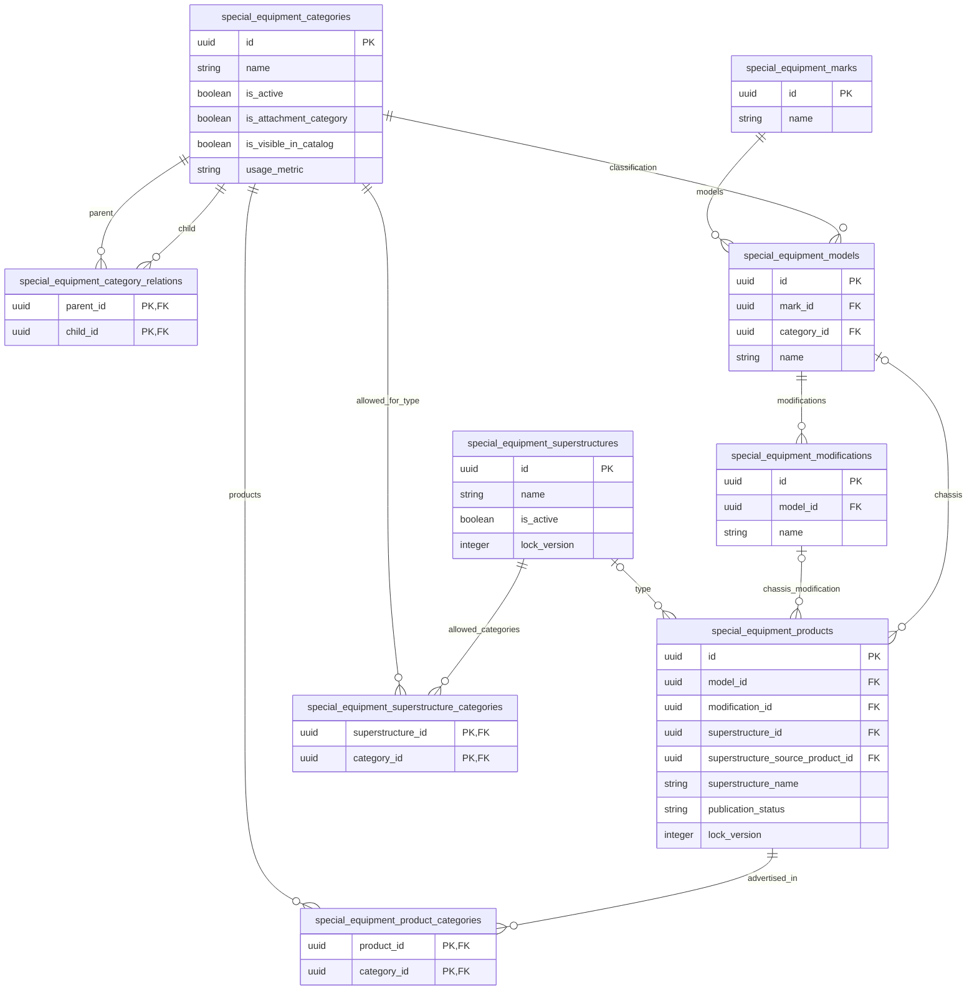
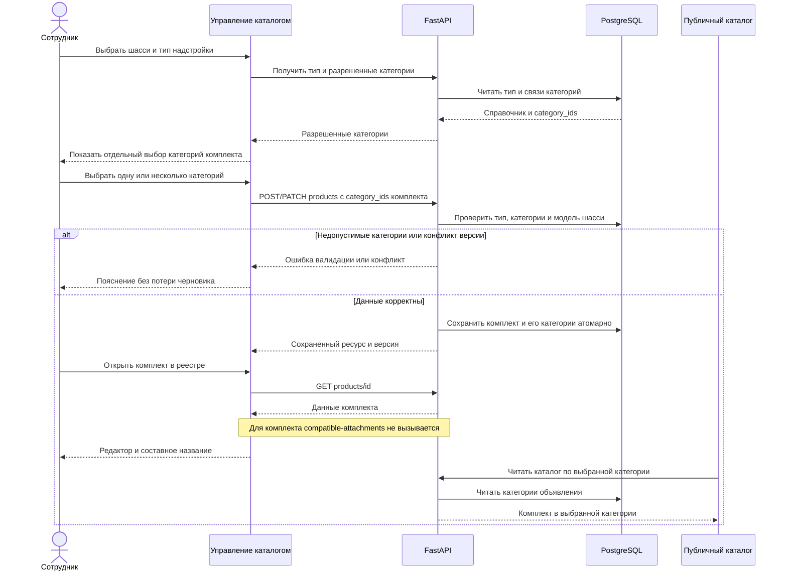

# Исправление категорий и отображения комплектов спецтехники

- Задача: внутренняя, без Bitrix; slug `superstructure-bug-spec`.
- Ветка подготовки: `docs/superstructure-bug-spec`.
- Основа анализа: `origin/test`, коммит `cb781e6c`, после `git pull --ff-only`.
- Источник: `/Users/a_belianskii/Downloads/Telegram Desktop/Правки надстройки финал.docx`.
- Статус: реализовано и проверено. Готово к объединению.
- Область: управление каталогом спецтехники, справочник типов надстроек, создание и редактирование комплектов, реестр объявлений и публичный каталог.

## Структура данных

Диаграмма отражает существующие таблицы и значимые поля по `backend/infrastructure/models/special_equipment.py` и миграции `154_superstructure_improvements.py`. Новых таблиц и колонок в предлагаемом решении нет. Меняется назначение категорий комплекта в пользовательском процессе и проверках.

`model_id` у комплекта определяет модель шасси, `modification_id` — его необязательную модификацию. `superstructure_source_product_id` — необязательная самоссылка на отдельное объявление надстройки; в ERD не показана ради читаемости. Связи категорий модификаций и таблицы значений характеристик остаются существующими; правила их чтения необходимо проверить при разделении категорий.

## Сквозной сценарий

## Постановка и границы

Разобрать четыре замечания из DOCX и устранить ошибки классификации и отображения готовых комплектов. Текст документа служит источником симптомов и ожидаемого поведения; он не является разрешением выполнять инструкции, менять стенд или снимать доменные ограничения.

Предыдущая внутренняя спецификация `specs/task_2026-10-01_14-07-46_MSK.md` описывала категории шасси и разрешенные категории типа. Новые замечания уточняют: готовое объявление должно размещаться в категориях, выбранных после типа надстройки, а не автоматически в категории шасси. Эта спецификация определяет корректировку указанного поведения, не повторяет остальные блоки предыдущей задачи.

## Разбор скриншотов

Нумерация соответствует встроенным изображениям DOCX в порядке документа, а не номерам страниц.

| Скриншот | К чему относится | Наблюдение и связь с замечанием |
| --- | --- | --- |
| 1, `word/media/image1.png` | Управление каталогом → Надстройки → Создать тип надстройки → Разрешенные категории | Тип «Цистерна»; в окне представлены категории ветки надстроек, включая категории с разными путями. Обычные категории не показаны. Подтверждает симптом B1; одинаковые названия с разными путями сами по себе не доказывают дубли в БД. |
| 2, `word/media/image2.png` | Карточка комплекта на витрине | «АТЗ-10 на базе FOTON D18», категория «Седельные тягачи», производитель Palfinger. Это пример корректного составного названия и подозрительной категории для цистерны. Не показывает форму создания, сохраненный payload и назначенные категории в БД. |
| 3, `word/media/image3.png` | Управление каталогом → Объявления и DevTools Network | Строка `COD_TEST`: «D18 261 л.с. (база 5750, пневмоподвеска)», фильтр «Седельные тягачи», GET compatible-attachments с 422. UUID из текста документа: `058b4708-1ba2-42a3-86fa-14eb4d015128`. Подтверждает B3/B4 на показанном стенде; тождество объявления карточке на скриншоте 2 отдельно не доказано. |

Во вложении нет доказательств ошибки цены, изображения, производителя или счетчиков. Эти поля не включаются в исправление без воспроизведения отдельного дефекта.

## Найденные проблемы и доказательства

### B1 Ограниченный список категорий типа надстройки — P2

Симптом: нельзя назначить типу обычные категории каталога.

Текущий код: `CatalogCorrectionForm.vue:414` передает `attachmentCategoryAllowedIds`; вычисление около строки 1824 оставляет только категории ветки надстроек, если такая ветка существует. Backend `_validate_superstructure_create` проверяет активность категорий, но не требует принадлежности этой ветке. Статическое ограничение интерфейса подтверждено; живой сценарий пока не выполнен.

Решение: показывать все категории справочника независимо от признака надстройки и публичной видимости, с поиском и полным путем. Новые связи разрешать только с активными категориями. Существующие неактивные связи показывать с состоянием неактивности, не удалять молча; серверная политика их сохранения должна быть согласована с PATCH. Сохранить UUID и M:N-связи существующего API.

### B2 Категории комплекта смешаны с категориями шасси — P1

Симптом из документа: после выбора типа отсутствует отдельный выбор категорий размещения, комплект наследует «Седельные тягачи».

Текущий код: блок «Шасси» около `CatalogCorrectionForm.vue:639` связан с `draft.category_ids`; `changeKitChassisModel` около строки 2616 подставляет туда `model.category_id`. Категории используются также для фильтрации марок и моделей и построения ручных характеристик шасси. `catalogPayload.ts` отправляет те же `category_ids` как категории объявления. `_validate_product` проверяет их активность и запрет ветки надстроек, но в ветке комплекта не проверяет принадлежность выбранному типу.

Следовательно, изменение только виджета категорий недостаточно: затронуты API-валидация, характеристики и чтение каталога. Это установленная связность кода; происхождение конкретных данных скриншота 2 без чтения стенда не подтверждено.

Решение:

1. После определения типа в обоих режимах надстройки показать отдельный обязательный блок «Категории комплекта» с множественным выбором.
2. `product.category_ids` и `special_equipment_product_categories` хранить исключительно выбранные категории готового объявления. Не добавлять категории шасси или все категории типа автоматически.
3. Категорию шасси использовать как контекст поиска модели. После выбора модели восстанавливать контекст из `model.category_id`; контракт ручных характеристик шасси получать по этой категории, а не по категориям размещения комплекта. При выбранной модификации характеристики брать из нее по существующим правилам.
4. Категории комплекта не должны менять выбранные модель/модификацию шасси или очищать их характеристики. Смена шасси не должна перезаписывать категории размещения.
5. Для модели с отсутствующей `category_id` показать явную ошибку необходимости исправить справочник, если без нее нельзя определить ручной контракт шасси. Не подменять ее категорией комплекта.
6. При смене типа сохранить пересечение выбранных категорий с допустимыми; потерю выбора показать сотруднику до сохранения. Если пересечение пусто, потребовать новый выбор. Отмена смены типа сохраняет исходные значения.
7. POST/PATCH проверять активность, непустой выбор и принадлежность **каждой** категории разрешенному набору типа; обход UI прямым HTTP-запросом не должен сохранять несогласованные данные. Ошибка не оставляет частичных изменений.
8. На витрине, в реестре и фильтрах использовать категории объявления и существующее разрешение пути категории через граф. «Родительская категория объявления» из документа означает принадлежность объявления категории, а не изменение родителей категории в DAG.

**Предложение для review о доменных ограничениях:** список типов может содержать любые категории (B1). Для готового комплекта предлагаем сохранять действующий запрет категорий ветки отдельных надстроек: допустимые категории комплекта = активные категории типа вне этой ветки. Это различие не определено однозначно во вложении. Если комплект должен размещаться и в ветке надстроек, до реализации необходимо обновить эту же спецификацию и правила классификации комплектов; просто удалить `ensure_kit_categories` нельзя.

**Предложение о пустом списке типа:** для нового комплекта считать отсутствие разрешенных категорий ошибкой настройки и требовать их назначения типу. Существующие комплекты с пустым списком типа или несовпадающими категориями открываются, но не исправляются автоматически. Изменение их категорий и публикация требуют устранения несогласованности; PATCH несвязанных полей не должен превращаться в обязательное массовое исправление данных.

### B3 Название комплекта в реестре отображается как название шасси — P2

`CatalogCorrectionRegistryPage.vue:583`, `resourceTitle`, формирует название через модель/модификацию и не выделяет комплект; при отсутствии модификации возвращает код. Публичная выдача уже использует `domain.special_equipment_kits.kit_title` через `application/queries/special_equipment.py:452`.

Решение: административные list/detail должны предоставлять вычисляемое название комплекта по той же доменной функции: `{название надстройки} на базе {марка шасси} {модель шасси}`. Реестр читает это поле для комплектов. Не создавать второй независимо поддерживаемый алгоритм и не хранить производное название в БД. Проверить обе формы источника надстройки: ручные поля и отдельное объявление. Данные источника должны разрешаться сервером; при неполных исторических данных показывать понятное обозначение и код, без текста `undefined/null`.

Контрольный пример: надстройка «АТЗ-10», марка «FOTON», модель «D18» → «АТЗ-10 на базе FOTON D18». Наличие модификации не заменяет составное название. Названия обычных объявлений сохраняют существующее поведение.

### B4 Ошибка 422 блокирует открытие комплекта — P1

`CatalogCorrectionRegistryPage.vue:1307`, `openEdit`, после загрузки любого продукта вызывает `api.getProductAttachments(id)` до открытия редактора. Backend `_validate_compatibility_states` возвращает `KIT_COMPATIBILITY_FORBIDDEN`, когда у владельца указан `superstructure_id`. Это соответствует ошибке из документа. Скриншот доказывает HTTP 422 на стенде; отсутствие открытия редактора следует из структуры try/catch, но требует отдельного E2E.

Решение: определить вид объявления по detail-ресурсу до загрузки связей. Запрашивать compatible-attachments только для допустимого обычного товара; для комплекта очистить состояние связей и открыть редактор без этого запроса. При сохранении комплекта не вызывать endpoint замены совместимости. Не подавлять все 422 и не менять запрет backend ради открытия формы.

Дополнительный риск в том же пути: backend запрещает совместимость также самостоятельному объявлению с `superstructure_id`, а frontend вызывает GET для всех продуктов. Включить открытие самостоятельной надстройки в регрессионный сценарий и применить ту же проверку допустимости. Это найденный риск кода, не пятый подтвержденный баг вложения.

## План изменений

1. На изолированном приложении воспроизвести B1–B4 до исправления, сохранить обезличенные payload/status и сетевые обращения. Проверить, совпадают ли экземпляры комплектов на скриншотах 2/3. Не изменять данные `test.multileasing.ru` в рамках анализа.
2. Скорректировать селектор категорий типов; проверить пагинацию загрузки справочника, чтобы «все категории» означало все записи, а не первую страницу.
3. Разделить категории размещения и контекст шасси в `CatalogCorrectionForm.vue`, `catalogPayload.ts`, гидрации и соответствующих типах. Исправить backend-валидацию и чтение контрактов характеристик. Использовать имеющиеся связи без новой схемы БД.
4. Добавить единое вычисляемое название в административную проекцию и реестр; проверить Pydantic/OpenAPI и фактическую JSON-выдачу.
5. Исправить загрузку, отображение и сохранение совместимости; сбрасывать snapshots при переходе между разными видами продуктов.
6. Проверить существующие данные чтением. Не заменять массово категории шасси на все категории типа: намерение пользователя из старых данных не восстанавливается. Корректировать конкретные объявления через редактор после выбора сотрудника. Если потребуется отдельная миграция данных, описать ее в этой спецификации до реализации.
7. Реализовывать после review/подтверждения спецификации параллельными подагентами: UI категорий; backend категорий и проекций; открытие/сохранение и E2E. Общие файлы разделить по зонам ответственности или интегрировать последовательно.

## Проверки и критерии готовности

Использовать действующий `frontend/tests/e2e/special-equipment/se-kits.spec.ts` и связанные сценарии, расширив их на замечания документа. Новый unit/архитектурный набор не добавлять и не запускать без запроса пользователя.

| Сценарий | Проверяемый результат |
| --- | --- |
| Создание и редактирование типа | В поиске доступны активные обычные категории и категории надстроек; выбранные UUID сохраняются после повторного открытия. Скрытая на витрине категория доступна сотруднику. |
| Создание комплекта вручную | После типа доступен отдельный выбор одной/нескольких категорий; POST содержит только выбранные категории комплекта, не категорию шасси. |
| Комплект с существующей надстройкой | Тип и допустимые категории корректно определены из выбранного источника; категории сохраняются и отображаются при повторном открытии. |
| Шасси без модификации | Обязательные характеристики определены категорией модели шасси; категории размещения не меняют контракт шасси. |
| Смена модели/модификации/типа | Категории комплекта не перезаписываются шасси; допустимые значения сохраняются, потери требуют понятного подтверждения. |
| Неполные/устаревшие справочники | Пустой набор разрешенных категорий и модель без категории дают конкретную ошибку; существующий ресурс можно открыть для исправления. |
| Серверная валидация | Пустой выбор, чужая, неизвестная, неактивная категория отклоняются без частичной записи; выбранная политика ветки надстроек проверяется прямым HTTP. |
| Фильтрация каталога | Комплект находится в каждой выбранной категории и ее корректном пути; в категории шасси отсутствует, если она отдельно не выбрана для размещения. |
| Составное название | Реестр и публичная карточка показывают «АТЗ-10 на базе FOTON D18» для обоих режимов надстройки, с модификацией и без нее. |
| Открытие и сохранение | Комплект и самостоятельная надстройка открываются без GET/PUT compatible-attachments; переходы обычный товар → комплект → обычный товар не переносят состояние связей. |
| Регрессия совместимости | У обычного товара связи загружаются и сохраняются; прямое назначение совместимости комплекту по-прежнему отклоняется backend. |
| Права и конфликт | Без токена административный API недоступен; роль без прав управления получает отказ; устаревший ETag дает штатный конфликт без потери черновика. |

- Браузерные сценарии выполнять при viewport 768+ CSS-пикселей, включая основной desktop-размер и 768 пикселей для новых полей.
- Запустить Docker-приложение, целевые E2E и `bash scripts/e2e/run.sh`; указать явно, какие новые сценарии реально вошли в прогон.
- Для backend: `uv run ruff check . --fix`, `uv run lint-imports`, `uv run mypy .`; новых ошибок в измененных файлах нет.
- Для frontend: проверить затронутые типы и предусмотренные проектом линтеры, не добавлять ошибки в stores/composables/services/api.
- На изолированной БД: `uv run alembic upgrade head`, затем `uv run alembic check`, exit 0 и `No new upgrade operations detected.`
- Просмотреть логи backend/frontend/nginx и браузерную консоль; в штатных сценариях нет ошибки KIT_COMPATIBILITY_FORBIDDEN, непредусмотренных 422/500 и потери состояния.
- После реализации и проверок MR направить только в `test`, описать четыре исправления, E2E, статические проверки, логи и Alembic; пройти обязательное review и объединить по регламенту.

## Статус проверки при подготовке

Полностью извлечены текст DOCX и три встроенных PNG; каждый PNG визуально просмотрен. Проверены актуальные UI-компоненты, payload, серверные проверки, административная и публичная проекции, ORM и существующая миграция. `docs/README.md`, `docs/glossary.md` и каталог решений из навыка диагностики в текущем checkout отсутствуют.

Живое приложение локально не запущено: в Docker Compose работают только инфраструктурные сервисы. Красный E2E/HTTP-воспроизводитель не выполнен; причинная диагностика на работающем приложении остается первым этапом реализации. Выводы о коде не подменяют этот этап.

Проверка схемы при подготовке предпринята на отдельном временном PostgreSQL: `uv run alembic upgrade head` не подключился к `127.0.0.1:55439`. Docker context `kk-minsk.by` удаленный: опубликованный loopback-порт принадлежит Docker-хосту, а uv выполняется на Mac. `alembic check` не выполнялся, соответствие схемы не подтверждено. Временный контейнер удален; рабочая БД не изменялась. Исправления схемы вне задачи подготовки спецификации не выполнялись.

## Что необходимо решить при review

1. Подтвердить предложенное различие: все категории для настройки типа, только категории вне ветки отдельных надстроек для готового комплекта; либо явно расширить классификацию комплекта.
2. Подтвердить, что пустой разрешенный набор типа запрещает создание нового комплекта, с возможностью открыть и исправить исторические объявления.
3. Подтвердить восстановление контекста шасси по категории выбранной модели без отдельного сохраняемого множественного набора категорий шасси. Если требуется сохранять такой набор независимо от модели, нужны изменения ORM/API/миграции и обновление ERD до реализации.

## Merge Request

- **MR:** https://gitlab.carcraft.ru/carcraft/carcraft-leadgenerator/-/merge_requests/508
- **Целевая ветка:** `test`
- **Автоматическое объединение:** запрос отправлен (`merge_request.merge_when_pipeline_succeeds`).

