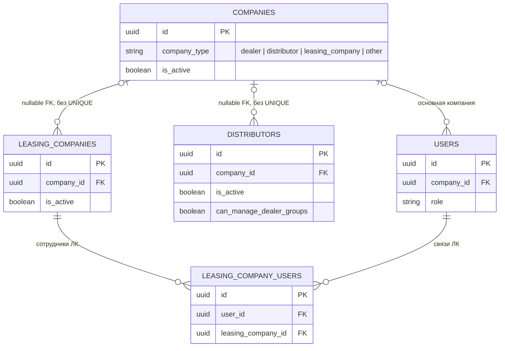
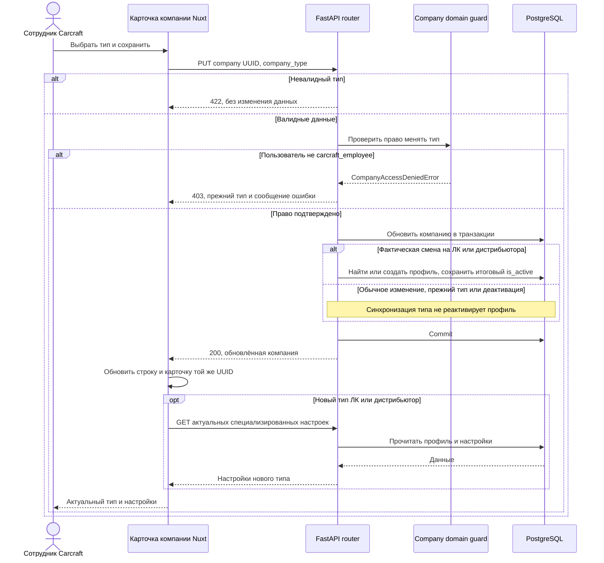

# Изменение типа компании в панели администратора

**Дата создания:** 2026-10-02 13:55:44 MSK
**Ветка:** `feature/company-role-edit`
**Статус:** реализована и проверена
**Связь с Bitrix:** внутренняя задача, без задачи Bitrix

Диаграмма отражает физическую структуру БД. `leasing_companies.company_id` и `distributors.company_id` допускают NULL и не имеют UNIQUE: база допускает несколько профилей компании. Логический инвариант этого сценария — повторно использовать существующий профиль, не создавать дубль. Новая миграция и изменение схемы БД не планируются.

## 1. Постановка

### Текущее поведение

- В рабочем разделе `/workspace/companies` пользователь с ролью `carcraft_employee` открывает список компаний и карточку выбранной компании.
- В карточке отображается тип компании, но элемента для его изменения нет.
- API `PUT /api/v1/companies/{company_id}` уже принимает поле `company_type`, однако сервер не выделяет это поле как доступное исключительно сотруднику Carcraft.
- При создании компании типа `leasing_company` или `distributor` backend создаёт связанную служебную запись соответственно в `leasing_companies` или `distributors`.
- При простом обновлении `companies.company_type` такие связанные записи не создаются и не синхронизируются. Поэтому смена типа без доработки backend может сформировать неполный профиль компании.

### Требуемое поведение

Пользователь с ролью `carcraft_employee` может в карточке компании изменить её **тип компании** на один из вариантов:

- `dealer` — «Дилер»;
- `distributor` — «Дистрибьютор»;
- `leasing_company` — «Лизинговая компания».

После подтверждения изменения:

- сервер проверяет, что операцию выполняет `carcraft_employee`;
- сервер сохраняет новый тип компании атомарно вместе с необходимой служебной записью профиля;
- для нового типа `leasing_company` создаётся или реактивируется запись `leasing_companies`;
- для нового типа `distributor` создаётся или реактивируется запись `distributors`;
- при возврате к ранее использованному типу используется прежняя служебная запись, а не создаётся дубль;
- карточка и строка списка сразу показывают новый тип;
- данные компании, связи и исторические записи не удаляются.

Изменяется именно `companies.company_type`. Роль пользователей (`users.role`), их привязки к компаниям и состав сотрудников этой задачей не меняются.

### Бизнес-цель

Сотрудники Carcraft смогут исправлять ошибочно указанный тип компании и переводить компанию в нужный рабочий контур без ручных операций в БД и без создания дубликата компании.

## 2. Границы задачи

### Входит в задачу

- Выбор типа компании в административной карточке компании.
- Сохранение выбранного типа через существующий API обновления компании.
- Серверная авторизация: менять `company_type` вправе только `carcraft_employee`.
- Безопасная синхронизация служебных профилей `leasing_companies` и `distributors` при смене типа.
- Отображение актуального типа после успешного сохранения.
- Сквозная проверка сценария в панели администратора и проверка запрета для пользователя без роли `carcraft_employee`.

### Не входит в задачу

- Изменение роли пользователей в `users.role`.
- Автоматическое назначение или отзыв сотрудников компании.
- Создание, удаление или перенос заявок, автомобилей, складов, групп дилеров, брендов, подрядчиков и связей дистрибьютора с дилерами.
- Удаление компаний или каких-либо связанных исторических данных.
- Новая схема БД, миграция или изменение публичного API-контракта для неадминистративных клиентов.

## 3. Выбранный подход и риски

### Выбранный подход

Использовать существующий канонический маршрут `PUT /api/v1/companies/{company_id}`:

1. Фронтенд добавляет в административную карточку отдельный блок «Тип компании» с селектом из трёх разрешённых типов и кнопкой сохранения.
2. API-клиент отправляет только `{ company_type: <новый тип> }` после явного действия администратора.
3. Команда обновления компании получает текущий тип до изменения, проверяет роль инициатора и в одной транзакции синхронизирует требуемый служебный профиль.
4. Служебные записи не удаляются. Для типа, который становится активным, профиль создаётся при отсутствии либо реактивируется при наличии.
5. При изменении типа frontend сбрасывает локальные данные специализированных блоков карточки и повторно получает их только для нового актуального типа. Это исключает сохранение брендов дистрибьютора или подрядчиков ЛК в уже неподходящем контексте.

### Альтернативы, которые не выбираются

- **Менять только поле в интерфейсе.** Нельзя: backend останется доступен для неадминистраторов, а у новой ЛК/дистрибьютора может не появиться обязательный профиль.
- **Удалять старые профили `leasing_companies` или `distributors`.** Нельзя: на них могут ссылаться сотрудники ЛК, заявки и другие исторические данные; удаление приведёт к потере связей или ошибкам внешних ключей.
- **Создать новый специальный API-маршрут только для смены типа.** Не требуется: действующий маршрут уже возвращает обновлённую компанию и подходит для частичного обновления. Усиление авторизации и доменная синхронизация выполняются в существующем сценарии.

### Риски и защита

- **Несоответствие типа компании и роли сотрудника.** Пользователь с ролью `leasing_company`, привязанный к компании, после перевода компании в другой тип сохранит свою роль и связи. Эта задача их намеренно не меняет, чтобы не отозвать доступ или не потерять историю автоматически.
- **Повторная смена типа.** Повторное переключение не должно порождать несколько профилей ЛК/дистрибьютора для одной компании; backend обязан находить и повторно использовать существующую запись.
- **Зависимые административные блоки.** Блок марок показывается только для дистрибьютора, блок подрядчиков — только для ЛК. После смены типа они должны обновляться по актуальному типу, без отправки старых данных.
- **Несанкционированная смена типа.** Backend обязан возвращать `403` для владельца компании и любого другого пользователя без `carcraft_employee`, даже если тот вручную сформирует HTTP-запрос.

## 4. Планируемые изменения

### Backend

- `backend/presentation/schemas/companies.py`
  - Уточнить контракт обновления типа: API принимает только существующие значения перечисления типов; административный сценарий использует `dealer`, `distributor`, `leasing_company`.

- `backend/application/commands/companies/update_company.py`
  - Выделить обработку изменения `company_type`.
  - Разрешить обновление `company_type` только актору с ролью `carcraft_employee`.
  - Сопоставить исходный и целевой типы до сохранения.
  - В рамках одной транзакции запросить создание или реактивацию требуемого профиля ЛК/дистрибьютора.
  - Сохранить единое DWH-событие изменения компании после успешного обновления.

- `backend/infrastructure/repositories/company_repository.py`
  - Добавить операции поиска, создания и реактивации профиля `leasing_companies` по `company_id`.
  - Добавить операции поиска, создания и реактивации профиля `distributors` по `company_id`.
  - Гарантировать, что операции возвращают словари или простые значения и не вызывают `commit()`.

- `backend/presentation/routers/companies.py`
  - Сохранить канонический путь без завершающего слеша и существующий формат ответа.
  - Передавать в команду только явно присланные поля; `commit()` остаётся в роутере после успешного выполнения команды.

### Frontend

- `frontend/features/company/components/CompanyDetailModal.vue`
  - Добавить в административную карточку отдельный блок «Изменить тип компании».
  - Показать селект с вариантами «Дилер», «Дистрибьютор», «Лизинговая компания» и кнопку «Сохранить тип».
  - Заблокировать кнопку во время отправки, не выполнять запрос при отсутствии изменения и показать понятную ошибку при неуспехе.

- `frontend/features/admin/companies/manage/components/CompaniesListPanel.vue`
  - Хранить выбранный тип и состояние сохранения.
  - По подтверждению вызвать существующий `updateCompany` только с полем `company_type`.
  - После успеха заменить тип компании в локальном списке и выбранной карточке, сбросить/перезагрузить специализированные данные для нового типа и показать уведомление.

- `frontend/features/admin/companies/manage/api/companiesAdminApi.ts`
  - Использовать существующий `UpdateCompanyPayload`; при необходимости уточнить типизацию поля `company_type` без изменения URL или добавления нового API-клиента.

### Проверка и документация

- Добавить или обновить целевой Playwright E2E-сценарий административного управления компаниями в `frontend/tests/e2e/`.
- Изменений ORM-моделей и миграций не планируется, но после реализации обязательно выполнить `uv run alembic upgrade head` и `uv run alembic check` на изолированной проверочной БД.

## 5. Критерии готовности

1. В `/workspace/companies` пользователь с `carcraft_employee` открывает карточку компании и видит текущий тип, селект и кнопку сохранения типа.
2. Администратор может изменить тип компании с «Дилер» на «Дистрибьютор», сохранить его и после обновления списка/карточки увидеть «Дистрибьютор».
3. При переводе компании в «Дистрибьютор» backend создаёт отсутствующий профиль `distributors` либо реактивирует существующий; повторное сохранение не создаёт дубль.
4. При переводе компании в «Лизинговая компания» backend создаёт отсутствующий профиль `leasing_companies` либо реактивирует существующий; повторное сохранение не создаёт дубль.
5. При повторном переводе в ранее использованный тип связанные данные не удаляются, исторические записи остаются доступны, а существующий служебный профиль используется повторно.
6. Пользователь без роли `carcraft_employee`, включая владельца компании, получает `403` при попытке передать `company_type` в `PUT /api/v1/companies/{company_id}`.
7. Изменение типа компании не меняет `users.role`, `users.company_id` и записи `leasing_company_users` автоматически.
8. После смены типа в карточке показываются только подходящие специализированные блоки: марки — для дистрибьютора, подрядчики — для ЛК.
9. При ошибке сохранения тип в строке списка и в карточке не меняется, пользователю отображается понятное сообщение.
10. На работающем приложении выполнен E2E-сценарий для `carcraft_employee`: изменение типа, визуальное обновление, проверка сетевого ответа и отсутствие ошибок в консоли.
11. Выполнены обязательные проверки: `ruff`, `lint-imports`, `mypy`, целевой E2E в Docker, просмотр логов, `alembic upgrade head`, `alembic check` с результатом `No new upgrade operations detected.`

## 6. Вопросы

### Блокирующий вопрос

Нужно подтвердить, что при смене типа компании **не меняем автоматически роли и доступы уже привязанных пользователей**. Это безопасный вариант без потери данных: он меняет тип юридического лица и его административный профиль, но не может неожиданно лишить сотрудников доступа. Если требуется также автоматически переводить пользователей (например, из `leasing_company` в `dealer`), это отдельное изменение прав доступа и должно быть описано отдельными правилами.

### Неблокирующие вопросы

- Тип `other` сохраняется в API для обратной совместимости и существующих данных, но в новом интерфейсе изменения типа не предлагается: по внутренней задаче доступны только дилер, дистрибьютор и лизинговая компания.
- Изменение типа не переносит и не пересоздаёт настройки брендов, подрядчиков или связей с дилерами. Их дальнейшее редактирование выполняется в обычных административных блоках после выбора типа.

## 7. Обнаруженное пересечение с параллельной работой

Перед началом реализации 2026-10-02 выполнена повторная сверка с `origin/test` и удалёнными ветками.

- В `origin/test` появились только изменения документации, которые не реализуют эту задачу.
- Обнаружена отдельная удалённая ветка `origin/feature/22294-company-admin-edit` с уже реализованным пересекающимся сценарием: изменение типа компании из административной карточки, серверный переход типа, создание/реактивация профилей и целевой E2E.
- Эта ветка содержит 31 изменённый файл и помимо требуемого сценария включает историю изменений компании, миграцию и другие доработки, не входящие в текущую узкую спецификацию.
- Из-за пересечения не следует копировать или параллельно реализовывать тот же сценарий в `feature/company-role-edit`: это создаст дублирование, конфликт и не позволит сохранить минимальный дифф.
- GitLab CLI не смог подтвердить статус MR удалённой ветки из-за сетевой ошибки `error connecting to socks5h`; наличие или состояние MR по техническим средствам этой среды не подтверждено.

Для продолжения требуется выбрать один из вариантов:

1. Использовать существующую ветку `feature/22294-company-admin-edit` как источник работы и отдельно оценить/отделить её дополнительные изменения.
2. Продолжить с отдельной минимальной реализацией только согласованной спецификации в `feature/company-role-edit`, не заимствуя широкие изменения из параллельной ветки.

## 8. Решение по пересечению и подтверждение реализации

Пользователь подтвердил отдельную минимальную реализацию. Ветка `feature/company-role-edit` синхронизирована с актуальным `origin/test` (`c1b465d8`) до начала изменений. Реализуется только объём этой спецификации: смена типа компании в административной карточке и безопасная серверная синхронизация служебных профилей. История изменений компании и иные доработки из пересекающейся ветки `feature/22294-company-admin-edit` не переносятся.

Под «ролью компании» в сообщении пользователя понимается именно `companies.company_type`. Роли сотрудников внутри компании (`administrator`, `manager`, `employee`) уже изменяются в таблице «Сотрудники компании» и не входят в данный объём.

## 9. Исправление по review (2026-10-02)

Пользователь подтвердил: «Чини, проверяй, заливай». Продолжаем существующую опубликованную ветку и эту спецификацию.

- Синхронизировать профиль только при фактическом переходе типа; обычное обновление и деактивация не должны реактивировать профиль.
- Проверку права изменять тип делегировать доменной сущности компании.
- После перевода в ЛК обновлять список профилей, исключая устаревший кэш.
- Удалить добавленные интеграционные тесты; заменить проверкой реального HTTP и desktop Playwright E2E.
- Проверить переходы типов, повторное использование профилей, деактивацию, обычное обновление и 403 для владельца.
- Запустить ruff, lint-imports, mypy, Docker E2E, проверить логи и Alembic upgrade/check.
- После зелёных проверок опубликовать исправление и MR только в test; пройти review и проверки MR.

### Уточнения после проверки

- Физическая кратность ERD проверена по ORM; добавлена последовательность сквозного процесса.
- При закрытии и повторном открытии той же карточки незавершённое сохранение остаётся заблокированным; после ответа карточка обновляется. Ответ другой компании не подменяет открытую карточку.
- В исходном frontend на `/workspace/companies` и незатронутом `/workspace/employees` подтверждено сообщение `Hydration completed but contains mismatches.` при первичной SSR-гидрации. Проверка консоли учитывает только этот точный существовавший baseline (не более одного сообщения на загрузку/перезагрузку); новые сообщения и необработанные ошибки запрещены. Исправление общего SSR не входит в согласованный объём этой задачи.

## 10. Результаты проверки (2026-10-02)

- Исходный backend воспроизвёл регрессию через реальный HTTP: обычное обновление включало отключённый профиль ЛК (`is_active=True`, ожидался False).
- Исходный frontend воспроизвёл регрессию в Chromium: после прогрева списка профилей перевод дилера в ЛК не запрашивал актуальный список профилей.
- Исправленный HTTP-сценарий прошёл: обычное обновление и прежний тип сохраняют отключённые профили; деактивация, совмещённый переход/деактивация и переход неактивной компании сохраняют False; переходы повторно используют UUID профилей; права 401/403 и валидация 422 проверены.
- `COMPANY_ROLE_BUILD_SSH=<локальный SSH ключ> bash scripts/e2e/company-role-edit/run.sh`: успешно. Docker-сборки backend/frontend, работающий nginx, HTTP, 4 desktop Playwright E2E (7.7 с), проверка сохранённых данных и Alembic выполнены. Отдельный финальный browser-прогон также прошёл (4 сценария, 7.3 с).
- Браузер: прогретый список ЛК и новый профиль, все переходы типов, повторное использование профилей, сохранение после reload, повторное открытие той же карточки во время запроса, другая открытая карточка, реальный 403 и отображение ошибки без изменения типа.
- `uv run ruff check . --fix`: успешно.
- `uv run lint-imports --no-cache`: 9 contracts kept, 0 broken.
- `uv run mypy . --cache-dir=/tmp/mypy-cache`: две исходные ошибки в незатронутых `domain/notification_policy.py:327` и `tests/test_document_request_history.py:517`. Сравнение с исходной веткой подтвердило baseline; в изменённых файлах ошибок нет. Ошибка удалённого интеграционного теста устранена вместе с файлом.
- `uv run alembic upgrade head` и `uv run alembic check`: успешно; `No new upgrade operations detected.` Схема БД и миграции не изменены.
- Логи backend/frontend/nginx просмотрены: неожиданных ошибок приложения и HTTP 5xx нет. В браузере только ранее подтверждённый SSR baseline при initial/reload; иных ошибок в проверенном сценарии нет.
- Финальный независимый review: Standards — 0 замечаний, Spec — 0 замечаний.
- Ветка синхронизирована с `origin/test` (`9682730c`), опубликованная история не переписывалась. Цель MR — только `test`.
