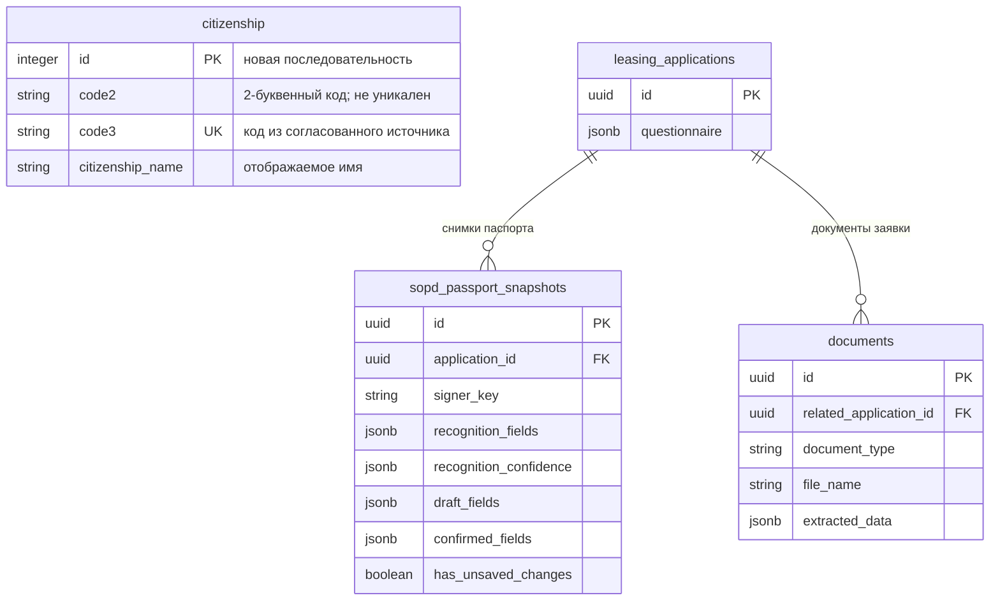

# Задача Bitrix #22408 — паспортные данные СОПД и справочник гражданств

**Bitrix:** https://carcraftpro.bitrix24.ru/workgroups/group/124/tasks/task/view/22408/

**Ветка:** `feature/22408` (создана от актуальной `test`).

**Статус:** добавлены доработки интерфейса; ожидается явное одобрение реализации.



*`citizenship` — планируемая таблица. Остальные таблицы уже существуют. Связь паспорта с гражданством хранится строкой `citizenship_name` в JSON анкеты и снимке паспорта, без внешнего ключа: это сохраняет текущий контракт API сохранения паспорта.*

```mermaid
sequenceDiagram
    participant U as Пользователь
    participant FE as Nuxt
    participant API as FastAPI
    participant OCR as DBrain
    participant DB as PostgreSQL/Object Storage

    U->>FE: Открывает СОПД
    FE->>API: GET снимка паспорта и метаданных файлов
    API->>DB: Читает снимок и документы заявки
    DB-->>API: Данные паспорта и сохранённые файлы
    API-->>FE: Состояние формы, имена файлов

    alt Загрузка двух страниц
        U->>FE: Выбирает страницы 2–3 и прописку
        FE->>API: POST passport-recognition
        API->>OCR: Распознаёт страницы
        OCR-->>API: Поля и confidence
        API->>DB: Сохраняет snapshot и документы заявки
        API-->>FE: Распознанные поля, имена файлов
    else Ручной ввод
        U->>FE: «Ввести паспорт вручную»
        FE->>API: Создаёт/обновляет ручной snapshot
        API-->>FE: Пустая форма без OCR confidence
    end

    FE->>API: GET /api/v1/citizenship
    API->>DB: Читает страны по citizenship_name
    DB-->>API: Справочник
    API-->>FE: id, code2, code3, citizenship_name

    U->>FE: Сохраняет паспорт
    FE->>API: PATCH passport
    API->>DB: Сравнивает OCR-ФИО с директором заявки
    alt ФИО не совпадает и это OCR-сценарий
        API-->>FE: 422, предупреждение; сохранение/продолжение заблокированы
    else Ручной ввод или ФИО совпало
        API->>DB: Подтверждает snapshot и проецирует citizenship_name
        API-->>FE: Подтверждённый паспорт
    end
```

## 1. Текущее поведение

- В СОПД паспортная форма показывается всегда, даже до загрузки файлов.
- Гражданство — свободный текст; фронтенд и сервер определяют РФ по набору текстовых вариантов.
- Распознавание запускается только после выбора обеих страниц. Бэкенд уже прикладывает их к документам заявки, но ответ `GET .../passport` не возвращает метаданные этих файлов. После F5 фронтенд очищает `File`-объекты, поэтому визуально предлагает загрузить документы повторно.
- Кнопка ручного ввода в интерфейсе отсутствует, хотя сервер технически умеет создать пустой паспортный snapshot через существующие маршруты сохранения.
- Для российского паспорта поле «Кем выдан» ограничено 100 символами и на фронтенде, и на сервере.
- Проверка несовпадения ФИО сейчас строится только для бенефициара и сравнивает OCR-ФИО со значением этого кандидата; серверная проверка дополнительно ограничивает существенное расхождение фамилии с OCR.

## 2. Цель и бизнес-результат

Пользователь заполняет СОПД без повторной загрузки уже прикреплённых паспортных страниц, выбирает гражданство из контролируемого справочника, может ввести паспорт без OCR и не может подтвердить OCR-паспорт при несовпадении ФИО с директором компании-заявителя.

Это снижает ошибки в данных СОПД и повторную работу пользователя после обновления страницы.

## 3. Решение

### 3.1. Справочник `citizenship`

1. Создать таблицу `citizenship` с целочисленным первичным ключом `id`, `code2`, `code3`, `citizenship_name`.
2. Создать миграцию, которая добавляет таблицу и заполняет её фиксированным набором из постановки Bitrix #22408 в указанном русскоязычном алфавитном порядке.
3. Добавить авторизованный `GET /api/v1/citizenship` с ответом-списком объектов:
   - `id: integer`;
   - `code2: string`;
   - `code3: string`;
   - `citizenship_name: string`.
5. `code3` — уникальное значение; `code2` намеренно может повторяться (шесть статусов гражданства Соединённого Королевства). Исправленные значения: Германия — `DE;DEU;Германия`, Фолклендские Острова — `FK;FLK;Фолклендские Острова`.
6. Сервер возвращает записи с сортировкой по `citizenship_name` в русской локали/детерминированном порядке, совпадающем с согласованным набором. Записи не редактируются через этот API.
7. Фронтенд один раз загружает справочник при открытии блока и даёт селектор с поиском по `citizenship_name`. При фокусе на пустом поле показывается весь алфавитный список. При каждом вводе или удалении символа список немедленно фильтруется без нового запроса: поиск регистронезависимый и префиксный — остаются только страны, чьё название начинается с введённой строки. Например, `Р` оставляет страны на «Р», а `Ру` — «Руанда» и «Румыния». При пустом запросе снова показывается полный алфавитный список. В поле паспорта и существующий API сохранения отправляется только выбранный `citizenship_name`.
8. Логика «российский/иностранный паспорт» сопоставляет выбранное название Российской Федерации с единым серверным правилом, а не с произвольным ручным текстом.
9. Названия справочника являются русскоязычными значениями из согласованного перечня; в частности, значение `TR;TUR` отображается как «Турция», а не «Türkiye».

### 3.2. Паспортные файлы и состояние после F5

1. Распознанные страницы продолжают сохраняться как документы заявки с типами `sopd_passport_main` и `sopd_passport_registration`.
2. В ответ snapshot добавляются безопасные метаданные сохранённых файлов текущего `signer_key`: тип страницы и имя файла. Сам бинарный файл в форму не передаётся.
3. При инициализации фронтенд показывает, что каждая сохранённая страница уже загружена, с её именем справа от её кнопки и возможностью заменить файл. Сразу после первого выбора локального файла соответствующая кнопка называется «Заменить» и имя остаётся видимым; после F5 то же состояние восстанавливается из серверных метаданных. Если на сервере есть хотя бы одна сохранённая паспортная страница этого подписанта, кнопка «Ввести паспорт вручную» после F5 не показывается. Повторная загрузка не требуется.
4. При замене одной страницы правило распознавания обеих страниц сохраняется: в браузере пользователь повторно выбирает вторую страницу либо интерфейс явно объясняет, что для нового распознавания нужны обе страницы. Существующий подтверждённый снимок не должен молча уничтожаться при незавершённой замене.

### 3.3. OCR, ручной ввод и видимость формы

1. До получения двух паспортных страниц блок «Проверка паспортных данных» скрыт.
2. После успешной загрузки и распознавания страниц блок показывается с OCR-полями и процентами уверенности для неотредактированных значений.
3. В блоке загрузки заменить заголовок на точный текст: «Загрузите скан паспорта - мы автоматически распознаем и сохраним данные. Или введите данные вручную».
4. Кнопки «Паспорт: страницы 2-3» и «Паспорт: страница с пропиской» расположить вертикально, одна под другой. Справа от каждой кнопки, на той же строке, отображать имя уже выбранного или ранее сохранённого файла соответствующей страницы.
5. Кнопку «Ввести паспорт вручную» расположить ниже двух строк загрузки, с небольшим дополнительным отступом сверху. Если пользователь выбрал хотя бы один реальный файл для OCR **или сервер вернул хотя бы одну сохранённую страницу**, кнопка скрывается; простое открытие системного окна выбора файла и его отмена не скрывают кнопку. Если пользователь сначала открыл ручной ввод, кнопки загрузки остаются доступными.
6. По кнопке открыть пустую форму, убрать проценты confidence и не применять сравнение вручную введённых полей с OCR-полями. Ручной ввод проходит обычную обязательную и форматную проверку полей, затем подтверждается существующим API сохранения паспорта.
7. Ручной режим сохраняется в snapshot и после F5 открывается как заполненная ручная форма, только пока нет сохранённых паспортных файлов.
8. Если после ручного ввода пользователь выбрал обе страницы для автоматического распознавания, **до отправки в DBrain** фронтенд немедленно очищает все паспортные поля, кроме выбранного `citizenship_name`; затем отправляет изображения. После успешного OCR эти поля заполняются распознанными значениями. Режим становится OCR: применяются confidence и проверка распознанного ФИО с эталонным ФИО роли. Ранее вручную введённые ФИО не участвуют ни в какой проверке значимого изменения и не могут сами вызвать предупреждение.

### 3.4. Сверка ФИО и поле «Кем выдан»

1. В момент успешной загрузки OCR-страниц сервер фиксирует в snapshot эталонное ФИО кандидата из анкеты **до** загрузки паспорта. Для `director_applicant` это поле «Директор компании-заявителя»; для учредителя, представителя и бенефициара — их собственное поле ФИО из соответствующей записи анкеты. Редактируемые поля паспортной формы не используются как эталон.
2. Для сценария распознавания сервер сравнивает нормализованные OCR `фамилия + имя + отчество` только с зафиксированным эталонным ФИО этого кандидата.
3. При несовпадении API возвращает понятную ошибку валидации, фронтенд показывает предупреждение, а подтверждение паспорта, отправка SMS и работа с СОПД остаются недоступными.
4. При ручном вводе проценты confidence не показываются и не выполняется проверка «значимого изменения» относительно OCR. При сохранении сервер нормализует только вручную введённые `фамилия + имя + отчество` и сверяет их с зафиксированным эталонным ФИО подписанта. Для директора это «Директор компании-заявителя», для остальных ролей — собственное ФИО записи анкеты. При несовпадении сохранение и дальнейшее прохождение СОПД блокируются тем же предупреждением.
5. Увеличить ограничение «Кем выдан» до 250 символов в компоненте, серверной валидации и актуальном контракте хранения анкеты/снимка.

## 4. План реализации

1. Проверить, к какому подписанту применяется формулировка о директоре и зафиксировать решение из раздела «Блокирующие вопросы».
2. Добавить ORM-модель, репозиторий чтения, миграцию и начальные записи `citizenship`; зарегистрировать API-роутер и Pydantic-схемы.
3. Расширить snapshot-ответ метаданными паспортных документов конкретного подписанта; не раскрывать документы другого подписанта или другой заявки.
4. Изменить серверную валидацию: лимит 250; отдельный флаг/состояние ручного snapshot; сверка OCR-ФИО с директором только для OCR-сценария.
5. Обновить Nuxt-компоненты `QuestionnaireSopd.vue`, `SignerCard.vue`, `PassportRecognitionForm.vue`: видимость формы, кнопка ручного режима, селектор гражданства с поиском, восстановление имён файлов, точный текст и предупреждение.
6. Добавить целевой Playwright E2E для OCR и ручного сценариев; подготовить изолированные фикстуры без внешнего вызова DBrain.
7. Собрать Docker-окружение, выполнить E2E, статические проверки backend, `alembic upgrade head` и `alembic check`; просмотреть логи.
8. Сделать коммит(ы) и отправить ветку `feature/22408` в удалённый репозиторий. Merge request не создавать по прямому требованию.

## 5. Изменяемые области

- `backend/infrastructure/models/` и `backend/alembic/versions/` — таблица и миграция справочника.
- `backend/infrastructure/repositories/` — чтение справочника и метаданных паспортных документов.
- `backend/application/commands/sopd_passport_snapshots.py`, `backend/application/services/sopd_passport.py` — режимы паспорта и серверная валидация.
- `backend/presentation/routers/`, `backend/presentation/schemas/` — `GET /api/v1/citizenship`, контракт snapshot.
- `frontend/features/checkout/components/QuestionnaireSopd.vue` — загрузка API, состояние ручного/OCR режима и восстановление файлов.
- `frontend/features/checkout/components/SignerCard.vue` — кнопки, текст, статусы файлов.
- `frontend/features/checkout/components/PassportRecognitionForm.vue` — селектор гражданства, лимит 250, режим без confidence.
- `frontend/tests/e2e/` и `scripts/e2e/` — целевой сквозной сценарий.

## 6. Критерии готовности

1. `GET /api/v1/citizenship` авторизованно возвращает весь согласованный набор, включая `DE;DEU;Германия` и `FK;FLK;Фолклендские Острова`, с полями `id` (integer), `code2`, `code3`, `citizenship_name`, отсортированный по названию; `code3` уникален, а повторяющийся `code2` допустим.
2. В форме СОПД нельзя ввести гражданство произвольным текстом: доступен поиск и выбор по названию; при каждом изменении строки фильтра список регистронезависимо сокращается по вхождению в `citizenship_name` (например, `Ру` → «Руанда», «Румыния»), а при сохранении в паспорт уходит только `citizenship_name`.
3. «Кем выдан» принимает и сохраняет значение длиной 250 символов; 251-й символ не принимается/получает ошибку.
4. После загрузки и F5 обе страницы отображаются как сохранённые, а сетевые данные подтверждают их наличие среди документов этой заявки.
5. До загрузки двух страниц паспортная форма не видна; после распознавания видна. Кнопка ручного ввода открывает форму и не показывает проценты OCR.
6. Для OCR-паспорта, ФИО которого не совпадает с директором по согласованному правилу, показано предупреждение и действия продолжения недоступны. Для ручного ввода такая сверка не выполняется.
7. Файлы, паспортные данные и права доступа одного подписанта не доступны через API другому подписанту или в другой заявке.
8. Успешно пройдены целевой E2E на desktop viewport не менее 768 px, Docker-подъём затронутых сервисов, `ruff check . --fix`, `lint-imports`, `mypy .`, `alembic upgrade head`, `alembic check` с выводом `No new upgrade operations detected.`; просмотрены логи backend/frontend.

## 7. Решённые вопросы и остаточный риск

1. **Коды справочника.** В перечне было два нарушения контракта трёхбуквенного `code3`: `DE;D;Германия` и `FK;FLK1;Фолклендские Острова`. Согласованные исправления: `DE;DEU;Германия` и `FK;FLK;Фолклендские Острова`.
2. **Уникальность.** Уникальным является `code3`; `code2` может повторяться, в том числе для шести статусов гражданства Соединённого Королевства.
3. **Сверка ФИО.** Для любого подписанта OCR-ФИО сверяется с его ФИО из анкеты, зафиксированным до загрузки страниц. Для директора это поле «Директор компании-заявителя». Форма паспорта не является источником сравнения.
4. **Показ формы после загрузки.** Сценарий требует обе страницы, так как текущий OCR API принимает их одной операцией; после ручного запуска форма доступна и без файлов.
5. **Алфавитный порядок.** PostgreSQL-сортировка зависит от collation окружения. Реализация должна проверить текущую локаль и обеспечить детерминированный порядок ответа, совпадающий с согласованным набором.
