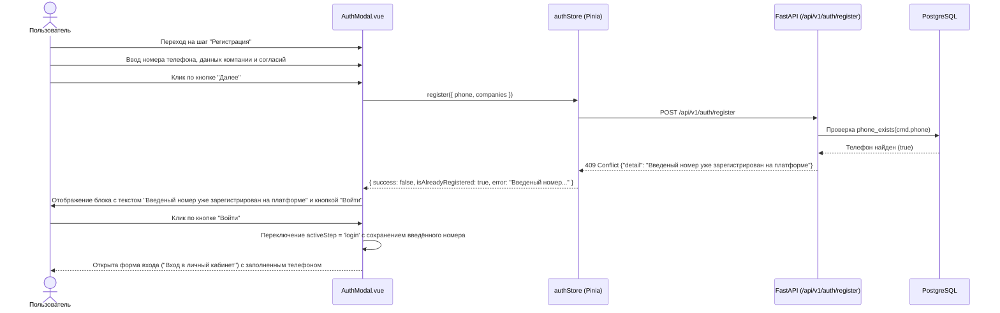

# Спецификация: отображение уведомления и кнопки входа при вводе уже зарегистрированного номера телефона

- **Bitrix:** https://carcraftpro.bitrix24.ru/company/personal/user/336/tasks/task/view/22360/
- **Дата и время создания:** 2026-10-02 14:25:41 MSK (UTC+3)
- **Идентификатор задачи:** `22360`
- **Тип:** `feature`
- **Рабочая ветка:** `feature/22360`
- **Целевая ветка MR:** `test`
- **Затрагиваемая область:** модальное окно авторизации/регистрации (`AuthModal.vue`), хранилище аутентификации (`auth.ts`), API бэкенда (`UserAlreadyExistsError`), только desktop web от 768px.

---

## Диаграмма взаимодействия



---

## 1. Постановка задачи и контекст

В текущей реализации при регистрации нового пользователя (`AuthModal.vue` в режиме `register`), если указан номер телефона, который уже существует в системе:
- Бэкенд возвращает статус `409 Conflict` с ошибкой `UserAlreadyExistsError`.
- Клиент видит стандартную ошибку в красном блоке без прямого действия перехода ко входу. Чтобы войти, пользователю приходится вручную искать текстовую ссылку «Уже есть аккаунт? Войти» внизу формы и повторно вводить номер телефона.

**Требование задачи:**
1. Если клиент указывает номер, который уже есть в системе, выводить уведомление:
   `"Введеный номер уже зарегистрирован на платформе"`
2. Ниже текста уведомления отображать кнопку `"Войти"`.
3. При клике на кнопку `"Войти"` открывать форму входа (`activeStep = 'login'`) в том же окне (модальном окне `AuthModal`), сохраняя уже введённый клиентом номер телефона.

---

## 2. Требования к реализации

### 2.1. Frontend (`frontend/features/auth/components/AuthModal.vue`)
1. **Реактивное состояние конфликта:**
   - Добавить флаг `isPhoneAlreadyRegistered = ref(false)`.
   - Сбрасывать флаг при изменении номера телефона пользователем (ввод цифр, backspace), при открытии модального окна и смене шагов.
2. **Отображение уведомления и кнопки:**
   - При получении ответа о том, что номер уже зарегистрирован (флаг `isAlreadyRegistered` или статус 409 / текст об уже существующем номере), выставлять `isPhoneAlreadyRegistered.value = true`.
   - Отображать блок уведомления:
     - Текст: `"Введеный номер уже зарегистрирован на платформе"`.
     - Кнопка ниже текста: `"Войти"`.
     - Кнопка стилизована в соответствии с дизайн-системой витрины (`btn-primary` с компактными отступами).
3. **Обработка клика по кнопке «Войти» (`openLoginForRegisteredPhone`):**
   - Сохранять введённый номер телефона (`form.phone`).
   - Сбрасывать ошибки и вспомогательные состояния (`error.value = ''`, `isPhoneAlreadyRegistered.value = false`).
   - Переключать `activeStep.value = 'login'`.
   - Восстанавливать сохранённый номер в поле ввода телефона формы логина.
   - Пользователь сразу видит экран входа с заголовком «Вход в личный кабинет», заполненным номером и кнопкой «Получить код».

### 2.2. Frontend-хранилище (`frontend/features/auth/store/auth.ts`)
1. В методе `register`:
   - При перехвате ошибки запроса проверять статус `409`, код `USER_ALREADY_EXISTS_ERROR` или наличие в тексте ошибки фразы `уже зарегистрирован` / `уже существует`.
   - Возвращать объект вида:
     ```ts
     {
       success: false,
       isAlreadyRegistered: true,
       error: detail || 'Введеный номер уже зарегистрирован на платформе'
     }
     ```

### 2.3. Backend (`backend/domain/errors.py`)
1. Актуализировать текст по умолчанию для доменного исключения `UserAlreadyExistsError`:
   `"Введеный номер уже зарегистрирован на платформе"`.
2. Эндпоинт `POST /api/v1/auth/register` при вызове `_http(UserAlreadyExistsError())` возвращает статус `409` с телом `{"detail": "Введеный номер уже зарегистрирован на платформе"}`.
3. Обновить тест `test_register_existing_phone_conflict` в `backend/tests/test_auth.py` для проверки возвращаемого сообщения.

---

## 3. План изменений по файлам

1. **`backend/domain/errors.py`**:
   - Изменить сообщение `UserAlreadyExistsError` на `"Введеный номер уже зарегистрирован на платформе"`.
2. **`backend/tests/test_auth.py`**:
   - В тесте `test_register_existing_phone_conflict` проверить статус `409` и тело ответа `{"detail": "Введеный номер уже зарегистрирован на платформе"}`.
3. **`frontend/features/auth/store/auth.ts`**:
   - В `register()` извлекать `detail` из ответа об ошибке и проставлять `isAlreadyRegistered: true`.
4. **`frontend/features/auth/components/AuthModal.vue`**:
   - Добавить состояние `isPhoneAlreadyRegistered`.
   - Добавить шаблон уведомления с текстом и кнопкой «Войти».
   - Добавить метод `openLoginForRegisteredPhone`.
   - Обеспечить сброс состояния при редактировании телефона и переключении шагов.
5. **E2E-тест Playwright**:
   - Создать/добавить сценарий проверки модального окна: переход на шаг регистрации, ввод существующего телефона, отправка, появление уведомления и кнопки «Войти», клик по «Войти», проверка открытия формы логина с сохранённым телефоном.

---

## 4. Критерии готовности (Definition of Done)

- [ ] При попытке регистрации с уже зарегистрированным номером телефона выводится уведомление: `"Введеный номер уже зарегистрирован на платформе"`.
- [ ] Ниже уведомления отображается кнопка `"Войти"`.
- [ ] При клике на `"Войти"` открывается форма логина в том же модальном окне (`activeStep = 'login'`).
- [ ] Введённый ранее номер телефона сохраняется в поле ввода формы входа.
- [ ] Все статические проверки бэкенда (`ruff`, `lint-imports`, `mypy`) пройдены без ошибок.
- [ ] Проверка отсутствия расхождений схемы БД (`alembic upgrade head`, `alembic check`) завершается успешно (`No new upgrade operations detected`).
- [ ] E2E-сценарий подтверждает поведение в браузере.
- [ ] Изменения закоммичены в ветку `feature/22360` и отправлены через GitLab Push Options с созданием MR в ветку `test`.
