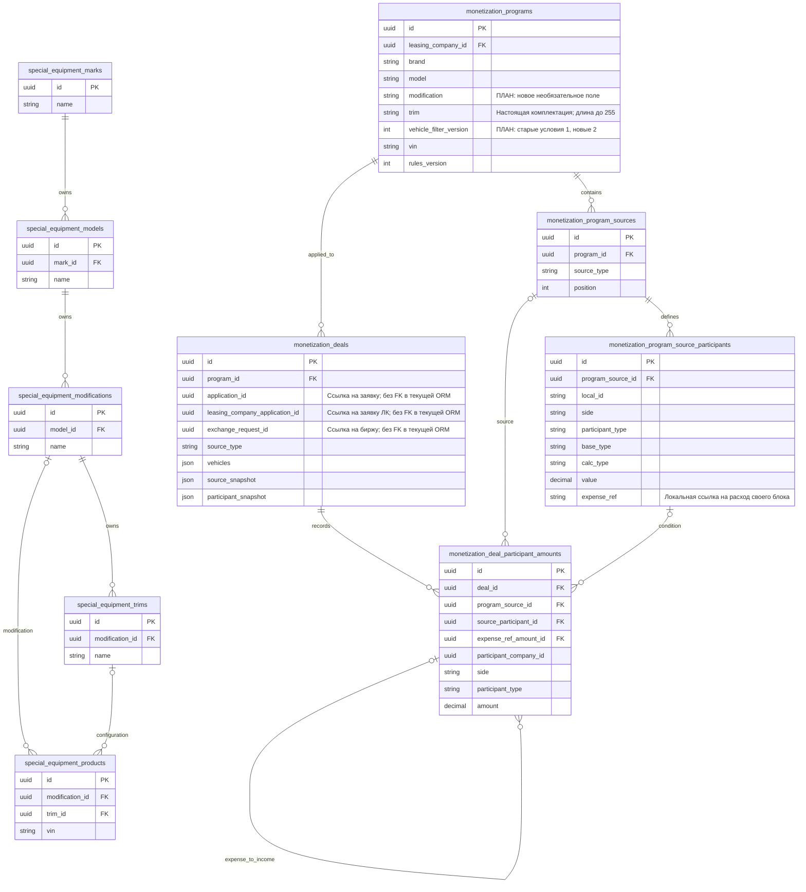
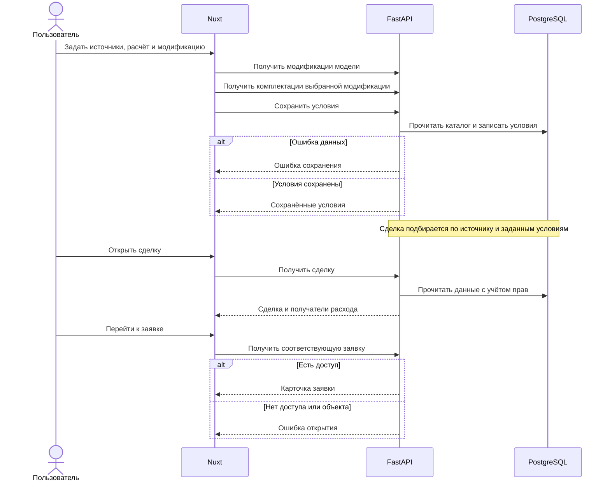

# Задача 22406 — условия монетизации и карточка сделки

- Bitrix: https://carcraftpro.bitrix24.ru/workgroups/group/124/tasks/task/view/22406/
- Создано: 2026-10-05 10:48:05 MSK (UTC+3).
- Ветка: `bugfix/22406`; база исправления комплектаций — `origin/test` (`86e29996`). Первоначальные пять пунктов опубликованы в MR !521 и объединены в `test`.
- Статус: исходные пять пунктов реализованы в MR !521. Исправление дублирования «Модификации» и «Комплектации» по последующей команде пользователя реализовано; E2E, Alembic и независимое review завершены.
- MR — только по отдельной команде пользователя.

ERD: структура по ORM и изменения этой задачи. Поле modification добавлено миграцией 166 в MR !521; vehicle_filter_version и длина trim до 255 добавлены миграцией 167. Показаны затронутые связи.

## Постановка и требования

Выполнить пять пунктов из скриншота задачи:

1. В «Источники заявки и расчёт» при выборе базы «Стоимость имущества по договору» сделать ₽ недоступным — аналогично недоступному % при выборе «Без базы (фиксированная сумма)».
2. Вернуть кнопку «Добавить источник», чтобы в одном условии монетизации можно было задать несколько источников и расчёт для каждого: например, заявку с платформы и заявку с биржи.
3. В карточке сделки рядом с «Источник заявки» добавить ссылку «Перейти к заявке». Нажатие открывает заявку, которой соответствует сделка. По уточнению пользователя для заявки биржи переход реализуется только для её участников (дилер, ЛК, дистрибьютор); администратору доступ к бирже не добавляется. Для обычной заявки используются существующие права, включая администратора.
4. Показывать дилеру, кому он платит: чей доход связан с его расходом.
5. При создании условий монетизации перед «Комплектация» добавить поле «Модификация» из `special_equipment_modifications.name`. Связать его с условиями по сделке аналогично остальным полям.

## Границы пользовательского флоу

Пять пунктов скриншота — полный согласуемый объём изменений пользовательского поведения. Технические правки API, схем, БД и расчётов допускаются в объёме, необходимом для этих пунктов.

Новые шаги, ограничения выбора, правила удаления, подтверждения и изменения других полей не добавляются автоматически. Если потребуется поведение сверх скриншота, отдельно описать конкретное изменение, зачем оно нужно и что произойдёт без него; до согласования не включать его в реализацию.

## Уточнение пользователя: настоящие комплектации

Пользователь показал пример SOLLERS → SF1, получил пояснение о дублировании и дал команду «Поправь». Это подтверждает изменение ранее сохранённого поведения комплектации.

- «Модификация» читает `special_equipment_modifications.name` выбранной модели.
- «Комплектация» читает `special_equipment_trims.name` только выбранной модификации. До выбора модификации поле недоступно; смена или очистка модификации сбрасывает комплектацию и устаревший список.
- «Все комплектации» не ограничивает комплектацию внутри выбранной модификации. Выбранная комплектация сохраняется отдельным фильтром.
- В подборе условий для биржи и обычных заявок используется настоящая комплектация товара или позиции заказа; название модификации не подставляется вместо неё.
- Миграция 167 вводит внутреннюю версию фильтров автомобиля: существующие условия сохраняют версию 1 и прежнее сравнение `trim`, новые получают версию 2 с настоящей комплектацией. Версия не редактируется пользователем. Снимки и суммы существующих сделок не переписываются; приоритет условий не меняется. Это необходимо, чтобы ранее сохранённые названия модификаций не стали внезапно сравниваться с названиями комплектаций. Отдельные шаги пользователя не добавляются.
- Длина фильтра `trim` увеличивается до 255, как у названия комплектации в каталоге. В заявке на модель без конкретного товара комплектация отсутствует; она не подменяется модификацией.
- MR !521 уже объединён в `test`; исправление публикуется следующим MR этой задачи в `test`, в той же ветке и спецификации.

## Планируемые изменения

- Исправить переключатель типа расчёта и восстановить добавление источников в форме. Убрать существующее ограничение одного источника в UI и backend, мешающее пункту 2.
- Добавить переход к соответствующей заявке и отображение получателей расхода дилера в карточке сделки; использовать существующие связи и проверки доступа.
- Провести поле модификации через справочник, форму, сохранение и подбор условий; добавить необходимые технические изменения и миграцию. Исправить справочник комплектаций и его зависимость от выбранной модификации, а также значения комплектации в источниках расчёта.
- Устранить выявленную E2E ошибку SQL в чтении обычной заявки дистрибьютором: задать явный FROM существующего подзапроса брендов, не меняя ни одного условия доступа. Это необходимо для работы запрошенной ссылки; дополнительного пользовательского флоу нет.
- После согласования выполнять независимые части фоновыми подагентами согласно AGENTS: форма и источники; модификация; карточка сделки. Интегрировать и проверить результат.

## Критерии готовности

Каждый пункт требований проверен на работающем приложении:

1. Для базы «Стоимость имущества по договору» нельзя выбрать ₽.
2. Одно условие с платформой и биржей сохраняется; каждая сделка получает расчёт своего источника.
3. Ссылка из сделки открывает соответствующую заявку.
4. Дилер видит получателей своего расхода.
5. Модификация выбирается, сохраняется и учитывается при подборе условий сделки. Комплектации принадлежат выбранной модификации; два разных оснащения одной модификации получают свои условия, а «Все комплектации» допускает оба.

## Обязательные проверки по AGENTS

- E2E в браузере при viewport ≥768 и реальные HTTP-запросы для затронутого API: основной путь, права доступа и значимые ошибки. При необходимости обновить целевые E2E.
- Для изменений backend: `uv run ruff check . --fix`, `uv run lint-imports`, `uv run mypy .`.
- Проверить типизацию затронутого фронтенда, сборку и запуск приложения в Docker, выполнить `bash scripts/e2e/run.sh` и недостающие целевые сценарии; просмотреть логи.
- На изолированной БД: `uv run alembic upgrade head`, `uv run alembic check`; результат — код 0 и `No new upgrade operations detected.`.
- Проверить итоговый diff. MR создавать только по отдельной команде пользователя, в `test`.

## Проверки первоначальной реализации (до MR !521)

Реализованы пять пунктов. Ветка `bugfix/22406` синхронизирована с `origin/test` (`ec46ed03`). Администратору не добавляется просмотр биржевых заявок; MR создаётся только по отдельной команде пользователя.

Проверки на изолированном Docker-стенде `http://localhost:18268`:

- Исходные ошибки воспроизведены до правок: доступен ₽, нет кнопки добавления источника, нет ссылки и получателей расходов; справочник модификаций возвращал 422.
- 3 новых E2E формы и 10 существующих сценариев расчётов/сохранения: 13/13 пройдены.
- Модификация: 2 браузерных сценария при 768/1440, HTTP-проверки справочника и прав, конфликт условий, реальные принятия ставок, подтверждения обычных заявок со склада и по заказу модели. Проверены расчёты платформы 7% и биржи 5% одного условия, разные модификации, общий фильтр, прежняя комплектация.
- Ruff: успешно. Import-linter: 9 контрактов соблюдены.
- `mypy .`: 3 прежние ошибки в `domain/notification_policy.py:327`, `application/commands/sopd_passport_snapshots.py:122`, `tests/test_document_request_history.py:517`. Совпадают с неизменённой базой `ec46ed03`; новых ошибок нет.
- `vue-tsc --noEmit -p .nuxt/tsconfig.json`: 2 прежние ошибки в `features/admin/companies/manage/components/CompaniesListPanel.vue:338,347`. Совпадают с неизменённой базой; новых ошибок нет.
- Миграции применены до 163. `alembic check`: код 0, `No new upgrade operations detected.`.
- Итоговый запуск `bash scripts/e2e/run.sh --suite 22406 --skip-build` после Docker-сборки: код 0, 16/16 новых браузерных E2E (21,6 с). Вместе с 10 прежними сценариями — 26 успешных сценариев. HTTP-проверки также успешны: чужой доступ 404, без аутентификации 401, изменение получателей недоступно; запросы обычной заявки дистрибьютора вернули 200. Логи приложения просмотрены: ошибка повторного JOIN устранена; внешняя бухгалтерская интеграция в изолированном стенде отключена. Независимое review завершено без замечаний. Статические проверки доступны через `bash scripts/e2e/22406/checks.sh` (mypy сообщает перечисленные исходные ошибки).

## Standards первоначальной реализации

Нарушений документированных правил и actionable smells не обнаружено. Проверен WIP-diff относительно `ec46ed038aeb026ae06b2962a28fb4488b7e90be`, включая новые миграцию, E2E, скрипты и спецификацию.

## Spec первоначальной реализации

Замечаний нет. Все пять требований реализованы в согласованных границах; переход к бирже доступен только её участникам, прежнее поведение комплектации сохранено. Дополнительных изменений пользовательского флоу нет.

Результат review: Standards — 0 замечаний, критичных проблем нет; Spec — 0 замечаний, критичных проблем нет. Проверки проведены двумя независимыми подагентами в режиме чтения. MR не создавался.

## Проверка перед MR !521 после синхронизации

По команде пользователя «Создай мр» ветка синхронизирована с актуальной `test` (`80410628`). В общем E2E-скрипте сохранены оба набора: `warehouse-form` и `22406`. Миграция модификации перенесена с занятого номера 163 на 166, родитель — 165. Пользовательский флоу задачи не изменён.

На новой изолированной БД применена полная цепочка миграций до 166. Предыдущее окружение и его БД сохранены отдельно. Фикстуры подтверждения обычной заявки приведены к актуальному контракту: дата, VIN позиции, договор и акт.

- Docker-сборка backend/frontend: успешно.
- `bash scripts/e2e/run.sh --suite 22406 --skip-build`: код 0; HTTP-проверки и 16/16 браузерных сценариев успешны (24,9 с).
- Alembic: `No new upgrade operations detected.`, код 0.
- Ruff и 9 архитектурных контрактов: успешно. Mypy: те же 3 исходные ошибки, новых нет.
- Vue-tsc: те же 2 исходные ошибки в `CompaniesListPanel.vue`, смещённые изменениями test; новых нет.
- Состав изменения и разрешение конфликта проверены; `git diff --check` успешен. MR направляется только в `test`.

## Проверки уточнения по комплектациям

Исправление выполнено после прямой команды пользователя. База — `86e29996`, Docker-стенд — `http://localhost:18268`.

- До исправления воспроизведено через реальный HTTP и браузер: список комплектаций содержал названия модификаций вместо двух настоящих комплектаций.
- Docker-сборка и запуск backend/frontend/nginx успешны.
- HTTP: 6 биржевых и 4 обычные сделки; отдельные условия для двух комплектаций одной модификации, все комплектации, источник платформы 7% и биржи 5%, складская позиция, товар без allocation, заказ модели без комплектации; проверены права 401/403, неверный UUID 422, несовместимые родители и пустой список.
- Перед миграцией 167 создано 10 прежних условий и 5 реальных сделок. После миграции проверены прежние случаи с пустыми, одинаковыми и разными modification/trim, произвольным trim и надстройкой; критерии и версия 1 сохранились, все снимки и суммы пяти сделок идентичны. Новые условия получают версию 2; она не принимается от клиента. Повторяемая проверка подключена в runner, отсутствие исходного снимка явно отмечается как пропуск проверки миграции.
- Название комплектации длиной 255 сохраняется, 256 отклоняется с 422; дубликаты проверены с 409.
- Браузер: 17/17 сценариев (38,9 с), включая 768/1440, сбросы, пустой список, сохранение/повторное открытие и защиту от позднего реального HTTP-ответа.
- Ruff: успешно. Import-linter: 9 контрактов соблюдены. Mypy: только 3 исходные ошибки в неизменённых `domain/notification_policy.py:327`, `application/commands/sopd_passport_snapshots.py:122`, `tests/test_document_request_history.py:517`.
- Vue-tsc: только существующая ошибка несовместимости nullable phone в неизменённом `CompaniesListPanel.vue:332`; затронутые файлы без ошибок.
- Alembic upgrade до 167 и check: код 0, `No new upgrade operations detected.`.
- Логи просмотрены: ошибок затронутых API нет; ожидаемые 503 приходят от отключённой внешней бухгалтерской интеграции изолированного стенда.
- Итоговый `bash scripts/e2e/run.sh --suite 22406 --skip-build`: код 0, все HTTP-проверки и 17/17 браузерных сценариев успешны (36,7 с), Alembic без операций. Финальные логи просмотрены: только ожидаемые ошибки отключённой бухгалтерской интеграции. `git diff --check` успешен.

## Standards исправления комплектаций

Нарушений документированных правил и actionable smells не обнаружено. Проверен полный WIP-diff относительно `86e29996c6d5bc90eec2f2319cd75e27d71a6d3f`, включая миграцию 167 и проверку перехода прежних условий. Standards — 0 замечаний, критичных проблем нет.

## Spec исправления комплектаций

Замечаний нет. Новое поведение комплектации соответствует уточнению пользователя; старые условия и снимки сохраняются, остальные пункты исходного скриншота и ограничение доступа администратора к бирже не изменены. Spec — 0 замечаний, критичных проблем нет.

Две оси проверены независимыми подагентами только чтением замороженного diff. Результаты: Standards — 0; Spec — 0.
