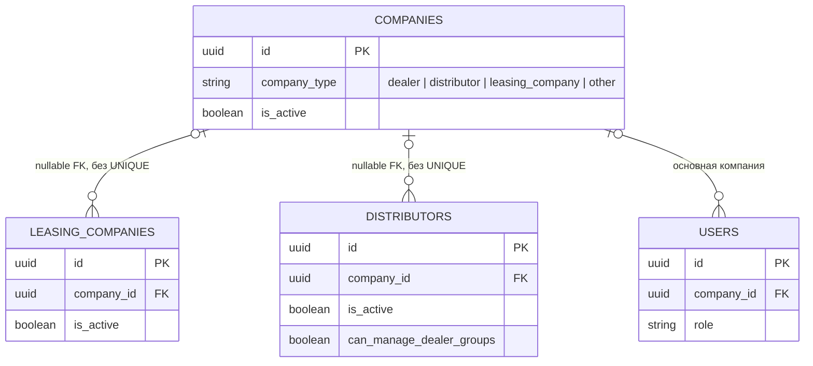
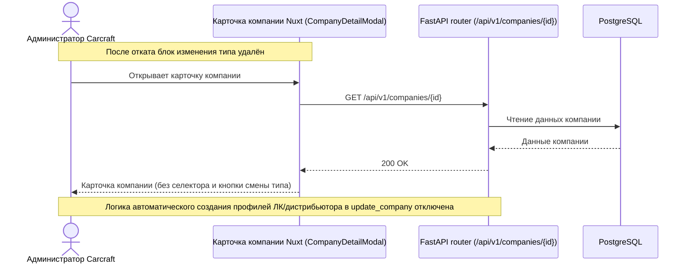

# Откат изменений MR !512 (изменение типа компании в карточке администратора)

**Дата создания:** 2026-10-05 11:09:10 MSK
**Ветка:** `chore/revert-mr-512`
**Статус:** реализована и проверена
**Связь с Bitrix:** внутренняя задача, без задачи Bitrix
**Целевая ветка MR:** `test`
**Созданный Merge Request:** [!515](https://gitlab.carcraft.ru/carcraft/carcraft-leadgenerator/-/merge_requests/515)
**Откатываемый Merge Request:** [!512 (feat(admin): изменение типа компании в карточке администратора)](https://gitlab.carcraft.ru/carcraft/carcraft-leadgenerator/-/merge_requests/512)
**Коммит слияния в `test`:** `a0cdc3d0cda207c6a067c3fda6c9b69dc2382a3c`





---

## 1. Постановка задачи и контекст

В рамках MR !512 (`feature/company-role-edit`, коммит слияния `a0cdc3d0cda207c6a067c3fda6c9b69dc2382a3c`) была внедрена функциональность изменения типа компании (`company_type`) через карточку компании в панели администратора (`/workspace/companies`), а также доменная проверка прав и автоматическая синхронизация профилей лизинговой компании и дистрибьютора при смене типа.

Пользователь запросил откат изменений MR !512:
`https://gitlab.carcraft.ru/carcraft/carcraft-leadgenerator/-/merge_requests/512 нужно откатить изменение`

Задача заключается в аккуратном и полном откате изменений, внесённых MR !512, с возвращением кодовой базы к состоянию до слияния этой ветки (`9682730c`), сохранении исторической спецификации задачи MR !512 в репозитории и проведении обязательных проверок качества.

---

## 2. Требования

### 2.1. Backend
1. **`backend/application/commands/companies/update_company.py`**:
   - Убрать проверку `ensure_company_type_change_allowed` для `company_type` в `handle_update_company`.
   - Убрать вызов `repo.ensure_company_type_profile`.
   - Вернуть оригинальный docstring модуля.
2. **`backend/domain/entities/company.py`**:
   - Удалить метод `ensure_company_type_change_allowed`.
3. **`backend/infrastructure/repositories/company_repository.py`**:
   - Удалить функцию `ensure_company_type_profile`.

### 2.2. Frontend
1. **`frontend/features/admin/companies/manage/api/companiesAdminApi.ts`**:
   - Вернуть тип возвращаемого значения `updateCompany` к исходному состоянию до MR !512.
2. **`frontend/features/admin/companies/manage/components/CompaniesListPanel.vue`**:
   - Удалить методы `saveSelectedCompanyType`, `resetCompanyTypeState`, переменные `companyTypeSaving`, `companyTypeError`, `pendingCompanyTypeSaves`.
   - Вернуть обработку `loadContractorLinks` и `findLeasingCompanyRef` к исходному состоянию.
3. **`frontend/features/company/components/CompanyDetailModal.vue`**:
   - Удалить UI-блок «Изменить тип компании» (селектор, отображение ошибки, кнопку сохранения типа).
   - Удалить props `companyTypeSaving`, `companyTypeError`, событие `save-company-type` и локальное состояние `selectedCompanyType`.

### 2.3. Тесты и скрипты
1. Удалить E2E-тест `frontend/tests/e2e/company-role-edit.spec.ts`.
2. Удалить скрипты и артефакты E2E-окружения `scripts/e2e/company-role-edit/` (`browser.sh`, `compose.yml`, `nginx.e2e.conf`, `run.sh`, `runtime.py`).

### 2.4. Спецификации
1. Сохранить `specs/task_2026-10-02_13-55-44_MSK.md` в репозитории в неизменном виде как архивный документ выполненной ранее задачи.
2. Создать данную спецификацию `specs/task_2026-10-05_11-09-10_MSK.md` с описанием отката.

---

## 3. План изменений по файлам

1. **`backend/application/commands/companies/update_company.py`**: откат изменений логики обновления компании.
2. **`backend/domain/entities/company.py`**: удаление `ensure_company_type_change_allowed`.
3. **`backend/infrastructure/repositories/company_repository.py`**: удаление `ensure_company_type_profile`.
4. **`frontend/features/admin/companies/manage/api/companiesAdminApi.ts`**: возврат сигнатуры `updateCompany`.
5. **`frontend/features/admin/companies/manage/components/CompaniesListPanel.vue`**: откат панели администрирования компаний.
6. **`frontend/features/company/components/CompanyDetailModal.vue`**: откат модального окна карточки компании.
7. **`frontend/tests/e2e/company-role-edit.spec.ts`**: удаление файла теста.
8. **`scripts/e2e/company-role-edit/`**: удаление директории со вспомогательными скриптами.
9. **`specs/task_2026-10-05_11-09-10_MSK.md`**: спецификация отката MR !512.

---

## 4. Критерии готовности

1. Все файлы кода и тестов, добавленные или изменённые в MR !512, возвращены в исходное состояние (до коммита `a0cdc3d0`).
2. Архивные спецификации сохранены, новая спецификация зафиксирована в `specs/`.
3. Статические проверки бэкенда (`ruff`, `lint-imports`, `mypy`) проходят успешно:
   ```bash
   cd backend
   uv run ruff check . --fix
   uv run lint-imports
   uv run mypy .
   ```
4. Проверка схемы базы данных через Alembic проходит успешно без предложений новых миграций:
   ```bash
   uv run alembic upgrade head
   uv run alembic check
   ```
5. Проверка компиляции/типов фронтенда и отсутствие регрессий.
6. Оформлен Merge Request в ветку `test`.
