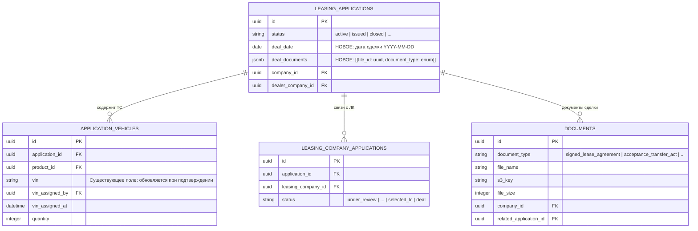
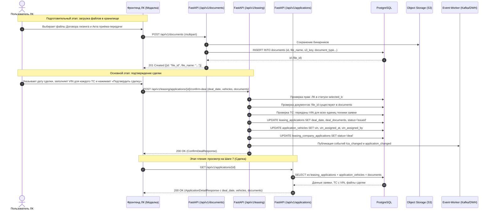

# Закрытие сделки лизинговой компанией: сохранение даты сделки, VIN-номеров и документов (Бэкенд)

**Дата создания:** 2026-10-05 11:47:48 MSK  
**Ветка:** `feature/22008-deal-confirmation-backend`  
**Статус:** реализована и проверена  
**Связь с Bitrix:** [Задача 22008](https://carcraftpro.bitrix24.ru/company/personal/user/336/tasks/task/view/22008/)  
**Целевая ветка MR:** `test`  





---

## 1. Постановка задачи и контекст

В рамках бизнес-процесса лизинговой сделки после выбора конкретной лизинговой компании клиентом (статус `selected_lc`), выбранная ЛК оформляет сделку и нажимает «Подтвердить сделку».
В текущей реализации метод `POST /api/v1/leasing/applications/{application_id}/confirm-deal` не принимает параметров и переводит заявку в статус `deal` / `issued` без фиксации реквизитов закрытия.

Согласно ТЗ задачи Bitrix #22008 (страницы 1–2 ТЗ):
1. Метод закрытия сделки `POST /api/v1/leasing/applications/{application_id}/confirm-deal` должен принимать дату сделки, перечень VIN-номеров для всех ТС заявки и прикрепленные файлы документов сделки.
2. Все эти данные должны сохраняться в БД вместе с информацией о заявке.
3. Эндпоинт получения детальной информации `GET /api/v1/applications/{application_id}` должен возвращать сохраненные дату сделки, VIN-номера ТС и документы сделки (для отображения на Шаге 7).

Данная спецификация охватывает **Группу 1 (Бэкенд и БД)** общего плана реализации.

---

## 2. Требования

### 2.1. База данных и схема хранения
1. **Таблица `leasing_applications`:**
   - Новая колонка `deal_date: sa.Date, nullable=True` — дата фактического заключения сделки.
   - Новая колонка `deal_documents: JSONB, nullable=True` — список метаданных документов закрытия сделки:
     ```json
     [
       {"file_id": "<uuid>", "document_type": "signed_lease_agreement"},
       {"file_id": "<uuid>", "document_type": "acceptance_transfer_act"}
     ]
     ```
2. **Таблица `application_vehicles`:**
   - Существующая колонка `vin: sa.String(50), nullable=True` заполняется переданными из запроса значениями.
   - Заполняются колонки аудита: `vin_assigned_by` (ID актора ЛК) и `vin_assigned_at` (UTC время).
3. **Таблица `documents`:**
   - Для переданных `file_id` гарантируется валидность и существование записей.
   - При необходимости проставляется `related_application_id = application_id`.

### 2.2. Контракт `POST /api/v1/leasing/applications/{application_id}/confirm-deal`
* **Доступ:** только сотрудник выбранной лизинговой компании (`selected_lc`).
* **Тело запроса (`ConfirmDealRequest`):**
  - `deal_date: date` — дата сделки в формате `YYYY-MM-DD`.
  - `vehicles: list[VehicleVinInput]` — массив VIN-номеров техники:
    - `vehicle_id: UUID` — идентификатор записи `application_vehicles.id`.
    - `vin: str` — VIN-номер (непустая строка, макс. 50 символов, обрезаются пробелы).
  - `documents: list[DealDocumentInput]` — массив документов закрытия:
    - `file_id: UUID` — идентификатор файла в таблице `documents`.
    - `document_type: str` — enum:
      - `signed_lease_agreement` («Подписанный договор лизинга»).
      - `acceptance_transfer_act` («Акт приёма-передачи предмета лизинга»).
* **Валидация:**
  - `vehicles`: должны быть переданы VIN для **всех** активных ТС заявки. Нельзя пропустить ТС или передать чужой `vehicle_id`.
  - `documents`: в списке должны обязательно присутствовать оба типа документов: `signed_lease_agreement` и `acceptance_transfer_act`.
  - `documents`: каждый `file_id` должен существовать в таблице `documents`.
  - `deal_date`: корректная дата (не пустая).
* **Идемпотентность:**
  - При повторном вызове в статусе `deal` (replay): если данные уже сохранены, возвращается успешный результат без дублирования истории и повторной генерации заказов.

### 2.3. Контракт `GET /api/v1/applications/{application_id}`
* Ответ `ApplicationDetailResponse` расширяется полями:
  - `deal_date: date | None` — дата сделки (или `null`).
  - `vehicles`: каждый элемент содержит `vin: str | None`.
  - `deal_documents` (и/или алиас `documents`): массив объектов:
    - `file_id: UUID`
    - `document_type: str`
    - `file_name: str | None`
    - `file_size: int | None`
    - `download_url: str | None` (канонический путь `/api/v1/documents/{file_id}/content`)

---

## 3. Планируемые изменения по файлам

### 3.1. Миграция базы данных (Alembic)
* **[NEW] `backend/alembic/versions/162_application_deal_fields.py`**
  - Добавление колонок `deal_date` (`sa.Date`, nullable=True) и `deal_documents` (`postgresql.JSONB`, nullable=True) в таблицу `leasing_applications`.
  - Обязательная проверка обратимости (`downgrade`).

### 3.2. ORM-модели и схемы данных
* **[MODIFY] `backend/infrastructure/models/applications.py`**
  - Добавить поля `deal_date` и `deal_documents` в класс `LeasingApplication`.
* **[NEW/MODIFY] `backend/presentation/schemas/leasing.py`**
  - Создать схемы `ConfirmDealRequest`, `VehicleVinInput`, `DealDocumentInput`, `DealDocumentTypeEnum`.
* **[MODIFY] `backend/presentation/schemas/applications.py`**
  - В `ApplicationDetailResponse` объявить `deal_date: date | None = None` и `deal_documents: list[DealDocumentDetailOut] = Field(default_factory=list)`.
  - В `ApplicationVehicleDetailOut` явно зафиксировать `vin: str | None = None`.

### 3.3. Доменная логика и репозитории
* **[MODIFY] `backend/domain/entities/leasing_application.py`**
  - Добавить атрибуты `deal_date` и `deal_documents` в доменную сущность `LeasingApplication`.
* **[MODIFY] `backend/infrastructure/repositories/application_repository.py`**
  - Поддержка сохранения `deal_date` и `deal_documents` при обновлении заявки.
  - Метод обновления VIN-номеров в `application_vehicles` (`update_vehicle_vins(session, application_id, vehicles_vin_data, actor_id)`).
  - В выборке `get_by_id` чтение `deal_date` и `deal_documents`.
* **[MODIFY] `backend/application/commands/leasing/confirm_deal.py`**
  - Расширить `ConfirmDealCommand` полями `deal_date`, `vehicles: list[...]`, `documents: list[...]`.
  - Реализовать проверки наличия ТС заявки, наличия обязательных документов и валидацию `file_id`.
  - Сохранение `deal_date`, `deal_documents` и обновление VIN ТС в единой транзакции с переводом статусов.
* **[MODIFY] `backend/application/queries/applications/get_application.py`**
  - Обогащение элементов `deal_documents` метаданными файлов из таблицы `documents` (имя файла, размер, ссылка на скачивание).

### 3.4. Роутеры
* **[MODIFY] `backend/presentation/routers/leasing.py`**
  - Подключить `body: ConfirmDealRequest` в эндпоинт `confirm_deal_endpoint`.
  - Передать данные в `ConfirmDealCommand`.

---

## 4. Критерии готовности (DoD)

1. **Миграции и схема БД:**
   - Миграция успешно применяется: `uv run alembic upgrade head`.
   - Проверка схемы: `uv run alembic check` завершается с результатом `No new upgrade operations detected.`.
2. **Статический анализ:**
   - `uv run ruff check . --fix` — 0 ошибок.
   - `uv run lint-imports` — 0 ошибок соблюдения архитектурных слоев.
   - `uv run mypy .` — отсутствие новых ошибок в затронутых модулях.
3. **Автотесты и контракты:**
   - Интеграционные тесты `confirm-deal` проверяют:
     - Успешный вызов с корректными датой, VIN и документами.
     - Ошибку валидации при отсутствии одного из обязательных типов документов.
     - Ошибку валидации при незаполненном VIN для одного из ТС.
     - Ошибку при несуществующем `file_id`.
     - Корректную отдачу сохраненных данных в `GET /api/v1/applications/{application_id}`.
4. **Merge Request:**
   - Оформление MR в ветку `test` с автоматическим слиянием по завершении пайплайна.
