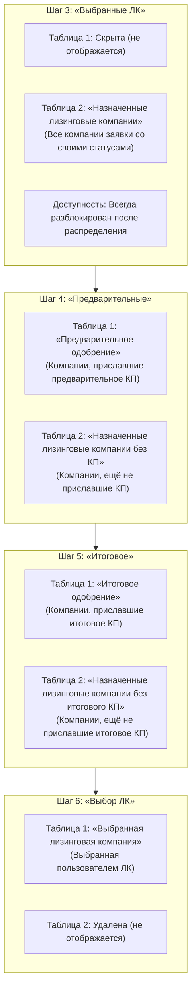

# Рефакторинг чекаута заявки: шаги 3–6 (переименования, фильтрация ЛК, разблокировка шага 3)

**Дата создания:** 2026-10-05 14:20:26 MSK  
**Ветка:** `feature/22008-checkout-steps-3-6`  
**Статус:** реализована и проверена  
**Связь с Bitrix:** [Задача 22008](https://carcraftpro.bitrix24.ru/company/personal/user/336/tasks/task/view/22008/)  
**Целевая ветка MR:** `test`  
**Область:** только desktop web (ширина viewport от 768 CSS-пикселей)

---

## 1. Постановка задачи и контекст

В рамках общей задачи [Bitrix 22008](https://carcraftpro.bitrix24.ru/company/personal/user/336/tasks/task/view/22008/) клиентский и дилерский чекаут заявки (просмотр и движение по этапам лизинга) требует рефакторинга структуры шагов 3, 4, 5, 6:
1. Шаг 3 ранее назывался «Отправленные» и блокировался при переходе заявки на последующие шаги. Требуется переименовать его в **«Выбранные ЛК»**, разблокировать для постоянного свободного возврата пользователя и скрыть верхнюю таблицу («Одобрение»), оставив только список всех назначенных лизинговых компаний с их текущими статусами.
2. Шаги 4 («Предварительные») и 5 («Итоговое») содержали общие названия таблиц («Одобрение», «Офферы: предварительные») и смешанные данные. Требуется явно разделить их на одобренные предложения и предложения в ожидании решения («без КП» / «без итогового КП»).
3. На шаге 6 («Выбор ЛК») верхняя таблица должна называться **«Выбранная лизинговая компания»** (показывает выбранную ЛК), а нижний список карточек офферов должен быть полностью удален.

---

## 2. Детальные требования (пункты 1–10 ТЗ)

1. **Переименование шага 3:**
   - Внутри заявки в степпере шагов переименовать Шаг 3 «Отправленные» на **«Выбранные ЛК»**.
2. **Скрытие таблицы «Одобрение» на шаге 3:**
   - На шаге 3 верхняя таблица «Одобрение» не отображается.
3. **Таблица назначенных компаний на шаге 3:**
   - На шаге 3 таблицу карточек («Офферы: отправленные») переименовать в **«Назначенные лизинговые компании»**.
   - В ней отображаются **все** лизинговые компании, с которыми работает заявка, независимо от текущего статуса конкретной ЛК.
   - У каждой компании отображается её актуальный статус (например, «Отправлена», «На рассмотрении», «Предварительное КП», «Итоговое КП» и т.д.).
4. **Разблокировка шага 3:**
   - Шаг 3 не должен блокироваться при прохождении. Пользователь в любой момент может вернуться на шаг 3 и посмотреть все назначенные лизинговые компании и их актуальные статусы.
5. **Таблица компаний без предварительного КП на шаге 4:**
   - На шаге 4 («Предварительные») нижнюю таблицу карточек переименовать в **«Назначенные лизинговые компании без КП»**.
   - Отображать только лизинговые компании, которые ещё не отправили пользователю предварительное КП (статусы `submitted`, `pending_distribution`, `under_review`, `under_review_with_docs`).
6. **Таблица предварительного одобрения на шаге 4:**
   - На шаге 4 («Предварительные») верхнюю таблицу «Одобрение» переименовать в **«Предварительное одобрение»**.
   - Отображать только лизинговые компании, которые уже отправили предварительное КП (`approved_scoring`, `approved_scoring_another_cond`).
7. **Таблица итогового одобрения на шаге 5:**
   - На шаге 5 («Итоговое») верхнюю таблицу «Одобрение» переименовать в **«Итоговое одобрение»**.
   - Отображать только лизинговые компании, которые уже отправили итоговое КП (`approved_final`, `approved_final_another_cond`).
8. **Таблица компаний без итогового КП на шаге 5:**
   - На шаге 5 («Итоговое») нижнюю таблицу переименовать в **«Назначенные лизинговые компании без итогового КП»**.
   - Отображать лизинговые компании, которые ещё не отправили итоговое КП.
9. **Таблица выбранной компании на шаге 6:**
   - На шаге 6 («Выбор ЛК») верхнюю таблицу «Одобрение» переименовать в **«Выбранная лизинговая компания»**.
   - В ней отображается выбранная пользователем лизинговая компания (`selected_lc`).
10. **Удаление лишней таблицы на шаге 6:**
    - На шаге 6 («Выбор ЛК») нижнюю таблицу карточек («Офферы: выбор ЛК») удалить / скрыть.

---

## 3. Границы задачи

### Входит в задачу
- Изменение констант и утилит шагов чекаута в `frontend/features/checkout/utils/steps.ts`.
- Доработка компонента `CheckoutOffersStep.vue`:
  - Заголовки таблиц для шагов 3, 4, 5, 6.
  - Условия отображения таблиц (скрытие верхней на шаге 3, скрытие нижней на шаге 6).
  - Фильтрация карточек LCA для шагов 3 (все), 4 (без предварительного КП), 5 (без итогового КП).
- Доработка компонента `ApplicationWorkflowPage.vue`:
  - Постоянная доступность шага 3 (`sent` / `Выбранные ЛК`) после распределения заявки (`availableStatusSections` всегда включает `sent` при наличии распределенных ЛК).
  - Свободный переход на шаг 3 по клику на степпер.
- Актуализация Playwright-тестов в `frontend/tests/e2e/checkout/`.

### Не входит в задачу
- Backend, БД и миграции (уже завершены в Группе 1).
- Модальное окно подтверждения закрытия сделки в кабинете ЛК (Группа 3).
- Карточка «Документы по сделке» на шаге 7 (Группа 4).
- Мобильные viewport менее 768px (согласно `AGENTS.md`).

---

## 4. Архитектурное решение и планируемые изменения

### 4.1. Константы шагов (`frontend/features/checkout/utils/steps.ts`)
- В `CHECKOUT_LCA_STATUS_BUCKETS.sent`: изменить `label` с `'Отправленные'` на `'Выбранные ЛК'`.
- В `CHECKOUT_STATUS_SECTIONS`: для `section: 'sent'` изменить `label` на `'Выбранные ЛК'`.
- В `CHECKOUT_STEPS`: для `num: 3` изменить `label` на `'Выбранные ЛК'`.

### 4.2. Навигация и разблокировка шага 3 (`frontend/features/checkout/components/ApplicationWorkflowPage.vue`)
- В `availableStatusSections`:
  - Если у заявки есть хотя бы одна LCA (`items.length > 0`), секция `'sent'` гарантированно добавляется в `availableStatusSections`.
  - При прогрессе заявки (например, когда все LCA перешли в `approved_scoring` или `selected_lc`), секция `'sent'` не выбывает из списка доступных.
- В `canJump(section)`:
  - Секция `'sent'` всегда доступна для клика, если пользователь уже дошёл до этапа работы с ЛК.

### 4.3. Отображение и фильтрация таблиц (`frontend/features/checkout/components/CheckoutOffersStep.vue`)
- **Верхняя таблица (Одобрение / Выбор):**
  - `showApprovalTable`: `computed(() => props.statusBucket !== 'sent')` (скрыта на шаге 3; на шагах 4, 5, 6 отображается).
  - `approvalTableTitle`:
    - `props.statusBucket === 'preliminary'`: `'Предварительное одобрение'`
    - `props.statusBucket === 'final'`: `'Итоговое одобрение'`
    - `props.statusBucket === 'selected' || props.statusBucket === 'deal'`: `'Выбранная лизинговая компания'`
    - по умолчанию: `'Одобрение'`
  - Переключатель табов (`approvalTabs`): скрывать на шагах 4, 5, 6, так как каждый шаг строго соответствует своему типу оффера.
- **Нижняя таблица (Назначенные ЛК / Карточки):**
  - `showLcaCardsSection`: `computed(() => props.statusBucket !== 'selected' && props.statusBucket !== 'deal')` (удалена на шагах 6 и 7).
  - Заголовок `statusStepTitle`:
    - `props.statusBucket === 'sent'`: `'Назначенные лизинговые компании'`
    - `props.statusBucket === 'preliminary'`: `'Назначенные лизинговые компании без КП'`
    - `props.statusBucket === 'final'`: `'Назначенные лизинговые компании без итогового КП'`
    - по умолчанию: `'Офферы: ...'`
  - Фильтрация `filteredLcaItems`:
    - Для `props.statusBucket === 'sent'`: возвращать **все** `lcaItems`, отсортированные по времени/статусу.
    - Для `props.statusBucket === 'preliminary'`: возвращать компании, не приславшие предварительное КП (статусы без `approved_scoring`, `approved_final`, `selected_lc`, `deal`).
    - Для `props.statusBucket === 'final'`: возвращать компании, не приславшие итоговое КП (статусы без `approved_final`, `selected_lc`, `deal`).

---

## 5. Критерии готовности (DoD)

1. **Степпер чекаута:**
   - Шаг 3 отображается с лейблом «Выбранные ЛК».
   - После продвижения заявки на шаги 4, 5, 6, 7 клик по Шагу 3 возвращает пользователя на Шаг 3, шаг не блокируется.
2. **Шаг 3 («Выбранные ЛК»):**
   - Верхняя таблица «Одобрение» отсутствует.
   - Нижняя таблица называется «Назначенные лизинговые компании» и содержит все ЛК заявки с их реальными статусами.
3. **Шаг 4 («Предварительные»):**
   - Верхняя таблица называется «Предварительное одобрение» (только с предварительными КП).
   - Нижняя таблица называется «Назначенные лизинговые компании без КП» (только компании без КП).
4. **Шаг 5 («Итоговое»):**
   - Верхняя таблица называется «Итоговое одобрение» (только с итоговыми КП).
   - Нижняя таблица называется «Назначенные лизинговые компании без итогового КП».
5. **Шаг 6 («Выбор ЛК»):**
   - Верхняя таблица называется «Выбранная лизинговая компания» (содержит выбранную ЛК).
   - Нижняя таблица карточек удалена / не отображается.
6. **Тестирование:**
   - E2E-тесты в Playwright обновлены под новые названия и поведение шагов и успешно проходят.
   - Статические проверки `typecheck` фронтенда проходят без новых ошибок.
