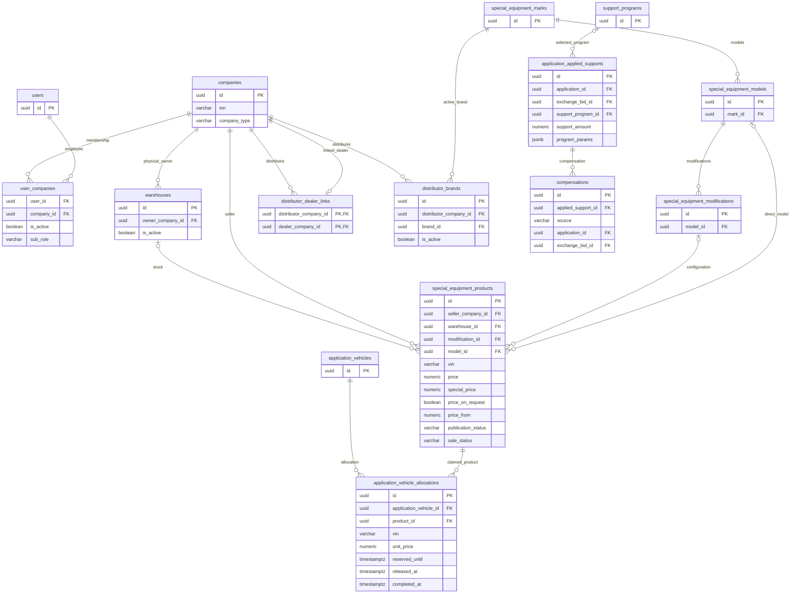
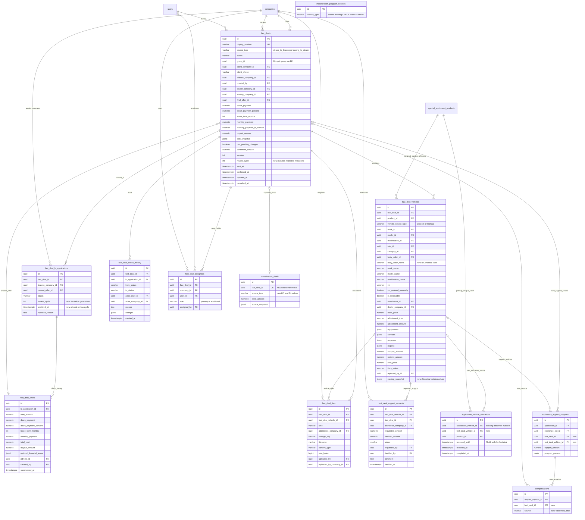

# Регистрация сделки — Bitrix 22152

- Создано: **2026-10-05 16:19:22 MSK (UTC+3)**.
- Задача: [Bitrix24 №22152](https://carcraftpro.bitrix24.ru/company/personal/user/302/tasks/task/view/22152/).
- Статус: **проект спецификации, на согласовании**. Реализация начинается после подтверждения этой спецификации.
- Ветка: `feature/22152`; целевая ветка MR: `test`.
- База исследования: `804106288f1843f7bc3463240c8f5e892641bc16`, синхронизированная ветка `test`.
- Основной источник: `Регистрация сделки.docx`, предоставленный пользователем, 55 страниц.
- Визуальный источник: [Miro, блок «Регистрация сделки»](https://miro.com/app/board/uXjVPZByo14=/?moveToWidget=3458764681298370203&cot=14), белый «Флоу дилера» и светло-пурпурный «Флоу Лизинговой».
- Приоритет источников: **DOCX определяет бизнес-правила; Miro определяет совместимую с ними компоновку**. Уточнение основано на присланной переписке: автор сообщил, что документ актуальнее, а Miro почти не меняли после встречи. Это уточняет первоначальное указание о приоритете Miro.
- Содержимое задачи и комментариев Bitrix не прочитано: страница требует авторизации. Номер задачи и ссылка известны; положения из недоступной страницы не предполагаются.
- Затрагиваются: самостоятельный процесс регистрации сделки, каталог спецтехники, резерв, поддержки и компенсации, калькулятор, файлы, назначения сотрудников, уведомления, общие списки заявок, монетизация.

## ERD: существующие связи и планируемое расширение

В диаграммах показаны значимые поля, а не полный набор колонок. Первая диаграмма отражает текущую модель; вторая — планируемую. Новые таблицы имеют префикс `fast_deal`; дополнения существующих таблиц отмечены комментариями полей. Все идентификаторы сущностей — UUID.





Вторая диаграмма не означает, что все справочники создаются заново: категории, марки, модели, модификации, комплектации, цвета, назначения, регионы, оборудование и услуги уже существуют. Поля для времён создания/изменения, подробных финансовых условий КП и снимков описаны ниже. Связь источника с `monetization_deals` — логическая: сохранить принятую в модуле политику ссылок источников, не вводить FK выборочно без необходимости.

## Последовательности основного процесса

```mermaid
sequenceDiagram
    autonumber
    actor Dealer as Дилер
    participant UI as Кабинет
    participant API as FastAPI / fast-deals
    participant DB as PostgreSQL
    participant Notices as Existing notification outbox
    actor LC as Лизинговая компания
    participant Integrations as Компенсации и монетизация
    Dealer->>UI: Создать, выбрать клиента, добавить технику и условия
    UI->>API: POST draft, mutations with If-Match
    API->>DB: Создать DD, номер, автора и историю
    Dealer->>UI: Отправить выбранным ЛК
    UI->>API: send-to-leasing-companies
    API->>DB: Lock deal and products, validate all claims
    alt Конфликт хотя бы одного резерва
        DB-->>API: Conflict
        API-->>UI: 409, VIN; никаких частичных изменений
    else Все позиции допустимы
        API->>DB: Резервы, pending_lc_confirmation, записи ЛК
        API->>Notices: События в общей транзакции
        API->>DB: Commit
        Notices-->>LC: Inbox и email
        LC->>API: offer или reject, If-Match
        API->>DB: Одно действующее КП на запись ЛК, история, version
        Dealer->>API: select выбранного КП
        API->>DB: selected_by_dealer, остальные closed_not_selected
        Note over API,DB: Сделка pending_lc_final_confirmation
        alt Выбранная ЛК подтверждает
            LC->>API: confirm
            API->>DB: Зафиксировать КП, confirmed_amount, завершить резервы, sold
            API->>Integrations: Компенсации и capture по UUID сделки
            API->>Notices: События подтверждения
            API->>DB: Commit
        else ЛК отказывает или дилер снимает выбор
            LC->>API: reject с причиной или Dealer withdraw-selection
            API->>DB: Восстановить offer_sent либо pending_review других ЛК
            Note over API,DB: Если нет доступных ЛК, rejected и освобождение резервов
        end
    end
    opt Дилер меняет бизнес-данные после отправки до confirmed
        Dealer->>API: Изменить позицию, цену или запрошенные условия
        API->>DB: Новый review_cycle, старые КП superseded, draft, release
        API->>Notices: Уведомить участников предыдущего цикла
    end
```

```mermaid
sequenceDiagram
    autonumber
    actor LC as Лизинговая компания
    participant API as FastAPI / fast-deals
    participant DB as PostgreSQL
    participant Notices as Existing notification outbox
    actor Dealer as Дилер
    participant Integrations as Компенсации и монетизация
    LC->>API: DL draft с каталожными и ручными позициями нескольких дилеров
    LC->>API: send-to-dealers, If-Match
    API->>DB: Lock draft; validate positions, dealer groups and pricing
    API->>DB: Atomic split; original ID for first dealer; group_id original ID
    Note over API,DB: Для каждой сделки свой номер, суммы и версии; pending_dealer_confirmation
    API->>Notices: Уведомления каждому дилеру
    API->>DB: Commit
    alt Дилер принимает без изменений
        Dealer->>API: confirm
        API->>DB: confirmed, confirmed_amount, завершение допустимых резервов
        API->>Integrations: Capture отдельно по каждой сделке группы
        API->>DB: Commit
    else Дилер меняет цену, поддержку или допустимые данные позиции
        Dealer->>API: mutations, If-Match
        API->>DB: has_pending_changes, снимок до и после
        Dealer->>API: send-changes
        API->>DB: pending_lc_changes_confirmation
        API->>Notices: Уведомление ЛК
        alt ЛК принимает
            LC->>API: changes/accept
            API->>DB: confirmed, confirmed_amount, sold для резервируемых позиций
            API->>Integrations: Компенсации и capture
            API->>DB: Commit
        else ЛК отклоняет
            LC->>API: changes/reject с причиной
            API->>DB: rejected, release, история
            LC->>API: Изменить свою сделку
            API->>DB: draft, dealer неизменен
            LC->>API: send-to-dealers
            Note over API,DB: Повторная отправка тому же дилеру, без нового split
        end
    else Дилер отказывает
        Dealer->>API: reject с причиной
        API->>DB: rejected, release, история
    end
```

## 1. Постановка и границы

Добавить быстрый способ зафиксировать уже согласованную вне платформы сделку между дилером и лизинговой компанией. Это самостоятельный объект `fast_deal`, а не фиктивная обычная лизинговая заявка. Клиента выбирают по компании и телефону; клиент не получает аккаунт, SMS, приглашение или доступ к этой сделке.

Поддерживаются два направления:

| Направление | Инициатор | Позиции | Завершение |
|---|---|---|---|
| `dealer_to_leasing` — DD | Дилер | Собственная складская спецтехника либо ручные позиции | Дилер выбирает КП, выбранная ЛК окончательно подтверждает |
| `leasing_to_dealer` — DL | ЛК | Опубликованный каталог либо ручные позиции с обязательным дилером | Дилер подтверждает без изменений либо ЛК принимает его изменения |

В scope входят обе стороны процесса, списки, карточка, документы, назначения, история, уведомления, калькулятор, резерв и интеграции. Используется только действующий каталог спецтехники. Не входят: прежний автомобильный каталог, клиентский ЛК, SMS/СОПД, OCR, отдельные отчёты и напоминания, создание складских объявлений из ручной позиции, поля двигателя/КПП/года из старых макетов, альтернативная нумерация D/A/B и дополнительное подтверждение инициатором после финального решения.

## 2. Приоритеты источников и принятые уточнения

| Расхождение или неполнота | Решение для этой спецификации |
|---|---|
| Miro показывает дополнительные подтверждения, SMS и другие старые шаги | Применить процесс DOCX; сохранить только совместимые экраны и расположение блоков |
| Miro позволяет дилеру прикладывать коммерческое предложение к позиции | `vehicle_offer` загружает только ЛК, как определено DOCX |
| Miro связывает ручную позицию с добавлением на склад | Ручная позиция не создаёт и не изменяет продукт каталога |
| DOCX показывает дату номера без года | Использовать текущую согласованную в репозитории дату `ДДММГГ`, см. `specs/task_2026-09-30_11-29-42_MSK.md`; это явная адаптация, включённая в review этой спеки |
| DOCX допускает текстовые данные техники ЛК, но схема содержит только `body_color_id` | Добавить `body_color_name` и неизменяемые снимки названий; у ЛК нет скрытого автосопоставления с каталогом |
| Частичная уникальность приглашений DOCX мешает новому циклу после сброса | Добавить `review_cycle` и `archived_at`; уникальность распространяется только на действующие записи текущего цикла |
| DOCX требует монетизацию, но не перечисляет все текущие CHECK источников | Расширить также `monetization_program_sources` и `monetization_deals`, добавить происхождение `fast_deal_id` |
| В истории и снимках возможна утечка поддержек ЛК | Отдельная серверная проекция для ЛК на всех каналах, включая историю и письма |
| Обязательный `product_id` для источника product несовместим с SET NULL после удаления каталога | Требовать ссылку при создании; сохранять исторический снимок. Активный резерв защищён RESTRICT существующей allocation |

Эти уточнения не считать уже реализованными. Их подтверждают вместе с основной спецификацией. Вопросы, для которых источники не дают однозначного ответа, выделены в разделе 12.

## 3. Интерфейс и общие списки

### 3.1. Навигация

Добавить первым пунктом меню «Регистрация сделки» для дилера, ЛК, дистрибьютора и администратора платформы. Для клиента пункт отсутствует. Создание доступно дилеру и ЛК; дистрибьютор и администратор просматривают сделки, дистрибьютор отдельно принимает решения по своим запросам поддержки.

Список: номер, клиент/ИНН, направление «От … к …», стороны, статус, ответственные и переход в карточку. Для DD до выбора показывать «в N лизинговых компаний», после выбора — выбранную ЛК. Фильтры: номер, ИНН клиента, компания клиента, ЛК (дилер/администратор), дилер (ЛК/дистрибьютор/администратор), направление, статус; кнопка сброса и пагинация. Все фильтры применяются после серверного ограничения доступного набора.

В общие «Мои заявки» дилера, ЛК, дистрибьютора и администратора добавить строки `kind=fast_deal` с бейджем «Быстрая регистрация» и ссылкой в собственную карточку. Добавить фильтр вида заявки. Не преобразовывать fast deal в ordinary application и не смешивать словари статусов: **при выборе фильтра статуса обычной заявки fast deals исключаются**, как требует DOCX. Без этого фильтра возвращается доступное объединение. Список клиента не расширять. Сортировка, пагинация и `total` считаются над итоговым доступным объединением.

### 3.2. Создание и карточка

Модальное окно компании и карточка используют существующие визуальные элементы. Поиск — только `GET /api/v1/company/search`, выбранный объект `CompanyAutocomplete` передаётся через `@select` без преобразования идентификаторов. Backend принимает либо UUID существующей компании, либо полный выбранный объект компании; создание компании не создаёт пользователя. Обязательный телефон клиента — `+7XXXXXXXXXX`. Выбранного клиента после создания сделки не менять.

Сохранить структуру Miro: реквизиты и контакты клиента, рядом условия лизинга; далее позиции техники с ценой, опциями и документами; ниже запрос/КП, сравнение или согласование; отдельные блоки документов, ответственных и истории. Белая область описывает DD, пурпурная DL; цвет доски не задаёт обязательную окраску рабочего интерфейса.

Каждая позиция — отдельная единица с VIN. Количества нет. Показывать базовую/конечную цену, скидку или наценку, оборудование, услуги, назначения и регионы. В дилерской проекции также видны программы и запросы поддержки. Подписи действий и доступность брать из `allowed_actions`; сервер повторно проверяет каждый запрос. Ошибки показывать у соответствующего поля, конфликт резерва — с VIN, устаревшую версию — с предложением обновить карточку.

В DD показывать столбец «Запрошено» и по столбцу на действующее КП каждой ЛК. ЛК имеет кнопку «Перенести запрошенные условия», затем «Сделать КП». Дилер выбирает одну ЛК и может снять выбор. В DL показывать изменённые значения дилера до/после, «Подтвердить», «Отправить изменения», а у ЛК — «Принять изменения» и «Отклонить».

Карточка не открывает специальные mobile-сценарии: viewport от 768 CSS px. Состояния загрузки, пустого списка, запрета доступа, терминальных статусов и конфликта версии обязательны.

### 3.3. Номер и группировка

Номер выдаётся при создании, остаётся неизменным: `DD-<ИНН клиента>-<ДДММГГ>-<NNN>` или `DL-<ИНН клиента>-<ДДММГГ>-<NNN>`. Например, `DD-7707083893-051026-001`. Дата номера берётся по действующему правилу UTC; MSK в имени этой спецификации не меняет дату бизнес-номеров.

Генератор fast deal использует собственную advisory transaction lock для направления, ИНН и полного дня, уникальный индекс номера и последовательность не менее трёх цифр без усечения после 999. Заимствовать принцип существующего `display_number.py`, не менять номера и namespace обычных заявок. Номер хранится полной строкой, фронтенд не добавляет второй префикс.

DL при первой отправке атомарно разделяется по дилерам. Исходный ID и номер остаются у первого дилера в стабильном порядке позиций, остальные получают новые UUID и номера; у всех `group_id` равен исходному ID. ЛК видит связанные сделки группы, каждый дилер — только свою. После отправки дилер конкретной сделки неизменен. Повторная отправка после отказа не повторяет split.

## 4. Доступ и ответственные

Проверять JWT, текущий контекст компании, её тип и активное членство пользователя в компании. Автор, основной и дополнительный ответственные видят свои сделки; администратор компании видит доступные сделки компании и назначает ответственных. Отдельный статус сотрудника не даёт доступа к сделкам других компаний.

| Участник | Просмотр | Изменения и решения |
|---|---|---|
| Дилер-инициатор DD | Свой draft; затем своя сделка и приглашённые ЛК | Позиции/условия до confirmed, отправка, выбор/снятие выбора, отмена |
| Приглашённая ЛК DD | Только после отправки; собственная запись и КП | Одно КП в цикле, отказ; выбранная ЛК — финальное подтверждение |
| ЛК-инициатор DL | Собственный draft и все свои сделки группы | Подготовка, отправка, решение по изменениям, отмена |
| Дилер DL | Своя часть после отправки | Цена/поддержки/разрешённые ручные данные, подтверждение или отправка изменений, отказ |
| Дистрибьютор | Отправленные сделки связанных дилеров; без чужих приватных файлов | Только решение по адресованному ему запросу поддержки |
| Администратор платформы | Все сделки и допустимые общие документы | Просмотр; не подменяет бизнес-решение сторон |
| Клиент | Нет доступа | Нет действий |

До первой отправки draft доступен только стороне инициатора по правилам автора/назначенных/администратора компании. После сброса в draft получатели не получают новые бизнес-данные до повторной отправки; их прошлые события не исчезают. Для ID чужой сделки/позиции/файла отдавать безопасный отказ без сведений о клиенте или VIN.

На каждую сторону — один `primary` и не более одного `additional`. Автор становится основным инициатора. У контрагента до назначения работают администраторы компании; назначают только активных сотрудников своей компании. Администратор компании может переназначать при любом статусе, включая confirmed/cancelled: это административное исключение из запрета изменения бизнес-данных, с историей и уведомлением. Пользователь другой стороны не назначает сотрудников контрагента.

## 5. Техника, цены, калькулятор и резерв

### 5.1. Добавление позиции

Дилер начинает с VIN. Поиск ограничен физически собственными складами; право видеть чужой склад не делает его собственным. Владелец определяется существующим правилом `warehouse.owner_company_id`, при отсутствии склада — `seller_company_id`. При отсутствии VIN: «Не найдено на ваших складах», действие «Добавить вручную» сохраняет введённый VIN. Табличный выбор с фильтрами VIN, склад, марка и модель позволяет добавить несколько разных единиц; повторное добавление одной единицы исключается.

Дилер может выбрать объявление без VIN либо «Под заказ» и вручную ввести VIN. Такая позиция помечается `vin_entered_manually`, не резервируется и не переводит объявление в sold; объявление остаётся в витрине. Данные каталожной позиции не редактируются в fast deal; снимок её данных сохраняется.

Ручное добавление дилера использует цепочку категория → марка → модель → необязательная модификация → необязательная комплектация из справочников. Если марки нет, «Нет марки» включает текстовые марку и модель; если нет модели существующей марки, «Нет модели» включает текстовую модель. При текстовом вводе модели показывать похожие модели каталога; выбор подсказки восстанавливает связанные справочные поля. Категорию, предложенную модификацией, можно изменить. Отсутствующая текстовая марка не создаёт новую запись справочника автоматически.

ЛК также выбирает **всю опубликованную технику** по VIN или из таблицы с фильтрами, независимо от принадлежности склада самой ЛК; дилер позиции определяется по физическому владельцу склада с действующим fallback на продавца. Объявления без VIN/под заказ работают по тем же правилам ручного VIN без резерва. Неопубликованные и недоступные к продаже единицы нельзя отправить через обход прямым product ID.

Ручное добавление ЛК использует текстовые марку, модель, модификацию, VIN и цвет, категорию из справочника; дилер выбирается явно. В этой ручной форме нет подсказок марок/моделей, скрытого привязывания к складу или автоматической регистрации нового объявления. Изменения дилера в DL сохраняют независимый снимок ручной позиции. После первого split любое новое добавление допустимо только в draft инициатора и только для прежнего дилера.

Обязательные поля: марка, модель, категория, VIN, цена. VIN нормализуется в upper case и проверяется `^[A-HJ-NPR-Z0-9]{17}$`, без I/O/Q; уникален среди активных позиций сделки. Действующий каталог допускает более широкий формат VIN: не сужать его глобальный контракт. Если конкретное объявление не подходит регистрации по VIN, объяснить причину и не обойти проверку сменой источника.

### 5.2. Цена и опции

База каталожной позиции — `special_price`, если задана, иначе `price`; при `price_on_request` цену явно вводит пользователь, не копировать `price_from` как согласованную цену. Ручная позиция всегда получает явно заданную цену. Все суммы — `Decimal`, хранятся с точностью копейки; округление выполняется на сервере по принятому калькулятором правилу. Не использовать binary float для расчётов.

Дилер DD может задать скидку; дилер DL — скидку либо наценку. Типы взаимоисключающие, очистка снимает корректировку. Итог:

`final_price = base_price - discount + markup - accounted_support + equipments_total + services_total`.

Итог неотрицателен, изменение суммы пересчитывается на сервере. Поддержка учитывается ровно один раз; `support_amount` — производная принятых и учтённых источников, а не доверенный ввод клиента.

Оборудование и услуги — существующие справочники, цена и необязательный комментарий на выбранный элемент; интерфейс «Выбрать»/«Изменить». Назначения и регионы — действующие справочники, сохраняются все выбранные значения. Полный набор опций заменяется атомарно, а удалённые значения отражаются в истории. ЛК получает конечную цену, но не разложение на скрытые поддержки.

### 5.3. Условия лизинга

Использовать существующий калькулятор и его проверенные формулы. Аванс доступен в рублях и процентах, срок 12–84 месяца, выкупной платёж и ежемесячный платёж. Сервер хранит активный режим ввода аванса, ручной флаг monthly payment и снимок расчёта; одновременно противоречивые рубли/% отклоняются.

Если ежемесячный платёж введён вручную, изменение базы сохраняет его и показывает отдельно вновь рассчитанный платёж. Остальные производные не подменяются формулой из ручного платежа; стоимость договора = аванс + платёж × срок + выкуп. В DD запрошенные и окончательные условия отдельны, итоговые копируются из выбранного КП. В DL условия меняет ЛК, дилер не редактирует срок/аванс/платёж.

При split DL копировать срок и процент аванса; для суммы позиций каждого дилера заново вычислить рублёвый аванс, ежемесячный платёж, выкуп и стоимость договора по текущей формуле, включая исходно ручной платёж. Не делить исходную месячную сумму пропорционально и не сохранять ложный ручной флаг рассчитанного значения.

### 5.4. Глобальный резерв

Резервируется только реальная каталожная единица с исходным VIN, доступным остатком и доказанным владельцем. Ручные позиции и вручную назначенный VIN для объявления без VIN/под заказ не резервируются. Backend вычисляет `is_reservable`; запрос клиента не может включить его самостоятельно.

Отправка сделки берёт блокировку сделки и всех связанных продуктов в стабильном порядке и проверяет существующие активные allocations, покупки и другие действующие механизмы claims. Проверка вне транзакции или только состояния `sale_status` недостаточна. Конфликт обычной заявки, покупки, обменного/корзинного процесса, дошедшего до резервирования, или другой fast deal блокирует всю отправку. Само наличие позиции в незарезервированной корзине не создаёт нового вида блокировки.

Вся отправка откатывается, если не удалось зарезервировать хотя бы одну единицу; сообщить VIN и номер конкурирующего источника только при праве пользователя видеть его. Параллельные отправки по одному продукту имеют ровно одного победителя.

Резерв fast deal не имеет срока истечения. Existing expiry worker не должен удалять allocation с `reserved_until=NULL`. При cancelled/rejected/DD reset, удалении или замене позиции резерв освобождается в той же транзакции. При confirmed allocation завершается, резервируемый продукт получает sold; ручные позиции каталог не меняют. Не возвращать завершённый sold-продукт в available обработчиком обычного освобождения.

После отправки удаление и замена — soft states `removed`/`replaced`, новая позиция ссылается через `replaced_by_id`; исторические VIN, цены и поддержки не теряются. Проверять повторно владение и доступность перед каждой новой отправкой/подтверждением, не доверять старому снимку.

## 6. Поддержки и компенсации

Программы поддержки видит и применяет дилер для каталожно связанной марки/модели. Применять действующие правила совместимости и ограничения программ; фиксировать параметры и сумму, не читать изменившуюся программу как исторически применённую. Ручная текстовая марка ЛК не становится справочной автоматически.

Запрос дополнительной поддержки создаёт дилер по позиции: положительная сумма и необязательный комментарий, дистрибьютор определяется через связь дилер → дистрибьютор и его активное назначение марки. Если связь/марка отсутствуют, действие недоступно с подсказкой «Для этой марки не найден ваш дистрибьютор»; нельзя выбрать произвольного дистрибьютора. У позиции не более одного запроса `requested`/`pre_approved`; дилер не редактирует и не отзывает уже отправленный запрос.

| Решение дистрибьютора | Статус | Эффект |
|---|---|---|
| Отклонить | `cancelled` | В интерфейсе «Отклонено», причина/история |
| Предварительно согласовать | `pre_approved` | Цена пока не уменьшается |
| Согласовать | `approved` | Сумма может отличаться от запрошенной, фиксируется `decided_amount` |

Согласованная сумма в DD draft учитывается сразу. После отправки цену автоматически не менять: показать дилеру «Неучтённая поддержка: N ₽» и действие «Применить». Применение вызывает обычный сброс DD либо цикл изменений DL. Подтверждение программы/запроса не должно дважды вычитать сумму. Поздние решения после терминального статуса отдельно определены в вопросах review.

Для ЛК исключить идентификаторы программ, суммы, комментарии и статусы поддержки, breakdown цены и чувствительные ключи JSON из карточки, списка, истории, API ошибок, файловых метаданных, calc snapshots, уведомлений и писем. Использовать разрешённую проекцию, а не скрытие CSS. Дистрибьютору доступны только его запросы и допустимая сделка связанных дилеров.

При confirmed создать записи компенсаций для применённых программ через существующий механизм `application_applied_supports`/`compensations` с новым источником `fast_deal`. Повтор запроса подтверждения не создаёт дублей. Сам запрос индивидуальной поддержки хранится отдельно; не придумывать отсутствующую в DOCX выплату компенсации по нему.

## 7. Состояния и переходы

Статусы сделки: `draft`, `pending_lc_confirmation`, `pending_lc_final_confirmation`, `pending_dealer_confirmation`, `pending_lc_changes_confirmation`, `confirmed`, `rejected`, `cancelled`. Это собственный словарь, не дополнительные значения ordinary application.

### 7.1. DD

| Действие и сторона | Исходное состояние | Результат |
|---|---|---|
| Дилер отправляет ≥1 ЛК | draft, валидные позиции/условия | pending_lc_confirmation, резерв, приглашения pending_review |
| ЛК отправляет КП | Собственная pending_review | offer_sent; сделка ожидает выбора |
| ЛК отказывает с причиной | pending_review/offer_sent; также выбранная запись при ожидании финала | rejected у ЛК; если остались допустимые ЛК, продолжить выбор; иначе rejected сделки и release |
| Дилер выбирает КП | pending_lc_confirmation, действующее offer_sent | selected_by_dealer, остальные closed_not_selected, pending_lc_final_confirmation |
| Дилер снимает выбор | pending_lc_final_confirmation | Очистить выбор; восстановить состояния других приглашений, вернуть выбор |
| Выбранная ЛК подтверждает | selected_by_dealer и pending_lc_final_confirmation | confirmed у обеих записей, финальные условия, сумма, sold, интеграции |
| Дилер меняет бизнес-поле после отправки | Любое незавершённое состояние | draft, release, новый цикл, старые КП superseded |
| Дилер исправляет сделку после отказа всех ЛК | rejected | draft; затем новый цикл отправки с прежним или изменённым списком ЛК |
| Дилер отменяет | Любое состояние до confirmed/cancelled | cancelled, release, редактирование закрыто |

Статусы записи ЛК: `pending_review`, `offer_sent`, `selected_by_dealer`, `confirmed`, `rejected`, `closed_not_selected`. На одну запись ЛК — одно отправленное КП; изменение отправленного КП в пределах цикла запрещено. Для нового согласования нужен новый цикл дилера. При снятии выбора/отказе выбранной ЛК существующие валидные КП возвращаются в `offer_sent`, приглашения без КП — в `pending_review`; отвергнутые ЛК не воскресают автоматически.

Reset сохраняет историю и КП, помечает их `superseded_at`, архивирует предыдущие приглашения, очищает `final_offer_id`, выводит контрагентов из текущего review и уведомляет их. Повторное приглашение после отказа создаёт новую дочернюю запись. Нельзя показывать устаревшее КП как выбираемое.

### 7.2. DL

| Действие и сторона | Исходное состояние | Результат |
|---|---|---|
| ЛК отправляет | draft | Первый split по дилерам, затем pending_dealer_confirmation |
| Дилер принимает без изменений | pending_dealer_confirmation, has_pending_changes=false | confirmed |
| Дилер меняет разрешённые поля | pending_dealer_confirmation | has_pending_changes=true, снимок изменений; confirm недоступен |
| Дилер отправляет изменения | pending_dealer_confirmation, has_pending_changes=true | pending_lc_changes_confirmation |
| ЛК принимает изменения | pending_lc_changes_confirmation | confirmed, без дополнительного подтверждения дилером |
| ЛК отклоняет изменения с причиной | pending_lc_changes_confirmation | rejected, release |
| Дилер отказывает с причиной | pending_dealer_confirmation | rejected, release |
| ЛК исправляет отклонённую сделку | rejected | draft; прежний дилер неизменен |
| ЛК повторно отправляет | Исправленный draft после split | Тот же дилер, pending_dealer_confirmation; без повторного split |
| ЛК отменяет | Любое состояние до confirmed/cancelled | cancelled, release |

Подтверждается вся сделка; частичного согласования позиций нет. Во время рассмотрения изменений дилер не продолжает незаметно менять согласуемый снимок. Все решения ссылаются на актуальную версию.

`confirmed` закрывает бизнес-редактирование: позиции, цены, условия, поддержки, файлы и выбранные стороны неизменны. `cancelled` необратим, повторная отправка невозможна. Отказ хранит причину; отмена требует предупреждения в UI. Удаление всей сделки разрешено только для draft, который никогда не отправлялся (`sent_at IS NULL`), с очисткой task-owned файлов по существующему процессу.

## 8. Документы, история и уведомления

### 8.1. Файлы

Хранение — существующий приватный ObjectStorage/S3, в БД только storage key и метаданные. Загрузка до confirmed/cancelled, до 20 файлов за запрос. Как в обмене, предел одного файла **50 MiB** (`exchange_requests.py`, `exchange_bids.py`); сейчас эти endpoints не имеют MIME whitelist. Не добавлять произвольный новый whitelist под видом существующего контракта. Пустые файлы и превышение лимита отклоняются, имя хранится безопасно, MIME не означает доверие к содержимому.

| Вид | Кто загружает | Кто читает |
|---|---|---|
| `deal_main` | Допущенная сторона | Дилер; до выбора — все приглашённые ЛК, после выбора — выбранная; связанный дистрибьютор и администратор |
| `deal_additional` | Дилер/ЛК | Загрузившая сторона, дилер и адресная ЛК; дистрибьютор/администратор не получают эти приватные файлы |
| `lc_offer_pdf` | ЛК для своего КП, необязательно | Дилер и соответствующая ЛК |
| `vehicle_offer` | Только ЛК, обязательна связь с позицией | Дилер и соответствующая ЛК |

Для дополнительных файлов дилер DD выбирает одну/несколько адресных ЛК; хранить строку ACL на каждого адресата с одним безопасно разделяемым объектом storage. Файл ЛК адресуется дилеру своей сделки, без передаваемого клиентом чужого UUID. `deal_main` не требует категорий в UI. Загрузка `vehicle_offer` — доступное ЛК действие, **не обязательное условие отправки или подтверждения**. Обязательна связь с позицией при загрузке такого файла; это не обязательность самого файла.

Проверять доступ отдельно при выдаче метаданных, скачивании и сборке ZIP. Архив содержит только доступные пользователю файлы и безопасные имена; прямой известный file ID/storage key не обходит ACL. Не выдавать публичную ссылку на весь bucket. Ошибка БД при upload не оставляет бесхозный объект навсегда: использовать существующую компенсацию/очистку storage, не изображать S3 частью транзакции PostgreSQL.

### 8.2. История

История фиксирует дату, actor user/company, переход from/to, причину и снимок изменённых бизнес-полей. В DL сохраняются значения до/после. Изменение ответственных, reset, приглашение, КП, решение по поддержке, split, отмена и подтверждение аудируются. Soft-removed/replaced позиции остаются читаемыми в допустимой истории. По дочерней записи возможна собственная история, привязанная к родителю.

### 8.3. Уведомления

Inbox и email через существующий transactional outbox после commit: отправка, КП, выбор/снятие выбора, окончательное подтверждение/отказ, reset, изменения DL и решение ЛК, отмена, назначение ответственных, запрос и решение поддержки. Получатели — основной/дополнительный ответственные; если их нет, администраторы нужной компании. Не уведомлять клиента.

Контент: номер, клиент, техника/VIN, допустимая конечная цена и условия, ссылка на карточку. Шаблон ЛК не содержит поддержку; поддержка адресуется дилеру/дистрибьютору. Дедупликация по событию и версии; повтор HTTP/доставка не порождают новые письма и inbox. Канонический hostname ссылок берётся из settings.

## 9. Монетизация

Добавить реальные источники `dealer_to_leasing` и `leasing_to_dealer` в UI настройки программ и backend validation. Не использовать `quick_deal_distributor`: дистрибьютор не инициатор этого флоу. Текущие выключенные quick-deal placeholders заменить корректными пунктами; действующие программы других источников не переименовывать.

В fast deal `leasing_company_id` ссылается на `companies.id`, как в DOCX, а программы монетизации используют `leasing_companies.id`. Это разные UUID-контракты. Адаптер монетизации явно разрешает запись `leasing_companies` по её `company_id`; не передаёт UUID компании как UUID записи ЛК, не выбирает между несвязанными полями через fallback. Отсутствие/неоднозначность связи обрабатывается существующим механизмом ошибки интеграции, не создаёт фиктивную ЛК.

Capture выполняется при единственном переходе в confirmed. База — неизменяемая `confirmed_amount = sum(final_price активных позиций)`, не сумма финансирования КП и не текущая цена каталога. Сохранить снимок происхождения, сторон, клиента и VIN. В DD используются выбранная ЛК и дилер; в DL — стороны конкретной части. Каждая split-сделка самостоятельна для монетизации; group_id не является ключом дедупликации.

Расширить `build_source_context` веткой fast deal: статус confirmed переводится в существующий внутренний контракт завершённого источника; `final_proposal_id` обычной заявки для fast deal не нужен. `capture_source_transition` принимает новый взаимоисключающий источник `fast_deal_id`, под блокировкой и с сохранением действующей nested-transaction политики ошибок capture: ошибка монетизации логируется/уведомляется существующим способом и не отменяет уже допустимое бизнес-подтверждение. Повтор capture идемпотентен по UUID источника и существующим правилам consumed VIN.

Расширить CHECK источников, происхождения и уникальность в `monetization_program_sources`/`monetization_deals`; одного изменения строки перечисления недостаточно. Не создавать фиктивные `leasing_company_applications`/`leasing_proposals` ради старого API capture. Нулевой итог требует решения review в разделе 12.

## 10. Контракты API и хранение

### 10.1. Общий контракт

Префикс `/api/v1/fast-deals`, канонические пути без зависимости от 307. JWT из cookie `accessToken`, затем Bearer, действующие ES256. IDs в Python `UUID`, на фронте непрозрачные строки; даты ISO 8601, деньги — принятый существующим API точный decimal-контракт, без числового приведения UUID. DTO не раскрывает ORM.

GET карточки возвращает `version`, `ETag`, `allowed_actions`, scoped vehicles/files/history/assignees, requested/final terms, доступные записи ЛК, группу только ЛК и состояние изменений. Проекции DD/DL и ролей определены сервером. Поддержки ЛК отсутствуют целиком, а не равны нулю.

Все изменения родителя или ребёнка увеличивают родительскую `version`. Мутации требуют `If-Match`, включая offer/support decision/files/assignees; для дочернего URL используется ETag родительской сделки. Несовпадение → 412 без частичных изменений; отсутствие → 428. POST создания не требует ETag. Повторное подтверждение завершённой операции либо возвращает допустимый текущий результат без повторных эффектов, либо конфликт состояния; никогда не создаёт вторую компенсацию/capture/уведомление. Успешная мутация возвращает новую версию/ETag, позволяя UI продолжить работу.

Ошибки: 401 без аутентификации; 403/404 согласно действующей политике скрытия ресурса; 400 для неправильного VIN lookup; 422 для полей формы; 409 для перехода/резерва/уникальности; 412 для версии; 428 без If-Match; 413 для размера файла. Не возвращать успех после частичного split/резерва.

### 10.2. Endpoints

Все пути ниже относительно `/api/v1/fast-deals`, кроме явно указанного VIN lookup. Внутренние schemas отдельно описывают роль и permitted fields; неподдерживаемые поля не сохраняются молча.

| Метод и путь | Назначение и основные параметры |
|---|---|
| `POST /` | Создать draft; `company_id` XOR `company`, `client_phone`; направление выводится из роли |
| `GET /` | Список, фильтры раздела 3; `page>=1`, `page_size` 1–100, default 20; items/total/page/page_size |
| `GET /{id}` | Карточка, проекция, allowed_actions, version/ETag |
| `DELETE /{id}` | Только никогда не отправленный draft |
| `GET /api/v1/special-equipment/catalog/vin-lookup?vin=...` | Дилеру — собственный склад, ЛК — все опубликованные объявления; found/product/reserved; role/company scope проверяет сервер |
| `POST /{id}/vehicles` | vehicle_source_type=product/manual, product UUID либо ручные поля, VIN, категория, цена; для DL дилер каталожной позиции выводится сервером, ручной — выбран явно |
| `PATCH /{id}/vehicles/{vehicleId}` | Допустимые поля либо `replace_with`, взаимоисключающие действия; price/source/catalog поля проверяет сервер |
| `DELETE /{id}/vehicles/{vehicleId}` | Удаление/soft removal, release, история и необходимый reset |
| `PATCH /{id}/vehicles/{vehicleId}/price-adjustment` | Тип discount/markup и положительная сумма; clear через null |
| `PUT /{id}/vehicles/{vehicleId}/options` | Полная замена equipments/services с code/price/comment, purposes и region codes |
| `GET /{id}/vehicles/{vehicleId}/support-programs` | Доступные программы только дилеру |
| `POST /{id}/vehicles/{vehicleId}/applied-supports` | Применить программу, сервер рассчитывает сумму/совместимость |
| `DELETE /{id}/vehicles/{vehicleId}/applied-supports/{appliedId}` | Снять применение, допустимый пересчёт/reset |
| `POST /{id}/vehicles/{vehicleId}/support-requests` | Запрос amount/comment своему дистрибьютору |
| `PATCH /support-requests/{requestId}` | Решение своего дистрибьютора: cancelled/pre_approved/approved, decided_amount |
| `POST /{id}/vehicles/{vehicleId}/apply-support` | Учесть ранее одобренную сумму; DD reset либо DL changes |
| `PATCH /{id}/leasing-terms` | Аванс в одном режиме, срок 12–84, monthly payment/manual flag, buyout |
| `POST /{id}/send-to-leasing-companies` | DD, непустой уникальный список leasing_company_ids |
| `POST /lc-applications/{lcApplicationId}/offer` | КП: обязательны сумма финансирования, аванс, срок, платёж, стоимость договора; остальные условия/PDF optional |
| `POST /lc-applications/{lcApplicationId}/select` | Дилер выбирает действующее КП |
| `POST /{id}/withdraw-selection` | Дилер снимает выбор и восстанавливает доступные приглашения |
| `POST /lc-applications/{lcApplicationId}/confirm` | Выбранная ЛК подтверждает DD, optional file_ids |
| `POST /lc-applications/{lcApplicationId}/reject` | ЛК отказывает, reason обязателен |
| `POST /{id}/send-to-dealers` | DL, первый атомарный split либо повтор тому же дилеру; ответ group_id и deals |
| `POST /{id}/confirm` | Дилер подтверждает DL без pending changes, optional file_ids |
| `POST /{id}/send-changes` | Дилер отправляет изменения DL, optional comment |
| `POST /{id}/changes/accept` | ЛК принимает изменения и завершает DL |
| `POST /{id}/changes/reject` | ЛК отклоняет изменения, reason обязателен |
| `POST /{id}/reject` | Дилер отказывает DL, reason обязателен |
| `POST /{id}/cancel` | Инициатор отменяет незавершённую сделку |
| `POST /{id}/files` | Multipart files до 20, kind, допустимые адресаты; vehicle ID обязателен для vehicle_offer |
| `GET /{id}/files/{fileId}` | ACL перед выдачей приватного объекта |
| `GET /{id}/files/archive` | ZIP только доступных файлов |
| `PUT /{id}/assignees` | primary_user_id, optional additional_user_id|null для своей стороны |

Канонические endpoints списка/создания реализовать без завершающего слеша, в таблице `/` обозначает корень префикса. Для КП обязательные/необязательные финансовые поля соответствуют DOCX и типам действующего предложения: ставка, удорожание, выкуп, возврат НДС, налоговая экономия и связанные показатели не заменяются одной произвольной строкой. Использовать typed schema, даже если на ERD компактно показан JSON snapshot.

### 10.3. Таблицы и ограничения

Создать восемь таблиц DOCX, с явными расширениями из раздела 2:

1. `fast_deals`: данные клиента и сторон, immutable номер, source/status/group, запрошенные условия и режимы ввода, calc snapshot, выбранное КП, pending changes, confirmed_amount, reason и sent/confirmed/rejected/cancelled timestamps, version/review_cycle, created/updated timestamps. CHECK допустимых направлений/статусов/сроков/сумм; инварианты сторон проверяет домен и БД там, где они статичны.
2. `fast_deal_vehicles`: источники/ссылки и снимки справочников, VIN/manual flag/reservable, принадлежность дилеру, база/корректировка/опции/итог, статусы active/removed/replaced, ссылка на замену, автор и timestamps. UNIQUE `(fast_deal_id, vin)` для active; цены неотрицательны, adjustment type взаимоисключающий. Catalog-derived значения нельзя передать как доверенные.
3. `fast_deal_lc_applications`: сторона ЛК, статус, текущее КП, review cycle, archived_at, причины/даты. Partial UNIQUE `(fast_deal_id, leasing_company_id)` для неархивной записи с status != rejected; архивирование перед созданием нового цикла. Проверять принадлежность current_offer своей записи.
4. `fast_deal_offers`: денежные показатели по DOCX/типам существующих предложений, PDF reference, автор/время, superseded_at. После отправки запись immutable; current_offer только из актуального цикла.
5. `fast_deal_status_history`: parent/optional lc application, actor user/company, from/to/reason/changes, timestamp. JSON changes содержит снимки и никогда не отдаётся ЛК без проекции.
6. `fast_deal_support_requests`: parent/position/distributor, requested/decided amount, requested/pre_approved/approved/cancelled, автор/решивший/комментарий/даты. Partial UNIQUE по позиции для requested/pre_approved, decided amount положительная при approved.
7. `fast_deal_files`: parent/optional position, kind/recipient, private storage key, filename/MIME/bytes, uploader/company/time. CHECK согласованности kind/position/recipient; ссылка PDF предложения должна указывать на допустимый файл этой сделки/ЛК.
8. `fast_deal_assignees`: parent/company/user, primary/additional, assigned_by/time; UNIQUE `(fast_deal_id, company_id, role)`; активность членства проверяется на назначении и каждом доступе.

Суммы — `numeric(15,2)`, проценты — подходящий текущему калькулятору decimal scale; JSONB хранит структурированные snapshots/options, не произвольный обход typed validation. Для FK исторических объектов не применять массовый CASCADE, который уничтожит отправленную историю. Удаление никогда не отправленного draft выполняется отдельным явным use case.

Расширить существующие таблицы:

| Таблица | Изменение |
|---|---|
| `application_vehicle_allocations` | `application_vehicle_id` nullable; `fast_deal_vehicle_id` FK RESTRICT; CHECK ровно одного источника; `reserved_until` nullable только для fast deal; сохранить глобальный partial UNIQUE активного product_id |
| `application_applied_supports` | fast_deal_id/fast_deal_vehicle_id; расширить existing exactly-one-source CHECK для application/exchange/fast deal; согласованность позиции и сделки; уникальность применённой программы на позиции |
| `compensations` | fast_deal_id, source=`fast_deal`; расширить CHECK согласованности источника и ссылки, сохранить правила старых источников |
| `monetization_program_sources` | Допустить dealer_to_leasing/leasing_to_dealer в существующем CHECK |
| `monetization_deals` | fast_deal_id как новый provenance, unique capture по источнику; расширить source/origin CHECK; сохранить снимки/правила обычных источников |

Аудитировать **всех** читателей allocations и applied supports: nullable application_vehicle_id нельзя безусловно использовать как обычную заявку; отбор expiring allocations исключает NULL; загрузка групп и release/sold учитывают новый источник. Не переносить удалённый в миграции 125 trigger legacy vehicles в новый процесс.

Индексы: доступ по dealer/LC/initiator/client + created_at, display_number, status/source, group_id; children по parent; pending supports по distributor/status; files по parent/recipient; history по parent/time. Добавлять целевые индексы по фактическим запросам, не индексировать весь JSON без задачи.

Миграция создаёт пустой новый процесс и расширяет старые ограничения без изменения старых номеров/состояний/снимков. Backfill fast deals из обычных заявок не нужен. Номер новой ревизии выбрать после актуальной синхронизации, не фиксировать заранее 166. Upgrade на текущей БД и чистой БД, downgrade без потери существующих данных в поддерживаемых условиях; перед downgrade с непустыми новыми источниками требуется явный guard, не молчаливое удаление истории.

### 10.4. Транзакции

Один command владеет бизнес-переходом: блокировка родителя, версия и ACL → валидация сторон/полей/children → блокировка products при необходимости → изменение всей модели → history/notifications → увеличение версии → commit в HTTP-слое. Domain не выполняет SQL/HTTP. При ошибке не остаются split children, лишние номера, резервы либо уведомления о несостоявшейся отправке.

Порядок locks одинаков в обычном и новом резервировании; уникальный active-product constraint остаётся последней защитой от гонки. Idempotency транзакционных эффектов основана на источнике/действии/версии, не на случайном frontend request ID. Обычный optimistic lock не заменяет глобальную блокировку продукта.

## 11. Архитектура и план реализации

### 11.1. Границы модуля

Самостоятельный модуль `fast_deals` скрывает state machine, расчёт permitted actions, ролевые проекции, reset/split и согласование изменений. Его вызывают собственные HTTP endpoints и query объединённых списков. Общие резервирование, поддержки, компенсации, storage, notifications и monetization используются через действующие seams; второй независимый механизм claims не создаётся.

| Слой | Планируемые места и ответственность |
|---|---|
| Domain | Сущности/правила fast deal, переходы, чистые проверки VIN/цен/сторон; без SQLAlchemy/FastAPI/I/O |
| Application | `commands/fast_deals`, `queries/fast_deals`, ролевые проекции и orchestration, существующие интеграции |
| Infrastructure | `models/fast_deals.py`, repositories, миграции, изменения общих источников/claims; repositories возвращают dict, не ORM |
| Presentation | Typed schemas и router fast_deals, auth/scopes, If-Match/ETag, ошибки, commit; включение в существующий router registry |
| Frontend | `features/fast-deals` для списка/карточки/API/types; страницы workspace как тонкие routing shells |
| Shared UI | Существующие company modal, калькулятор и справочники через публичную поверхность; перенос действительно общего компонента в shared, без импорта внутренних файлов соседней feature |

Проверенные опорные файлы: `infrastructure/models/applications.py`, `infrastructure/models/special_equipment.py`, `infrastructure/models/monetization.py`, `infrastructure/repositories/vehicle_fulfillment_repository.py`, `vehicle_ownership_repository.py`, `company_registration_repository.py`, `application/commands/applications/display_number.py`, `application/commands/monetization/integration.py`, `domain/monetization/programs.py`, frontend applications/leasing/admin и `features/monetization/editor.ts`.

Соблюдать root и вложенные AGENTS, действующие import-linter contracts, frontend feature boundaries. `docs/glossary.md`, `docs/architecture/`, `docs/decisions/` отсутствуют в исследованном checkout; не утверждать, что решения согласованы отсутствующими ADR. Новые отдельные ADR/планы/отчёты в scope не входят.

### 11.2. Последовательность работы после review

1. Уточнить вопросы раздела 12 в этой же спецификации; подтвердить контракты и критерии.
2. Реализовать миграции/typed schemas и domain переходы; сохранить shared-source invariants и проверить Alembic.
3. После стабилизации API использовать максимально доступную команду подагентов, как требует AGENTS: backend/DD/DL и reserve; frontend UI; integrations/supports/notifications/monetization. Родитель согласует shared schema, миграции и объединённые списки; пересекающиеся файлы закрепить за одним владельцем.
4. Проверить каждый основной сценарий через реальные HTTP и браузер на Docker-приложении; добавить/обновить целевые E2E.
5. Исправить ошибки, выполнить обязательные статические проверки, E2E, логи и `alembic upgrade head`/`alembic check`.
6. После выполнения критериев push с одновременным созданием MR в `test`, ссылкой №22152, проверками и auto-merge по pipeline через стандартные GitLab push options. До согласования спецификации реализацию и доставку не выполнять.

## 12. Вопросы review и ограничения

1. **Поздняя поддержка.** DOCX не определяет судьбу requested/pre_approved после confirmed/cancelled/rejected. Предлагается закрывать бизнес-действия по ним после терминального состояния и сохранять историю без нового учёта цены/компенсаций. Если нужны поздние подтверждения, описать отдельный процесс без изменения confirmed_amount.
2. **Нулевая сумма.** Цена в DOCX может быть нулевой после поддержек, а монетизация требует положительную базу. Предлагается разрешить валидную confirmed сделку с нулевой суммой, не создавать денежный capture и использовать текущую наблюдаемую политику ошибки/пропуска интеграции; бизнес-подтверждение не откатывать. Это требует явного согласования.
3. **Объявление «цена по запросу» без price_from.** Каталог допускает такое available-объявление, но существующий claimed-price CHECK требует price_from при reserved/sold. Предлагается расширить существующий CHECK так, чтобы reserved/sold request-priced продукт мог опираться на доказанную allocation с согласованной положительной ценой, сохранив ограничения обычных цен. Межтабличный инвариант нельзя записать как простой CHECK: точный способ (общий guard резервирования либо DB trigger) выбрать и согласовать до реализации. Не изменять каталогную price_from молча и не исключать такую технику из задачи без решения.
4. **Повторное редактирование DL инициатором после отправки.** Основной согласованный путь — rejected → draft → тому же дилеру. Не вводить незапрошенный silent reset для ЛК в ожидании ответа дилера; дополнительные действия требуют уточнения.

Подтверждение этой спецификации должно включать решения пунктов 1–3 либо корректировку в том же файле. Bitrix attachments/comments, не вошедшие в предоставленный DOCX, остаются непроверенными; при получении новых требований пересмотреть эту спецификацию, не создавать второй артефакт задачи.

## 13. Критерии готовности и E2E

Проверки выполняются на реальном Docker-приложении через браузер (viewport 768+) и HTTP. Матрица ниже проверяет наблюдаемое поведение; unit/архитектурные тесты не добавлять и не запускать без прямого запроса пользователя.

| № | Сценарий | Ожидаемый результат |
|---|---|---|
| 1 | Меню и списки для всех ролей | Пункт первым у разрешённых ролей, отсутствует у клиента; filters/reset/pagination и kind работают без потери ordinary rows |
| 2 | Выбор/создание клиента | Backend DaData route, обязательный телефон, новая company без пользователя/SMS/СОПД; клиент immutable |
| 3 | DD каталог/VIN | Только физически собственный склад; чужой доступный склад не selectable; VIN-not-found сохраняется в ручной форме |
| 4 | DD ручная техника | Справочники и «Нет марки/модели», похожие модели и возврат к каталожным ID; обязательные поля/VIN; каталог/склад не создаются |
| 5 | DL техника | Каталог всех опубликованных единиц с определением дилера; ручные текстовые марка/модель/цвет, категория и дилер; нет скрытого связывания ручной позиции с каталогом |
| 6 | No-VIN/on-order продукт | Ручной VIN не резервирует/не продаёт объявление, витрина сохраняется |
| 7 | Цены/опции/термы | Special/base/on-request, корректировки, округление, сумма опций, поддержка учтена один раз; все purposes/regions сохраняются |
| 8 | Ручной платёж и split | Обычная правка базы сохраняет manual monthly; split пересчитывает по каждому дилеру, суммы/проценты корректны |
| 9 | DD несколько ЛК | Одно КП каждой ЛК; сравнение запрошено/КП, выбрать одну; финал только у выбранной ЛК |
| 10 | Отказ выбранной ЛК/снятие выбора | Валидные КП restored offer_sent, приглашения без КП pending_review; rejected не воскресает |
| 11 | Все ЛК отказали | rejected сделки, причина/история и release всех её резервов |
| 12 | DD reset и повторное приглашение | Draft, release, старые КП superseded, новый цикл без uniqueness ошибки, новый version и уведомления |
| 13 | DL split нескольких дилеров | Атомарность, original ID первого, новые номера остальных, общий group; дилер не видит соседние части |
| 14 | DL без изменений | Dealer confirm → confirmed, корректная сумма и финальные термы |
| 15 | DL с изменениями | confirm блокирован, снимок before/after; send-changes → accept confirmed либо reject/reason; частичного принятия нет |
| 16 | DL повтор после rejected | ЛК исправляет draft, повтор тому же дилеру без split/смены стороны |
| 17 | Конфликт глобального резерва | Обычная заявка/покупка/другая fast deal мешает send; всю транзакцию rollback; понятная безопасная ошибка VIN |
| 18 | Параллельный резерв | Два реальных HTTP запроса по одному product: один успех, второй 409; нет двойного claim |
| 19 | Резерв без expiry | Обычный expiry job не снимает NULL reserve; cancel/reject/reset/remove/replacement release; confirmed sold, не available |
| 20 | Программы/запросы поддержки | Совместимость, eligibility linked distributor/brand, pending uniqueness, решения с adjusted amount; повторный apply не удваивает снижение |
| 21 | Поддержка после send | Цена не меняется автоматически; apply приводит к DD reset/DL changes; финальные состояния соблюдают review-решение |
| 22 | Отсутствие утечки ЛК | API карточки/списка/history/calc/files/email/errors не содержат supports, amounts, comments и внутренних IDs |
| 23 | ACL сотрудников | Author/assignees/admin, active membership; чужая company/позиция/дочерний ID закрыты; draft не виден контрагенту |
| 24 | Назначения | Primary/additional собственной компании; fallback admins; reassign в confirmed разрешён с историей, бизнес-поля закрыты |
| 25 | Файлы | 20-file/50 MiB/empty validation, LC-only vehicle_offer со связью позиции, отправка без файла разрешена; адресные файлы и ZIP ACL, ошибка upload очищается |
| 26 | Cancel/delete/immutable | Cancel необратим; confirmed не редактируется; delete только никогда не отправленный draft |
| 27 | Version и race | Любая child mutation меняет ETag; missing If-Match 428, stale 412; concurrent decision не выполняет двойной финал |
| 28 | История/notifications | actor/reason/before-after, recipients/fallback; commit-only доставка, retry без дублей, нет клиента |
| 29 | Компенсации и capture | Применённые программы дают fast_deal source; confirmed_amount snapshot, capture один раз; split отдельно; ошибки capture не отменяют финал |
| 30 | Монетизация UI/ограничения | Новые DD/DL sources сохраняются программой, проходят DB CHECK; прежние источники и snapshots работают |
| 31 | Номер и конкурентное создание | Год, prefix/UTC day/unique immutable номер; 2 создания не дают дубль; split получает отдельные номера |
| 32 | Регрессии общих механизмов | Обычная заявка/покупка/поддержки/compensation/expiry/list и монетизация не ломаются из-за нового nullable источника |

Перед завершением реализации обязательны: `uv run ruff check . --fix`, `uv run lint-imports`, `uv run mypy .` в backend, отсутствие новых frontend TypeScript ошибок в stores/composables/services/api, Docker build/run, затронутые E2E и анализ логов. Проверка схемы: `uv run alembic upgrade head`, затем `uv run alembic check` с **`No new upgrade operations detected.`**. Не использовать stamp/фильтры autogenerate для сокрытия расхождений. Не считать общий E2E доказательством сценария, которого в наборе нет.

## 14. Проверка подготовки спецификации

- Ветка `test` синхронизирована через `git pull`, создана отдельная `feature/22152`; базовый код при подготовке не изменялся.
- Сверены предоставленный DOCX, доступный блок Miro и присланная переписка об актуальности; Bitrix требует авторизации.
- Схема проверяется на отдельной task-owned PostgreSQL БД, без изменения рабочего набора данных: `alembic upgrade head` успешно применил миграции до `165`.
- `alembic check` завершился с кодом 0: **`No new upgrade operations detected.`**. Имеется существующее предупреждение SQLAlchemy про `dialect_options`, оно не привело к операции autogenerate.
- `git diff --check` прошёл; diff содержит только эту спецификацию. Структурно проверены четыре блока Mermaid (две ERD и две sequence-диаграммы), парность fences и блоков атрибутов; это не проверка полноценным Mermaid renderer.
- Временная проверочная БД удалена после успешной проверки схемы; рабочая БД не изменялась.
- Приложение/E2E не запускались: текущий артефакт — спецификация без изменения поведения. Перечисленные выше сценарии являются критериями будущей реализации, а не уже выполненными тестами.
